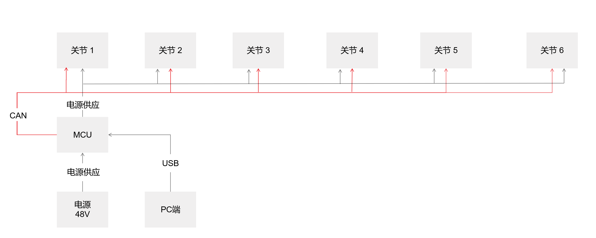
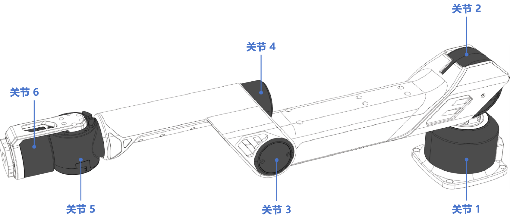
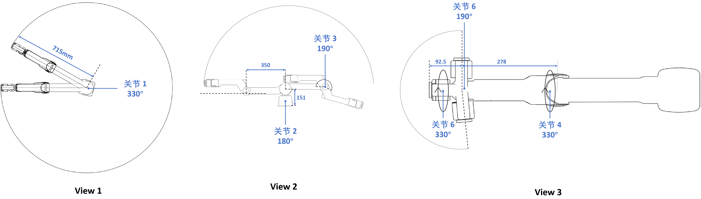
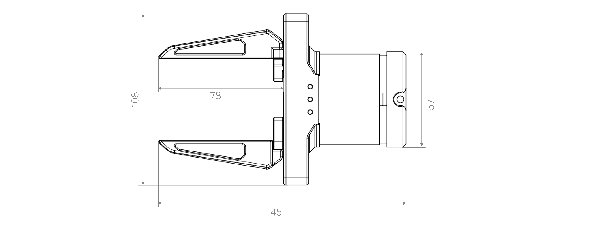
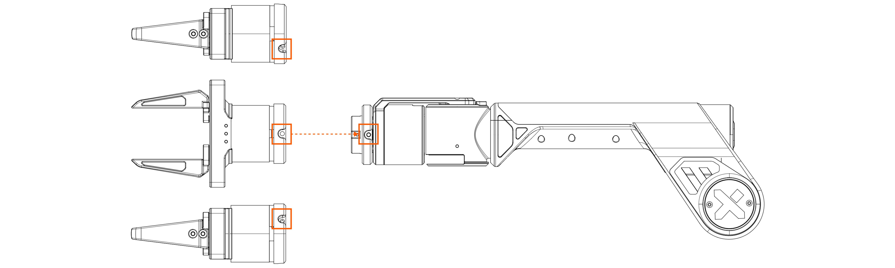
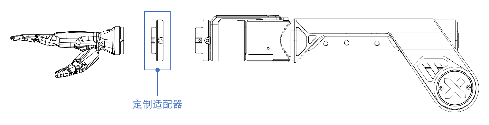

# A1硬件指南
>本用户指南将为您详尽解读 Galaxea A1 硬件部分的数据。

## 技术规格

<table style="width: 100%; border-collapse: collapse;">
    <thead>
        <tr style="background-color: black; color: white; text-align: left;">
            <th style="width: 300px; padding: 8px; border: 1px solid #ddd;">电气参数</th>
            <th style="width: 400px; padding: 8px; border: 1px solid #ddd;">数值</th>
        </tr>
    </thead>
    <tbody>
        <tr style="background-color: white; text-align: left;">
            <td style="padding: 8px; border: 1px solid #ddd;">额定电压</td>
            <td style="padding: 8px; border: 1px solid #ddd;">48 V</td>
        </tr>
        <tr style="background-color: white; text-align: left;">
            <td style="padding: 8px; border: 1px solid #ddd;">额定电流</td>
            <td style="padding: 8px; border: 1px solid #ddd;">6 A</td>
        </tr>
        <tr style="background-color: white; text-align: left;">
            <td style="padding: 8px; border: 1px solid #ddd;">最大电流</td>
            <td style="padding: 8px; border: 1px solid #ddd;">10 A</td>
        </tr>
        <tr style="background-color: white; text-align: left;">
            <td style="padding: 8px; border: 1px solid #ddd;">通信接口</td>
            <td style="padding: 8px; border: 1px solid #ddd;">USB 2.0 端口</td>
        </tr>
    </tbody>
</table>

<table style="width: 100%; border-collapse: collapse;">
    <thead>
        <tr style="background-color: black; color: white; text-align: left;">
            <th style="width: 300px; padding: 8px; border: 1px solid #ddd;">性能参数</th>
            <th style="width: 400px; padding: 8px; border: 1px solid #ddd;">数值</th>
        </tr>
    </thead>
    <tbody>
        <tr style="background-color: white; text-align: left;">
            <td style="padding: 8px; border: 1px solid #ddd;">尺寸</td>
            <td style="padding: 8px; border: 1px solid #ddd;">展开：775L x 128W x 237H mm， 折叠：449L x 128W x 277H mm</td>
        </tr>
        <tr style="background-color: white; text-align: left;">
            <td style="padding: 8px; border: 1px solid #ddd;">重量</td>
            <td style="padding: 8px; border: 1px solid #ddd;">6 kg</td>
        </tr>
        <tr style="background-color: white; text-align: left;">
            <td style="padding: 8px; border: 1px solid #ddd;">额定负载</td>
            <td style="padding: 8px; border: 1px solid #ddd;">2.5 kg</td>
        </tr>
        <tr style="background-color: white; text-align: left;">
            <td style="padding: 8px; border: 1px solid #ddd;">最大负载</td>
            <td style="padding: 8px; border: 1px solid #ddd;">5 kg</td>
        </tr>
        <tr style="background-color: white; text-align: left;">
            <td style="padding: 8px; border: 1px solid #ddd;">臂展</td>
            <td style="padding: 8px; border: 1px solid #ddd;">700 mm</td>
        </tr>
        <tr style="background-color: white; text-align: left;">
            <td style="padding: 8px; border: 1px solid #ddd;">最大末端线速度</td>
            <td style="padding: 8px; border: 1px solid #ddd;">10 m/s</td>
        </tr>
        <tr style="background-color: white; text-align: left;">
            <td style="padding: 8px; border: 1px solid #ddd;">最大末端加速度</td>
            <td style="padding: 8px; border: 1px solid #ddd;">40 m/s²</td>
        </tr>
        <tr style="background-color: white; text-align: left;">
            <td style="padding: 8px; border: 1px solid #ddd;">自由度</td>
            <td style="padding: 8px; border: 1px solid #ddd;">6</td>
        </tr>
        <tr style="background-color: white; text-align: left;">
            <td style="padding: 8px; border: 1px solid #ddd;">重复定位精度</td>
            <td style="padding: 8px; border: 1px solid #ddd;">1 mm</td>
        </tr>
    </tbody>
</table>

## 硬件架构

## 机械结构

### 关节

本节详细说明了六个关节的工作范围、额定扭矩和峰值扭矩，展示了机械臂在各种操作中的灵活性和力量性。

<table style="width: 100%; border-collapse: collapse;">
    <thead>
        <tr style="background-color: black; color: white; text-align: left;">
            <th style="width: 300px; padding: 8px; border: 1px solid #ddd;">关节</th>
            <th style="width: 400px; padding: 8px; border: 1px solid #ddd;">范围</th>
            <th style="width: 300px; padding: 8px; border: 1px solid #ddd;">额定扭矩</th>
        </tr>
    </thead>
    <tbody>
        <tr style="background-color: white; text-align: left;">
            <td style="padding: 8px; border: 1px solid #ddd;">关节 1</td>
            <td style="padding: 8px; border: 1px solid #ddd;">[-165°,165°]</td>
            <td style="padding: 8px; border: 1px solid #ddd;">20 Nm</td>
        </tr>
        <tr style="background-color: white; text-align: left;">
            <td style="padding: 8px; border: 1px solid #ddd;">关节 2</td>
            <td style="padding: 8px; border: 1px solid #ddd;">[0°,180°]</td>
            <td style="padding: 8px; border: 1px solid #ddd;">20 Nm</td>
        </tr>
        <tr style="background-color: white; text-align: left;">
            <td style="padding: 8px; border: 1px solid #ddd;">关节 3</td>
            <td style="padding: 8px; border: 1px solid #ddd;">[-190°,0°]</td>
            <td style="padding: 8px; border: 1px solid #ddd;">9 Nm</td>
        </tr>
        <tr style="background-color: white; text-align: left;">
            <td style="padding: 8px; border: 1px solid #ddd;">关节 4</td>
            <td style="padding: 8px; border: 1px solid #ddd;">[-165°,165°]</td>
            <td style="padding: 8px; border: 1px solid #ddd;">3 Nm</td>
        </tr>
        <tr style="background-color: white; text-align: left;">
            <td style="padding: 8px; border: 1px solid #ddd;">关节 5</td>
            <td style="padding: 8px; border: 1px solid #ddd;">[-95°,95°]</td>
            <td style="padding: 8px; border: 1px solid #ddd;">3 Nm</td>
        </tr>
        <tr style="background-color: white; text-align: left;">
            <td style="padding: 8px; border: 1px solid #ddd;">关节 6</td>
            <td style="padding: 8px; border: 1px solid #ddd;">[-105°,105°]</td>
            <td style="padding: 8px; border: 1px solid #ddd;">3 Nm</td>
        </tr>
    </tbody>
</table>

- **视角1**：关节1的工作半径为715 mm，最大旋转角度为330°。
- **视角1**：关节2的最大旋转角度为180°，关节3的最大旋转角度为190°。
- **视角1**：关节4和关节6的最大旋转角度均为330°，关节5的最大旋转角度为190°。

### 机械臂
Galaxea A1机械臂是双杆连接，每个关节均配备了行星齿轮电机，能够实现独立的变速操作，具有高精度和扭矩，使机械臂能够在控制器指挥的任何方向上灵活操作。

当前版本的电机尚未配备制动器，切断电源可能会导致机械臂突然掉落。

<table style="width: 100%; border-collapse: collapse;">
    <thead>
        <tr style="background-color: black; color: white; text-align: left;">
            <th style="width: 300px; padding: 8px; border: 1px solid #ddd;">条目</th>
            <th style="width: 400px; padding: 8px; border: 1px solid #ddd;">说明</th>
        </tr>
    </thead>
    <tbody>
        <tr style="background-color: white; text-align: left;">
            <td style="padding: 8px; border: 1px solid #ddd;">长</td>
            <td style="padding: 8px; border: 1px solid #ddd;">展开：775 mm，折叠：449 mm</td>
        </tr>
        <tr style="background-color: white; text-align: left;">
            <td style="padding: 8px; border: 1px solid #ddd;">宽</td>
            <td style="padding: 8px; border: 1px solid #ddd;">展开：237 mm，折叠：277 mm</td>
        </tr>
        <tr style="background-color: white; text-align: left;">
            <td style="padding: 8px; border: 1px solid #ddd;">高</td>
            <td style="padding: 8px; border: 1px solid #ddd;">128 mm</td>
        </tr>
    </tbody>
</table>

### 底座
Galaxea A1在底座后部有两个端口，用于通信和充电。

    

<table style="width: 100%; border-collapse: collapse;">
    <thead>
        <tr style="background-color: black; color: white; text-align: left;">
            <th style="width: 300px; padding: 8px; border: 1px solid #ddd;">规格</th>
            <th style="width: 400px; padding: 8px; border: 1px solid #ddd;">说明</th>
        </tr>
    </thead>
    <tbody>
        <tr style="background-color: white; text-align: left;">
            <td style="padding: 8px; border: 1px solid #ddd;">充电端口</td>
            <td style="padding: 8px; border: 1px solid #ddd;">额定电压48V</td>
        </tr>
        <tr style="background-color: white; text-align: left;">
            <td style="padding: 8px; border: 1px solid #ddd;">USB端口</td>
            <td style="padding: 8px; border: 1px solid #ddd;">USB 2.0</td>
        </tr>
        <tr style="background-color: white; text-align: left;">
            <td style="padding: 8px; border: 1px solid #ddd;">安装孔</td>
            <td style="padding: 8px; border: 1px solid #ddd;">四个M6螺纹，直径6.3 mm</td>
        </tr>
        <tr style="background-color: white; text-align: left;">
            <td style="padding: 8px; border: 1px solid #ddd;">尺寸</td>
            <td style="padding: 8px; border: 1px solid #ddd;">100 mm x 100 mm</td>
        </tr>
        <tr style="background-color: white; text-align: left;">
            <td style="padding: 8px; border: 1px solid #ddd;">最大末端加速度</td>
            <td style="padding: 8px; border: 1px solid #ddd;">10 m/s²</td>
        </tr>
    </tbody>
</table>

### 末端执行器

#### Galaxea G1夹爪

[Galaxea G1](../../Introducing_Galaxea_Robot/product_info/A1_accessory_G1.md)为自研平行夹爪，产品配备一个关节电机和两指夹具。

注意：A1机械臂不包括夹爪。如有需要，请联系我们购买。

<table style="width: 100%; border-collapse: collapse;">
    <thead>
        <tr style="background-color: black; color: white; text-align: left;">
            <th style="width: 300px; padding: 8px; border: 1px solid #ddd;">规格</th>
            <th style="width: 400px; padding: 8px; border: 1px solid #ddd;">数值</th>
        </tr>
    </thead>
    <tbody>
        <tr style="background-color: white; text-align: left;">
            <td style="padding: 8px; border: 1px solid #ddd;">长度</td>
            <td style="padding: 8px; border: 1px solid #ddd;">145 mm</td>
        </tr>
        <tr style="background-color: white; text-align: left;">
            <td style="padding: 8px; border: 1px solid #ddd;">夹爪长度</td>
            <td style="padding: 8px; border: 1px solid #ddd;">78 mm</td>
        </tr>
        <tr style="background-color: white; text-align: left;">
            <td style="padding: 8px; border: 1px solid #ddd;">电机直径</td>
            <td style="padding: 8px; border: 1px solid #ddd;">57 mm</td>
        </tr>
        <tr style="background-color: white; text-align: left;">
            <td style="padding: 8px; border: 1px solid #ddd;">夹爪操作范围</td>
            <td style="padding: 8px; border: 1px solid #ddd;">0 ~ 100 mm</td>
        </tr>
        <tr style="background-color: white; text-align: left;">
            <td style="padding: 8px; border: 1px solid #ddd;">夹爪额定力</td>
            <td style="padding: 8px; border: 1px solid #ddd;">100 N</td>
        </tr>
    </tbody>
</table>

配备末端执行器 Galaxea G1 后，机械臂具有以下特征：

<table style="width: 100%; border-collapse: collapse;">
    <thead>
        <tr style="background-color: black; color: white; text-align: left;">
            <th style="width: 300px; padding: 8px; border: 1px solid #ddd;">项</th>
            <th style="width: 400px; padding: 8px; border: 1px solid #ddd;">备注</th>
        </tr>
    </thead>
    <tbody>
        <tr style="background-color: white; text-align: left;">
            <td style="padding: 8px; border: 1px solid #ddd;">尺寸</td>
            <td style="padding: 8px; border: 1px solid #ddd;">展开：923L x 128W x 254H mm 折叠：550L x 128W x 294H mm</td>
        </tr>
        <tr style="background-color: white; text-align: left;">
            <td style="padding: 8px; border: 1px solid #ddd;">自由度</td>
            <td style="padding: 8px; border: 1px solid #ddd;">7</td>
        </tr>
    </tbody>
</table>

#### 安装夹爪
通过以下步骤可以即将夹爪安装至机械臂末端（反转步骤即可拆卸夹爪）。

1. **对齐检查**：确保夹爪周围的3个安装孔与机械臂末端的3个安装孔对齐。
2. **螺丝固定**：对齐后，使用提供的3个螺丝将夹爪固定并紧固到机械臂末端。
3. **最终检查**：紧固螺丝后，再次检查夹爪的安装是否对齐并是否牢固。

### Inspire-Robots RH56系列 灵巧手

[灵巧手](../../Introducing_Galaxea_Robot/product_info/The%20Dexterous%20Hands.md)拥有一定的握持力和适中的速度，适合于机器人或假肢应用中的抓取和操纵任务。其结合了力量和控制，可以有效地处理各种物体，从而增强了机器人或假肢执行复杂任务的功能。

注意：A1机械臂不包括灵巧手。如有需要，请联系我们购买。

<table style="width: 100%; border-collapse: collapse;">
    <thead>
        <tr style="background-color: black; color: white; text-align: left;">
            <th style="width: 300px; padding: 8px; border: 1px solid #ddd;">规格</th>
            <th style="width: 400px; padding: 8px; border: 1px solid #ddd;">数值</th>
        </tr>
    </thead>
    <tbody>
        <tr style="background-color: white; text-align: left;">
            <td style="padding: 8px; border: 1px solid #ddd;">自由度</td>
            <td style="padding: 8px; border: 1px solid #ddd;">6</td>
        </tr>
        <tr style="background-color: white; text-align: left;">
            <td style="padding: 8px; border: 1px solid #ddd;">关节数</td>
            <td style="padding: 8px; border: 1px solid #ddd;">12</td>
        </tr>
        <tr style="background-color: white; text-align: left;">
            <td style="padding: 8px; border: 1px solid #ddd;">重量</td>
            <td style="padding: 8px; border: 1px solid #ddd;">540 g</td>
        </tr>
        <tr style="background-color: white; text-align: left;">
            <td style="padding: 8px; border: 1px solid #ddd;">重复性</td>
            <td style="padding: 8px; border: 1px solid #ddd;">± 0.20 mm</td>
        </tr>
        <tr style="background-color: white; text-align: left;">
            <td style="padding: 8px; border: 1px solid #ddd;">最大手指握持力</td>
            <td style="padding: 8px; border: 1px solid #ddd;">10 N</td>
        </tr>
    </tbody>
</table>

#### 安装灵巧手
通过以下步骤可以即将灵巧手安装至机械臂末端（反转步骤即可拆卸灵巧手）。

1. **对齐检查**：使用特制转接件法兰，将法兰和灵巧手周围的4个安装孔对齐，以及将法兰与机械臂末端周围的3个安装孔对齐。
2. **螺丝固定**：对齐后，使用提供的螺丝将灵巧手、法兰和机械臂末端固定连接在一起。
3. **牢固检查**：紧固螺丝后，再次检查灵巧手的安装是否对齐并是否牢固。

## 下一步
Galaxea A1的产品硬件介绍到这里就结束了。我们建议您继续探索[Galaxea A1产品软件介绍](./Software_Guide.md)以获取更多详细信息。