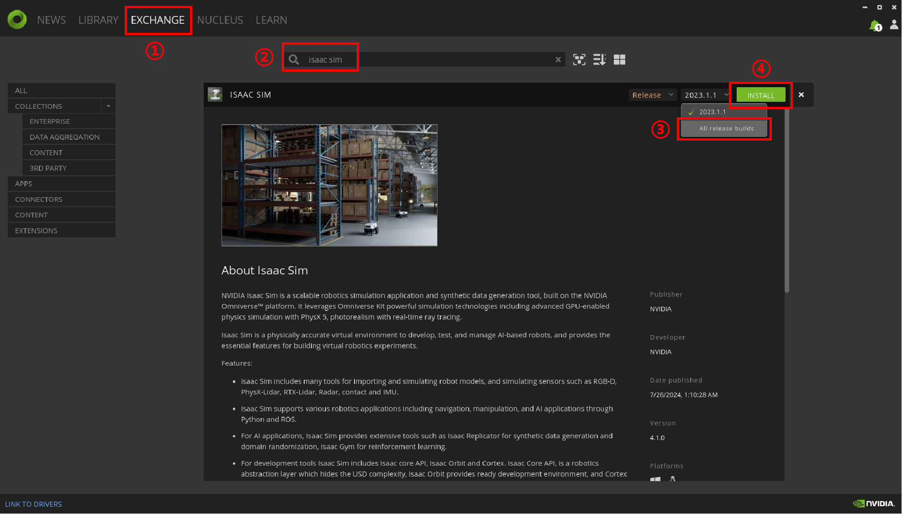
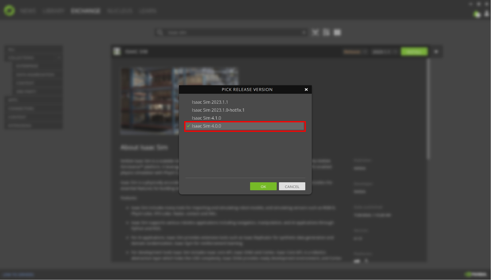
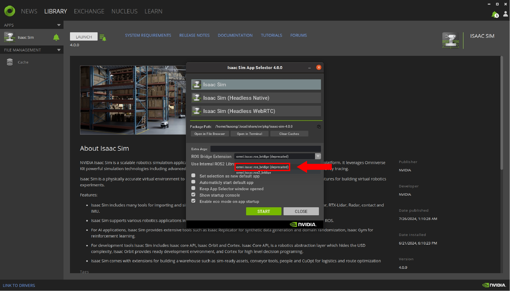
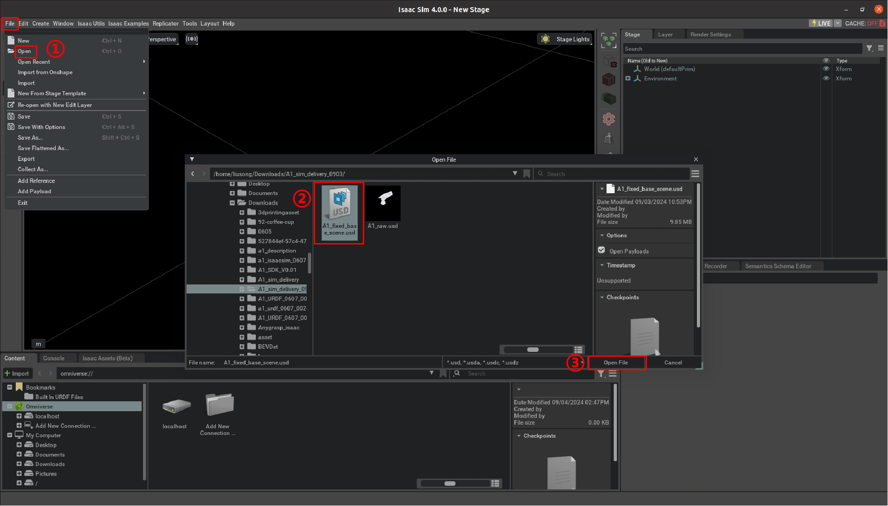
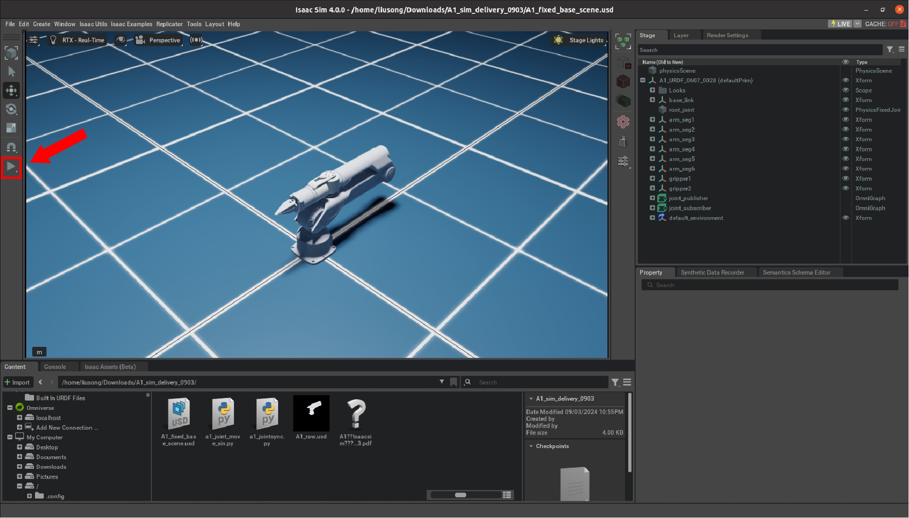
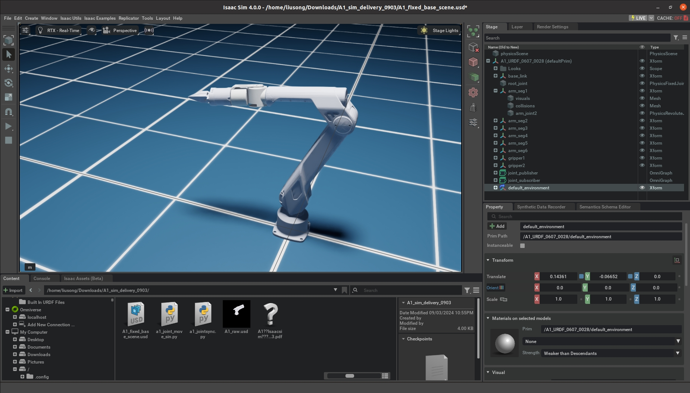
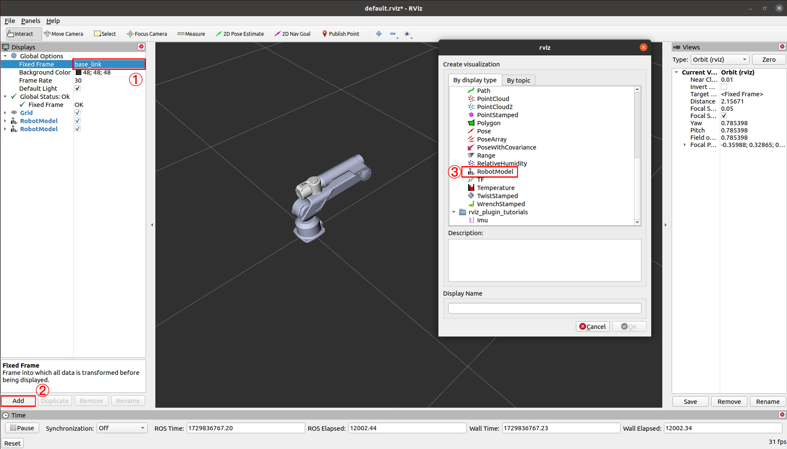
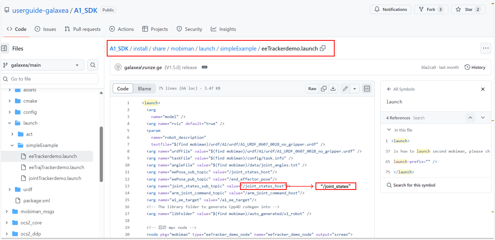

# A1 仿真平台使用说明

## **安装 Isaac Sim 4.0.0**

Issac Sim 对 GPU 版本和驱动程序有特定要求，任意更改可能会导致问题。因此，建议直接下载并安装所需的文件。

下载文件大约需要8GB的空间，请合理安排您的时间。


### **下载Omniverse Launcher**

1. **访问 NVIDIA 网站**：前往 NVIDIA 官网 https://docs.omniverse.nvidia.com/isaacsim/latest/installation/install_workstation.html ，下载 Omniverse Launcher。
2. **注册 NVIDIA 账户**：下载过程可能需要登录。如果您没有 NVIDIA 账户，请按照说明进行账户注册。注册完成后，请继续下载。
3. **安装 Omniverse Launcher**：下载完成后，启动安装程序并按照提示完成安装。
4. **启动 Omniverse Launcher**：完成安装后，请启动 Omniverse Launcher。在您首次使用时，系统会要求您使用NVIDIA 账户进行登录。
5. **设置文件路径**：登录之后，系统将引导您设置相关的文件路径。请根据您的具体需求进行相应的配置。
6. **安装 Cache 组件**：请根据系统的指引来安装 Cache 组件。为了获得更佳的使用体验，建议您采用默认的安装设置。
7. **访问主界面**：完成以上配置后，您将进入 Omniverse Launcher 的主界面。


### **安装 Isaac Sim**

1. **打开“Exchange”**：在 Omniverse Launcher 的主界面中，点击“Exchange”标签页。
2. **查找 Isaac Sim**：在“Exchange”标签页中搜索“Isaac Sim”应用程序。
3. **选择版本**：为了确保与 ROS 桥接的兼容性，避免潜在的问题，请确认您安装的是 Isaac Sim 的 **4.0.0 版本**。注意：版本号可能被包含在一个下拉菜单里，所以在选择时请仔细核对，确保选中的是正确的版本。
4. **安装 Isaac Sim**：选择版本后，点击“安装”按钮开始安装 Isaac Sim。





<u>**重要提示**：您可以在“Library”标签页中轻松定位并直接启动所有已安装的应用程序。</u>


### **Isaac Sim基本操作**

以下是官方教程，帮助您了解基本的 Isaac Sim 界面。

- **用户界面**
    - [Isaac Sim 界面](https://docs.omniverse.nvidia.com/isaacsim/latest/introductory_tutorials/tutorial_intro_interface.html)
    - [Isaac Sim 工作流程](https://docs.omniverse.nvidia.com/isaacsim/latest/introductory_tutorials/tutorial_intro_workflows.html)
- 添加物体并设置物理属性
    - [添加简单物体](https://docs.omniverse.nvidia.com/isaacsim/latest/gui_tutorials/tutorial_intro_simple_objects.html#isaac-sim-app-tutorial-intro-simple-objects)
- 组装并导入机器人
    - [组装一个简单的机器人](https://docs.omniverse.nvidia.com/isaacsim/latest/gui_tutorials/tutorial_gui_simple_robot.html)
    - [URDF 导入器](https://docs.omniverse.nvidia.com/isaacsim/latest/features/environment_setup/ext_omni_isaac_urdf.html)


## **导入 USD 文件**

首先，您需要在我们的 GitHub 上克隆我们的仓库 [A1_Simulation_Isaac_Sim_Usage_Tutorial。](https://github.com/userguide-galaxea/A1_Simulation_Isaac_Sim_Usage_Tutorial)

请前往 [A1_Simulation_SDK](https://github.com/userguide-galaxea/A1_Simulation_Isaac_Sim_Usage_Tutorial/tree/galaxea/main/A1_simulation_SDK) ，以获取 [A1_fixed_base_scene.usd](https://github.com/userguide-galaxea/A1_Simulation_Isaac_Sim_Usage_Tutorial/blob/galaxea/main/A1_simulation_SDK/A1_fixed_base_scene.usd) 和 [A1_raw.usd](https://github.com/userguide-galaxea/A1_Simulation_Isaac_Sim_Usage_Tutorial/blob/galaxea/main/A1_simulation_SDK/A1_raw.usd) 这两个资源文件，它们专为不配备夹爪 G1 的 A1 版本设计。

请前往 [A1_Simulation_A1 G1_SDK](https://github.com/userguide-galaxea/A1_Simulation_Isaac_Sim_Usage_Tutorial/tree/galaxea/main/A1_simulation_A1_G1_SDK) ，以获取 [A1_G1_scene.usd](https://github.com/userguide-galaxea/A1_Simulation_Isaac_Sim_Usage_Tutorial/blob/galaxea/main/A1_simulation_A1_G1_SDK/A1_G1_scene.usd) 和 [A1_G1_raw.usd](https://github.com/userguide-galaxea/A1_Simulation_Isaac_Sim_Usage_Tutorial/blob/galaxea/main/A1_simulation_A1_G1_SDK/A1_G1_raw.usd)  这两个资源文件，它们专为配备夹爪 G1 的 A1 版本设计。

1. **打开 Isaac Sim**：从omniverse launcher 启动 issacsim 4.0.0。确保在启动时选择 `omni.isaac.ros_bridge（deprecated）`以启用 Isaac Sim 和 ROS 节点之间的通信。

   
2. **打开 USD 文件**：启动 Isaac Sim 后，选择“**文件 -> 打开**”。在出现的文件对话框中，如果您使用的是不带夹爪的 A1，请从文件夹中选择 `A1_fixed_base_scene.usd `文件；如果您使用的是带有夹爪 G1 的 A1，请选择 `A1_G1_scene.usd `文件。

   
3. **运行同步脚本**：打开文件后，您将看到相应的场景。点击左侧边栏的“**播放（Play）**”按钮。

   

   运行文件夹里的`a1_jointsync.py`脚本, 以同步 RViz 仿真与 Isaac Sim 仿真，我们将在后续教程中进一步说明。

```shell
  python a1_jointsync.py
```

   <u>**重要提示**：isaac sim的 ROS 桥接只能在`roscore`运行时发布/订阅 `rostopic `。</u>

## **Demo示例**

点击播放按钮后，请运行Python 脚本 [A1_simulation_SDK/a1_joint_move_sin.py](https://github.com/userguide-galaxea/A1_Simulation_Isaac_Sim_Usage_Tutorial/blob/galaxea/main/A1_simulation_SDK/a1_joint_move_sin.py)。

A1 机械臂将开始在关节空间执行一个正弦轨迹运动，效果可以参考下图。您也可以通过运行 Python 文件 [A1_simulation_SDK/a1_control_from_traj.py](https://github.com/userguide-galaxea/A1_Simulation_Isaac_Sim_Usage_Tutorial/blob/galaxea/main/A1_simulation_SDK/a1_control_from_traj.py) 来播放控制器轨迹。

这一操作将依据给定的数据文件 [A1_simulation_SDK/joint_trajectory.npz](https://github.com/userguide-galaxea/A1_Simulation_Isaac_Sim_Usage_Tutorial/blob/galaxea/main/A1_simulation_SDK/joint_trajectory.npz) 来播放预定的轨迹。



至此，我们已经完成了Isaac Sim A1 机械臂的仿真设置。现在，您可以利用我们提供的代码，在系统中启动演示，操作步骤如下所示。


## **抓取演示**
点击“播放（Play）”后，请参考 A1 SDK 中的[末端执行器运动示例](https://github.com/userguide-galaxea/A1_SDK/blob/galaxea/main/README_CONTROL.md#end-effector-movement-example)，克隆 A1_SDK 代码仓库，以便在 Isaac Sim 环境中完成整个仿真流程。

注意：

- 启动 `eeTrackerdemo.launch` 后，请确保选择 `base_link` 作为固定帧，并将其添加到 `RobotModel `中，然后您就可以在 RViz 屏幕上看到可视化的 A1。



- 如果在执行了所有指令之后，机械臂仍然没有动作（这种情况仅发生在纯仿真环境中），请打开 A1_SDK 中的文件夹中的相应[文件](https://github.com/userguide-galaxea/A1_SDK/blob/galaxea/main/install/share/mobiman/launch/simpleExample/eeTrackerdemo.launch)，并将 `joint_states_sub_topic` 从 `/joint_states_host `修改为 `/joint_states`。这个调整会将机械臂的控制模式从真实硬件切换到纯仿真模式。



以下代码为例：

1. 追踪特定末端位姿

```Plain
##Initiate the end motion script to start one RViz of the arm. Joint position is on zero-point by default.
cd A1_SDK/install
source setup.bash
roslaunch mobiman eeTrackerdemo.launch

##Initiate one terminal,e.g. "terminal_1", open the A1 simulation sync.
python A1_simulation_SDK/a1_jointsync.py
##or if you are using the A1-G1, run: python A1_simulation_A1_G1_SDK/a1_jointsync_A1G1.py

##Initiate one terminal,e.g. "terminal_2", publish the example trajactory ponits.
rostopic pub /a1_ee_target geometry_msgs/PoseStamped "{
header: {
    seq: 0,
    stamp: {secs: 0, nsecs: 0},
    frame_id: 'world'
},
pose: {
    position: {x: 0.08, y: 0.0, z: 0.5},
    orientation: {x: 0.5, y: 0.5, z: 0.5, w: 0.5}
}
}"
```
2. 抓取物料 demo

```Bash
##Initiate the end motion script to start one RViz of the arm. Joint position is on zero-point by default.
cd A1_SDK/install
source setup.bash
roslaunch mobiman eeTrackerdemo.launch

##Initiate another terminal,e.g. "terminal_3", run the script.
python mpc_picker.py
```
3. Demo视频
<div style="display: flex; justify-content: center; align-items: center;">
<video width="1920" height="1080" controls>
  <source src="../assets/mp4_1.mp4" type="video/mp4">
  Your browser does not support the video tag.
</video>
</div>


