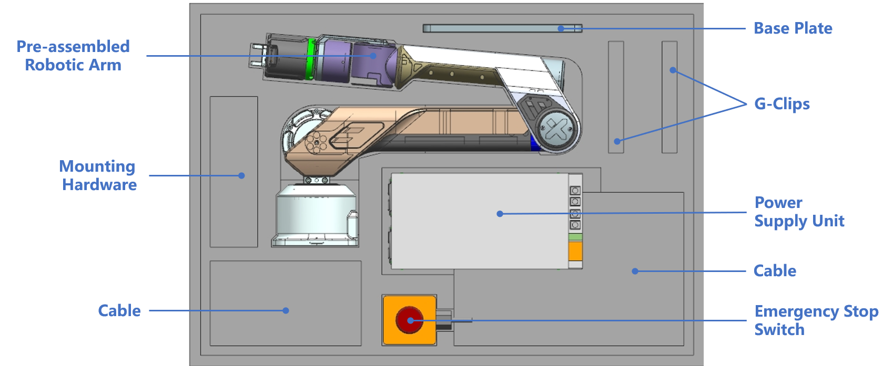

> 欢迎加入 Galaxea 开发者的大家庭，成为 Galaxea A1 的尊贵用户！这本精心编制的指南将带您领略 Galaxea A1 的独特风采和卓越功能。我们致力于帮您迅速掌握操作技巧，并探索 Galaxea A1 的无限可能。

# 快速入门指南

本节是 Galaxea A1 的快速入门指南，我们将深入介绍每个部件的工作原理和性能特点，为您使用 Galaxea A1 打下坚实基础。我们将一同探索和实践一系列令人兴奋的 demo 演示，解锁 Galaxea A1 的卓越功能。

## **开始之前**

本教程的第一节，<u>将带您了解如何开机并操控 Galaxea A1</u> 。请开始您与Galaxea A1 机械臂的互动之旅吧！

### **安全**

注意：如果操作不当，Galaxea A1 可能会造成潜在伤害。为确保您的安全，我们强烈建议您在首次操作机器之前仔细阅读并严格遵循《安全指南》中的说明，以保证操作的安全和高效。

### **开箱**

打开包装盒后，您会发现这款机械臂是一个完全组装好的单元。以下是包装盒内的物品：

<table style="width: 100%; border-collapse: collapse;">
    <thead>
        <tr style="background-color: black; color: white; text-align: left;">
            <th style="width: 220px; padding: 8px; border: 1px solid #ddd;">物品</th>
            <th style="width: 180px; padding: 8px; border: 1px solid #ddd;">数量</th>
            <th style="width: 400px; padding: 8px; border: 1px solid #ddd;">说明</th>
        </tr>
    </thead>
    <tbody>
        <tr style="background-color: white; text-align: left;">
            <td style="padding: 8px; border: 1px solid #ddd;">预装式机械臂</td>
            <td style="padding: 8px; border: 1px solid #ddd;">1</td>
            <td style="padding: 8px; border: 1px solid #ddd;">机械臂的所有组件都已预组装完成，确保设置过程简单直接。</td>
        </tr>
        <tr style="background-color: white; text-align: left;">
            <td style="padding: 8px; border: 1px solid #ddd;">电源</td>
            <td style="padding: 8px; border: 1px solid #ddd;">1</td>
            <td style="padding: 8px; border: 1px solid #ddd;">为机械臂提供所需的电能。</td>
        </tr>
        <tr style="background-color: white; text-align: left;">
            <td style="padding: 8px; border: 1px solid #ddd;">紧急停止按钮</td>
            <td style="padding: 8px; border: 1px solid #ddd;">1</td>
            <td style="padding: 8px; border: 1px solid #ddd;">用于紧急情况下立即切断电源。</td>
        </tr>
        <tr style="background-color: white; text-align: left;">
            <td style="padding: 8px; border: 1px solid #ddd;">电源线</td>
            <td style="padding: 8px; border: 1px solid #ddd;">1</td>
            <td style="padding: 8px; border: 1px solid #ddd;">用于将电源连接到机械臂。</td>
        </tr>
        <tr style="background-color: white; text-align: left;">
            <td style="padding: 8px; border: 1px solid #ddd;">USB线</td>
            <td style="padding: 8px; border: 1px solid #ddd;">1</td>
            <td style="padding: 8px; border: 1px solid #ddd;">用于将机械臂控制端连接到带有USB 2.0端口的电脑。</td>
        </tr>
        <tr style="background-color: white; text-align: left;">
            <td style="padding: 8px; border: 1px solid #ddd;">安装底座板</td>
            <td style="padding: 8px; border: 1px solid #ddd;">1</td>
            <td style="padding: 8px; border: 1px solid #ddd;">平板，用于将机械臂安装在稳定表面上。</td>
        </tr>
        <tr style="background-color: white; text-align: left;">
            <td style="padding: 8px; border: 1px solid #ddd;">G夹</td>
            <td style="padding: 8px; border: 1px solid #ddd;">2</td>
            <td style="padding: 8px; border: 1px solid #ddd;">格栅紧固件，用于将底座板固定在工作台或表面上。</td>
        </tr>
        <tr style="background-color: white; text-align: left;">
            <td style="padding: 8px; border: 1px solid #ddd;">安装板螺丝M6</td>
            <td style="padding: 8px; border: 1px solid #ddd;">4</td>
            <td style="padding: 8px; border: 1px solid #ddd;">用于使用G夹将底座板固定在安装表面上。</td>
        </tr>
    </tbody>
</table>

### **安装**

您需要将机械臂固定在安装底座板上，这一设计确保了其稳定性和操作精度。安装孔的设计提供了灵活的安装选项，允许在多种平台上安全稳固地安装臂。

请根据您的操作环境和使用需求，选择适当的安装平台和固定方式，以确保机械臂在运行过程中的稳定性和安全性。

### **开启电源**

请用我们提供的电源适配器和电缆线开启电源：将电源适配器电缆线的一端插入机械臂底座上的电源端口，另一端连接到电源，确保电压为48V。

### **关闭电源**

当机械臂和控制系统完全停止时，您只需拔下电源线即可关闭Galaxea A1。

在当前版本的Galaxea A1中，电机没有制动器，因此切断电源可能会导致机械臂突然掉落。我们将继续改进产品以解决这个问题。

### **紧急停止**

紧急停止开关（E-Stop）可在紧急情况下立即切断电源。

按下 E-Stop 按钮将立即断开机械臂的电源，确保操作人员的安全并防止设备损坏。

## **获取帮助**

如果您遇到任何问题，需要立即帮助，或希望直接与Galaxea AI的工程团队对话，请随时通过products@galaxea.ai与我们联系。

## **下一步**

Galaxea A1 的快速入门之旅到这里就结束啦！为了更好的理解与掌握 Galaxea A1，我们建议您继续探索 Galaxea A1 硬件指南和 Galaxea A1 软件指南。我们提供了大量信息和实际示例，指导您自信且轻松地进行编程应用。