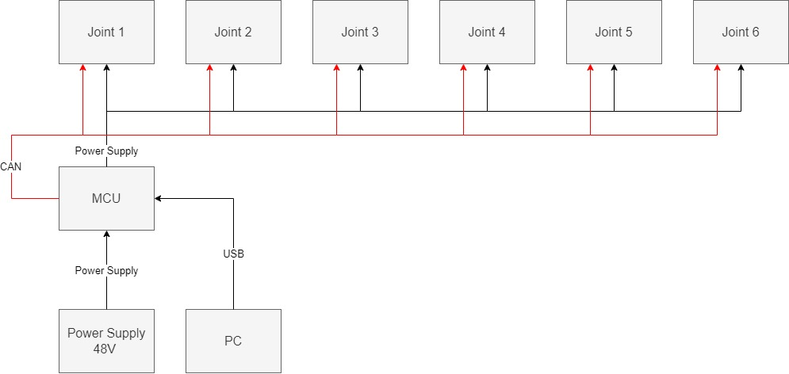
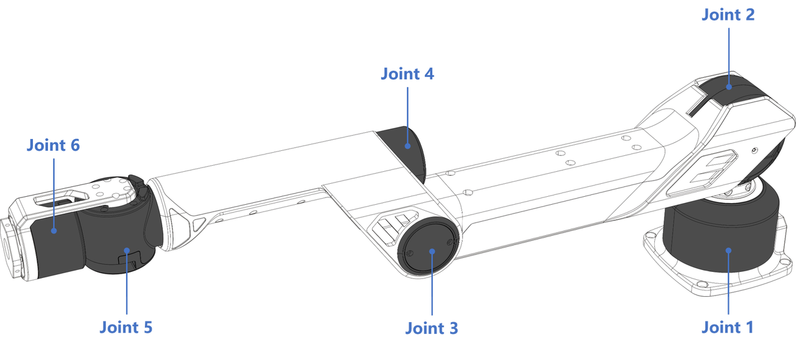
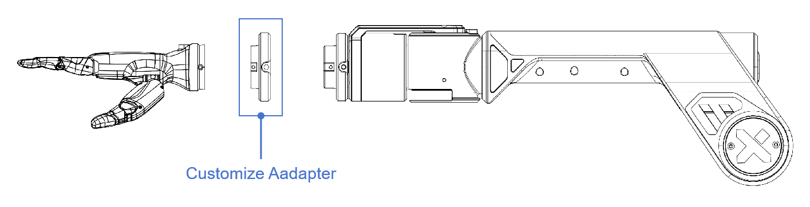

# A1硬件指南

本用户指南将为您详尽解读 Galaxea A1 硬件部分的数据。

## **安全指南**

    

Galaxea 机械臂在操作不当的情况下可能带来安全隐患，有造成人身伤害的风险。

- 在使用机械臂之前，请务必仔细阅读以下安全须知。
- 对于尚未熟悉本安全指南的人员，在靠近机器时必须受到严格监督，并需被明确告知机器操作可能存在的风险。
- 在使用产品之前，请务必对周围环境进行全面检查，以排除任何潜在的安全威胁。

更多安全信息，请查阅随附的安全指南。

## **声明**

<u>Galaxea A1 目前仅适用于科研开发应用，需要有经验的操作员和程序员使用。该产品不面向家庭消费者，且未获得相关认证以支持此类用途。</u>

## **技术规格**

### **电气参数**

Galaxea A1的电气特性是其卓越性能的关键。通过精心设计的电压、电流和通信接口参数，我们确保了机械臂在处理高负载和执行复杂动态任务时的稳定性与可靠性。

<table style="width: 100%; border-collapse: collapse;">
    <thead>
        <tr style="background-color: black; color: white; text-align: left;">
            <th style="width: 300px; padding: 8px; border: 1px solid #ddd;">电气参数</th>
            <th style="width: 400px; padding: 8px; border: 1px solid #ddd;">数值</th>
        </tr>
    </thead>
    <tbody>
        <tr style="background-color: white; text-align: left;">
            <td style="padding: 8px; border: 1px solid #ddd;">额定电压</td>
            <td style="padding: 8px; border: 1px solid #ddd;">48 V</td>
        </tr>
        <tr style="background-color: white; text-align: left;">
            <td style="padding: 8px; border: 1px solid #ddd;">额定电流</td>
            <td style="padding: 8px; border: 1px solid #ddd;">6 A</td>
        </tr>
        <tr style="background-color: white; text-align: left;">
            <td style="padding: 8px; border: 1px solid #ddd;">最大电流</td>
            <td style="padding: 8px; border: 1px solid #ddd;">10 A</td>
        </tr>
        <tr style="background-color: white; text-align: left;">
            <td style="padding: 8px; border: 1px solid #ddd;">通信接口</td>
            <td style="padding: 8px; border: 1px solid #ddd;">USB 2.0 端口</td>
        </tr>
    </tbody>
</table>

### **性能参数**

Galaxea A1的性能参数凸显了其核心优势，包括轻盈的自重、出色的负载能力、宽广的工作范围和迅捷的运行速度，这些特性共同确保了其在高速动态作业中的非凡表现。

<table style="width: 100%; border-collapse: collapse;">
    <thead>
        <tr style="background-color: black; color: white; text-align: left;">
            <th style="width: 300px; padding: 8px; border: 1px solid #ddd;">性能参数</th>
            <th style="width: 400px; padding: 8px; border: 1px solid #ddd;">数值</th>
        </tr>
    </thead>
    <tbody>
        <tr style="background-color: white; text-align: left;">
            <td style="padding: 8px; border: 1px solid #ddd;">尺寸</td>
            <td style="padding: 8px; border: 1px solid #ddd;">展开：775L x 128W x 237H mm， 折叠：449L x 128W x 277H mm</td>
        </tr>
        <tr style="background-color: white; text-align: left;">
            <td style="padding: 8px; border: 1px solid #ddd;">重量</td>
            <td style="padding: 8px; border: 1px solid #ddd;">6 kg</td>
        </tr>
        <tr style="background-color: white; text-align: left;">
            <td style="padding: 8px; border: 1px solid #ddd;">额定负载</td>
            <td style="padding: 8px; border: 1px solid #ddd;">2.5 kg</td>
        </tr>
        <tr style="background-color: white; text-align: left;">
            <td style="padding: 8px; border: 1px solid #ddd;">最大负载</td>
            <td style="padding: 8px; border: 1px solid #ddd;">5 kg</td>
        </tr>
        <tr style="background-color: white; text-align: left;">
            <td style="padding: 8px; border: 1px solid #ddd;">臂展</td>
            <td style="padding: 8px; border: 1px solid #ddd;">700 mm</td>
        </tr>
        <tr style="background-color: white; text-align: left;">
            <td style="padding: 8px; border: 1px solid #ddd;">最大末端线速度</td>
            <td style="padding: 8px; border: 1px solid #ddd;">10 m/s</td>
        </tr>
        <tr style="background-color: white; text-align: left;">
            <td style="padding: 8px; border: 1px solid #ddd;">最大末端加速度</td>
            <td style="padding: 8px; border: 1px solid #ddd;">10 m/s²</td>
        </tr>
        <tr style="background-color: white; text-align: left;">
            <td style="padding: 8px; border: 1px solid #ddd;">自由度</td>
            <td style="padding: 8px; border: 1px solid #ddd;">6</td>
        </tr>
        <tr style="background-color: white; text-align: left;">
            <td style="padding: 8px; border: 1px solid #ddd;">重复定位精度</td>
            <td style="padding: 8px; border: 1px solid #ddd;">1 mm</td>
        </tr>
    </tbody>
</table>

## **硬件架构**

## **机结构**

### **关节**

本节详细说明了六个关节的工作范围、额定扭矩和峰值扭矩，展示了机械臂在各种操作中的灵活性和力量性。

<table style="width: 100%; border-collapse: collapse;">
    <thead>
        <tr style="background-color: black; color: white; text-align: left;">
            <th style="width: 300px; padding: 8px; border: 1px solid #ddd;">关节</th>
            <th style="width: 400px; padding: 8px; border: 1px solid #ddd;">范围</th>
            <th style="width: 300px; padding: 8px; border: 1px solid #ddd;">额定扭矩</th>
        </tr>
    </thead>
    <tbody>
        <tr style="background-color: white; text-align: left;">
            <td style="padding: 8px; border: 1px solid #ddd;">Joint 1</td>
            <td style="padding: 8px; border: 1px solid #ddd;">[-165°,165°]</td>
            <td style="padding: 8px; border: 1px solid #ddd;">20 Nm</td>
        </tr>
        <tr style="background-color: white; text-align: left;">
            <td style="padding: 8px; border: 1px solid #ddd;">Joint 2</td>
            <td style="padding: 8px; border: 1px solid #ddd;">[0°,180°]</td>
            <td style="padding: 8px; border: 1px solid #ddd;">20 Nm</td>
        </tr>
        <tr style="background-color: white; text-align: left;">
            <td style="padding: 8px; border: 1px solid #ddd;">Joint 3</td>
            <td style="padding: 8px; border: 1px solid #ddd;">[0°,190°]</td>
            <td style="padding: 8px; border: 1px solid #ddd;">9 Nm</td>
        </tr>
        <tr style="background-color: white; text-align: left;">
            <td style="padding: 8px; border: 1px solid #ddd;">Joint 4</td>
            <td style="padding: 8px; border: 1px solid #ddd;">[-165°,165°]</td>
            <td style="padding: 8px; border: 1px solid #ddd;">3 Nm</td>
        </tr>
        <tr style="background-color: white; text-align: left;">
            <td style="padding: 8px; border: 1px solid #ddd;">Joint 5</td>
            <td style="padding: 8px; border: 1px solid #ddd;">[-95°,95°]</td>
            <td style="padding: 8px; border: 1px solid #ddd;">3 Nm</td>
        </tr>
        <tr style="background-color: white; text-align: left;">
            <td style="padding: 8px; border: 1px solid #ddd;">Joint 6</td>
            <td style="padding: 8px; border: 1px solid #ddd;">[-105°,105°]</td>
            <td style="padding: 8px; border: 1px solid #ddd;">3 Nm</td>
        </tr>
    </tbody>
</table>

- **view1**：显示关节1的工作半径和旋转角度，旋转半径为715 mm，最大旋转角度为330度。
- **view2**：显示关节2和关节3的旋转范围，关节2的最大旋转角度为180度，关节3为190度。
- **view3**：显示关节4、5、6的旋转角度，以及机械臂的末端位置。关节4和6的最大旋转角度为330度，关节5的最大旋转角度为190度。

### **连接**

Galaxea A1机械臂由两个主要的连接组成，这些连接由轻巧、坚固且耐用的丙烯腈-丁二烯-苯乙烯（ABS）材料制成。每个关节均配备了行星齿轮电机，具有高精度和扭矩，能够实现独立的变速操作。这种设计使得机械臂能够在控制器指挥的任何方向上灵活操作。

在当前版本中，电机尚未配备制动器，因此切断电源可能会导致机械臂突然掉落。我们将持续对产品进行改进，以解决这一问题。

机械臂的设计包括：

<table style="width: 100%; border-collapse: collapse;">
    <thead>
        <tr style="background-color: black; color: white; text-align: left;">
            <th style="width: 300px; padding: 8px; border: 1px solid #ddd;">条目</th>
            <th style="width: 400px; padding: 8px; border: 1px solid #ddd;">说明</th>
        </tr>
    </thead>
    <tbody>
        <tr style="background-color: white; text-align: left;">
            <td style="padding: 8px; border: 1px solid #ddd;">长</td>
            <td style="padding: 8px; border: 1px solid #ddd;">展开：775 mm，折叠：449 mm</td>
        </tr>
        <tr style="background-color: white; text-align: left;">
            <td style="padding: 8px; border: 1px solid #ddd;">宽</td>
            <td style="padding: 8px; border: 1px solid #ddd;">展开：237 mm，折叠：277 mm</td>
        </tr>
        <tr style="background-color: white; text-align: left;">
            <td style="padding: 8px; border: 1px solid #ddd;">高</td>
            <td style="padding: 8px; border: 1px solid #ddd;">128 mm</td>
        </tr>
    </tbody>
</table>

### **底座**

Galaxea A1在底座后部有两个端口，用于开发和充电。

<table style="width: 100%; border-collapse: collapse;">
    <thead>
        <tr style="background-color: black; color: white; text-align: left;">
            <th style="width: 300px; padding: 8px; border: 1px solid #ddd;">条目</th>
            <th style="width: 400px; padding: 8px; border: 1px solid #ddd;">说明</th>
        </tr>
    </thead>
    <tbody>
        <tr style="background-color: white; text-align: left;">
            <td style="padding: 8px; border: 1px solid #ddd;">充电端口</td>
            <td style="padding: 8px; border: 1px solid #ddd;">额定电压48V</td>
        </tr>
        <tr style="background-color: white; text-align: left;">
            <td style="padding: 8px; border: 1px solid #ddd;">USB端口</td>
            <td style="padding: 8px; border: 1px solid #ddd;">USB 2.0</td>
        </tr>
        <tr style="background-color: white; text-align: left;">
            <td style="padding: 8px; border: 1px solid #ddd;">安装孔</td>
            <td style="padding: 8px; border: 1px solid #ddd;">四个M6螺纹，直径6.3 mm</td>
        </tr>
        <tr style="background-color: white; text-align: left;">
            <td style="padding: 8px; border: 1px solid #ddd;">尺寸</td>
            <td style="padding: 8px; border: 1px solid #ddd;">100 mm x 100 mm</td>
        </tr>
        <tr style="background-color: white; text-align: left;">
            <td style="padding: 8px; border: 1px solid #ddd;">最大末端加速度</td>
            <td style="padding: 8px; border: 1px solid #ddd;">10 m/s²</td>
        </tr>
    </tbody>
</table>

### **末端执行器**

#### **Galaxea G1**

Galaxea G1 由一个电机、两个夹子和一个特别设计的关节模块组成。

注意：产品不包括夹爪。如有需要，您可以联系我们购买末端执行器或定制工具。

<table style="width: 100%; border-collapse: collapse;">
    <thead>
        <tr style="background-color: black; color: white; text-align: left;">
            <th style="width: 300px; padding: 8px; border: 1px solid #ddd;">特征</th>
            <th style="width: 400px; padding: 8px; border: 1px solid #ddd;">数值</th>
        </tr>
    </thead>
    <tbody>
        <tr style="background-color: white; text-align: left;">
            <td style="padding: 8px; border: 1px solid #ddd;">长度</td>
            <td style="padding: 8px; border: 1px solid #ddd;">145 mm</td>
        </tr>
        <tr style="background-color: white; text-align: left;">
            <td style="padding: 8px; border: 1px solid #ddd;">夹爪长度</td>
            <td style="padding: 8px; border: 1px solid #ddd;">78 mm</td>
        </tr>
        <tr style="background-color: white; text-align: left;">
            <td style="padding: 8px; border: 1px solid #ddd;">电机直径</td>
            <td style="padding: 8px; border: 1px solid #ddd;">57 mm</td>
        </tr>
        <tr style="background-color: white; text-align: left;">
            <td style="padding: 8px; border: 1px solid #ddd;">夹爪操作范围</td>
            <td style="padding: 8px; border: 1px solid #ddd;">0 ~ 100 mm</td>
        </tr>
        <tr style="background-color: white; text-align: left;">
            <td style="padding: 8px; border: 1px solid #ddd;">夹爪额定力</td>
            <td style="padding: 8px; border: 1px solid #ddd;">100 N</td>
        </tr>
    </tbody>
</table>

配备末端执行器Galaxea G1，应具有以下特征：

<table style="width: 100%; border-collapse: collapse;">
    <thead>
        <tr style="background-color: black; color: white; text-align: left;">
            <th style="width: 300px; padding: 8px; border: 1px solid #ddd;">条目</th>
            <th style="width: 400px; padding: 8px; border: 1px solid #ddd;">说明</th>
        </tr>
    </thead>
    <tbody>
        <tr style="background-color: white; text-align: left;">
            <td style="padding: 8px; border: 1px solid #ddd;">尺寸</td>
            <td style="padding: 8px; border: 1px solid #ddd;">展开：923L x 128W x 254H mm， 折叠：550L x 128W x 294H mm</td>
        </tr>
        <tr style="background-color: white; text-align: left;">
            <td style="padding: 8px; border: 1px solid #ddd;">自由度</td>
            <td style="padding: 8px; border: 1px solid #ddd;">7</td>
        </tr>
    </tbody>
</table>                                                    

#### **连接**

请按以下步骤将夹爪连接到A1。要移除它们，只需反转这些步骤。

1. **对齐检查：**确保夹爪周围的三个安装孔与臂末端的三个安装孔对齐。
2. **螺丝固定：**一旦对齐，使用提供的三个螺丝将夹爪固定并紧固到臂上。
3. **最终检查：**紧固螺丝后，再次检查夹爪的对齐和稳定性。它应该牢固地附着，并且不会晃动或独立于机械臂移动。

### **Inspire-Robots RH56系列灵巧手**

灵巧手拥有显著的握持力和适中的速度，适合于机器人或假肢应用中的抓取和操纵任务。灵巧手结合了力量性和控制力，可以有效地处理各种物体，类似于人手的多功能性，从而增强了机器人或假肢执行复杂任务的功能。

<table style="width: 100%; border-collapse: collapse;">
    <thead>
        <tr style="background-color: black; color: white; text-align: left;">
            <th style="width: 300px; padding: 8px; border: 1px solid #ddd;">特征</th>
            <th style="width: 400px; padding: 8px; border: 1px solid #ddd;">数值</th>
        </tr>
    </thead>
    <tbody>
        <tr style="background-color: white; text-align: left;">
            <td style="padding: 8px; border: 1px solid #ddd;">自由度</td>
            <td style="padding: 8px; border: 1px solid #ddd;">6</td>
        </tr>
        <tr style="background-color: white; text-align: left;">
            <td style="padding: 8px; border: 1px solid #ddd;">关节数</td>
            <td style="padding: 8px; border: 1px solid #ddd;">12</td>
        </tr>
        <tr style="background-color: white; text-align: left;">
            <td style="padding: 8px; border: 1px solid #ddd;">重量</td>
            <td style="padding: 8px; border: 1px solid #ddd;">540 g</td>
        </tr>
        <tr style="background-color: white; text-align: left;">
            <td style="padding: 8px; border: 1px solid #ddd;">重复性</td>
            <td style="padding: 8px; border: 1px solid #ddd;">± 0.20 mm</td>
        </tr>
        <tr style="background-color: white; text-align: left;">
            <td style="padding: 8px; border: 1px solid #ddd;">最大手指握持力</td>
            <td style="padding: 8px; border: 1px solid #ddd;">10 N</td>
        </tr>
    </tbody>
</table>

#### **连接**

## **下一步**

Galaxea A1 的硬件指南到这里就结束了。我们建议您阅读 Galaxea A1软件指南 以获取更多详细信息。