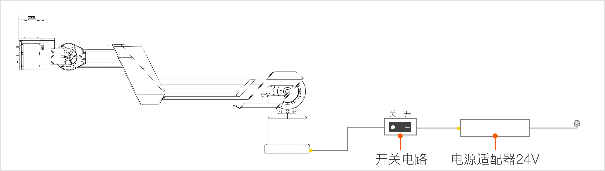

> 欢迎加入 Galaxea 开发者大家庭，成为 Galaxea A1XY 的用户！本文档将助您深入了解 Galaxea A1XY 的独特魅力与卓越性能，快速掌握操作技巧，开启智能机械臂的精彩应用之旅。

## 产品介绍
Galaxea A1XY 是一款集高精度、智能化于一体的先进机械臂，专为满足多样化的工业与创新应用需求而设计。它具备灵活的操作模式、强大的负载能力以及高度的编程兼容性，无论是工业生产线上的精密装配，还是科研实验中的自动化操作，亦或是教育领域的创新实践，Galaxea A1XY 都能以其卓越性能为您提供强大支持。

## 安全须知
在开始使用 Galaxea A1XY 之前，请务必仔细阅读以下安全说明，以确保您及周围人员的安全，同时保障设备的正常运行与长久使用寿命。

### 操作安全

- **资质要求** ：操作人员需接受专业培训，熟悉机械臂的操作流程、安全规范以及应急处理措施，确保具备正确、安全操作设备的能力。
- **操作环境** ：为机械臂提供符合要求的工作空间，确保周围无易燃易爆物品、强磁场干扰源等潜在危险因素，且环境整洁、干燥，避免因环境问题引发设备故障或安全事故。
- **操作规范** ：严格按照操作手册规定的步骤和方法进行操作，禁止在设备运行过程中进行任何违规操作，如随意触碰正在运动的部件、擅自调整关键参数等，以免造成设备损坏或人员伤害。

### 设备安全

- **电源安全** ：使用符合设备要求的电源适配器，确保电源电压稳定在规定的范围内（48V），避免因电压波动导致设备损坏。同时，定期检查电源线及相关连接部位，确保其完好无损，连接牢固。
- **紧急停止** ：熟悉紧急停止按钮的位置和使用方法，在遇到突发紧急情况（如机械臂失控、人员碰撞等）时，能够迅速按下紧急停止按钮，立即切断电源，确保安全。

## 开启电源

连接开关电路的两端至机械臂底座的供电口和电源适配器，将电源适配器接入电源。

打开电路开关上的开关按钮。

接通电源后，机械臂将进行初始化自检程序，请耐心等待，直至设备完成自检并进入待机状态，此时您可以开始进行操作设置。

## 关闭电源
关闭电路开关上的开关按钮。

但请注意，Galaxea A1XY的关节电机没有制动器，因此切断电源可能会导致机械臂突然掉落，所以在操作过程中务必确保周围环境安全，避免因机械臂掉落造成意外伤害或设备损坏。

## 获取帮助
如果您在使用 Galaxea A1XY 的过程中遇到任何问题，需要立即帮助，请通过support@galaxea.ai与我们联系。我们的专业技术支持团队将竭诚为您提供帮助，解答您的疑问，并协助您解决各种技术难题。