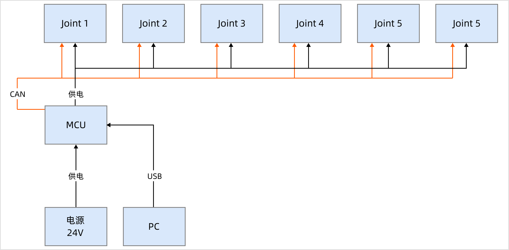
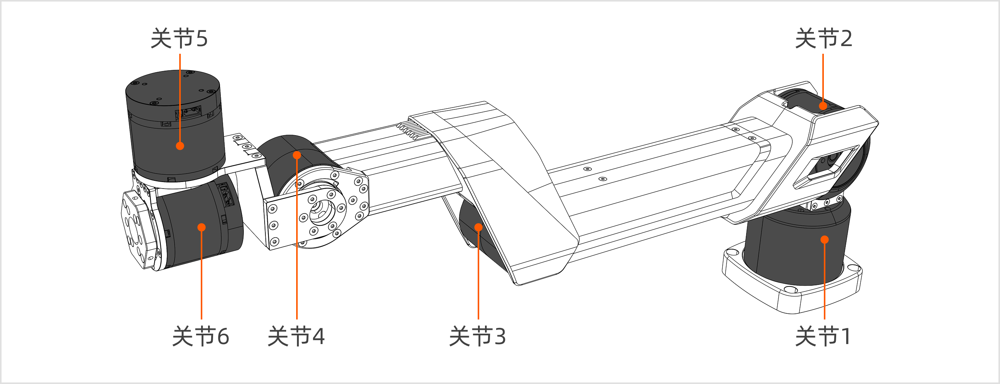
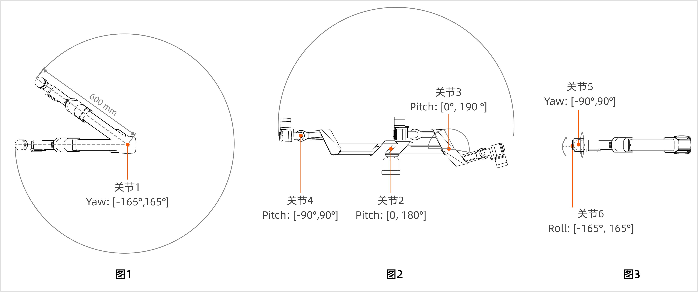
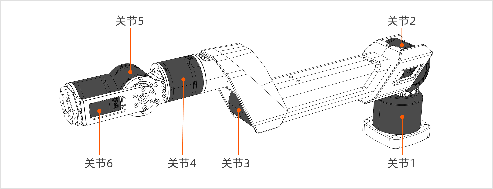
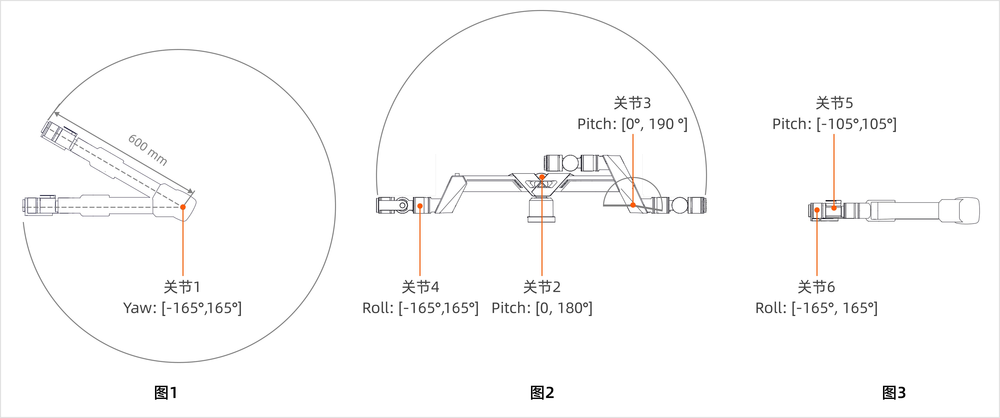
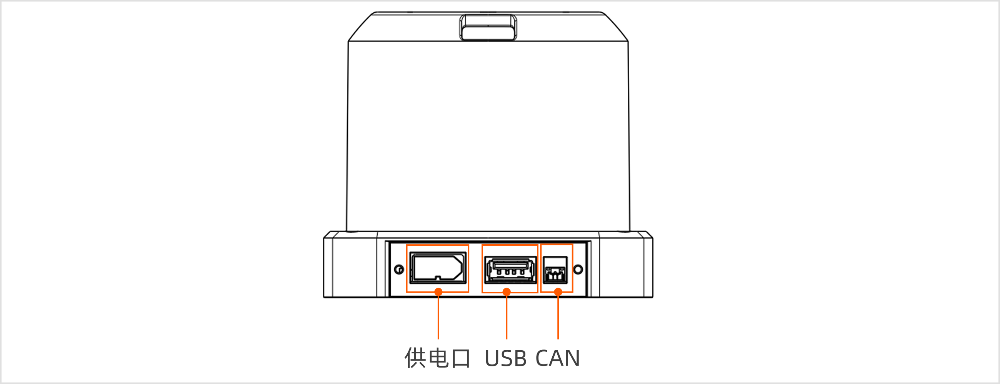
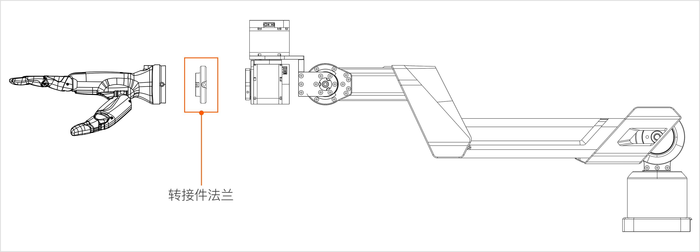

# A1XY 硬件介绍
> 本指南将为您详尽解读 Galaxea A1XY 硬件部分的数据。

## 安全指南
Galaxea 机械臂在操作不当的情况下可能带来安全隐患，有造成人身伤害的风险。

- 在您开始使用机械臂之前，请务必详细阅读以下安全须知。
- 对于尚未熟悉本安全指南的人员，在靠近机器人时必须受到严格监督，并需被明确告知机器人操作可能存在的风险。
- 在使用本产品之前，请务必对周围环境进行全面检查，以排除任何潜在的安全威胁。

## 技术规格

<table style="width: 100%; border-collapse: collapse;">
    <thead>
        <tr style="background-color: black; color: white; text-align: left;">
            <th style="width: 300px; padding: 8px; border: 1px solid #ddd;">机械参数</th>
            <th style="width: 400px; padding: 8px; border: 1px solid #ddd;">A1X 参数值</th>
            <th style="width: 400px; padding: 8px; border: 1px solid #ddd;">A1Y 参数值</th>
        </tr>
    </thead>
    <tbody>
        <tr style="background-color: white; text-align: left;">
            <td style="padding: 8px; border: 1px solid #ddd;">尺寸</td>
            <td style="padding: 8px; border: 1px solid #ddd;">600L x 100W x 305H mm</td>
            <td style="padding: 8px; border: 1px solid #ddd;">600L x 100W x 240H mm</td>
        </tr>
            <tr style="background-color: white; text-align: left;">
            <td style="padding: 8px; border: 1px solid #ddd;">重量</td>
            <td style="padding: 8px; border: 1px solid #ddd;">4.2 kg</td>
            <td style="padding: 8px; border: 1px solid #ddd;">4.2 kg</td>
        </tr>
        <tr style="background-color: white; text-align: left;">
            <td style="padding: 8px; border: 1px solid #ddd;">额定电压</td>
            <td style="padding: 8px; border: 1px solid #ddd;">24V</td>
            <td style="padding: 8px; border: 1px solid #ddd;">24V</td>
        </tr>
        <tr style="background-color: white; text-align: left;">
            <td style="padding: 8px; border: 1px solid #ddd;">额定电流</td>
            <td style="padding: 8px; border: 1px solid #ddd;">5A</td>
            <td style="padding: 8px; border: 1px solid #ddd;">5A</td>
        </tr>        
        <tr style="background-color: white; text-align: left;">
            <td style="padding: 8px; border: 1px solid #ddd;">最大电流</td>
            <td style="padding: 8px; border: 1px solid #ddd;">8A</td>
            <td style="padding: 8px; border: 1px solid #ddd;">8A</td>
        </tr>        
        <tr style="background-color: white; text-align: left;">
            <td style="padding: 8px; border: 1px solid #ddd;">通信接口</td>
            <td style="padding: 8px; border: 1px solid #ddd;">USB2.0、CAN</td>
            <td style="padding: 8px; border: 1px solid #ddd;">USB2.0、CAN</td>
        </tr>          
    </tbody>
</table>

<table style="width: 100%; border-collapse: collapse;">
    <thead>
        <tr style="background-color: black; color: white; text-align: left;">
            <th style="width: 300px; padding: 8px; border: 1px solid #ddd;">性能参数 </th>
            <th style="width: 400px; padding: 8px; border: 1px solid #ddd;">A1X 参数值</th>
            <th style="width: 400px; padding: 8px; border: 1px solid #ddd;">A1Y 参数值</th>
        </tr>
    </thead>
    <tbody>
        <tr style="background-color: white; text-align: left;">
            <td style="padding: 8px; border: 1px solid #ddd;">自由度</td>
            <td style="padding: 8px; border: 1px solid #ddd;">6</td>
            <td style="padding: 8px; border: 1px solid #ddd;">6</td>
        </tr>
            <tr style="background-color: white; text-align: left;">
            <td style="padding: 8px; border: 1px solid #ddd;">额定负载</td>
            <td style="padding: 8px; border: 1px solid #ddd;">3kg@0.6m</td>
            <td style="padding: 8px; border: 1px solid #ddd;">3kg@0.6m</td>
        </tr>
        <tr style="background-color: white; text-align: left;">
            <td style="padding: 8px; border: 1px solid #ddd;">最大负载</td>
            <td style="padding: 8px; border: 1px solid #ddd;">5kg@0.6m</td>
            <td style="padding: 8px; border: 1px solid #ddd;">5kg@0.6m</td>
        </tr>
        <tr style="background-color: white; text-align: left;">
            <td style="padding: 8px; border: 1px solid #ddd;">臂展</td>
            <td style="padding: 8px; border: 1px solid #ddd;">600 mm</td>
            <td style="padding: 8px; border: 1px solid #ddd;">600 mm</td>
        </tr>        
        <tr style="background-color: white; text-align: left;">
            <td style="padding: 8px; border: 1px solid #ddd;">最大末端线速度</td>
            <td style="padding: 8px; border: 1px solid #ddd;">5 m/s</td>
            <td style="padding: 8px; border: 1px solid #ddd;">5 m/s</td>
        </tr>        
        <tr style="background-color: white; text-align: left;">
            <td style="padding: 8px; border: 1px solid #ddd;">最大末端加速度</td>
            <td style="padding: 8px; border: 1px solid #ddd;">38 m/s²</td>
            <td style="padding: 8px; border: 1px solid #ddd;">38 m/s²</td>
        </tr>     
        <tr style="background-color: white; text-align: left;">
            <td style="padding: 8px; border: 1px solid #ddd;">重复定位精度</td>
            <td style="padding: 8px; border: 1px solid #ddd;">±0.05 mm</td>
            <td style="padding: 8px; border: 1px solid #ddd;">±0.05 mm</td>
        </tr>   
    </tbody>
</table>

## 硬件架构

## 机械结构

### 关节

#### A1X
A1X机械臂共有6个关节，最大旋转角度为330度。

<table style="width: 100%; border-collapse: collapse;">
    <thead>
        <tr style="background-color: black; color: white; text-align: left;">
            <th style="width: 300px; padding: 8px; border: 1px solid #ddd;">关节 </th>
            <th style="width: 400px; padding: 8px; border: 1px solid #ddd;">额定扭矩（Nm）</th>
            <th style="width: 400px; padding: 8px; border: 1px solid #ddd;">峰值扭矩（Nm）</th>
            <th style="width: 400px; padding: 8px; border: 1px solid #ddd;">额定速度（rpm）</th>
            <th style="width: 400px; padding: 8px; border: 1px solid #ddd;">峰值速度（rpm）</th>
            <th style="width: 400px; padding: 8px; border: 1px solid #ddd;">齿轮比</th>
            <th style="width: 400px; padding: 8px; border: 1px solid #ddd;">工作范围</th>            
        </tr>
    </thead>
    <tbody>
        <tr style="background-color: white; text-align: left;">
            <td style="padding: 8px; border: 1px solid #ddd;">Joint 1</td>
            <td style="padding: 8px; border: 1px solid #ddd;">9</td>
            <td style="padding: 8px; border: 1px solid #ddd;">27</td>
            <td style="padding: 8px; border: 1px solid #ddd;">36</td>
            <td style="padding: 8px; border: 1px solid #ddd;">100</td>
            <td style="padding: 8px; border: 1px solid #ddd;">40</td>
            <td style="padding: 8px; border: 1px solid #ddd;">[-165°,165°]</td>            
        </tr>
        <tr style="background-color: white; text-align: left;">
            <td style="padding: 8px; border: 1px solid #ddd;">Joint 2</td>
            <td style="padding: 8px; border: 1px solid #ddd;">20</td>
            <td style="padding: 8px; border: 1px solid #ddd;">50</td>
            <td style="padding: 8px; border: 1px solid #ddd;">40</td>
            <td style="padding: 8px; border: 1px solid #ddd;">120</td>
            <td style="padding: 8px; border: 1px solid #ddd;">39</td>
            <td style="padding: 8px; border: 1px solid #ddd;">[0, 180°]</td>            
        </tr>
        <tr style="background-color: white; text-align: left;">
            <td style="padding: 8px; border: 1px solid #ddd;">Joint 3</td>
            <td style="padding: 8px; border: 1px solid #ddd;">9</td>
            <td style="padding: 8px; border: 1px solid #ddd;">27</td>
            <td style="padding: 8px; border: 1px solid #ddd;">36</td>
            <td style="padding: 8px; border: 1px solid #ddd;">100</td>
            <td style="padding: 8px; border: 1px solid #ddd;">40</td>
            <td style="padding: 8px; border: 1px solid #ddd;">[-190°,0°]</td>            
        </tr>
        <tr style="background-color: white; text-align: left;">
            <td style="padding: 8px; border: 1px solid #ddd;">Joint 4</td>
            <td style="padding: 8px; border: 1px solid #ddd;">5</td>
            <td style="padding: 8px; border: 1px solid #ddd;">12</td>
            <td style="padding: 8px; border: 1px solid #ddd;">260</td>
            <td style="padding: 8px; border: 1px solid #ddd;">315</td>
            <td style="padding: 8px; border: 1px solid #ddd;">10</td>
            <td style="padding: 8px; border: 1px solid #ddd;">[-90°,90°]</td>            
        </tr>
        <tr style="background-color: white; text-align: left;">
            <td style="padding: 8px; border: 1px solid #ddd;">Joint 5</td>
            <td style="padding: 8px; border: 1px solid #ddd;">5</td>
            <td style="padding: 8px; border: 1px solid #ddd;">12</td>
            <td style="padding: 8px; border: 1px solid #ddd;">260</td>
            <td style="padding: 8px; border: 1px solid #ddd;">315</td>
            <td style="padding: 8px; border: 1px solid #ddd;">10</td>
            <td style="padding: 8px; border: 1px solid #ddd;">[-90°,90°]</td>            
        </tr>
        <tr style="background-color: white; text-align: left;">
            <td style="padding: 8px; border: 1px solid #ddd;">Joint 6</td>
            <td style="padding: 8px; border: 1px solid #ddd;">5</td>
            <td style="padding: 8px; border: 1px solid #ddd;">12</td>
            <td style="padding: 8px; border: 1px solid #ddd;">260</td>
            <td style="padding: 8px; border: 1px solid #ddd;">315</td>
            <td style="padding: 8px; border: 1px solid #ddd;">10</td>
            <td style="padding: 8px; border: 1px solid #ddd;">[-165°, 165°]</td>            
        </tr>
    </tbody>
</table>

注意：机械臂各关节工作范围会有2°限位保护。

机械臂各关节的工作范围如下图所示：

- 图1：机械臂关节1在Yaw角方向的最大旋转角度为330度，旋转半径为600mm。
- 图2：机械臂关节2和关节3在Pitch角正方向的最大旋转角度分别为180度和190度；关节4在Pitch角方向的最大旋转角度为180度。
- 图3：机械臂关节5在Yaw角方向的最大旋转角度为180度；关节6在Roll角方向的最大旋转角度为330度。

#### A1 Y
A1Y机械臂共有6个关节，最大旋转角度为330度。

其中，关节4和关节5与A1X有区别。具体参数如下：

<table style="width: 100%; border-collapse: collapse;">
    <thead>
        <tr style="background-color: black; color: white; text-align: left;">
            <th style="width: 300px; padding: 8px; border: 1px solid #ddd;">关节 </th>
            <th style="width: 400px; padding: 8px; border: 1px solid #ddd;">额定扭矩（Nm）</th>
            <th style="width: 400px; padding: 8px; border: 1px solid #ddd;">峰值扭矩（Nm）</th>
            <th style="width: 400px; padding: 8px; border: 1px solid #ddd;">额定速度（rpm）</th>
            <th style="width: 400px; padding: 8px; border: 1px solid #ddd;">峰值速度（rpm）</th>
            <th style="width: 400px; padding: 8px; border: 1px solid #ddd;">齿轮比</th>
            <th style="width: 400px; padding: 8px; border: 1px solid #ddd;">工作范围</th>            
        </tr>
    </thead>
    <tbody>
        <tr style="background-color: white; text-align: left;">
            <td style="padding: 8px; border: 1px solid #ddd;">Joint 1</td>
            <td style="padding: 8px; border: 1px solid #ddd;">9</td>
            <td style="padding: 8px; border: 1px solid #ddd;">27</td>
            <td style="padding: 8px; border: 1px solid #ddd;">36</td>
            <td style="padding: 8px; border: 1px solid #ddd;">100</td>
            <td style="padding: 8px; border: 1px solid #ddd;">40</td>
            <td style="padding: 8px; border: 1px solid #ddd;">[-165°,165°]</td>            
        </tr>
        <tr style="background-color: white; text-align: left;">
            <td style="padding: 8px; border: 1px solid #ddd;">Joint 2</td>
            <td style="padding: 8px; border: 1px solid #ddd;">20</td>
            <td style="padding: 8px; border: 1px solid #ddd;">50</td>
            <td style="padding: 8px; border: 1px solid #ddd;">40</td>
            <td style="padding: 8px; border: 1px solid #ddd;">120</td>
            <td style="padding: 8px; border: 1px solid #ddd;">39</td>
            <td style="padding: 8px; border: 1px solid #ddd;">[0, 180°]</td>            
        </tr>
        <tr style="background-color: white; text-align: left;">
            <td style="padding: 8px; border: 1px solid #ddd;">Joint 3</td>
            <td style="padding: 8px; border: 1px solid #ddd;">9</td>
            <td style="padding: 8px; border: 1px solid #ddd;">27</td>
            <td style="padding: 8px; border: 1px solid #ddd;">36</td>
            <td style="padding: 8px; border: 1px solid #ddd;">100</td>
            <td style="padding: 8px; border: 1px solid #ddd;">40</td>
            <td style="padding: 8px; border: 1px solid #ddd;">[-190°,0°]</td>            
        </tr>
        <tr style="background-color: white; text-align: left;">
            <td style="padding: 8px; border: 1px solid #ddd;">Joint 4</td>
            <td style="padding: 8px; border: 1px solid #ddd;">5</td>
            <td style="padding: 8px; border: 1px solid #ddd;">12</td>
            <td style="padding: 8px; border: 1px solid #ddd;">260</td>
            <td style="padding: 8px; border: 1px solid #ddd;">315</td>
            <td style="padding: 8px; border: 1px solid #ddd;">10</td>
            <td style="padding: 8px; border: 1px solid #ddd;">[-165°,165°]</td>            
        </tr>
        <tr style="background-color: white; text-align: left;">
            <td style="padding: 8px; border: 1px solid #ddd;">Joint 5</td>
            <td style="padding: 8px; border: 1px solid #ddd;">5</td>
            <td style="padding: 8px; border: 1px solid #ddd;">12</td>
            <td style="padding: 8px; border: 1px solid #ddd;">260</td>
            <td style="padding: 8px; border: 1px solid #ddd;">315</td>
            <td style="padding: 8px; border: 1px solid #ddd;">10</td>
            <td style="padding: 8px; border: 1px solid #ddd;">[-105°,105°]</td>            
        </tr>
        <tr style="background-color: white; text-align: left;">
            <td style="padding: 8px; border: 1px solid #ddd;">Joint 6</td>
            <td style="padding: 8px; border: 1px solid #ddd;">5</td>
            <td style="padding: 8px; border: 1px solid #ddd;">12</td>
            <td style="padding: 8px; border: 1px solid #ddd;">260</td>
            <td style="padding: 8px; border: 1px solid #ddd;">315</td>
            <td style="padding: 8px; border: 1px solid #ddd;">10</td>
            <td style="padding: 8px; border: 1px solid #ddd;">[-165°, 165°]</td>            
        </tr>
    </tbody>
</table>
机械臂各关节的工作范围如下图所示：

- 图1：机械臂关节1在Yaw角方向的最大旋转角度为330度，旋转半径为600mm。
- 图2：机械臂关节2和关节3在Pitch角正方向的最大旋转角度分别为180度和190度；关节4在Roll角方向的最大旋转角度为330度。
- 图3：机械臂关节5在Pitch角方向的最大旋转角度为210度；关节6在Roll角方向的最大旋转角度为330度。

### 底座

<table style="width: 100%; border-collapse: collapse;">
    <thead>
        <tr style="background-color: black; color: white; text-align: left;">
            <th style="width: 300px; padding: 8px; border: 1px solid #ddd;">底座</th>
            <th style="width: 400px; padding: 8px; border: 1px solid #ddd;">备注</th>
        </tr>
    </thead>
    <tbody>
        <tr style="background-color: white; text-align: left;">
            <td style="padding: 8px; border: 1px solid #ddd;">尺寸</td>
            <td style="padding: 8px; border: 1px solid #ddd;">75L x 75W mm</td>
        </tr>
            <tr style="background-color: white; text-align: left;">
            <td style="padding: 8px; border: 1px solid #ddd;">供电口</td>
            <td style="padding: 8px; border: 1px solid #ddd;">额定电压：24 V</td>
        </tr>
        <tr style="background-color: white; text-align: left;">
            <td style="padding: 8px; border: 1px solid #ddd;">通信口</td>
            <td style="padding: 8px; border: 1px solid #ddd;">USB 2.0、CAN</td>
        </tr>
        <tr style="background-color: white; text-align: left;">
            <td style="padding: 8px; border: 1px solid #ddd;">安装孔位</td>
            <td style="padding: 8px; border: 1px solid #ddd;">四个M6螺纹，直径6.3mm</td>
        </tr>                 
    </tbody>
</table>

### 末端执行器

#### Galaxea G1夹爪

Galaxea G1为自研平行夹爪，产品配备一个关节电机和两指夹具。

**注意：A1XY机械臂不包括夹爪。如有需要，请联系我们购买。**

<table style="width: 100%; border-collapse: collapse;">
    <thead>
        <tr style="background-color: black; color: white; text-align: left;">
            <th style="width: 300px; padding: 8px; border: 1px solid #ddd;">夹爪</th>
            <th style="width: 400px; padding: 8px; border: 1px solid #ddd;">备注</th>
        </tr>
    </thead>
    <tbody>
        <tr style="background-color: white; text-align: left;">
            <td style="padding: 8px; border: 1px solid #ddd;">长度</td>
            <td style="padding: 8px; border: 1px solid #ddd;">145 mm</td>
        </tr>
            <tr style="background-color: white; text-align: left;">
            <td style="padding: 8px; border: 1px solid #ddd;">夹爪长度</td>
            <td style="padding: 8px; border: 1px solid #ddd;">78 mm</td>
        </tr>
        <tr style="background-color: white; text-align: left;">
            <td style="padding: 8px; border: 1px solid #ddd;">电机直径</td>
            <td style="padding: 8px; border: 1px solid #ddd;">57 mm</td>
        </tr>
        <tr style="background-color: white; text-align: left;">
            <td style="padding: 8px; border: 1px solid #ddd;">夹爪操作范围</td>
            <td style="padding: 8px; border: 1px solid #ddd;">0 ~ 100 mm</td>
        </tr>    
        <tr style="background-color: white; text-align: left;">
            <td style="padding: 8px; border: 1px solid #ddd;">夹爪额定力</td>
            <td style="padding: 8px; border: 1px solid #ddd;">100 N</td>
        </tr>                 
    </tbody>
</table>

#### 安装方式

通过以下步骤即可将夹爪G1安装至机械臂末端（反转步骤即可拆卸夹爪）。

1. **对齐检查：**确保夹爪周围的3个安装孔与机械臂末端的3个安装孔对齐。
2. **螺丝固定：**对齐后，使用提供的3个螺丝将夹爪固定并紧固到机械臂末端。
3. **牢固检查：**紧固螺丝后，再次检查夹爪的安装是否对齐并是否牢固。
4. **连接线束：**连接机械臂末端J6外侧的CAN线束至夹爪的通信口。

#### **安装其他末端执行器**

通过以下步骤可以即将其他末端执行器安装至机械臂末端（反转步骤即可拆卸），此处以灵巧手为例。

1. **对齐检查：**使用特制转接件法兰，将法兰和灵巧手周围的4个安装孔对齐，以及将法兰与机械臂末端周围的3个安装孔对齐。（法兰.stp文件可联系support@galaxea.ai获取）
2. **螺丝固定：**对齐后，使用提供的螺丝将灵巧手、法兰和机械臂末端固定连接在一起。
3. **牢固检查：**紧固螺丝后，再次检查灵巧手的安装是否对齐并是否牢固。
4. **连接线束：**连接机械臂末端关节J6外侧的CAN线束至执行器的通信口。