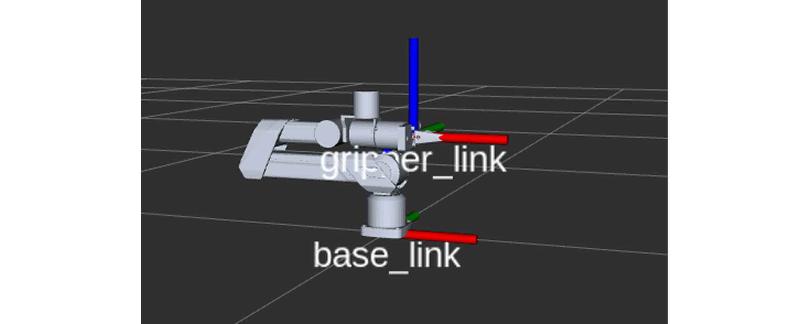

## 环境依赖

1. 操作系统依赖：Ubuntu 20.04 LTS
2. 中间件依赖：ROS Noetic

## 软件资源

点击以下链接获取A1XY SDK文件：

- 百度云盘：[https://pan.baidu.com/s/1jVEqjL-r_Ll7bKFB1XxKIw?pwd=a1xy](https://pan.baidu.com/s/1jVEqjL-r_Ll7bKFB1XxKIw?pwd=a1xy)
- Google Drive：[https://drive.google.com/drive/folders/180qSZTc7bZgwklVuwcuhq5O2DPteI2nR?usp=sharing](https://drive.google.com/drive/folders/180qSZTc7bZgwklVuwcuhq5O2DPteI2nR?usp=sharing)

当前为A1XY机械臂的首发软件版本。后续的版本更新您可以在A1XY软件版本更新日志中查看，获取最新的SDK包及更新信息。

点击获取A1XY URDF文件：

- [A1X URDF](https://github.com/userguide-galaxea/URDF/tree/galaxea/main/A1X)
- [A1Y URDF](https://github.com/userguide-galaxea/URDF/tree/galaxea/main/A1Y)

## 启动SDK

点击查看[A1XY 启动与Demo演示指南](./A1XY_Startup_Demo_Guide.md)

## Demo演示

点击查看[A1XY Demo演示](./A1XY_Startup_Demo_Guide.md/#23-demo演示)

## 软件接口

### 驱动接口

<table style="width: 100%; border-collapse: collapse;">
    <thead>
        <tr style="background-color: black; color: white; text-align: left;table-layout: fixed;">
            <th style="width: 200px; padding: 8px; border: 1px solid #ddd;">话题名称</th>
            <th style="width: 100px; padding: 8px; border: 1px solid #ddd;">I/O</th>          
            <th style="width: 200px; padding: 8px; border: 1px solid #ddd;">描述</th>
            <th style="width: 200px; padding: 8px; border: 1px solid #ddd;">消息类型</th>
        </tr>
    </thead>
    <tbody>
        <tr style="background-color: white; text-align: left;">
            <td style="padding: 8px; border: 1px solid #ddd;">/hdas/feedback_arm</td>
            <td style="padding: 8px; border: 1px solid #ddd;">Output</td>                    
            <td style="padding: 8px; border: 1px solid #ddd;">各关节反馈位置/速度/力矩</td>
            <td style="padding: 8px; border: 1px solid #ddd;">sensor_msgs::JointState</td>
        </tr>
        <tr style="background-color: white; text-align: left;">
            <td style="padding: 8px; border: 1px solid #ddd;">/hdas/feedback_gripper</td>
            <td style="padding: 8px; border: 1px solid #ddd;">Output</td>                    
            <td style="padding: 8px; border: 1px solid #ddd;">末端夹爪反馈行程</td>
            <td style="padding: 8px; border: 1px solid #ddd;">sensor_msgs::JointState</td>
        </tr>
        <tr style="background-color: white; text-align: left;">
            <td style="padding: 8px; border: 1px solid #ddd;">/hdas/feedback_status</td>
            <td style="padding: 8px; border: 1px solid #ddd;">Output</td>                                   
            <td style="padding: 8px; border: 1px solid #ddd;">各关节状态反馈</td>
            <td style="padding: 8px; border: 1px solid #ddd;">hdas_msg::feedback_status</td>
        </tr>
        <tr style="background-color: white; text-align: left;">
            <td style="padding: 8px; border: 1px solid #ddd;">/motion_control/control_arm</td>
            <td style="padding: 8px; border: 1px solid #ddd;">Input</td>                   
            <td style="padding: 8px; border: 1px solid #ddd;">各关节电机控制接口</td>
            <td style="padding: 8px; border: 1px solid #ddd;">hdas_msg::motor_control</td>
        </tr>
        <tr style="background-color: white; text-align: left;">
            <td style="padding: 8px; border: 1px solid #ddd;">/motion_control/control_gripper</td>
            <td style="padding: 8px; border: 1px solid #ddd;">Input</td>                 
            <td style="padding: 8px; border: 1px solid #ddd;">末端夹爪电机控制接口</td>
            <td style="padding: 8px; border: 1px solid #ddd;">hdas_msg::motor_control</td>
        </tr>
        <tr style="background-color: white; text-align: left;">
            <td style="padding: 8px; border: 1px solid #ddd;">/motion_control/position_control_gripper</td>
            <td style="padding: 8px; border: 1px solid #ddd;">Input</td>                    
            <td style="padding: 8px; border: 1px solid #ddd;">末端夹爪行程控制接口</td>
            <td style="padding: 8px; border: 1px solid #ddd;">std_msgs::Float32</td>
        </tr>
        <tr style="background-color: white; text-align: left;">
            <td style="padding: 8px; border: 1px solid #ddd;">/arm_node/function_frame_arm</td>
            <td style="padding: 8px; border: 1px solid #ddd;">Input</td>                    
            <td style="padding: 8px; border: 1px solid #ddd;">机械臂功能帧</td>
            <td style="padding: 8px; border: 1px solid #ddd;">hdas_msg/FunctionFrame</td>
        </tr>        
    </tbody>
</table>

针对以上话题的具体字段及其详细描述如下表所示：

<table style="width: 100%; border-collapse: collapse;">
    <thead>
        <tr style="background-color: black; color: white; text-align: left;table-layout: fixed;">
            <th style="width: 200px; padding: 8px; border: 1px solid #ddd;">话题名称</th>
            <th style="width: 100px; padding: 8px; border: 1px solid #ddd;">字段</th>          
            <th style="width: 400px; padding: 8px; border: 1px solid #ddd;">描述</th>
        </tr>
    </thead>
    <tbody>
        <tr style="background-color: white;">
            <td rowspan="4" style="padding: 10px; border: 1px solid #ddd; vertical-align: middle;">/hdas/feedback_arm</td>
            <td style="padding: 10px; border: 1px solid #ddd;">header</td>
            <td style="padding: 10px; border: 1px solid #ddd;">标准消息头</td>
        </tr>
        <tr style="background-color: white;">
            <td style="padding: 10px; border: 1px solid #ddd;">position</td>
            <td style="padding: 10px; border: 1px solid #ddd;">[Joint1_position, Joint2_position, Joint3_position, Joint4_position, Joint5_position, Joint6_position, gripper_position]</td>
        </tr>
        <tr style="background-color: white;">
            <td style="padding: 10px; border: 1px solid #ddd;">velocity</td>
            <td style="padding: 10px; border: 1px solid #ddd;">[Joint1_velocity, Joint2_velocity, Joint3_velocity, Joint4_velocity, Joint5_velocity, Joint6_velocity, gripper_velocity]</td>
        </tr>
        <tr style="background-color: white;">
            <td style="padding: 10px; border: 1px solid #ddd;">effort</td>
            <td style="padding: 10px; border: 1px solid #ddd;">[Joint1_effort, Joint2_effort, Joint3_effort, Joint4_effort, Joint5_effort, Joint6_effort, gripper_effort]</td>
        </tr>
        <tr style="background-color: white;">
            <td rowspan="4" style="padding: 10px; border: 1px solid #ddd; vertical-align: middle;">/hdas/feedback_gripper</td>
            <td style="padding: 10px; border: 1px solid #ddd;">header</td>
            <td style="padding: 10px; border: 1px solid #ddd;">标准消息头</td>
        </tr>
        <tr style="background-color: white;">
            <td style="padding: 10px; border: 1px solid #ddd;">position</td>
            <td style="padding: 10px; border: 1px solid #ddd;">[gripper_stroke]</td>
        </tr>
        <tr style="background-color: white;">
            <td style="padding: 10px; border: 1px solid #ddd;">velocity</td>
            <td style="padding: 10px; border: 1px solid #ddd;">未使用</td>
        </tr>
        <tr style="background-color: white;">
            <td style="padding: 10px; border: 1px solid #ddd;">effort</td>
            <td style="padding: 10px; border: 1px solid #ddd;">未使用</td>
        </tr>
                <tr style="background-color: white;">
            <td rowspan="3" style="padding: 10px; border: 1px solid #ddd; vertical-align: middle;">/hdas/feedback_status_arm</td>
            <td style="padding: 10px; border: 1px solid #ddd;">header</td>
            <td style="padding: 10px; border: 1px solid #ddd;">标准消息头</td>
        </tr>
        <tr style="background-color: white;">
            <td style="padding: 10px; border: 1px solid #ddd;">name_id</td>
            <td style="padding: 10px; border: 1px solid #ddd;">关节名称</td>
        </tr>
        <tr style="background-color: white;">
            <td style="padding: 10px; border: 1px solid #ddd;">errors</td>
            <td style="padding: 10px; border: 1px solid #ddd;">包含错误代码及描述</td>
        </tr>
        <tr style="background-color: white;">
            <td rowspan="8" style="padding: 10px; border: 1px solid #ddd; vertical-align: middle;">/motion_control/control_arm</td>
            <td style="padding: 10px; border: 1px solid #ddd;">header</td>
            <td style="padding: 10px; border: 1px solid #ddd;">标准消息头</td>
        </tr>
        <tr style="background-color: white;">
            <td style="padding: 10px; border: 1px solid #ddd;">name</td>
            <td style="padding: 10px; border: 1px solid #ddd;">-</td>
        </tr>        
        <tr style="background-color: white;">
            <td style="padding: 10px; border: 1px solid #ddd;">p_des</td>
            <td style="padding: 10px; border: 1px solid #ddd;">[Joint1_position, Joint2_position, Joint3_position, Joint4_position, Joint5_position, Joint6_position]</td>
        </tr>
        <tr style="background-color: white;">
            <td style="padding: 10px; border: 1px solid #ddd;">v_des</td>
            <td style="padding: 10px; border: 1px solid #ddd;">[Joint1_velocity, Joint2_velocity, Joint3_velocity, Joint4_velocity, Joint5_velocity, Joint6_velocity]</td>
        </tr>
        <tr style="background-color: white;">
            <td style="padding: 10px; border: 1px solid #ddd;">kp</td>
            <td style="padding: 10px; border: 1px solid #ddd;">[Joint1_kp, Joint2_kp, Joint3_kp, Joint4_kp, Joint5_kp, Joint6_kp]</td>
        </tr>
        <tr style="background-color: white;">
            <td style="padding: 10px; border: 1px solid #ddd;">kd</td>
            <td style="padding: 10px; border: 1px solid #ddd;">[Joint1_kd, Joint2_kd, Joint3_kd, Joint4_kd, Joint5_kd, Joint6_kd]</td>
        </tr>
        <tr style="background-color: white;">
            <td style="padding: 10px; border: 1px solid #ddd;">t_ff</td>
            <td style="padding: 10px; border: 1px solid #ddd;">[Joint1_effort, Joint2_effort, Joint3_effort, Joint4_effort, Joint5_effort, Joint6_effort]</td>
        </tr>        
        <tr style="background-color: white;">
            <td style="padding: 10px; border: 1px solid #ddd;">mode</td>
            <td style="padding: 10px; border: 1px solid #ddd;">-</td>
        </tr>
        <tr style="background-color: white;">
            <td rowspan="8" style="padding: 10px; border: 1px solid #ddd; vertical-align: middle;">/motion_control/control_gripper</td>
            <td style="padding: 10px; border: 1px solid #ddd;">header</td>
            <td style="padding: 10px; border: 1px solid #ddd;">标准消息头</td>
        </tr>
        <tr style="background-color: white;">
            <td style="padding: 10px; border: 1px solid #ddd;">name</td>
            <td style="padding: 10px; border: 1px solid #ddd;">-</td>
        </tr>        
        <tr style="background-color: white;">
            <td style="padding: 10px; border: 1px solid #ddd;">p_des</td>
            <td style="padding: 10px; border: 1px solid #ddd;">[gripper_position]</td>
        </tr>
        <tr style="background-color: white;">
            <td style="padding: 10px; border: 1px solid #ddd;">v_des</td>
            <td style="padding: 10px; border: 1px solid #ddd;">[gripper_velocity]</td>
        </tr>
        <tr style="background-color: white;">
            <td style="padding: 10px; border: 1px solid #ddd;">kp</td>
            <td style="padding: 10px; border: 1px solid #ddd;">[gripper_kp]</td>
        </tr>
        <tr style="background-color: white;">
            <td style="padding: 10px; border: 1px solid #ddd;">kd</td>
            <td style="padding: 10px; border: 1px solid #ddd;">[gripper_kd]</td>
        </tr>
        <tr style="background-color: white;">
            <td style="padding: 10px; border: 1px solid #ddd;">t_ff</td>
            <td style="padding: 10px; border: 1px solid #ddd;">[gripper_effort]</td>
        </tr>        
        <tr style="background-color: white;">
            <td style="padding: 10px; border: 1px solid #ddd;">mode</td>
            <td style="padding: 10px; border: 1px solid #ddd;">-</td>
        </tr>
        <tr style="background-color: white;">
            <td rowspan="2" style="padding: 10px; border: 1px solid #ddd; vertical-align: middle;">/motion_control/position_control_gripper</td>
            <td style="padding: 10px; border: 1px solid #ddd;">header</td>
            <td style="padding: 10px; border: 1px solid #ddd;">标准消息头</td>
        </tr>
        <tr style="background-color: white;">
            <td style="padding: 10px; border: 1px solid #ddd;">data</td>
            <td style="padding: 10px; border: 1px solid #ddd;">desired_gripper_stroke, range (0 to 100) mm</td>
        </tr>
        <tr style="background-color: white; text-align: left;">
            <td style="padding: 8px; border: 1px solid #ddd;">/arm_node/function_frame_arm</td>
            <td style="padding: 8px; border: 1px solid #ddd;">command</td>                    
            <td style="padding: 8px; border: 1px solid #ddd;">1: 使能<br>2: 失能<br>3: 整臂标定<br>4: 清除错误</td>
        </tr>
    </tbody>
</table>


### 运控接口

#### 关节控制

```Bash
source A1XY_workspace/install/setup.bash

# 根据产品型号，选择以下任一启动方式：
roslaunch mobiman a1x_jointTrackerdemo.launch
roslaunch mobiman a1y_jointTrackerdemo.launch
```

该启动文件将启动 `a1_xy_jointTracker_demo_node`，该节点是负责控制每个关节的主要节点。

接口信息如下：

<table style="width: 100%; border-collapse: collapse;">
    <thead>
        <tr style="background-color: black; color: white; text-align: left;table-layout: fixed;">
            <th style="width: 200px; padding: 8px; border: 1px solid #ddd;">话题名称</th>
            <th style="width: 100px; padding: 8px; border: 1px solid #ddd;">I/O</th>          
            <th style="width: 200px; padding: 8px; border: 1px solid #ddd;">描述</th>
            <th style="width: 200px; padding: 8px; border: 1px solid #ddd;">消息类型</th>
        </tr>
    </thead>
    <tbody>
        <tr style="background-color: white; text-align: left;">
            <td style="padding: 8px; border: 1px solid #ddd;">/hdas/feedback_arm</td>
            <td style="padding: 8px; border: 1px solid #ddd;">Output</td>                                   
            <td style="padding: 8px; border: 1px solid #ddd;">手臂关节反馈</td>
            <td style="padding: 8px; border: 1px solid #ddd;">Hdas_msg::motor_control</td>
        </tr>        
        <tr style="background-color: white; text-align: left;">
            <td style="padding: 8px; border: 1px solid #ddd;">/motion_control/control_arm</td>
            <td style="padding: 8px; border: 1px solid #ddd;">Input</td>                    
            <td style="padding: 8px; border: 1px solid #ddd;">手臂电机控制</td>
            <td style="padding: 8px; border: 1px solid #ddd;">Sensor_msgs::JointState</td>
        </tr>
        <tr style="background-color: white; text-align: left;">
            <td style="padding: 8px; border: 1px solid #ddd;">/motion_target/target_joint_state_arm</td>
            <td style="padding: 8px; border: 1px solid #ddd;">Input</td>                    
            <td style="padding: 8px; border: 1px solid #ddd;">各关节目标位置</td>
            <td style="padding: 8px; border: 1px solid #ddd;">sensor_msgs::JointState</td>
        </tr>
    </tbody>
</table>

针对以上话题的具体字段及其详细描述如下表所示：

<table style="width: 100%; border-collapse: collapse;">
    <thead>
        <tr style="background-color: black; color: white; text-align: left;table-layout: fixed;">
            <th style="width: 300px; padding: 8px; border: 1px solid #ddd;">话题名称</th>
            <th style="width: 200px; padding: 8px; border: 1px solid #ddd;">字段</th>          
            <th style="width: 400px; padding: 8px; border: 1px solid #ddd;">描述</th>
        </tr>
    </thead>
    <tbody>
        <tr style="background-color: white;">
            <td rowspan="2" style="padding: 10px; border: 1px solid #ddd; vertical-align: middle;">/motion_target/target_joint_state_arm</td>
            <td style="padding: 10px; border: 1px solid #ddd;">position</td>
            <td style="padding: 10px; border: 1px solid #ddd;">这是一个包含六个元素的向量，代表每个关节的六个目标位置。</td>
        </tr>
        <tr style="background-color: white;">
            <td style="padding: 10px; border: 1px solid #ddd;">velocity</td>
            <td style="padding: 10px; border: 1px solid #ddd;">这是一个包含六个元素的向量，代表每个关节在运动过程中的最大速度。最大速度如下：{3, 3, 3, 5, 5, 5, 5}。 加速度和加加速度限制设置为速度限制的1.5倍。</td>
        </tr>
        <tr style="background-color: white; text-align: left;">
            <td style="padding: 8px; border: 1px solid #ddd;">/hdas/feedback_arm</td>
            <td style="padding: 8px; border: 1px solid #ddd;">-</td>                    
            <td style="padding: 8px; border: 1px solid #ddd;">请参考手臂驱动接口</td>
        </tr>
        <tr style="background-color: white; text-align: left;">
            <td style="padding: 8px; border: 1px solid #ddd;">/motion_control/control_arm</td>
            <td style="padding: 8px; border: 1px solid #ddd;">-</td>                    
            <td style="padding: 8px; border: 1px solid #ddd;">请参考手臂驱动接口</td>
        </tr>
    </tbody>
</table>

#### 手臂姿态控制

A1XY手臂姿态控制是一个用于控制手臂移动到目标末端执行器（ee）坐标帧的ROS软件包。它主要包括一个launch文件,可以通过以下命令启动。

```Bash
source A1XY_workspace/install/setup.bash

# 根据产品型号，选择以下任一启动方式：
roslaunch mobiman a1x_arm_relaxed_ik.launch
roslaunch mobiman a1y_arm_relaxed_ik.launch
```

请注意： 

- 当双臂姿态控制器启动后，还是需要将关节控制节点启动，原因是姿态控制是根据目标ee姿态不断解算出目标关节角下发给`/motion_target/target_joint_state_arm`。

    ```Bash
    source A1XY_workspace/install/setup.bash

    # 根据产品型号，选择以下任一启动方式：
    roslaunch mobiman a1x_jointTrackerdemo.launch
    roslaunch mobiman a1y_jointTrackerdemo.launch
    ```

- 当前末端姿态控制的相对位姿是URDF中gripper_link相对于base_link的姿态转换。以A1X为例，下图展示了gripper_link坐标系相对于base_link坐标系的相对关系，包含了x、y、z的偏移量以及orientation对应的旋转偏移。

  

该接口如下所示：

<table style="width: 100%; border-collapse: collapse;">
    <thead>
        <tr style="background-color: black; color: white; text-align: left;table-layout: fixed;">
            <th style="width: 200px; padding: 8px; border: 1px solid #ddd;">话题名称</th>
            <th style="width: 100px; padding: 8px; border: 1px solid #ddd;">I/O</th>          
            <th style="width: 200px; padding: 8px; border: 1px solid #ddd;">描述</th>
            <th style="width: 200px; padding: 8px; border: 1px solid #ddd;">消息类型</th>
        </tr>
    </thead>
    <tbody>
        <tr style="background-color: white; text-align: left;">
            <td style="padding: 8px; border: 1px solid #ddd;">/hdas/feedback_arm</td>
            <td style="padding: 8px; border: 1px solid #ddd;">Output</td>                                   
            <td style="padding: 8px; border: 1px solid #ddd;">手臂关节反馈</td>
            <td style="padding: 8px; border: 1px solid #ddd;">Hdas_msg::motor_control</td>
        </tr>        
        <tr style="background-color: white; text-align: left;">
            <td style="padding: 8px; border: 1px solid #ddd;">/motion_target/target_joint_state_arm</td>
            <td style="padding: 8px; border: 1px solid #ddd;">Input</td>                    
            <td style="padding: 8px; border: 1px solid #ddd;">手臂关节目标</td>
            <td style="padding: 8px; border: 1px solid #ddd;">Sensor_msgs::JointState</td>
        </tr>
        <tr style="background-color: white; text-align: left;">
            <td style="padding: 8px; border: 1px solid #ddd;">/motion_target/pose_ee_arm</td>
            <td style="padding: 8px; border: 1px solid #ddd;">Input</td>                    
            <td style="padding: 8px; border: 1px solid #ddd;">目标手臂末端执行器姿态</td>
            <td style="padding: 8px; border: 1px solid #ddd;">Geometry_msgs::PoseStamped</td>
        </tr>
    </tbody>
</table>

针对以上话题的具体字段及其详细描述如下表所示：

<table style="width: 100%; border-collapse: collapse;">
    <thead>
        <tr style="background-color: black; color: white; text-align: left;table-layout: fixed;">
            <th style="width: 300px; padding: 8px; border: 1px solid #ddd;">话题名称</th>
            <th style="width: 200px; padding: 8px; border: 1px solid #ddd;">字段</th>          
            <th style="width: 400px; padding: 8px; border: 1px solid #ddd;">描述</th>
        </tr>
    </thead>
    <tbody>
        <tr style="background-color: white;">
            <td rowspan="8" style="padding: 10px; border: 1px solid #ddd; vertical-align: middle;">/motion_target/pose_ee_arm</td>
            <td style="padding: 10px; border: 1px solid #ddd;">header</td>
            <td style="padding: 10px; border: 1px solid #ddd;">标准消息头</td>
        </tr>
        <tr style="background-color: white;">
            <td style="padding: 10px; border: 1px solid #ddd;">pose.position.x</td>
            <td style="padding: 10px; border: 1px solid #ddd;">X轴偏移</td>
        </tr>
        <tr style="background-color: white; text-align: left;">
            <td style="padding: 8px; border: 1px solid #ddd;">pose.position.y</td>
            <td style="padding: 8px; border: 1px solid #ddd;">Y轴偏移</td>                    
        </tr>
        <tr style="background-color: white; text-align: left;">
            <td style="padding: 8px; border: 1px solid #ddd;">pose.position.z</td>
            <td style="padding: 8px; border: 1px solid #ddd;">Z轴偏移</td>                    
        </tr>
        <tr style="background-color: white; text-align: left;">
            <td style="padding: 8px; border: 1px solid #ddd;">pose.orientation.x</td>
            <td style="padding: 8px; border: 1px solid #ddd;">旋转四元数</td>                    
        </tr>
        <tr style="background-color: white; text-align: left;">
            <td style="padding: 8px; border: 1px solid #ddd;">pose.orientation.y</td>
            <td style="padding: 8px; border: 1px solid #ddd;">旋转四元数</td>                    
        </tr>
        <tr style="background-color: white; text-align: left;">
            <td style="padding: 8px; border: 1px solid #ddd;">pose.orientation.z</td>
            <td style="padding: 8px; border: 1px solid #ddd;">旋转四元数</td>                    
        </tr>
        <tr style="background-color: white; text-align: left;">
            <td style="padding: 8px; border: 1px solid #ddd;">pose.orientation.w</td>
            <td style="padding: 8px; border: 1px solid #ddd;">旋转四元数</td>                    
        </tr>
        <tr style="background-color: white; text-align: left;">
            <td style="padding: 8px; border: 1px solid #ddd;">/hdas/feedback_arm</td>
            <td style="padding: 8px; border: 1px solid #ddd;">-</td>                    
            <td style="padding: 8px; border: 1px solid #ddd;">请参考手臂驱动接口</td>
        </tr>
        <tr style="background-color: white; text-align: left;">
            <td style="padding: 8px; border: 1px solid #ddd;">/motion_target/target_joint_state_arm</td>
            <td style="padding: 8px; border: 1px solid #ddd;">-</td>                    
            <td style="padding: 8px; border: 1px solid #ddd;">请参考手臂驱动接口</td>
        </tr>
    </tbody>
</table>

#### 夹爪控制

A1XY夹爪控制是一个用于控制末端夹爪的ROS node。它主要包括一个launch文件,可以通过以下命令启动：

```Bash
source A1XY_workspace/install/setup.bash
roslaunch mobiman a1xy_gripperController.launch
```

该启动文件将启动 `a1_xy_jointTracker_demo_node`，该节点是负责控制每个关节的主要节点。

接口信息如下：

<table style="width: 100%; border-collapse: collapse;">
    <thead>
        <tr style="background-color: black; color: white; text-align: left;table-layout: fixed;">
            <th style="width: 200px; padding: 8px; border: 1px solid #ddd;">话题名称</th>
            <th style="width: 100px; padding: 8px; border: 1px solid #ddd;">I/O</th>          
            <th style="width: 200px; padding: 8px; border: 1px solid #ddd;">描述</th>
            <th style="width: 200px; padding: 8px; border: 1px solid #ddd;">消息类型</th>
        </tr>
    </thead>
    <tbody>
        <tr style="background-color: white; text-align: left;">
            <td style="padding: 8px; border: 1px solid #ddd;">/motion_target/target_position_gripper</td>
            <td style="padding: 8px; border: 1px solid #ddd;">Input</td>                                   
            <td style="padding: 8px; border: 1px solid #ddd;">夹爪目标位置</td>
            <td style="padding: 8px; border: 1px solid #ddd;">Sensor_msgs::JointState</td>
        </tr>        
        <tr style="background-color: white; text-align: left;">
            <td style="padding: 8px; border: 1px solid #ddd;">/motion_control/control_gripper</td>
            <td style="padding: 8px; border: 1px solid #ddd;">Input</td>                    
            <td style="padding: 8px; border: 1px solid #ddd;">夹爪电机控制</td>
            <td style="padding: 8px; border: 1px solid #ddd;">Sensor_msgs::JointState</td>
        </tr>
    </tbody>
</table>

针对以上话题的具体字段及其详细描述如下表所示：

<table style="width: 100%; border-collapse: collapse;">
    <thead>
        <tr style="background-color: black; color: white; text-align: left;table-layout: fixed;">
            <th style="width: 300px; padding: 8px; border: 1px solid #ddd;">话题名称</th>
            <th style="width: 200px; padding: 8px; border: 1px solid #ddd;">字段</th>          
            <th style="width: 400px; padding: 8px; border: 1px solid #ddd;">描述</th>
        </tr>
    </thead>
    <tbody>
        <tr style="background-color: white; text-align: left;">
            <td style="padding: 8px; border: 1px solid #ddd;">/motion_target/target_position_gripper</td>
            <td style="padding: 8px; border: 1px solid #ddd;">position</td>                    
            <td style="padding: 8px; border: 1px solid #ddd;">表示夹爪的目标位置，[0，100]，0为完全闭合，100为完全张开。</td>
        </tr>
        <tr style="background-color: white; text-align: left;">
            <td style="padding: 8px; border: 1px solid #ddd;">/motion_control/control_gripper</td>
            <td style="padding: 8px; border: 1px solid #ddd;">-</td>                    
            <td style="padding: 8px; border: 1px solid #ddd;">请参考驱动接口</td>
        </tr>
    </tbody>
</table>