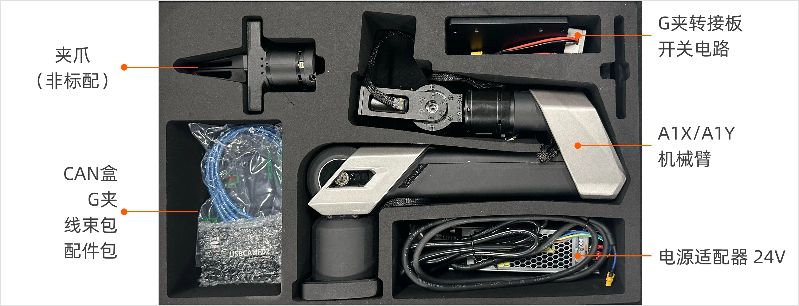
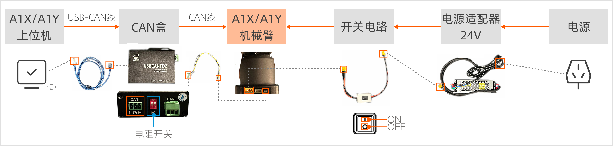

# A1XY 开箱安装指南
## 1.  物品清单检查

打开包装盒后，请按照发货清单仔细检查以下物品是否齐全：

<table style="width: 100%; border-collapse: collapse;">
    <thead>
        <tr style="background-color: black; color: white; text-align: left;">
            <th style="width: 300px; padding: 8px; border: 1px solid #ddd;">物品</th>
            <th style="width: 200px; padding: 8px; border: 1px solid #ddd;">数量</th>
            <th style="width: 400px; padding: 8px; border: 1px solid #ddd;">备注</th>
        </tr>
    </thead>
    <tbody>
        <tr style="background-color: white; text-align: left;">
            <td style="padding: 8px; border: 1px solid #ddd;">A1X/A1Y机械臂</td>
            <td style="padding: 8px; border: 1px solid #ddd;">1</td>
            <td style="padding: 8px; border: 1px solid #ddd;">机械臂本体</td>
        </tr>
        <tr style="background-color: white; text-align: left;">
            <td style="padding: 8px; border: 1px solid #ddd;">电源适配器</td>
            <td style="padding: 8px; border: 1px solid #ddd;">1</td>
            <td style="padding: 8px; border: 1px solid #ddd;">额定电压：24V</td>
        </tr>
        <tr style="background-color: white; text-align: left;">
            <td style="padding: 8px; border: 1px solid #ddd;">开关电路</td>
            <td style="padding: 8px; border: 1px solid #ddd;">1</td>
            <td style="padding: 8px; border: 1px solid #ddd;">用于开启和关闭机械臂电源。</td>
        </tr>
        <tr style="background-color: white; text-align: left;">
            <td style="padding: 8px; border: 1px solid #ddd;">CAN盒</td>
            <td style="padding: 8px; border: 1px solid #ddd;">1</td>
            <td style="padding: 8px; border: 1px solid #ddd;">用于机械臂通信。</td>
        </tr>
        <tr style="background-color: white; text-align: left;">
            <td style="padding: 8px; border: 1px solid #ddd;">CAN线</td>
            <td style="padding: 8px; border: 1px solid #ddd;">1</td>
            <td style="padding: 8px; border: 1px solid #ddd;">用于连接CAN盒和机械臂。</td>
        </tr>
        <tr style="background-color: white; text-align: left;">
            <td style="padding: 8px; border: 1px solid #ddd;">USB-CAN线</td>
            <td style="padding: 8px; border: 1px solid #ddd;">1</td>
            <td style="padding: 8px; border: 1px solid #ddd;">用于连接CAN盒和电脑。</td>
        </tr>
        <tr style="background-color: white; text-align: left;">
            <td style="padding: 8px; border: 1px solid #ddd;">G夹</td>
            <td style="padding: 8px; border: 1px solid #ddd;">2</td>
            <td style="padding: 8px; border: 1px solid #ddd;">G型紧固件，用于将桌面固在桌面上。</td>
        </tr>
        <tr style="background-color: white; text-align: left;">
            <td style="padding: 8px; border: 1px solid #ddd;">G夹转接板</td>
            <td style="padding: 8px; border: 1px solid #ddd;">1</td>
            <td style="padding: 8px; border: 1px solid #ddd;">用于放置机械臂，通过G夹固定其至桌面。</td>
        </tr>
        <tr style="background-color: white; text-align: left;">
            <td style="padding: 8px; border: 1px solid #ddd;">内六角L型扳手套件</td>
            <td style="padding: 8px; border: 1px solid #ddd;">1</td>
            <td style="padding: 8px; border: 1px solid #ddd;">用于固定螺钉。</td>
        </tr>
        <tr style="background-color: white; text-align: left;">
            <td style="padding: 8px; border: 1px solid #ddd;">M6螺钉小包</td>
            <td style="padding: 8px; border: 1px solid #ddd;">1</td>
            <td style="padding: 8px; border: 1px solid #ddd;">用于固定机械臂底座至G夹转接板上。</td>
        </tr>        
    </tbody>
</table>

**注意：A1XY机械臂标配不包括夹爪。如有需要，请联系我们购买。**

此外，仍需准备以下物品：

<table style="width: 100%; border-collapse: collapse;">
    <thead>
        <tr style="background-color: black; color: white; text-align: left;">
            <th style="width: 300px; padding: 8px; border: 1px solid #ddd;">物品</th>
            <th style="width: 200px; padding: 8px; border: 1px solid #ddd;">数量</th>
            <th style="width: 400px; padding: 8px; border: 1px solid #ddd;">备注</th>
        </tr>
    </thead>
    <tbody>
        <tr style="background-color: white; text-align: left;">
            <td style="padding: 8px; border: 1px solid #ddd;">上位机</td>
            <td style="padding: 8px; border: 1px solid #ddd;">1</td>
            <td style="padding: 8px; border: 1px solid #ddd;">操作系统：Ubuntu 20.04 LTS 中间件依赖：ROS Noetic</td>
        </tr>
    </tbody>
</table>

**注意：为确保产品正常运行，请将A1XY放置在干燥、通风良好的环境中，并确保周围没有障碍物或危险物品。**

## 2. 安装本体

- 请选择合适的安装平台，确保平台平整、稳固，能够承受机械臂在运行过程中的最大负载。
- 请清洁安装平台表面，去除杂物、灰尘等可能影响安装稳定性的物质，保证安装底座板与平台之间的紧密贴合。

按照以下步骤安装固定机械臂：

1. 将G夹转接板放置在选定的安装平台或桌面上，确保其位置合适，便于后续的固定操作。
2. 使用G夹固定好转接板。
3. 将机械臂小心地放置在转接板中央，确保机械臂底座四周的孔位与G夹转接板的孔位准确对接，使用M6螺丝固定机械臂。

## 3. 连接线束

1. 连接USB-CAN线至上位机和CAN盒。
2. 连接线束包中的CAN线两端至机械臂底座的CAN线接口和CAN盒的CAN1接口，并将CAN盒的电阻开关R1、R2均拨至顶部。
3. 连接开关电路的两端至机械臂底座的供电口和电源适配器。
4. 将电源适配器接入电源中。

连接成功后，查看[A1XY 启动与Demo演示指南](./A1XY_Startup_Demo_Guide.md)，开启机械臂控制和Demo演示。