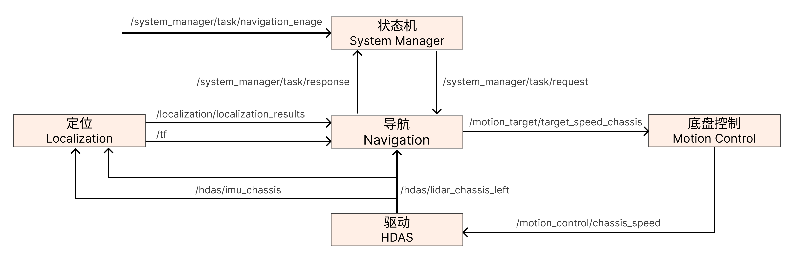

# R1自主导航系统教程

## 1. 产品介绍

该系统包含了建图、定位、导航和控制模块。 机器人可在环境下构建点云地图，并依此实现全局定位和目标点的自主移动和避障。
<table style="width: 100%; border-collapse: collapse;">
    <thead>
        <tr style="background-color: black; color: white; text-align: left;">
            <th style="width: 300px; padding: 8px; border: 1px solid #ddd;">定位</th>
            <th style="width: 400px; padding: 8px; border: 1px solid #ddd;">描述</th>
        </tr>
    </thead>
    <tbody>
        <tr style="background-color: white; text-align: left;">
            <td style="padding: 8px; border: 1px solid #ddd;">定位方式</td>
            <td style="padding: 8px; border: 1px solid #ddd;">激光SLAM</td>
        </tr>
        <tr style="background-color: white; text-align: left;">
                <td style="padding: 8px; border: 1px solid #ddd;">定位频率</td>
            <td style="padding: 8px; border: 1px solid #ddd;">100 Hz</td>
        </tr>
        <tr style="background-color: white; text-align: left;">
            <td style="padding: 8px; border: 1px solid #ddd;">定位精度</td>
            <td style="padding: 8px; border: 1px solid #ddd;">＜0.05 m</td>
        </tr>
    </tbody>
</table>


<table style="width: 100%; border-collapse: collapse;">
    <thead>
        <tr style="background-color: black; color: white; text-align: left;">
            <th style="width: 300px; padding: 8px; border: 1px solid #ddd;">运动控制</th>
            <th style="width: 400px; padding: 8px; border: 1px solid #ddd;">描述</th>
        </tr>
    </thead>
    <tbody>
        <tr style="background-color: white; text-align: left;">
            <td style="padding: 8px; border: 1px solid #ddd;">控制方式</td>
            <td style="padding: 8px; border: 1px solid #ddd;">自主导航（路径跟踪）</td>
        </tr>
        <tr style="background-color: white; text-align: left;">
                <td style="padding: 8px; border: 1px solid #ddd;">最大行驶速度</td>
            <td style="padding: 8px; border: 1px solid #ddd;">0.6 m/s</td>
        </tr>
        <tr style="background-color: white; text-align: left;">
            <td style="padding: 8px; border: 1px solid #ddd;">避障方式</td>
            <td style="padding: 8px; border: 1px solid #ddd;">绕障</td>
        </tr>
        <tr style="background-color: white; text-align: left;">
            <td style="padding: 8px; border: 1px solid #ddd;">避障频率</td>
            <td style="padding: 8px; border: 1px solid #ddd;">10-20 Hz</td>
        </tr>        
    </tbody>
</table>


<table style="width: 100%; border-collapse: collapse;">
    <thead>
        <tr style="background-color: black; color: white; text-align: left;">
            <th style="width: 300px; padding: 8px; border: 1px solid #ddd;">网络</th>
            <th style="width: 400px; padding: 8px; border: 1px solid #ddd;">描述</th>
        </tr>
    </thead>
    <tbody>
        <tr style="background-color: white; text-align: left;">
            <td style="padding: 8px; border: 1px solid #ddd;">有线网络</td>
            <td style="padding: 8px; border: 1px solid #ddd;">支持</td>
        </tr>
        <tr style="background-color: white; text-align: left;">
                <td style="padding: 8px; border: 1px solid #ddd;">WiFi</td>
            <td style="padding: 8px; border: 1px solid #ddd;">支持</td>
        </tr>
    </tbody>
</table>

  <div style="display: flex; justify-content: center; align-items: center;">
  <video width="1920" height="1080" controls>
    <source src="../assets/R1自主导航系统示例.mp4" type="video/mp4">
    Your browser does not support the video tag.
  </video>
  </div>

  

## 2. 硬件介绍

Galaxea R1配备了多种传感器，其中包括9个高清摄像头和2个激光雷达，使其能够全方位感知周围环境。


<table style="width: 100%; border-collapse: collapse;">
    <thead>
        <tr style="background-color: black; color: white; text-align: left;">
            <th style="width: 300px; padding: 8px; border: 1px solid #ddd;">传感器</th>
            <th style="width: 400px; padding: 8px; border: 1px solid #ddd;">描述</th>
        </tr>
    </thead>
    <tbody>
        <tr style="background-color: white; text-align: left;">
            <td style="padding: 8px; border: 1px solid #ddd;">相机</td>
            <td style="padding: 8px; border: 1px solid #ddd;">头部：1 x 双目深度相机<br>腕部：2 x 单目深度相机<br>
底盘：5 x 单目相机</td>
        </tr>
        <tr style="background-color: white; text-align: left;">
                <td style="padding: 8px; border: 1px solid #ddd;">激光雷达</td>
            <td style="padding: 8px; border: 1px solid #ddd;">1 x 360°<br>
(可选配两个激光雷达) </td>
        </tr>
    </tbody>
</table>


### 2.1 相机

<table style="width: 100%; border-collapse: collapse;">
    <thead>
        <tr style="background-color: black; color: white; text-align: left;">
            <th style="width: 150px; padding: 8px; border: 1px solid #ddd;">规格</th>
            <th style="width: 250px; padding: 8px; border: 1px solid #ddd;">头部</th>
            <th style="width: 250px; padding: 8px; border: 1px solid #ddd;">腕部</th>
            <th style="width: 250px; padding: 8px; border: 1px solid #ddd;">底盘</th>
        </tr>
    </thead>
    <tbody>
        <tr style="background-color: white; text-align: left;">
            <td style="padding: 8px; border: 1px solid #ddd;">类型</td>
            <td style="padding: 8px; border: 1px solid #ddd;">双目深度相机</td>
            <td style="padding: 8px; border: 1px solid #ddd;">单目深度相机</td>
            <td style="padding: 8px; border: 1px solid #ddd;">单目相机</td>
        </tr>
        <tr style="background-color: white; text-align: left;">
            <td style="padding: 8px; border: 1px solid #ddd;">数量</td>
            <td style="padding: 8px; border: 1px solid #ddd;">1</td>
            <td style="padding: 8px; border: 1px solid #ddd;">2</td>
            <td style="padding: 8px; border: 1px solid #ddd;">5</td>
        </tr>
        <tr style="background-color: white; text-align: left;">
            <td style="padding: 8px; border: 1px solid #ddd;">输出分辨率</td>
            <td style="padding: 8px; border: 1px solid #ddd;">1920 x 1080 @30FPS</td>
            <td style="padding: 8px; border: 1px solid #ddd;">1280 x 720 @30FPS </br>(RGB 1920 x 1080)</td>
            <td style="padding: 8px; border: 1px solid #ddd;">1920 x 1080 @30FPS</td>
        </tr>
        <tr style="background-color: white; text-align: left;">
            <td style="padding: 8px; border: 1px solid #ddd;">视场角</td>
            <td style="padding: 8px; border: 1px solid #ddd;">110°H x 70°V x 120°D</td>
            <td style="padding: 8px; border: 1px solid #ddd;">87°H x 58°V x 95°D</td>
            <td style="padding: 8px; border: 1px solid #ddd;">118°H x 62°V</td>
        </tr>
        <tr style="background-color: white; text-align: left;">
            <td style="padding: 8px; border: 1px solid #ddd;">深度范围</td>
            <td style="padding: 8px; border: 1px solid #ddd;">0.3 m ~ 20 m</td>
            <td style="padding: 8px; border: 1px solid #ddd;">0.2 m ~ 3 m</td>
            <td style="padding: 8px; border: 1px solid #ddd;">\</td>
        </tr>
        <tr style="background-color: white; text-align: left;">
            <td style="padding: 8px; border: 1px solid #ddd;">工作温度</td>
            <td style="padding: 8px; border: 1px solid #ddd;">-10 °C ~ +45°C</td>
            <td style="padding: 8px; border: 1px solid #ddd;">0 ~ +85℃</td>
            <td style="padding: 8px; border: 1px solid #ddd;">-40 ~ +85℃</td>
        </tr>
        <tr style="background-color: white; text-align: left;">
            <td style="padding: 8px; border: 1px solid #ddd;">尺寸</td>
            <td style="padding: 8px; border: 1px solid #ddd;">175L x 30W x 32H mm</td>
            <td style="padding: 8px; border: 1px solid #ddd;">90L x 25W x 25H mm</td>
            <td style="padding: 8px; border: 1px solid #ddd;">30L x 30W x 23H mm</td>
        </tr>
        <tr style="background-color: white; text-align: left;">
            <td style="padding: 8px; border: 1px solid #ddd;">重量</td>
            <td style="padding: 8px; border: 1px solid #ddd;">164 g</td>
            <td style="padding: 8px; border: 1px solid #ddd;">75 g</td>
            <td style="padding: 8px; border: 1px solid #ddd;"><50 g</td>
        </tr>
    </tbody>
</table>


### 2.2 激光雷达

底盘配备360°激光雷达*，精度高且抗干扰能力强。

<table style="width: 100%; border-collapse: collapse;">
    <thead>
        <tr style="background-color: black; color: white; text-align: left;">
            <th style="width: 300px; padding: 8px; border: 1px solid #ddd;">雷达</th>
            <th style="width: 400px; padding: 8px; border: 1px solid #ddd;">说明</th>
        </tr>
    </thead>
    <tbody>
        <tr style="background-color: white; text-align: left;">
            <td style="padding: 8px; border: 1px solid #ddd;">数量</td>
            <td style="padding: 8px; border: 1px solid #ddd;">1 ~ 2</td>
        </tr>
        <tr style="background-color: white; text-align: left;">
            <td style="padding: 8px; border: 1px solid #ddd;">视场角</td>
            <td style="padding: 8px; border: 1px solid #ddd;">360°H x 59°V</td>
        </tr>
        <tr style="background-color: white; text-align: left;">
            <td style="padding: 8px; border: 1px solid #ddd;">激光波长</td>
            <td style="padding: 8px; border: 1px solid #ddd;">905 nm</td>
        </tr>
        <tr style="background-color: white; text-align: left;">
            <td style="padding: 8px; border: 1px solid #ddd;">检测范围</td>
            <td style="padding: 8px; border: 1px solid #ddd;">40 m @10% 反射率
            </br>70 m @80% 反射率</td>
        </tr>
        <tr style="background-color: white; text-align: left;">
            <td style="padding: 8px; border: 1px solid #ddd;">近距离盲区</td>
            <td style="padding: 8px; border: 1px solid #ddd;">0.1 m</td>
        </tr>
        <tr style="background-color: white; text-align: left;">
            <td style="padding: 8px; border: 1px solid #ddd;">数据端口</td>
            <td style="padding: 8px; border: 1px solid #ddd;">100 BASE-TX 以太网</td>
        </tr>
        <tr style="background-color: white; text-align: left;">
            <td style="padding: 8px; border: 1px solid #ddd;">IMU</td>
            <td style="padding: 8px; border: 1px solid #ddd;">内置IMU</td>
        </tr>
        <tr style="background-color: white; text-align: left;">
            <td style="padding: 8px; border: 1px solid #ddd;">工作温度范围</td>
            <td style="padding: 8px; border: 1px solid #ddd;">-20 ~ +55℃</td>
        </tr>
        <tr style="background-color: white; text-align: left;">
            <td style="padding: 8px; border: 1px solid #ddd;">尺寸</td>
            <td style="padding: 8px; border: 1px solid #ddd;">65L x 65W x 60H mm</td>
        </tr>
        <tr style="background-color: white; text-align: left;">
            <td style="padding: 8px; border: 1px solid #ddd;">重量</td>
            <td style="padding: 8px; border: 1px solid #ddd;">265 g</td>
        </tr>
    </tbody>
</table>

\* 标配1个激光雷达，可根据用户需求选择激光雷达配置数量。

## 3. 软件介绍

请确保您的环境满足以下软件依赖要求。

1. 硬件依赖：R1计算单元
2. 操作系统依赖：Ubuntu 20.04 LTS
3. 中间件依赖：ROS Noetic

<span style="color:red;">**注意：R1必须安装V1.1.0及以上的智能版本包，请联系product@galaxea.ai 或致电4008780980获取。**</span>

如果需要首次部署导航系统，请按照以下步骤安装相关依赖：

```Go
sudo apt install libsdl1.2-dev
sudo apt install libsdl-image1.2-dev
sudo apt install libsdl2-image-dev
sudo apt install ros-noetic-grid-map-core
sudo apt install ros-noetic-grid-map-ros
sudo apt install libgoogle-glog-dev
```

## 4. 定位导航操作流程

地图构建是机器人自主导航的基础步骤，通过遥控机器人录制传感器数据（bag文件）并将数据回传。地图导出后，将地图部署在机器人本体，再设置目标位姿，实现定点导航。

###  4.1 构建地图
#### 4.1.1 启动R1

1. **登录R1端**

    通过SSH登录至R1 ECU。

    ```Bash
    ssh nvidia@robot_ip
    # Enter the password  (default: nvidia)
    ```

2. **启动R1**

    运行以下指令，启动相关节点。

    ```Bash
    cd work/galaxea/install/share/startup_config/script/
    ./ota_script.sh boot
    ```

#### 4.1.2 录制数据包

运行以下指令，开始录制bag文件。

```Bash
cd ~
rosbag record /hdas/imu_chassis /hdas/lidar_chassis_left /hdas/feedback_chassis
```

通过**遥控器**控制机器人在所需建图空间内移动，确保覆盖所有需要导航的区域。

遥控器操控机器人底盘方式请点击[此处](R1_Overview.md)查阅。

当完成地图数据录制后，按下`ctrl+c`结束录制。

**注意**：

- 请将机器人移动到准备建图的区域，再启动录制。
- 在录制开始时，机器人需保持静止状态，并持续5秒以上，以保证数据质量。
- 在录制数据时，应确保环境中没有动态目标（如移动的人员或物体），以避免干扰地图构建。请勿跟随机器人移动。

#### 4.1.3 将数据回传

1. **确认bag文件路径**
	</br>在R1机器人端，确认录制的bag文件路径。默认情况下，bag文件会保存在用户的主目录下（`~`）
   
    ```Bash
    ls -lh ~/map_data.bag
    ```
	 如果文件名与默认不同，请记录实际的文件名。
	
2. **使用SCP将数据传输到本地电脑**
	</br>通过SCP工具，将bag文件从机器人端传输到本地电脑。确保本地电脑已连接到与机器人相同的网络，并且网络连接稳定。在本地电脑的终端中，运行以下命令：
    ```Bash
    scp nvidia@robot_ip:~/map_data.bag /local/path/to/save/
    # nvidia@robot_ip：机器人的用户名和IP地址。
    # ~/map_data.bag：机器人端bag文件的路径。
    # /local/path/to/save/：本地电脑上保存bag文件的目录。
    ```

3. **验证文件传输**
    </br>在本地电脑上，检查文件是否已成功传输，并确认文件大小是否与机器人端一致。
    
    ```Bash
    ls -lh /local/path/to/save/map_data.bag
	```
    如果文件传输成功，您将看到与机器人端相同的文件大小。
    
4. **数据回传**
	</br>**请将数据包回传至support@galaxea.ai或发送至企业微信客服。**

#### 4.1.4  导入地图相关文件
数据回传后，请联系技术人员获取地图，并将其导入R1。
```Bash
ssh nvidia@{rorbot_ip} "mkdir -p ~/galaxea/calib ~/galaxea/maps"
scp -r ~/mapping_data/map/* nvidia@{robot_ip}:~/galaxea/maps/
scp -r ~/mapping_data/robot_calibration.json nvidia@{robot_ip}:~/galaxea/calib/
```

### 4.2 启动定位功能

启动定位功能时，确保机器人在已知地图中。

1. **启动R1节点**
    </br>在R1端执行以下命令，启动相关节点。
    ```Plain
    ssh nvidia@{rorbot_ip}
    cd work/galaxea/install/share/startup_config/script/
    ./ota_script.sh boot
    ```

2. **获取定位**
    </br>将遥控器拨到底盘控制模式，操作机器人已知地图环境中2m范围内绕圈，确保机器人能够成功定位。

    在R1端终端中，运行以下命令检查定位状态：
    ```Bash
     source ~/work/galaxea/install/setup.bash
     rosrun tf tf_echo map body
    ```

    若正常返回以下数据，则定位成功：
    ```Bash
    - Translation: [3.280, -0.743, 0.008]
    - Rotation: in Quaternion [0.000, -0.004, -0.147, 0.989] # xx y z w
    ```

### 4.3 设置目标位姿

1. **遥控机器人到目标点**
  </br>启动定位成功后，将机器人遥控到客户想设定的目标点处，确保R1中心远离障碍物至少45cm。

2. **记录位姿信息**
    </br>每遥控至一个目标点，记录该位置的位姿信息：
    ```Bash
    - Translation: [3.280, -0.743, 0.008]
    - Rotation: in Quaternion [0.000, -0.004, -0.147, 0.989] # x y z w
    ```

3. **更新导航目标点下发脚本**
    </br>重复上述过程，记录所有目标点的位姿信息后，将所有目标点位姿信息更新到导航目标点下发脚本中。 脚本示例如下：

    ```
    point_nav.py
    ```

    ```
    #!/usr/bin/env python
    import geometry_msg.msg
    import rospy
    from geometry_msgs.msg import PoseStamped
    from system_manager_msg.msg import TaskRequest, TaskResponse
    from geometry_msg.msg import PoseStamped
    class NavigationEngager:
        def __init__(self):
            # 初始化ROS节点
            rospy.init_node('navigation_engager', anonymous=True)
            # 初始化位置数组
            self.pose_array = self.create_pose_array()
            self.current_index = 0  # 当前目标位置索引
    
            # 设置Publisher和Subscriber
            self.publisher = rospy.Publisher('/system_manager/task/navigation_enage', TaskRequest, queue_size=10)
            self.subscriber = rospy.Subscriber('/system_manager/task/response', TaskResponse, self.response_callback)
    
            # 状态变量
            self.engage_pending = False  # 标志当前是否等待响应
            rospy.loginfo("Navigation engager node initialized.")
    
            # 开始发送第一个 engage
            rospy.sleep(1)  # 确保 Publisher 已初始化
            self.send_engage()
    
        def create_pose_array(self):
            """创建一个包含目标位置的 PoseStamped 数组"""
            pose_array = []
            pose = geometry_msg.msg.PoseStamped()
            pose.header.frame_id = "map"
            pose.pose.position.x = 3.280 
            pose.pose.position.y = -0.743
            pose.pose.position.z = 0.008
            pose.pose.orientation.x = 0.000 
            pose.pose.orientation.y = -0.004
            pose.pose.orientation.z =  -0.147
            pose.pose.orientation.w = 0.989
            pose_array.append(pose)
    
            # 新增目标点
            # pose = geometry_msg.msg.PoseStamped()
            # pose.header.frame_id = "map"
            # pose.pose.position.x = 5.761 
            # pose.pose.position.y = -0.146
            # pose.pose.position.z = 0.087
            # pose.pose.orientation.x = -0.008 
            # pose.pose.orientation.y = -0.001
            # pose.pose.orientation.z = 0.551
            # pose.pose.orientation.w = 0.835
            # pose_array.append(pose)
    
            return pose_array
    
        def send_engage(self):
            print("index  =", self.current_index)
            """发送 engage 消息"""
    
            if self.current_index >= len(self.pose_array):
                self.current_index = 0
            if not self.engage_pending and self.current_index < len(self.pose_array):
                msg = TaskRequest()
                # 根据需要设置消息的字段
                msg.task_type = 1
                msg.navigation_task.target_pose = self.pose_array[self.current_index]
                self.publisher.publish(msg)
                self.current_index += 1
                self.engage_pending = True  # 标记为等待响应
    
        def response_callback(self, msg):
            """处理响应消息"""
            if self.engage_pending:
                self.engage_pending = False  # 重置状态，允许发送新的 engage
                rospy.sleep(0.1)  # 控制发送节奏
                self.send_engage()  # 发送新的 engage
    
        def run(self):
            """运行节点"""
            rospy.spin()
    
    if __name__ == '__main__':
        try:
            engager = NavigationEngager()
            engager.run()
        except rospy.ROSInterruptException:
            pass
    ```

    可添加任意多个点，在python文件中，替换和新增python脚本中的如下区域
    ```Python
    # 新添加目标点
    # pose = geometry_msg.msg.PoseStamped()
    # pose.header.frame_id = "map"
    # pose.pose.position.x = 5.761 
    # pose.pose.position.y = -0.146
    # pose.pose.position.z = 0.087
    # pose.pose.orientation.x = -0.008 
    # pose.pose.orientation.y = -0.001
    # pose.pose.orientation.z = 0.551
    # pose.pose.orientation.w = 0.835
    # pose_array.append(pose)
    ```

    在目标点设置完成后，执行该脚本。将遥控器切换至Auto模式，可实现机器人设置目标点的循环自主导航。
    ```Go
    source ~/work/galaxea/install/setup.bash
    python3 point_nav.py
    ```

## 5. 软件接口

### 5.1 系统框图



### 5.2 驱动接口

R1提供了多种驱动接口，用于与硬件设备进行通信和控制。以下是主要的驱动接口及其说明：

#### 5.2.1 底盘驱动接口

`/motion_control/chassis_speed`：用于控制机器人底盘的运动，包括速度控制、方向控制等。请前往R1软件手册的[底盘驱动接口](Software_Guide.md/#底盘驱动接口)章节获取更多详细信息。

#### 5.2.2 激光雷达接口

`/hdas/lidar_chassis_left`：激光雷达用于环境感知和距离测量，为机器人提供实时的环境信息。请前往R1软件手册的[激光雷达接口](Software_Guide.md/#激光雷达接口)章节获取更多详细信息。

#### 5.2.3 IMU接口

`/hdas/imu_chassis`：IMU用于测量机器人的加速度、角速度等信息，为导航和姿态控制提供数据支持。请前往R1软件手册的[IMU接口](Software_Guide.md/#imu-接口)章节获取更多详细信息。

### 5.3 运控接口

R1机器人提供了多种运动控制接口，用于实现对机器人运动的精确控制。以下是主要的运控接口及其说明：

#### 5.3.1 底盘控制接口

`/motion_target/target_speed_chassis`：用于控制机器人底盘的运动，包括速度控制、方向控制等。请前往R1软件手册的“底盘控制接口”章节获取更多详细信息。

### 5.4 定位接口

定位（Localization）接口是R1机器人实现自主导航和环境感知的核心组件。通过这些接口，机器人能够接收来自多种传感器的数据，如IMU（惯性测量单元）和激光雷达，从而实现精确的多传感器融合定位。这些接口确保机器人能够在复杂环境中准确地感知自身位置和姿态，为后续的路径规划和导航提供可靠的数据支持。本章节详细介绍了定位接口的各个话题，包括输入和输出数据的类型及其用途。

<table style="width: 100%; border-collapse: collapse;table-layout: fixed;">
    <thead>
        <tr style="background-color: black; color: white; text-align: left;">
            <th style="width: 300px; padding: 8px; border: 1px solid #ddd;">话题名称</th>
            <th style="width: 100px padding: 8px; border: 1px solid #ddd;">I/O</th>                
            <th style="width: 300px; padding: 8px; border: 1px solid #ddd;">描述</th>
            <th style="width: 200px; padding: 8px; border: 1px solid #ddd;">消息类型</th>
        </tr>
    </thead>
    <tbody>
        <tr style="background-color: white; text-align: left;">
            <td style="padding: 8px; border: 1px solid #ddd;">/hdas/imu_chassis   </td>
            <td style="padding: 8px; border: 1px solid #ddd;">Input</td>                 
            <td style="padding: 8px; border: 1px solid #ddd;">IMU数据，用于多传感器融合定位</td>
            <td style="padding: 8px; border: 1px solid #ddd;">sensor_msgs::Imu</td>
        </tr>
        <tr style="background-color: white; text-align: left;">
            <td style="padding: 8px; border: 1px solid #ddd;">/hdas/lidar_chassis_left</td>
            <td style="padding: 8px; border: 1px solid #ddd;">Input</td>    
            <td style="padding: 8px; border: 1px solid #ddd;">多线激光雷达点云，用于定位</td>
            <td style="padding: 8px; border: 1px solid #ddd;">sensor_msgs/PointCloud2</td>
        </tr>
        <tr style="background-color: white; text-align: left;">
            <td style="padding: 8px; border: 1px solid #ddd;">/localization/localization_results</td>
            <td style="padding: 8px; border: 1px solid #ddd;">Output</td>    
            <td style="padding: 8px; border: 1px solid #ddd;">SLAM定位状态</td>
            <td style="padding: 8px; border: 1px solid #ddd;">localization_msg/LocLocalization</td>
        </tr>
    </tbody>
</table>

### 5.5 导航话题接口

导航（Navigation）接口是R1机器人实现自主路径规划和运动控制的关键部分。这些接口允许机器人根据输入的传感器数据（如激光雷达点云和SLAM定位状态）进行全局和局部路径规划，并输出控制指令以驱动机器人底盘运动。导航接口不仅支持避障功能，还能够实时更新机器人的运动轨迹和任务状态，确保机器人能够高效、安全地完成导航任务。本章节详细介绍了导航接口的各个话题，包括输入和输出数据的类型及其用途。

<table style="width: 100%; border-collapse: collapse;table-layout: fixed;">
    <thead>
        <tr style="background-color: black; color: white; text-align: left;">
            <th style="width: 300px; padding: 8px; border: 1px solid #ddd;">话题名称</th>
            <th style="width: 100px; padding: 8px; border: 1px solid #ddd;">I/O</th>                
            <th style="width: 300px; padding: 8px; border: 1px solid #ddd;">描述</th>
            <th style="width: 300px; padding: 8px; border: 1px solid #ddd;">消息类型</th>
        </tr>
    </thead>
    <tbody>
        <tr style="background-color: white; text-align: left;">
            <td style="padding: 8px; border: 1px solid #ddd;">/hdas/lidar_chassis_left</td>
            <td style="padding: 8px; border: 1px solid #ddd;">Input</td>                 
            <td style="padding: 8px; border: 1px solid #ddd;">多线激光雷达点云，用于避障</td>
            <td style="padding: 8px; border: 1px solid #ddd;">sensor_msgs/PointCloud2</td>
        </tr>
        <tr style="background-color: white; text-align: left;">
            <td style="padding: 8px; border: 1px solid #ddd;">/localization/localization_results</td>
            <td style="padding: 8px; border: 1px solid #ddd;">Input</td>    
            <td style="padding: 8px; border: 1px solid #ddd;">SLAM定位状态</td>
            <td style="padding: 8px; border: 1px solid #ddd;">localization_msg/LocLocalization</td>
        </tr>
        <tr style="background-color: white; text-align: left;">
            <td style="padding: 8px; border: 1px solid #ddd;">/system_manager/task/request</td>
            <td style="padding: 8px; border: 1px solid #ddd;">Input</td>    
            <td style="padding: 8px; border: 1px solid #ddd;">导航任务接口</td>
            <td style="padding: 8px; border: 1px solid #ddd;">system_manager_msg/TaskRequest</td>
        </tr>
        <tr style="background-color: white; text-align: left;">
            <td style="padding: 8px; border: 1px solid #ddd;">/nav/local_path</td>
            <td style="padding: 8px; border: 1px solid #ddd;">Output</td>    
            <td style="padding: 8px; border: 1px solid #ddd;">局部路径规划器规划的局部路径</td>
            <td style="padding: 8px; border: 1px solid #ddd;">sensor_msgs/PointCloud2</td>
        </tr>
        <tr style="background-color: white; text-align: left;">
            <td style="padding: 8px; border: 1px solid #ddd;">/nav/global_path</td>
            <td style="padding: 8px; border: 1px solid #ddd;">Output</td>    
            <td style="padding: 8px; border: 1px solid #ddd;">全局路径规划器规划的全局路径</td>
            <td style="padding: 8px; border: 1px solid #ddd;">sensor_msgs/PointCloud2</td>
        </tr>
        <tr style="background-color: white; text-align: left;">
            <td style="padding: 8px; border: 1px solid #ddd;">/nav/robot_global_traj</td>
            <td style="padding: 8px; border: 1px solid #ddd;">Output</td>    
            <td style="padding: 8px; border: 1px solid #ddd;">机器人行驶的全局轨迹</td>
            <td style="padding: 8px; border: 1px solid #ddd;">nav_msgs/Path</td>
        </tr>
        <tr style="background-color: white; text-align: left;">
            <td style="padding: 8px; border: 1px solid #ddd;">/nav/global_map</td>
            <td style="padding: 8px; border: 1px solid #ddd;">Output</td>    
            <td style="padding: 8px; border: 1px solid #ddd;">导航全局代价地图，用于规划全局路径</td>
            <td style="padding: 8px; border: 1px solid #ddd;">nav_msgs/OccupancyGrid</td>
        </tr>
        <tr style="background-color: white; text-align: left;">
            <td style="padding: 8px; border: 1px solid #ddd;">/nav/local_map</td>
            <td style="padding: 8px; border: 1px solid #ddd;">Output</td>    
            <td style="padding: 8px; border: 1px solid #ddd;">导航局部代价地图，用于规划局部路径</td>
            <td style="padding: 8px; border: 1px solid #ddd;">nav_msgs/OccupancyGrid</td>
        </tr>
        <tr style="background-color: white; text-align: left;">
            <td style="padding: 8px; border: 1px solid #ddd;">/nav/global_goal</td>
            <td style="padding: 8px; border: 1px solid #ddd;">Output</td>    
            <td style="padding: 8px; border: 1px solid #ddd;">导航接收的目标点，用于可视化</td>
            <td style="padding: 8px; border: 1px solid #ddd;">geometry_msgs/PoseStamped</td>
        </tr>
        <tr style="background-color: white; text-align: left;">
            <td style="padding: 8px; border: 1px solid #ddd;">/motion_target/target_speed_chassis</td>
            <td style="padding: 8px; border: 1px solid #ddd;">Output</td>    
            <td style="padding: 8px; border: 1px solid #ddd;">导航输出控制速度</td>
            <td style="padding: 8px; border: 1px solid #ddd;">geometry_msgs/Twist</td>
        </tr>
        <tr style="background-color: white; text-align: left;">
            <td style="padding: 8px; border: 1px solid #ddd;">/system_manager/task/response</td>
            <td style="padding: 8px; border: 1px solid #ddd;">Output</td>    
            <td style="padding: 8px; border: 1px solid #ddd;">导航任务完成情况</td>
            <td style="padding: 8px; border: 1px solid #ddd;">system_manager_msg/TaskResponse</td>
        </tr>
    </tbody>
</table>

### 5.6 导航服务接口

#### 5.6.1 开启导航服务

执行以下命令可开启导航服务。

```YAML
service name: /nav_service  # 用于导航系统开关
Type: std_srvs/SetBool
示例:  rosservice call /nav_service "data: true"
      rosservice call /nav_service "data: false"
```

**注意：导航服务在机器人启动时默认开启。**

**注意：确保R1机器人在导航服务开启时处于已建图的环境中，且周围环境与建图时保持一致，以确保定位和导航的准确性**

#### 5.6.2 关闭导航服务

执行以下命令可关闭导航服务。

```YAML
service name: /nav_service  # 用于导航系统开关
Type: std_srvs/SetBool
示例:  rosservice call /nav_service "data: true"
      rosservice call /nav_service "data: false"
```

### 5.7 状态机

状态机（System Manager）是R1机器人系统的核心管理模块，负责协调和管理机器人的各项任务和服务。通过System Manager，用户可以触发导航任务、监控任务状态，并接收任务完成的反馈。本章节详细介绍了System Manager相关的ROS话题，包括输入和输出数据的类型及其用途。

<table style="width: 100%; border-collapse: collapse;table-layout: fixed;">
    <thead>
        <tr style="background-color: black; color: white; text-align: left;">
            <th style="width: 200px; padding: 8px; border: 1px solid #ddd;">话题名称</th>
            <th style="width: 100px; padding: 8px; border: 1px solid #ddd;">I/O</th>                
            <th style="width: 300px; padding: 8px; border: 1px solid #ddd;">描述</th>
            <th style="width: 200px; padding: 8px; border: 1px solid #ddd;">消息类型</th>
        </tr>
    </thead>
    <tbody>
        <tr style="background-color: white; text-align: left;">
            <td style="padding: 8px; border: 1px solid #ddd;">/system_manager/task/navigation_enage     </td>
            <td style="padding: 8px; border: 1px solid #ddd;">Input</td>                 
            <td style="padding: 8px; border: 1px solid #ddd;">根据用户给出的target_pose触发system_manager构建，并向导航模块发送任务的topic</td>
            <td style="padding: 8px; border: 1px solid #ddd;">system_manager_msg/TaskRequest</td>
        </tr>
        <tr style="background-color: white; text-align: left;">
            <td style="padding: 8px; border: 1px solid #ddd;">/system_manager/task/response </td>
            <td style="padding: 8px; border: 1px solid #ddd;">Input</td>    
            <td style="padding: 8px; border: 1px solid #ddd;">导航模块完成导航任务后，向system_manager回复成功或失败的topic</td>
            <td style="padding: 8px; border: 1px solid #ddd;"> system_manager_msg/TaskResponse</td>
        </tr>
        <tr style="background-color: white; text-align: left;">
            <td style="padding: 8px; border: 1px solid #ddd;">/system_manager/task/request   </td>
            <td style="padding: 8px; border: 1px solid #ddd;">Output</td>    
            <td style="padding: 8px; border: 1px solid #ddd;">system_manager向导航模块发送任务的topic</td>
            <td style="padding: 8px; border: 1px solid #ddd;">system_manager_msg/TaskRequest</td>
        </tr>
    </tbody>
</table>