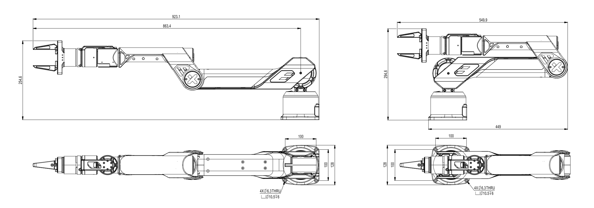
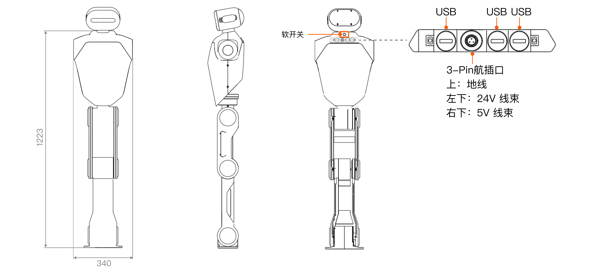
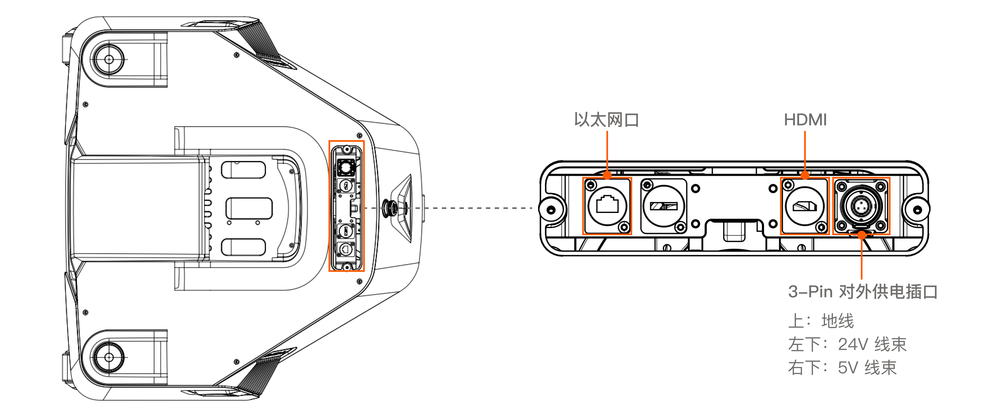
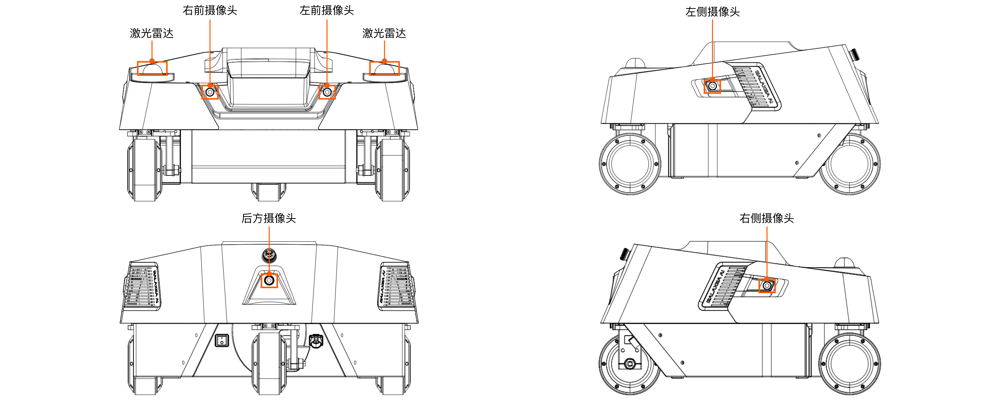

# Galaxea R1 硬件指南
## 技术规格
<table style="width: 100%; border-collapse: collapse;">
    <thead>
        <tr style="background-color: black; color: white; text-align: left;">
            <th style="width: 300px; padding: 8px; border: 1px solid #ddd;">机械参数</th>
            <th style="width: 400px; padding: 8px; border: 1px solid #ddd;">数值</th>
        </tr>
    </thead>
    <tbody>
        <tr style="background-color: white; text-align: left;">
            <td style="padding: 8px; border: 1px solid #ddd;">高度</td>
            <td style="padding: 8px; border: 1px solid #ddd;">1700 mm</td>
        </tr>
        <tr style="background-color: white; text-align: left;">
            <td style="padding: 8px; border: 1px solid #ddd;">宽度</td>
            <td style="padding: 8px; border: 1px solid #ddd;">675 mm</td>
        </tr>
        <tr style="background-color: white; text-align: left;">
            <td style="padding: 8px; border: 1px solid #ddd;">重量</td>
            <td style="padding: 8px; border: 1px solid #ddd;">96 KG（含电池）</td>
        </tr>
        <tr style="background-color: white; text-align: left;">
            <td style="padding: 8px; border: 1px solid #ddd;">额定电压</td>
            <td style="padding: 8px; border: 1px solid #ddd;">48 V</td>
        </tr>
        <tr style="background-color: white; text-align: left;">
            <td style="padding: 8px; border: 1px solid #ddd;">额定容量</td>
            <td style="padding: 8px; border: 1px solid #ddd;">35 Ah</td>
        </tr>
        <tr style="background-color: white; text-align: left;">
            <td style="padding: 8px; border: 1px solid #ddd;">电源</td>
            <td style="padding: 8px; border: 1px solid #ddd;">锂离子电池</td>
        </tr>
        <tr style="background-color: white; text-align: left;">
            <td style="padding: 8px; border: 1px solid #ddd;">电池能量</td>
            <td style="padding: 8px; border: 1px solid #ddd;">1680 Wh</td>
        </tr>
        <tr style="background-color: white; text-align: left;">
            <td style="padding: 8px; border: 1px solid #ddd;">电池管理系统 (BMS)</td>
            <td style="padding: 8px; border: 1px solid #ddd;">支持</td>
        </tr>        
        <tr style="background-color: white; text-align: left;">
            <td style="padding: 8px; border: 1px solid #ddd;">通风系统</td>
            <td style="padding: 8px; border: 1px solid #ddd;">低噪音局部空气冷却</td>
        </tr>
        <tr style="background-color: white; text-align: left;">
            <td style="padding: 8px; border: 1px solid #ddd;">风道数量</td>
            <td style="padding: 8px; border: 1px solid #ddd;">2</td>
        </tr>        
    </tbody>
</table>
<table style="width: 100%; border-collapse: collapse;">
    <thead>
        <tr style="background-color: black; color: white; text-align: left;">
            <th style="width: 300px; padding: 8px; border: 1px solid #ddd;">性能参数</th>
            <th style="width: 400px; padding: 8px; border: 1px solid #ddd;">数值</th>
        </tr>
    </thead>
    <tbody>
        <tr style="background-color: white; text-align: left;">
            <td style="padding: 8px; border: 1px solid #ddd;">自由度</td>
            <td style="padding: 8px; border: 1px solid #ddd;">全身共24 DOF:  底盘6 DOF  躯干4 DOF  单臂带夹爪7 DOF</td>
        </tr>
        <tr style="background-color: white; text-align: left;">
            <td style="padding: 8px; border: 1px solid #ddd;">手臂负载</td>
            <td style="padding: 8px; border: 1px solid #ddd;">额定: 2.5 KG@0.5 m 最大: 5 KG@0.5 m</td>
        </tr>
        <tr style="background-color: white; text-align: left;">
            <td style="padding: 8px; border: 1px solid #ddd;">操作范围</td>
            <td style="padding: 8px; border: 1px solid #ddd;">垂直: 0 ~ 2000 mm 水平: 700 mm (包括夹爪860 mm)</td>
        </tr>
        <tr style="background-color: white; text-align: left;">
            <td style="padding: 8px; border: 1px solid #ddd;">功能</td>
            <td style="padding: 8px; border: 1px solid #ddd;">躯干：升降/横摆/俯仰 底盘：阿克曼/平移/旋转</td>
        </tr>
    </tbody>
</table>
<table style="width: 100%; border-collapse: collapse;">
    <thead>
        <tr style="background-color: black; color: white; text-align: left;">
            <th style="width: 300px; padding: 8px; border: 1px solid #ddd;">控制功能</th>
            <th style="width: 400px; padding: 8px; border: 1px solid #ddd;">数值</th>
        </tr>
    </thead>
    <tbody>
        <tr style="background-color: white; text-align: left;">
            <td style="padding: 8px; border: 1px solid #ddd;">遥控器</td>
            <td style="padding: 8px; border: 1px solid #ddd;">无线频率: 2.4 G 最大遥控范围: 1.5 km</td>
        </tr>
        <tr style="background-color: white; text-align: left;">
            <td style="padding: 8px; border: 1px solid #ddd;">通信接口</td>
            <td style="padding: 8px; border: 1px solid #ddd;">以太网,USB</td>
        </tr>
    </tbody>
</table>

## 机器人结构
### 头部
Galaxea R1 头部配备了双目立体相机。

### 手臂

Galaxea R1 配备了两只 Galaxea A1 机械臂和两个 Galaxea G1 夹爪。手臂6个关节配备了高精度和大扭矩的行星电机，能够实现独立的变速操作。

**重要提示：目前关节电机没有制动器，为了您的安全，在关闭R1电源之前，请用手扶住两只手臂，以防止其突然坠落。**

<table style="width: 100%; border-collapse: collapse;">
    <thead>
        <tr style="background-color: black; color: white; text-align: left;">
            <th style="width: 300px; padding: 8px; border: 1px solid #ddd;">手臂</th>
            <th style="width: 400px; padding: 8px; border: 1px solid #ddd;">备注</th>
        </tr>
    </thead>
    <tbody>
        <tr style="background-color: white; text-align: left;">
            <td style="padding: 8px; border: 1px solid #ddd;">尺寸</td>
            <td style="padding: 8px; border: 1px solid #ddd;">展开：863L x 128W mm 折叠：550L x 254W mm</td>
        </tr>
        <tr style="background-color: white; text-align: left;">
            <td style="padding: 8px; border: 1px solid #ddd;">自由度</td>
            <td style="padding: 8px; border: 1px solid #ddd;">6自由度手臂 + 夹爪</td>
        </tr>
        <tr style="background-color: white; text-align: left;">
            <td style="padding: 8px; border: 1px solid #ddd;">峰值负载</td>
            <td style="padding: 8px; border: 1px solid #ddd;">单臂 5kg</td>
        </tr>
        <tr style="background-color: white; text-align: left;">
            <td style="padding: 8px; border: 1px solid #ddd;">重量</td>
            <td style="padding: 8px; border: 1px solid #ddd;">6.2 kg</td>
        </tr>
        <tr style="background-color: white; text-align: left;">
            <td style="padding: 8px; border: 1px solid #ddd;">夹爪额定力</td>
            <td style="padding: 8px; border: 1px solid #ddd;">100 N</td>
        </tr>
        <tr style="background-color: white; text-align: left;">
            <td style="padding: 8px; border: 1px solid #ddd;">夹爪运动范围</td>
            <td style="padding: 8px; border: 1px solid #ddd;">0 ~ 100 mm</td>
        </tr>
    </tbody>
</table>

如需了解更多信息，请参考[Galaxea A1 User Guide](../A1/A1_Getting_Started.md)。

### 躯干

<table style="width: 100%; border-collapse: collapse;">
    <thead>
        <tr style="background-color: black; color: white; text-align: left;">
            <th style="width: 300px; padding: 8px; border: 1px solid #ddd;">条目</th>
            <th style="width: 400px; padding: 8px; border: 1px solid #ddd;">备注</th>
        </tr>
    </thead>
    <tbody>
        <tr style="background-color: white; text-align: left;">
            <td style="padding: 8px; border: 1px solid #ddd;">尺寸</td>
            <td style="padding: 8px; border: 1px solid #ddd;">1400H x 340W mm</td>
        </tr>
        <tr style="background-color: white; text-align: left;">
            <td style="padding: 8px; border: 1px solid #ddd;">功能</td>
            <td style="padding: 8px; border: 1px solid #ddd;">升降/横摆/俯仰</td>
        </tr>
        <tr style="background-color: white; text-align: left;">
            <td style="padding: 8px; border: 1px solid #ddd;">腰部运动空间（偏航）</td>
            <td style="padding: 8px; border: 1px solid #ddd;">± 170°</td>
        </tr>
        <tr style="background-color: white; text-align: left;">
            <td style="padding: 8px; border: 1px solid #ddd;">臀部运动空间（俯仰）</td>
            <td style="padding: 8px; border: 1px solid #ddd;">± 100°</td>
        </tr>
        <tr style="background-color: white; text-align: left;">
            <td style="padding: 8px; border: 1px solid #ddd;">膝关节运动空间</td>
            <td style="padding: 8px; border: 1px solid #ddd;">W1: 0°~100° W2: -154°~145°</td>
        </tr>
        <tr style="background-color: white; text-align: left;">
            <td style="padding: 8px; border: 1px solid #ddd;">躯干电机扭矩</td>
            <td style="padding: 8px; border: 1px solid #ddd;">额定: 108 Nm 最大: 304 Nm</td>
        </tr>
        <tr style="background-color: white; text-align: left;">
            <td style="padding: 8px; border: 1px solid #ddd;">软开关</td>
            <td style="padding: 8px; border: 1px solid #ddd;">用于开启/关闭R1电源。</td>
        </tr>
        <tr style="background-color: white; text-align: left;">
            <td style="padding: 8px; border: 1px solid #ddd;">USB接口</td>
            <td style="padding: 8px; border: 1px solid #ddd;">用于连接鼠标和键盘等外部设备。</td>
        </tr>
        <tr style="background-color: white; text-align: left;">
            <td style="padding: 8px; border: 1px solid #ddd;">3-Pin 航空插头</td>
            <td style="padding: 8px; border: 1px solid #ddd;">用于为外部设备供电。粗红线（24V），细红线（5V），黑线（地线）。</td>
        </tr>
    </tbody>
</table>

### 底盘

<table style="width: 100%; border-collapse: collapse;">
    <thead>
        <tr style="background-color: black; color: white; text-align: left;">
            <th style="width: 300px; padding: 8px; border: 1px solid #ddd;">底盘</th>
            <th style="width: 400px; padding: 8px; border: 1px solid #ddd;">备注</th>
        </tr>
    </thead>
    <tbody>
        <tr style="background-color: white; text-align: left;">
            <td style="padding: 8px; border: 1px solid #ddd;">尺寸</td>
            <td style="padding: 8px; border: 1px solid #ddd;">675L x 636W x 346H mm</td>
        </tr>
        <tr style="background-color: white; text-align: left;">
            <td style="padding: 8px; border: 1px solid #ddd;">电源按钮</td>
            <td style="padding: 8px; border: 1px solid #ddd;">用于开/关R1电源。</td>
        </tr>
        <tr style="background-color: white; text-align: left;">
            <td style="padding: 8px; border: 1px solid #ddd;">电源插口</td>
            <td style="padding: 8px; border: 1px solid #ddd;">额定电压 48 V</td>
        </tr>
        <tr style="background-color: white; text-align: left;">
            <td style="padding: 8px; border: 1px solid #ddd;">紧急停止按钮</td>
            <td style="padding: 8px; border: 1px solid #ddd;">紧急或危险情况下，按下可立即停止所有操作。</td>
        </tr>
        <tr style="background-color: white; text-align: left;">
            <td style="padding: 8px; border: 1px solid #ddd;">风道</td>
            <td style="padding: 8px; border: 1px solid #ddd;">用于散发机器内部产生的热量，防止因过热导致性能下降或不稳定。</td>
        </tr>
        <tr style="background-color: white; text-align: left;">
            <td style="padding: 8px; border: 1px solid #ddd;">电池指示器</td>
            <td style="padding: 8px; border: 1px solid #ddd;">三色呼吸灯显示电源使用状态。 🟩绿色：70%以上 🟨黄色：30% ~ 70% 🟥红色：低于30% 绿色闪烁：充电中</td>
        </tr>
    </tbody>
</table>

外设接口位于底盘后侧顶部。

<table style="width: 100%; border-collapse: collapse;">
    <thead>
        <tr style="background-color: black; color: white; text-align: left;">
            <th style="width: 300px; padding: 8px; border: 1px solid #ddd;">外设接口</th>
            <th style="width: 400px; padding: 8px; border: 1px solid #ddd;">备注</th>
        </tr>
    </thead>
    <tbody>
        <tr style="background-color: white; text-align: left;">
            <td style="padding: 8px; border: 1px solid #ddd;">以太网口</td>
            <td style="padding: 8px; border: 1px solid #ddd;">用于连接以太网。</td>
        </tr>
        <tr style="background-color: white; text-align: left;">
            <td style="padding: 8px; border: 1px solid #ddd;">HDMI</td>
            <td style="padding: 8px; border: 1px solid #ddd;">用于连接显示屏。</td>
        </tr>
        <tr style="background-color: white; text-align: left;">
            <td style="padding: 8px; border: 1px solid #ddd;">3-Pin 对外供电插口</td>
            <td style="padding: 8px; border: 1px solid #ddd;">用于为外部设备供电：粗红线（24V），细红线（5V），黑线（地线）。</td>
        </tr>
    </tbody>
</table>

### 传感器
Galaxea R1配备了多种传感器，其中包括9个高清摄像头和2个激光雷达，使其不仅能够全方位感知周围环境，还能实现精确操作。

<table style="width: 100%; border-collapse: collapse;">
    <thead>
        <tr style="background-color: black; color: white; text-align: left;">
            <th style="width: 300px; padding: 8px; border: 1px solid #ddd;">传感器</th>
            <th style="width: 400px; padding: 8px; border: 1px solid #ddd;">数值</th>
        </tr>
    </thead>
    <tbody>
        <tr style="background-color: white; text-align: left;">
            <td style="padding: 8px; border: 1px solid #ddd;">相机</td>
            <td style="padding: 8px; border: 1px solid #ddd;">头部：1 x 双目深度相机 腕部：2 x 单目深度相机 底盘：5 x 单目相机</td>
        </tr>
        <tr style="background-color: white; text-align: left;">
            <td style="padding: 8px; border: 1px solid #ddd;">激光雷达</td>
            <td style="padding: 8px; border: 1px solid #ddd;">1 x 360° (可选配两个激光雷达)</td>
        </tr>
    </tbody>
</table>                              

#### 相机
<table style="width: 100%; border-collapse: collapse;">
    <thead>
        <tr style="background-color: black; color: white; text-align: left;">
            <th style="width: 150px; padding: 8px; border: 1px solid #ddd;">规格</th>
            <th style="width: 250px; padding: 8px; border: 1px solid #ddd;">头部</th>
            <th style="width: 250px; padding: 8px; border: 1px solid #ddd;">腕部</th>
            <th style="width: 250px; padding: 8px; border: 1px solid #ddd;">底盘</th>
        </tr>
    </thead>
    <tbody>
        <tr style="background-color: white; text-align: left;">
            <td style="padding: 8px; border: 1px solid #ddd;">类型</td>
            <td style="padding: 8px; border: 1px solid #ddd;">双目深度相机</td>
            <td style="padding: 8px; border: 1px solid #ddd;">单目深度相机</td>
            <td style="padding: 8px; border: 1px solid #ddd;">单目相机</td>
        </tr>
        <tr style="background-color: white; text-align: left;">
            <td style="padding: 8px; border: 1px solid #ddd;">数量</td>
            <td style="padding: 8px; border: 1px solid #ddd;">1</td>
            <td style="padding: 8px; border: 1px solid #ddd;">2</td>
            <td style="padding: 8px; border: 1px solid #ddd;">5</td>
        </tr>
        <tr style="background-color: white; text-align: left;">
            <td style="padding: 8px; border: 1px solid #ddd;">输出分辨率</td>
            <td style="padding: 8px; border: 1px solid #ddd;">1920 x 1080 @30FPS</td>
            <td style="padding: 8px; border: 1px solid #ddd;">1280 x 720 @30FPS  (RGB 1920 x 1080)</td>
            <td style="padding: 8px; border: 1px solid #ddd;">1920 x 1080 @30FPS</td>
        </tr>
        <tr style="background-color: white; text-align: left;">
            <td style="padding: 8px; border: 1px solid #ddd;">视场角</td>
            <td style="padding: 8px; border: 1px solid #ddd;">110°H x 70°V x 120°D</td>
            <td style="padding: 8px; border: 1px solid #ddd;">87°H x 58°V x 95°D</td>
            <td style="padding: 8px; border: 1px solid #ddd;">118°H x 62°V</td>
        </tr>
        <tr style="background-color: white; text-align: left;">
            <td style="padding: 8px; border: 1px solid #ddd;">深度范围</td>
            <td style="padding: 8px; border: 1px solid #ddd;">0.3 m ~ 20 m</td>
            <td style="padding: 8px; border: 1px solid #ddd;">0.2 m ~ 3 m</td>
            <td style="padding: 8px; border: 1px solid #ddd;">\</td>
        </tr>
        <tr style="background-color: white; text-align: left;">
            <td style="padding: 8px; border: 1px solid #ddd;">工作温度</td>
            <td style="padding: 8px; border: 1px solid #ddd;">-10 °C ~ +45°C</td>
            <td style="padding: 8px; border: 1px solid #ddd;">0 ~ +85℃</td>
            <td style="padding: 8px; border: 1px solid #ddd;">-40 ~ +85℃</td>
        </tr>
        <tr style="background-color: white; text-align: left;">
            <td style="padding: 8px; border: 1px solid #ddd;">尺寸</td>
            <td style="padding: 8px; border: 1px solid #ddd;">175L x 30W x 32H mm</td>
            <td style="padding: 8px; border: 1px solid #ddd;">90L x 25W x 25H mm</td>
            <td style="padding: 8px; border: 1px solid #ddd;">30L x 30W x 23H mm</td>
        </tr>
        <tr style="background-color: white; text-align: left;">
            <td style="padding: 8px; border: 1px solid #ddd;">重量</td>
            <td style="padding: 8px; border: 1px solid #ddd;">164 g</td>
            <td style="padding: 8px; border: 1px solid #ddd;">75 g</td>
            <td style="padding: 8px; border: 1px solid #ddd;"><50 g</td>
        </tr>
</table>

#### 激光雷达
底盘配备360°激光雷达，精度高且抗干扰能力强。
<table style="width: 100%; border-collapse: collapse;">
    <thead>
        <tr style="background-color: black; color: white; text-align: left;">
            <th style="width: 300px; padding: 8px; border: 1px solid #ddd;">条目</th>
            <th style="width: 400px; padding: 8px; border: 1px solid #ddd;">说明</th>
        </tr>
    </thead>
    <tbody>
        <tr style="background-color: white; text-align: left;">
            <td style="padding: 8px; border: 1px solid #ddd;">数量</td>
            <td style="padding: 8px; border: 1px solid #ddd;">1 ~ 2</td>
        </tr>
        <tr style="background-color: white; text-align: left;">
            <td style="padding: 8px; border: 1px solid #ddd;">视场角</td>
            <td style="padding: 8px; border: 1px solid #ddd;">360°H x 59°V</td>
        </tr>
        <tr style="background-color: white; text-align: left;">
            <td style="padding: 8px; border: 1px solid #ddd;">激光波长</td>
            <td style="padding: 8px; border: 1px solid #ddd;">905 nm</td>
        </tr>
        <tr style="background-color: white; text-align: left;">
            <td style="padding: 8px; border: 1px solid #ddd;">近距离盲区</td>
            <td style="padding: 8px; border: 1px solid #ddd;">0.1 m</td>
        </tr>
        <tr style="background-color: white; text-align: left;">
            <td style="padding: 8px; border: 1px solid #ddd;">数据端口</td>
            <td style="padding: 8px; border: 1px solid #ddd;">100 BASE-TX 以太网</td>
        </tr>
        <tr style="background-color: white; text-align: left;">
            <td style="padding: 8px; border: 1px solid #ddd;">IMU</td>
            <td style="padding: 8px; border: 1px solid #ddd;">内置IMU</td>
        </tr>
        <tr style="background-color: white; text-align: left;">
            <td style="padding: 8px; border: 1px solid #ddd;">工作温度范围</td>
            <td style="padding: 8px; border: 1px solid #ddd;">-20 ~ +55℃</td>
        </tr>
        <tr style="background-color: white; text-align: left;">
            <td style="padding: 8px; border: 1px solid #ddd;">尺寸</td>
            <td style="padding: 8px; border: 1px solid #ddd;">65L x 65W x 60H mm</td>
        </tr>
        <tr style="background-color: white; text-align: left;">
            <td style="padding: 8px; border: 1px solid #ddd;">重量</td>
            <td style="padding: 8px; border: 1px solid #ddd;">265 g</td>
        </tr>
    </tbody>
</table>

<u>提示：标配1个激光雷达，可根据用户需求选择激光雷达配置数量。</u>

### 计算单元
<table style="width: 100%; border-collapse: collapse;table-layout: fixed;">
    <thead>
        <tr style="background-color: black; color: white; text-align: left;">
            <th style="width: 300px; padding: 8px; border: 1px solid #ddd;">单元</th>
            <th style="width: 400px; padding: 8px; border: 1px solid #ddd;">单 SoC</th>
            <th style="width: 400px; padding: 8px; border: 1px solid #ddd;">双 SoC</th>
        </tr>
    </thead>
    <tbody>
        <tr style="background-color: white; text-align: left;">
            <td style="padding: 8px; border: 1px solid #ddd;">基本计算能力</td>
            <td style="padding: 8px; border: 1px solid #ddd;">8核 2.2GHz CPU</td>
            <td style="padding: 8px; border: 1px solid #ddd;">2 * 8核 2.2GHz CPU</td>
        </tr>
        <tr style="background-color: white; text-align: left;">
            <td style="padding: 8px; border: 1px solid #ddd;">深度学习能力</td>
            <td style="padding: 8px; border: 1px solid #ddd;">200 TOPS</td>
            <td style="padding: 8px; border: 1px solid #ddd;">550 TOPS</td>
        </tr>
        <tr style="background-color: white; text-align: left;">
            <td style="padding: 8px; border: 1px solid #ddd;">内存芯片</td>
            <td style="padding: 8px; border: 1px solid #ddd;">1 x LPDDR5@32G</td>
            <td style="padding: 8px; border: 1px solid #ddd;">2 x LPDDR5@32G</td>
        </tr>
        <tr style="background-color: white; text-align: left;">
            <td style="padding: 8px; border: 1px solid #ddd;">硬盘</td>
            <td style="padding: 8px; border: 1px solid #ddd;">1 x SSD@1T</td>
            <td style="padding: 8px; border: 1px solid #ddd;">2 x SSD@512G</td>
        </tr>
        <tr style="background-color: white; text-align: left;">
            <td style="padding: 8px; border: 1px solid #ddd;">相机</td>
            <td style="padding: 8px; border: 1px solid #ddd;">8 x GMSL</td>
            <td style="padding: 8px; border: 1px solid #ddd;">8 x GMSL (SoC-1) + 8 x GMSL (SoC-2)</td>
        </tr>
        <tr style="background-color: white; text-align: left;">
            <td style="padding: 8px; border: 1px solid #ddd;">以太网</td>
            <td style="padding: 8px; border: 1px solid #ddd;">4 x 千兆以太网 (M12)</td>
            <td style="padding: 8px; border: 1px solid #ddd;">3 x SoC-1 千兆以太网 (M12) + 3 x SoC-2 千兆以太网 (M12)</td>
        </tr>
        <tr style="background-color: white; text-align: left;">
            <td style="padding: 8px; border: 1px solid #ddd;">WiFi 模块</td>
            <td style="padding: 8px; border: 1px solid #ddd;">M.2 WiFi 带AP模式</td>
            <td style="padding: 8px; border: 1px solid #ddd;">M.2 WiFi 带AP模式</td>
        </tr>
    </tbody>
</table>

<u>如需不同配置，请联系我们。</u>

## 下一步
Galaxea R1 硬件指南已经介绍完毕。如需了解其他详细信息，请参阅[Galaxea R1软件指南](./R1_Software_Guide.md)。