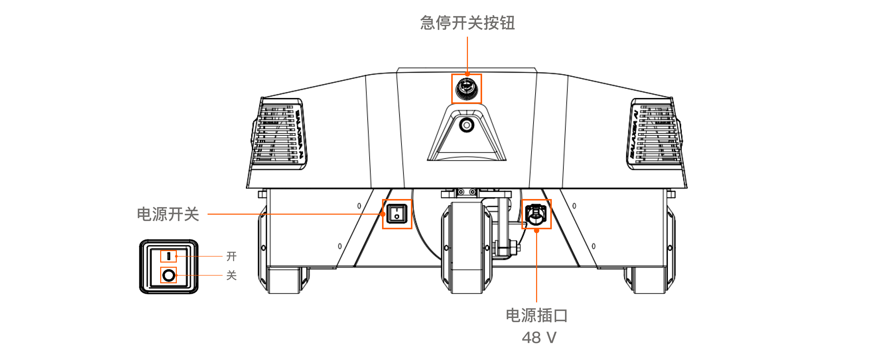
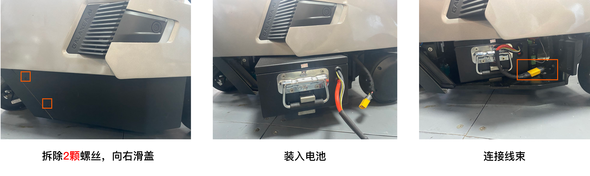
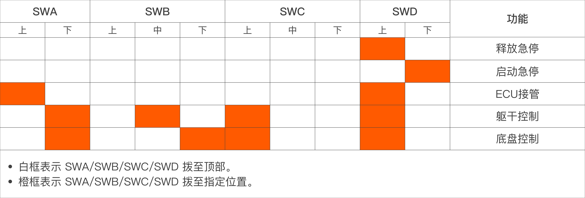
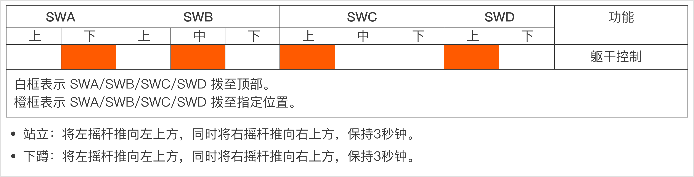
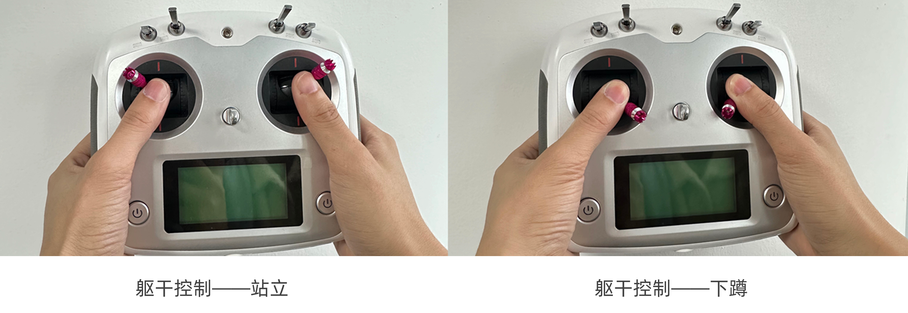
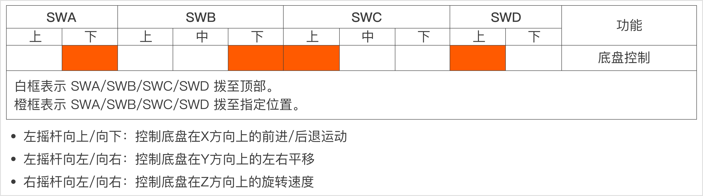

# R1 快速开始
> 欢迎使用 Galaxea R1！本手册将为您详细介绍如何开启、操作这款产品，带您开启与 Galaxea R1 的互动之旅。

## 开机&关机
### 硬开关
R1底盘尾端底部设有一个黑色船形电源按钮。按下该按钮，即可开机/关机。

### 软开关
R1颈部后方配备了一个银色圆形电源按钮：

- 开机：按下按钮并松开，蓝色指示灯亮起表示R1已开机。
- 关机：按下按钮后保持不动至少3秒，再松开，蓝色指示灯熄灭表示R1已关机。

## 充电&换电
充电口位于底盘尾端的左侧底部。充电时，将电源线插入即可。当充电器上的红色指示灯亮起，同时底盘上的电池指示灯闪烁绿灯，即表示R1正在充电中。

电池位于底盘右侧下方，安装步骤如下：

1. 拆下2个螺丝，将电池盖向右滑动，即可拆卸电池盖。
2. 把电池放入底盘，连接好电池线缆到底盘。
3. 安装电池盖。
   若要更换电池，按照上述步骤的相反顺序进行拆卸即可。

## 急停开关
紧急停止按钮位于底盘尾端上方。如遇紧急或危险情况时，请立即按下此急停按钮，R1将停止所有操作，但此操作不会切断电源。

<u>注意： 请确保在开机时，紧急停止按钮处于释放状态。</u>

## 遥控器使用说明
遥控器用于控制机器人的躯干、底盘和紧急停止。

**重要提示：在进行任何操作之前，请确认所有拨杆开关（SWA/SWB/SWC/SWD）都拨至最上方档位，这样能使R1 处于停止状态，防止其意外运行。**

请按照下图所示，将4个拨杆拨到指定位置控制机器人：

**在使用遥控器控制R1 之前，请必须先启动 CAN 驱动程序和其他相关程序，详细说明请参考[开箱启动指南](./R1_Step_by_Step_Guide.md)中[第4.3节](./R1_Step_by_Step_Guide.md/#43-启动can驱动程序)。完成启动后，可将每个开关移至指定位置，并按照以下步骤控制R1。**

### 躯干控制

如图所示：

### 底盘控制

## 遥操作
### R1-Teleop同构遥操作
启动和操作说明请查看 [R1 Teleop同构遥操作使用说明](./R1_Teleop_Usage_Tutorial.md)

### VR遥操作
启动和操作说明请查看[R1 VR-Teleop遥操作使用说明](./R1_VR_Teleop_Usage_Tutorial.md)。
