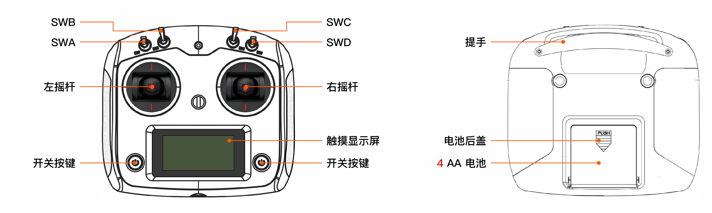
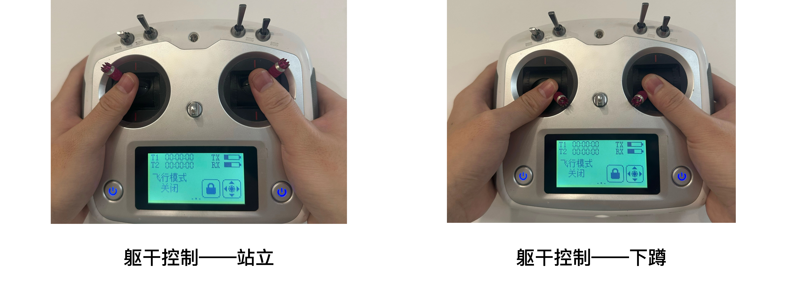

# R1 基础使用介绍
> 欢迎使用 Galaxea R1！本手册将为您详细介绍如何开启、操作这款产品，带您开启与 Galaxea R1 的互动之旅。

## 开机&关机
### 硬开关
R1底盘尾端底部设有一个黑色船形电源按钮。按下该按钮，即可开机/关机。

### 软开关
R1颈部后方配备了一个银色圆形电源按钮：
- 开机：按下按钮并松开，蓝色指示灯亮起表示R1已开机。
- 关机：按下按钮后保持不动至少3秒，再松开，蓝色指示灯熄灭表示R1已关机。

## 充电&换电
电源插口位于底盘尾端的左侧底部。充电时，将电源线插入即可。当充电器上的红色指示灯亮起，同时底盘上的电池指示灯闪烁绿灯，即表示R1正在充电中。

电池位于底盘右侧下方，安装步骤如下：

1. 拆下2个螺丝，将电池盖向右滑动，即可拆卸电池盖。
2. 把电池放入底盘，连接好电池线缆到底盘。
3. 安装电池盖。
   若要更换电池，按照上述步骤的相反顺序进行拆卸即可。

## 急停开关
紧急停止按钮位于底盘尾端上方。如遇紧急或危险情况时，请立即按下此急停按钮，R1将停止所有操作，但此操作不会切断电源。

<u>注意： 请确保在开机时，紧急停止按钮处于释放状态。</u>

## 遥控器使用说明
### 操作说明

- **开启/关闭**：同时按住两个电源按钮，直至触摸屏亮起或者熄灭。

**电量及连接状态显示**：
- TX 框显示遥控器的电池电量情况。
- RX 框显示遥控器是否成功连接到底盘。若连接成功，框中会出现一个条形；若连接失败，则框中会显示一个问号。

**拨杆/摇杆使用**：
- SWA/SWD 是短拨杆开关，有上、下两个档位。
- SWB/SWC 是长拨杆开关，有上、中、下三个档位。
- 左/右摇杆可上、下、左、右移动。

### 机器人控制说明
**重要提示：在进行任何操作之前，请确认所有拨杆开关（SWA/SWB/SWC/SWD）都拨至最上方档位，这样能使R1处于停止状态，防止其意外运行。** 

在不同功能下，各拨杆开关切换到不同位置的操作说明如下：

<u>在使用遥控器控制R1之前，请必须先启动 CAN 驱动程序和其他相关程序，详细说明请参考《开机指南》中的[第4.3节-启动CAN驱动程序](R1_Step_by_Step_Guide.md/#43-启动can驱动程序), [第4.4节-第一次自检](R1_Step_by_Step_Guide.md/#44--第一次自检), [第4.5节-站立](R1_Step_by_Step_Guide.md/#45-站立) 和[第5节-安装手臂](R1_Step_by_Step_Guide.md/#5-安装手臂)节。</u> 完成启动后，可将每个开关移至指定位置，并按照以下步骤控制机器人。

#### 躯干控制
1. 将左摇杆推向左上方，同时将右摇杆推向右上方（如下图所示）。保持3秒钟，随后**R1将站立**。
2. 将左摇杆推向左上方，同时将右摇杆推向右上方（如下图所示）。保持3秒钟，随后**R1将下蹲**。

#### 底盘控制

<table style="width: 100%; border-collapse: collapse;">
    <thead>
        <tr style="background-color: black; color: white; text-align: left;">
            <th style="width: 150px; padding: 8px; border: 1px solid #ddd;">摇杆</th>
            <th style="width: 500px; padding: 8px; border: 1px solid #ddd;">备注</th>
        </tr>
    </thead>
    <tbody>
        <tr style="background-color: white; text-align: left;">
            <td style="padding: 8px; border: 1px solid #ddd;">左摇杆</td>
            <td style="padding: 8px; border: 1px solid #ddd;">向上/向下移动可控制底盘在X方向上的前进/后退运动。  向左/向右移动可控制底盘在Y方向上的左右平移。</td>
        </tr>
        <tr style="background-color: white; text-align: left;">
            <td style="padding: 8px; border: 1px solid #ddd;">右摇杆</td>
            <td style="padding: 8px; border: 1px solid #ddd;">向左/向右移动可控制底盘在Z方向上的旋转速度。</td>
        </tr>
    </tbody>
</table>

## 遥操作
### R1-Teleop同构遥操作
启动和操作说明请查看 [R1 Teleop同构遥操作使用说明](./R1_Teleop_Usage_Tutorial.md)

### VR遥操作
启动和操作说明请查看[R1 VR-Teleop遥操作使用说明](./R1_VR_Teleop_Usage_Tutorial.md)。

## 下一步
我们的快速入门之旅已告一段落。为了更深入地掌握Galaxea R1，我们强烈建议您查阅[Galaxea R1 产品硬件介绍](Hardware_Guide.md)和[Galaxea R1 产品软件介绍](Software_Guide.md)中的章节。这些资源包含了丰富的信息以及实际示例，能够帮助您更轻松、更好地使用 Galaxea R1。