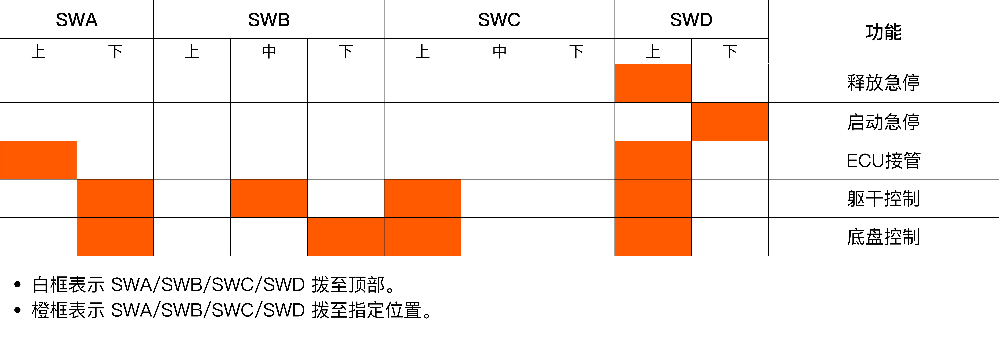
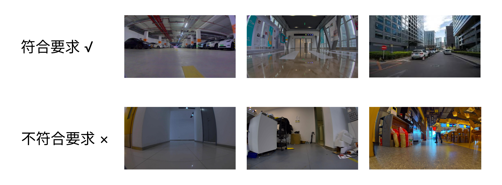
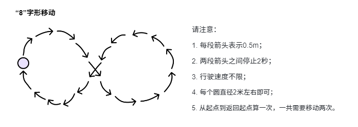
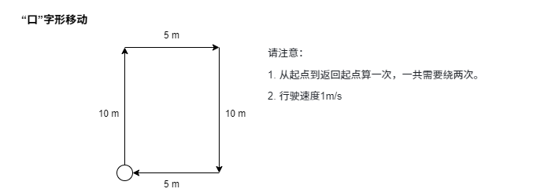

# R1 传感器标定数据采集方法
## 数据采集流程


## 1. 开机
启动R1

## 2. 确认SDK版本
请确认R1整机SDK版本为V1.0.1及以上。

点击[这里](https://github.com/userguide-galaxea/System_Version_Release/tree/main/R1/v1.0.1)获取系统版本更新安装包。

## 3. 启动相关驱动
**Step 1: 清理已有ROS节点**

```Bash
# The following commands will terminate all TMUX.
sudo tmux kill-server
tmux kill-server
pkill -9 ros
```

**Step 2: 启动CAN驱动**

```Bash
sudo ip link set dev can0 type can bitrate 1000000 dbitrate 5000000 fd on
# If "RTNETLINK answers: Device or resource busy" appears, it indicates that the CAN transceiver has been configured and is currently running.
sudo ip link set up can0
```

**Step 3: 启动TMUX**

```Bash
tmux
```

**Step 4: 启动roscore**

```Bash
roscore
```

**Step 5: `Ctrl + B` +`C` 开启新的terminal窗口。 启动HDAS**

```Bash
source ~/work/galaxea/install/setup.bash
roslaunch HDAS hdas.launch
```

**Step 6: `Ctrl + B` +`C` 开启新的terminal窗口。 启动Chassis Control**

```Bash
source ~/work/galaxea/install/setup.bash
roslaunch mobiman r1_chassis_control.launch
```

**Step 7: `Ctrl + B` +`C` 开启新的terminal窗口。 启动Lidar驱动**

```Bash
source ~/work/galaxea/install/setup.bash
roslaunch livox_ros_driver2 msg_MID360.launch
```

**Step 8: `Ctrl + B` +`C` 开启新的terminal窗口。 启动Camera驱动**

```Bash
source ~/work/galaxea/install/setup.bash
sudo chmod 777 /dev/ttyTHS1
roslaunch signal_camera signal_camera.launch
```

## 4. 开启遥控
<span style="color:red;">**重要提示：在进行任何操作之前，请确认所有拨杆开关（SWA/SWB/SWC/SWD）都拨至最上方档位，这样能使R1处于停止状态，防止其意外运行。** </span>

在不同功能下，各拨杆开关切换到不同位置的操作说明如下：



<u>在使用遥控器控制R1之前，请必须先启动 CAN 驱动程序和其他相关程序，详细说明请参考《开机指南》中的 **第[4.3](./R1_Step_by_Step_Guide.md/#43-启动can驱动程序), [4.4](./R1_Step_by_Step_Guide.md/#44--第一次自检), [4.5](./R1_Step_by_Step_Guide.md/#45-站立) 和其他相关章节。</u> 完成启动后，可将每个开关移至指定位置，并按照以下步骤控制R1。

## 5. 确认Topic
开始采集前， 确保有以下topic，且类型和帧率正常。

```Bash
rostopic hz /hdas/imu_chassis /hdas/lidar_chassis_left /hdas/camera_chassis_front_left/rgb/compressed /hdas/camera_chassis_front_right/rgb/compressed /hdas/camera_chassis_left/rgb/compressed /hdas/camera_chassis_rear/rgb/compressed /hdas/camera_chassis_right/rgb/compressed
```


<table style="width: 100%; border-collapse: collapse;">
    <thead>
        <tr style="background-color: black; color: white; text-align: left;">
            <th style="width: 300px; padding: 8px; border: 1px solid #ddd;">传感器</th>
            <th style="width: 400px; padding: 8px; border: 1px solid #ddd;">Topics</th>
            <th style="width: 400px; padding: 8px; border: 1px solid #ddd;">消息类型</th>
            <th style="width: 400px; padding: 8px; border: 1px solid #ddd;">帧率</th>            
        </tr>
    </thead>
    <tbody>
        <tr style="background-color: white; text-align: left;">
            <td style="padding: 8px; border: 1px solid #ddd;">Lidar</td>
            <td style="padding: 8px; border: 1px solid #ddd;">/hdas/lidar_chassis_left</td>
            <td style="padding: 8px; border: 1px solid #ddd;">sensor_msgs/PointCloud2</td>
            <td style="padding: 8px; border: 1px solid #ddd;">10 Hz</td>   
        </tr>
        <tr style="background-color: white; text-align: left;">
            <td style="padding: 8px; border: 1px solid #ddd;">Camera</td>
            <td style="padding: 8px; border: 1px solid #ddd;">/hdas/camera_chassis_front_left/rgb/compressed <br>/hdas/camera_chassis_front_right/rgb/compressed <br>/hdas/camera_chassis_left/rgb/compressed <br>/hdas/camera_chassis_rear/rgb/compressed <br>/hdas/camera_chassis_right/rgb/compressed </td>
            <td style="padding: 8px; border: 1px solid #ddd;">sensor_msgs/CompressedImage   </td>
            <td style="padding: 8px; border: 1px solid #ddd;">10 Hz</td>   
        </tr>
        <tr style="background-color: white; text-align: left;">
            <td style="padding: 8px; border: 1px solid #ddd;">wheel</td>
            <td style="padding: 8px; border: 1px solid #ddd;">/hdas/feedback_chassis</td>
            <td style="padding: 8px; border: 1px solid #ddd;">sensor_msgs/JointState</td>
            <td style="padding: 8px; border: 1px solid #ddd;">200 Hz</td>   
        </tr>
        <tr style="background-color: white; text-align: left;">
            <td style="padding: 8px; border: 1px solid #ddd;">imu</td>
            <td style="padding: 8px; border: 1px solid #ddd;">/hdas/imu_chassis</td>
            <td style="padding: 8px; border: 1px solid #ddd;">sensor_msgs/Imu</td>
            <td style="padding: 8px; border: 1px solid #ddd;">100 Hz</td> 
        </tr>        
        </tr>
    </tbody>
</table>

## 6. 采集场景
符合要求的采集场景示例：光线好、空间开阔超100平米、纹理与结构多样且无动态物体，如照明充足的地下车库、人少开阔的写字楼园区。

不符合要求的采集场景示例：空间狭窄、纹理结构单一、光线不佳或有较多动态物体，像狭窄走廊、大白墙环境、人多的餐厅、办公室等。



## 7. 采集路线
在对R1传感器进行标定工作时，一共需要采集2组数据，可通过录制ros bag的方式来完成相应数据的收集操作。

```Bash
rosbag record -a
```

1. 8字行驶
   

2. 口字型行驶
   

## 8. 数据回传
将bag回传。