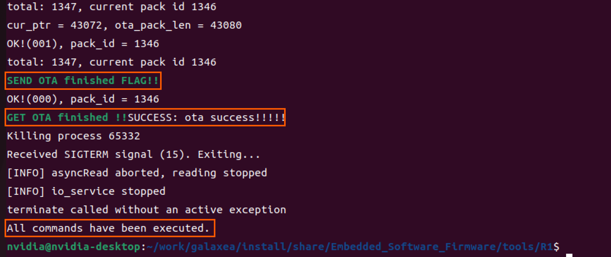
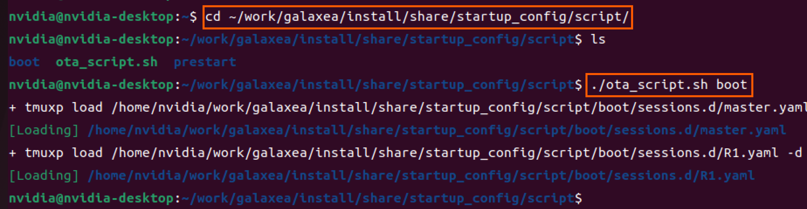
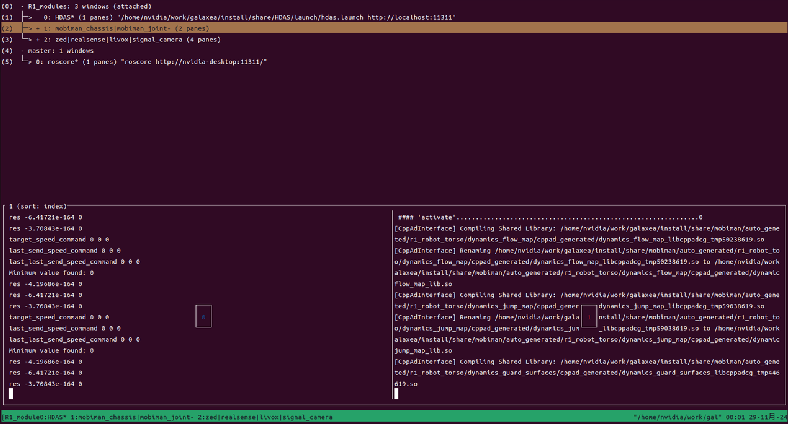

# Galaxea R1软件版本_V1.0.4_更新日志

## 更新说明

**产品名称：**Galaxea R1/R1 Pro

**软件版本号：**V1.0.4

**发布日期：**2025.01.17 (GMT +8)

**更新项：**

1. **导航智能产品上线：**<br>
   a) 新增**定位模块**，涵盖全局定位功能和里程计功能；<br>
   b) 新增**规划模块**，涵盖全局路径搜索和局部路径规划功能。<br>
   **<span style="color:blue;">如有试用需求，请邮件至 [info@galaxea.ai](mailto:info@galaxea.ai)或致电4008-780-980联系我们。</span>**

2. **运控内容更新项：**<br>
   a) 修复chassis control 的低速跟随问题;<br>
   b) 新增**高跟随模式**的关节控制命令；<br>
   c) 新增**躯干控线速度控制**，该命令不能与Joint Tracker同时启动;<br>
   d) 新增禁用躯干控制功能，用于特定测试。

3. **驱动（HDAS）内容更新项：**<br>
   a) 新增**R1 Pro协议**解析：`roslaunch HDAS r1pro.launch`，支持**A2机械臂**搭载**灵巧手** / 夹爪接口；<br>
   b) HDAS修复CAN无消息情况下CPU占用100%问题。<br>

4. **嵌入式固件（xCU）内容更新项：**<br>
   a) 新增CCU(Central Control Unit)调低风扇速度功能；<br>
   b) 新增VCU(Vehicle Control Unit)**底盘控制errorcode上报**。


## 更新说明

1. **<span style="color:red;">请注意:</span>** 升级脚本会默认删除 **`/home/nvidia/work/ci_pipeline`** 下的所有文件，请您务必在升级前确认该文件夹内的文件已做好备份工作，以免造成数据丢失。
2. 在升级过程中，请不要中止系统运行，也不要进行任何控制操作，否则可能导致升级失败，影响系统正常使用。
3. 升级完成后，请关闭R1电源，并重新进行上电操作，以确保系统更新完全生效。

**请严格按照以下教程完成本次系统更新，如遇问题，请邮件至 [info@galaxea.ai](mailto:info@galaxea.ai)或致电4008-780-980联系我们。!**


## 更新教程

### 软件包下载

软件更新包名称：Software_V1.0.4_Release.tar.gz

- 百度云：[https://pan.baidu.com/s/1BVzYb3EWsbrJ9ANOo_psNQ?pwd=V104](https://pan.baidu.com/s/1BVzYb3EWsbrJ9ANOo_psNQ?pwd=V104)
- Google Drive：[https://drive.google.com/drive/folders/1BRQXwE6emFTTZhMeqXbdcG1J3bjrawR0?usp=drive_link](https://drive.google.com/drive/folders/1BRQXwE6emFTTZhMeqXbdcG1J3bjrawR0?usp=drive_link)

### 软件包解压

```Bash
tar -xf ${your_download_path}/Software_V1.0.4_Release.tar.gz -C ~/
chmod +x ~/ota.sh
cd ~
./ota.sh
```

### 嵌入式固件升级

```Bash
cd ~/work/galaxea/install/share/Embedded_Software_Firmware/tools/R1
source ~/work/galaxea/install/setup.bash
bash r1_embedded_firmware_upgrade.sh ../../firmware/R1/V1_0_4
```



**<span style="color:red;">注意：更新完毕后，请关闭R1电源并重新上电</span>**

### 模块运行

```Bash
sudo apt-get install tmux tmuxp
cd ~/work/galaxea/install/share/startup_config/script
./ota_script.sh boot
```



