# R1 开箱启动指南
> 在本教程中，我们将提供详细的说明，指导您如何正确地开箱Galaxea R1，连接电缆，安装机械臂，以及如何远程控制R1，以实现更好的通信和探索更多功能。

## 开箱启动教学
<iframe width="720" height="350" src="https://youtu.be/jPyW3BnnwwY" title="R1 Lite Unboxing and Startup Guide" frameborder="0" allow="accelerometer; autoplay; clipboard-write; encrypted-media; gyroscope; picture-in-picture; web-share" referrerpolicy="strict-origin-when-cross-origin" allowfullscreen></iframe>

## 1.物品清单检查
收到产品时，请根据以下清单检查包装盒内的物品是否齐全。（部分物品在航空箱内）
<table style="width: 100%; border-collapse: collapse;">
    <thead>
        <tr style="background-color: black; color: white; text-align: left;">
            <th style="width: 200px; padding: 8px; border: 1px solid #ddd;">物品</th>
            <th style="width: 300px; padding: 8px; border: 1px solid #ddd;">数量</th>
        </tr>
    </thead>
    <tbody>
        <tr style="background-color: white; text-align: left;">
            <td style="padding: 8px; border: 1px solid #ddd;">R1 本体</td>
            <td style="padding: 8px; border: 1px solid #ddd;">1</td>
        </tr>
        <tr style="background-color: white; text-align: left;">
            <td style="padding: 8px; border: 1px solid #ddd;">A1 机械臂</td>
            <td style="padding: 8px; border: 1px solid #ddd;">2</td>
        </tr>
        <tr style="background-color: white; text-align: left;">
            <td style="padding: 8px; border: 1px solid #ddd;">G1 夹爪</td>
            <td style="padding: 8px; border: 1px solid #ddd;">2</td>
        </tr>
        <tr style="background-color: white; text-align: left;">
            <td style="padding: 8px; border: 1px solid #ddd;">遥控器</td>
            <td style="padding: 8px; border: 1px solid #ddd;">1</td>
        </tr>
        <tr style="background-color: white; text-align: left;">
            <td style="padding: 8px; border: 1px solid #ddd;">六角扳手套组</td>
            <td style="padding: 8px; border: 1px solid #ddd;">1</td>
        </tr>
                <tr style="background-color: white; text-align: left;">
            <td style="padding: 8px; border: 1px solid #ddd;">充电器&电缆线套组</td>
            <td style="padding: 8px; border: 1px solid #ddd;">1</td>
        </tr>
        <tr style="background-color: white; text-align: left;">
            <td style="padding: 8px; border: 1px solid #ddd;">电缆线束包</td>
            <td style="padding: 8px; border: 1px solid #ddd;">1</td>
        </tr>
    </tbody>
</table>

此外，仍需准备以下物品：
<table style="width: 100%; border-collapse: collapse;">
    <thead>
        <tr style="background-color: black; color: white; text-align: left;">
            <th style="width: 200px; padding: 8px; border: 1px solid #ddd;">物品</th>
            <th style="width: 300px; padding: 8px; border: 1px solid #ddd;">数量</th>
        </tr>
    </thead>
    <tbody>
        <tr style="background-color: white; text-align: left;">
            <td style="padding: 8px; border: 1px solid #ddd;">显示器&键盘&鼠标</td>
            <td style="padding: 8px; border: 1px solid #ddd;">1</td>
        </tr>
        <tr style="background-color: white; text-align: left;">
            <td style="padding: 8px; border: 1px solid #ddd;">电脑</td>
            <td style="padding: 8px; border: 1px solid #ddd;">1</td>
        </tr>
        <tr style="background-color: white; text-align: left;">
            <td style="padding: 8px; border: 1px solid #ddd;">WiFi 网络</td>
            <td style="padding: 8px; border: 1px solid #ddd;">1</td>
        </tr>
                <tr style="background-color: white; text-align: left;">
            <td style="padding: 8px; border: 1px solid #ddd;">HDMI线</td>
            <td style="padding: 8px; border: 1px solid #ddd;">1</td>
        </tr>
    </tbody>
</table>
<span style="color=red;">注意： 为确保产品正常运行，请将R1放置在干燥、通风良好的环境中，并确保周围没有障碍物或危险物品。</span>

## 2. 开箱
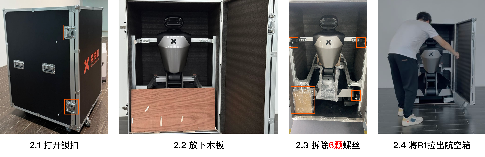

### 2.1 打开箱锁
找到箱子左侧的两个锁，打开锁片，并逆时针旋转即可打开箱门。

### 2.2 放下盖板
箱门前侧有一个用于使R1沿其下滑的木板。将板子放平到地面上。

### 2.3 移除箱内固定件
使用L型六角扳手（M6）卸下六个固定螺丝，如下图所示。

### 2.4 拉出R1
将机器人从箱子里拉出来，过程中请避免碰撞。

### 2.5 移除底盘固定件
底盘的前后均有固定件。
1. 将装有固定件的轮子旋转到两侧，即可露出固定螺丝。
2. 使用L型六角扳手（M6）卸下轮子上的六个固定螺丝。
3. 将轮子转回原位。

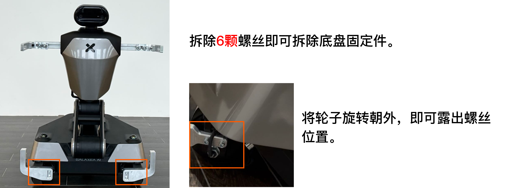

### 2.6  拆卸背部盖板
请按照以下步骤拆卸胸腔后盖：

1. 打开背部盖板上的外设接口盖。
2. 使用L型六角扳手（M4）卸下盖板下的2颗M4螺丝。
3. 使用L型六角扳手（M5）卸下胸腔盖板侧面的4颗M5螺丝。

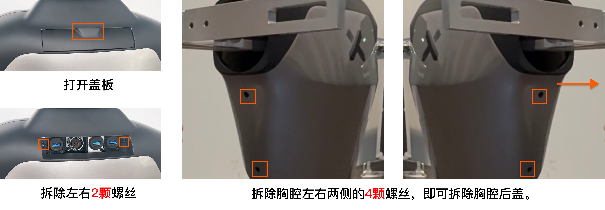

### 2.7 拆卸前侧盖板
使用L型六角扳手（M5）卸下胸腔两侧的六个M5螺丝，如下图所示。
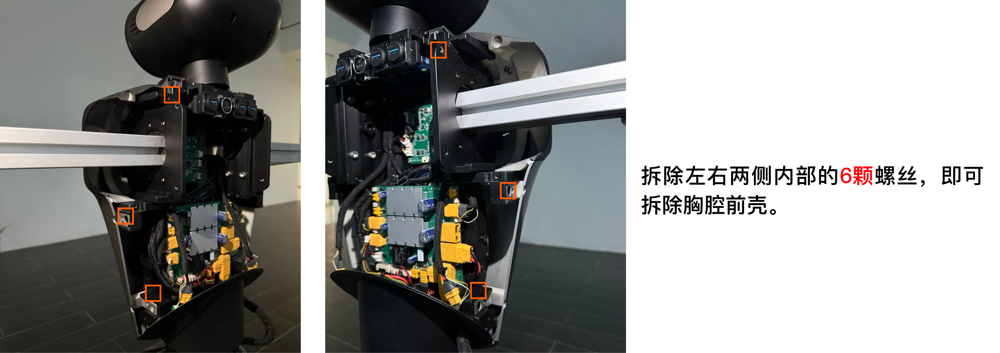

### 2.8 移除手臂固定件
使用L型六角扳手（M5）卸下胸腔内的两个螺丝，如下图所示。

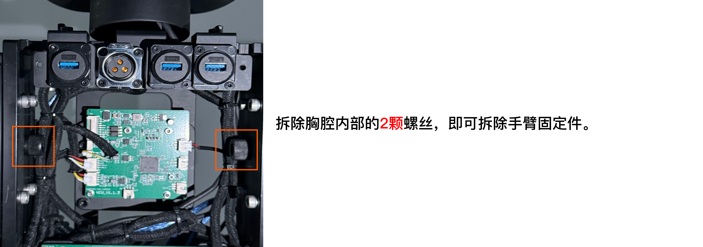

## 3. R1开机
### 3.1 连接HDMI和USB
<span style="color: red;">**重要提示：为了您的安全，请在连接任何电缆之前先关闭R1的电源。**
</span>

请按照以下步骤连接R1：

1. 使用L型六角扳手（M3）卸下底盘外设接口盖上的2颗M3螺丝。
2. 将HDMI电缆连接到底盘和显示器。请确保连接牢固，避免松动。
   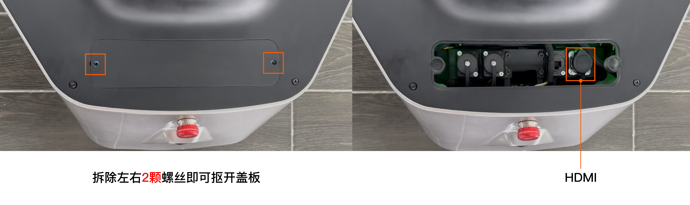
3. 将USB接口连接到鼠标、键盘和胸腔。请确保连接牢固，避免松动。
   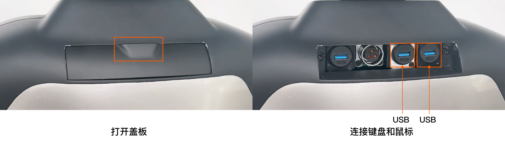

### 3.2 开机
按下底盘后侧底部的船形电源按钮，即可开机。关闭电源按钮，即可关机。
<span style="color:red">注意：请保持紧急停止按钮抬起，并打开位于底盘左后底部的船形电源按钮。如果电源之前是开着的，您需要先关闭再打开；否则，显示器可能无法工作。</span>

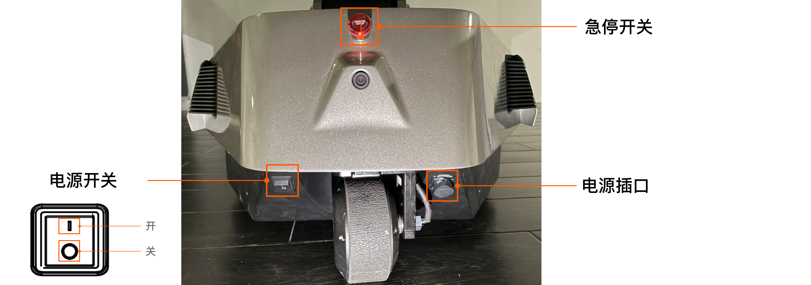

#### 3.2.1 充电
如果机器人的底盘内有电池但电量耗尽，应先充电然后再打开按钮。电源端口位于底盘后侧底部。

充电步骤如下所示：

1. 拧开电源充电口盖。
2. 将电源线插入端口。当充电器上的红灯亮起时，且机器人底盘侧边的电源指示灯橙绿色频闪状态，表示机器人正在充电。

#### 3.2.2 更换电池
如果机器人的底盘内没有电池，请先安装电池。电池位于底盘右侧底部。

更换电池步骤如下所示：

1. 拆除底盘侧边盖板的2个螺丝，并向有滑动盖板即可拆卸。
2. 将电池推入底盘。
3. 将电池电缆连接到底盘。
4. 关闭盖板。

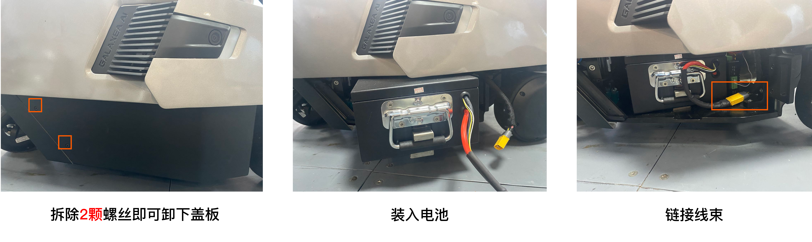

## 4. 连接R1
### 4.1 本地连接
如果不需要远程连接和控制R1，请继续在原有的显示器和键盘上操作，并保持HDMI和USB电缆连接。然后进行[第4.3节-启动CAN驱动程序](#43-启动can驱动程序)，继续后续流程。

### 4.2 远程连接
#### 4.2.1 获取IP地址
R1开机后，等待显示器显示桌面。

1. 点击“设置”并连接WiFi。
   

2. 打开终端并输入以下命令：
    ```Bash
      ifconfig mlan0
    ```

3. 找到`mlan0`。R1 Orin的IP地址是：`192.168.xxx.xxx`。
   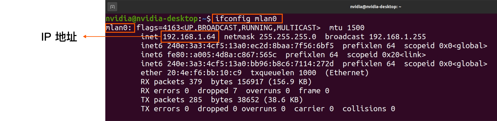

#### 4.2.2 通过SSH连接
1. 使用另一台计算机。
2. 在终端输入以下命令以连接Orin。
    ```Bash
      ssh nvidia@IP address
      # Enter the password  (default: nvidia)
    ```
3. 如果连接成功，请断开HDMI和USB电缆，并关闭底盘和胸腔的外设接口盖，以免影响活动范围。
4. 然后进行[第4.3节-启动CAN驱动程序](#43-启动can驱动程序)，继续后续流程。

<span style="color: blue;">如果连接失败，请及时联系我们<a href="mailto:support@galaxea.ai">support@galaxea.ai</a>提供技术支持。</span>

### 4.3 启动CAN驱动程序
在控制R1的整个过程中，您需要打开多个终端。我们建议您使用TMUX。常用指令如下：
- 创建新终端：按`Ctrl + B`然后按`C`。
- 切换终端：按`Ctrl + B`然后按数字，数字表示终端窗口的序号。

现在，请按照以下步骤启动CAN驱动程序。

1. 启动TMUX。
    ```Bash
    tmux
    ```

2. 启动FDCAN通信。
    ```Bash
    sudo ip link set dev can0 type can bitrate 1000000 dbitrate 5000000 fd on
    # If "RTNETLINK answers: Device or resource busy" appears, it indicates that the CAN transceiver has been configured and is currently running.
    sudo ip link set up can0  
    ```

3. 启动roscore。
    ```Bash
    roscore    
    ```

4. 按下`Ctrl + B`加`C`，创建新终端，然后启动HDAS。
    ```Bash
    source ~/work/galaxea/install/setup.bash
    roslaunch HDAS r1.launch
    ```

### 4.4  第一次自检
<span style="color:red">**重要提示：在对R1进行任何操作之前，您必须完成R1自检以确保安全。** </span>

请确保：

- R1已出箱且所有固定件已移除。
- R1保持折叠状态，没有安装机械臂。

按照以下步骤进行第一次自检。

1. 按`Ctrl + B`然后按`C`创建新终端。然后启动自检。
   ```Bash
   source ~/work/galaxea/install/setup.bash
   rosrun HDAS check_node 
   #after executed the command, please press 0. (0 means the self-check when the arms are uninstalled.)
   ```

2. 如果显示“self-check completed”，如下图所示，表示自检完成，请按`Ctrl + C`退出。
   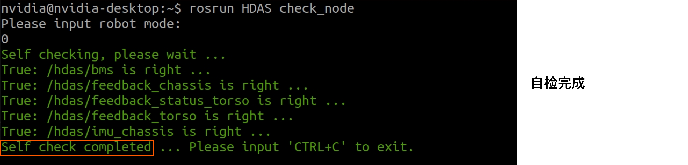

3. 如果出现警告，如下图所示，请及时联系我们提供技术支持。
   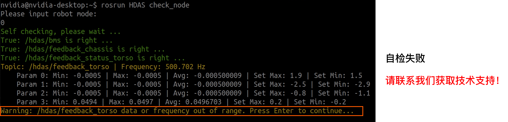

### 4.5 站立
<span style="color:red">**重要提示：为了您的安全，请确保R1已出箱，且没有任何干扰或固定件。否则，躯干可能会进入自锁保护状态。**</span>

完成自检后，您可以通过命令躯干和底盘，并使用遥控器使R1站立起来。

#### 4.5.1 启动躯干控制
按下 `Ctrl + B ` 加 `C` 创建新终端，启动臂部和躯干控制。
```Bash
source ~/work/galaxea/install/setup.bash
roslaunch mobiman r1_jointTrackerdemo.launch
```

#### 4.5.2 启动底盘控制
按下 `Ctrl + B ` 加 `C` 创建新终端，启动底盘控制。
```Bash
source ~/work/galaxea/install/setup.Bash
roslaunch mobiman r1_chassis_control.launch
```

#### 4.5.3 遥控器操作
<span style="color:red"> 注意：在进行任何操作之前，请确保所有开关（SWA/SWB/SWC/SWD）都处于顶部位置。</span>这将使机器处于停止状态，防止R1误操作。如果需要获取更多详细操作信息，请参阅Galaxea R1用户指南中的遥控器指南。

1. 要开启/关闭控制器，请按住两个电源按钮，直到触摸屏亮起/熄灭。
2. 将SWA开关拨至底部，将SWB开关拨至中间。
3. 同时将左摇杆移至左上角，将右摇杆移至右上角，如下图所示。等待3秒钟，R1即可站立。
   <p style="text-align: center;">
      
   </p>

## 5. 安装手臂
<span style="color:red">**重要提示：为了您的安全，请在安装手臂之前使R1站立并关闭电源。**</span>

1. 将夹爪连接到手臂。拆除夹爪，反向操作即可。
   

    - **对齐检查**：确保夹爪周围的3个安装孔与机械臂末端的3个安装孔对齐。
    - **螺丝固定**：对齐后，使用提供的3个螺丝将夹爪固定并紧固到机械臂末端。
    - **牢固检查**：紧固螺丝后，再次检查夹爪的安装是否对齐并是否牢固。

2. 使用六角L型扳手（5mm）和4颗M6螺丝固定手臂。
   <span style="color:red">**注意：在安装R1手臂时，您必须确保手臂底座上的端口朝向后方，如下图所示。**</span>
   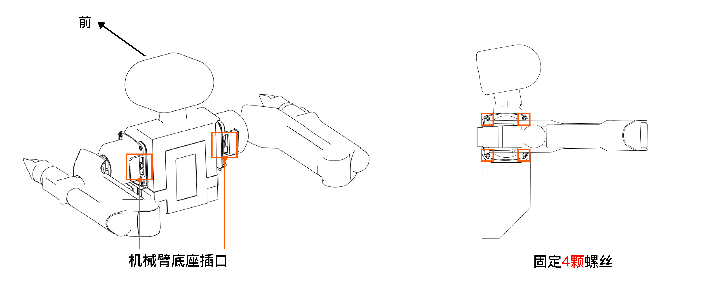

3. 将机械臂电源线和CAN线连接到手臂底座端口。
   <span style="color:red">**注意：在插入CAN电缆之前，请先卸下电阻帽。如在未安装机械臂的状态下使用机器人，需要重新安装上电阻帽，建议您妥善保存。**</span>
   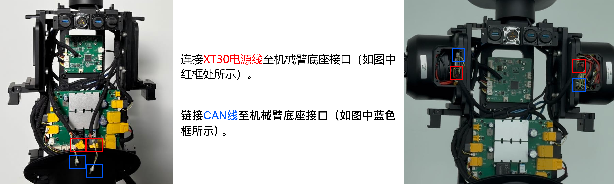
   
4. 在确认与机器人手臂的通信连接成功后，通过反向执行上述[第2.6节-拆卸背部盖板](#26--拆卸背部盖板)和[第2.7节-拆卸前侧盖板](#27-拆卸前侧盖板)的步骤，重新安装盖板。

## 6. 第二次自检
在开始自检之前，请确保:

- R1已站立。
- R1已正确安装手臂。肘部朝外（银色外壳朝内，黑色外壳朝外），且夹爪电缆朝外。
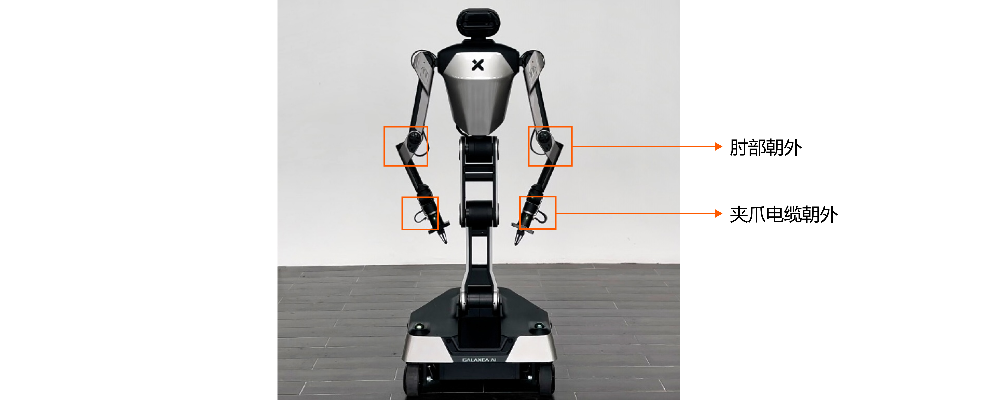

然后，<span style="color:red">**开机**</span>并：

1. 按照[第4.3节-启动CAN驱动程序](#43-启动can驱动程序)中的命令完成操作。
2. 按`Ctrl + B`然后按`C`创建新终端。现在，开始第二次自检。
    ```Bash
    source work/galaxea/install/setup.Bash
    rosrun HDAS check_node #after executed the command, please press 1. (1 means the self-check when the arms are installed.)
    ```
3. 按照[第4.5.1节-启动躯干控制](#451-启动躯干控制)和[第4.5.2节-启动底盘控制](#452-启动底盘控制)中的命令完成操作。


## 7. Demo演示
<span style="color:red">**重要提示：在对R1进行任何操作之前，您必须完成R1自检以确保安全。**</span>

完成上述所有操作后，<span style="color:red">将R1移动到一个开阔区域，确保周围没有障碍物</span>，方可远程命令R1进行Demo测试。

您可以在[R1 Demo Guide](./R1_demo_test.md)中找到文档和Python脚本。

## 8. 传感器标定数据采集
点击查看[R1传感器标定数据采集方法](./R1_Sensor_Calibration_Data_Collection_Method.md)。