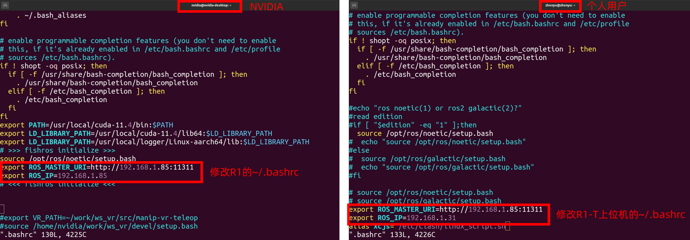
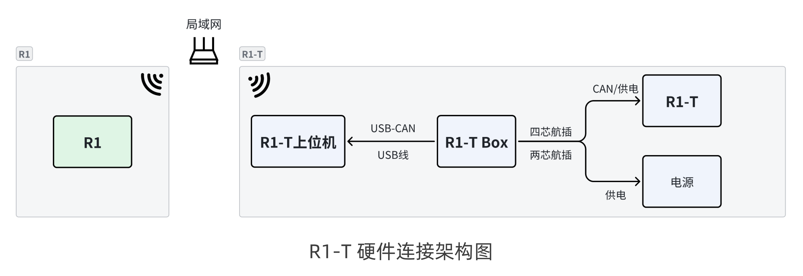
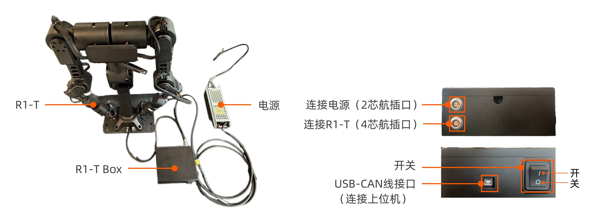
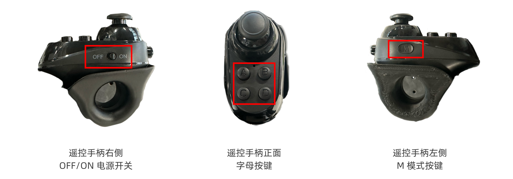
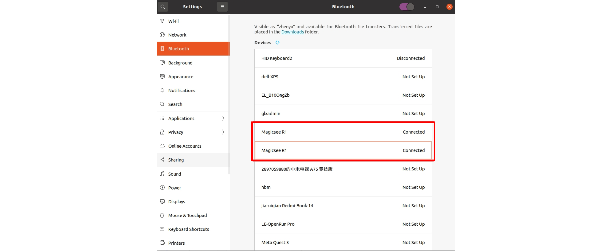
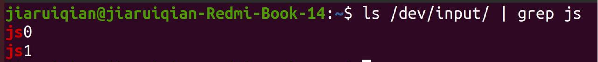
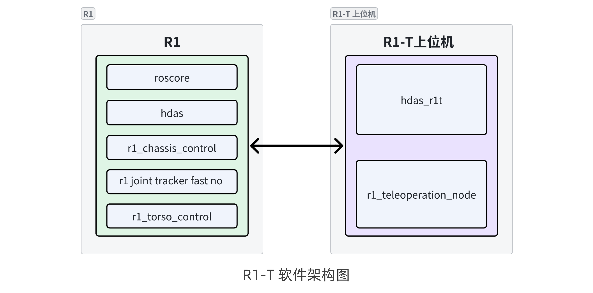
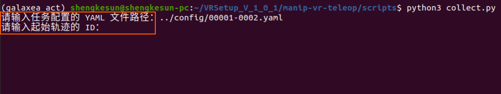
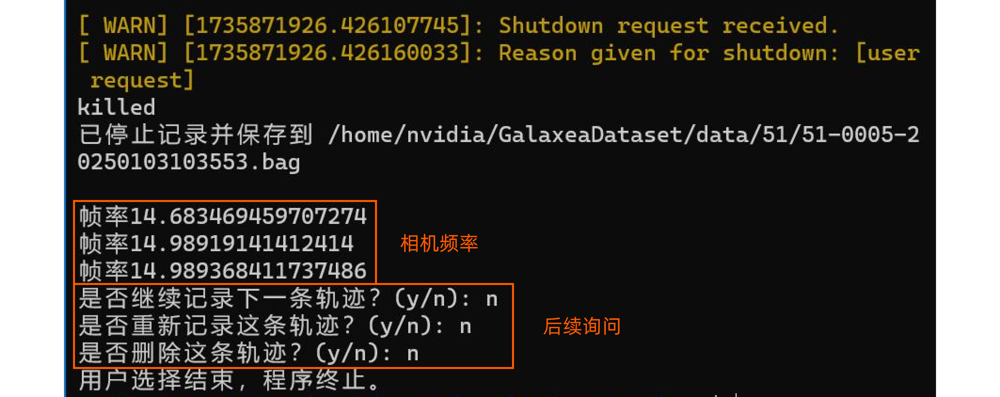

# R1 Teleop 同构遥操作教程
> 欢迎使用 **R1 Teleop（简称 R1-T）** —— 专为 R1 打造的同构遥操作平台。

## 1. 产品介绍
R1 Teleop平台采用按比例缩小设计，完美复刻R1的各项功能，实现全身力反馈遥操作、全关节映射，并支持本体端力反馈至遥操端，确保操作精准同步，具备毫米级精度与毫秒级响应速度。
</br>接下来的教程将详细指导您如何安装和启动 R1 Teleop，助您迅速体验这款高性能遥操作平台。
## 2. 开箱

收到产品时，请根据以下货品交付清单检查包装盒内的物品是否齐全。

<table style="width: 100%; border-collapse: collapse;">
    <thead>
        <tr style="background-color: black; color: white; text-align: left;">
            <th style="width: 300px; padding: 8px; border: 1px solid #ddd;">物品</th>
            <th style="width: 400px; padding: 8px; border: 1px solid #ddd;">数量</th>
        </tr>
    </thead>
    <tbody>
        <tr style="background-color: white; text-align: left;">
            <td style="padding: 8px; border: 1px solid #ddd;">R1-T 本体</td>
            <td style="padding: 8px; border: 1px solid #ddd;">1</td>
        </tr>
        <tr style="background-color: white; text-align: left;">
                <td style="padding: 8px; border: 1px solid #ddd;">R1-T Box （电源/通信盒）</td>
            <td style="padding: 8px; border: 1px solid #ddd;">1</td>
        </tr>
        <tr style="background-color: white; text-align: left;">
            <td style="padding: 8px; border: 1px solid #ddd;">G夹固定器</td>
            <td style="padding: 8px; border: 1px solid #ddd;">2</td>
        </tr>
        <tr style="background-color: white; text-align: left;">
            <td style="padding: 8px; border: 1px solid #ddd;">电源</td>
            <td style="padding: 8px; border: 1px solid #ddd;">1</td>
        </tr>
        <tr style="background-color: white; text-align: left;">
            <td style="padding: 8px; border: 1px solid #ddd;">USB/CAN线</td>
            <td style="padding: 8px; border: 1px solid #ddd;">1</td>
        </tr>
    </tbody>
</table>

## 3. 启动前准备
### 3.1 硬件准备
<table style="width: 100%; border-collapse: collapse;">
    <thead>
        <tr style="background-color: black; color: white; text-align: left;">
            <th style="width: 200px; padding: 8px; border: 1px solid #ddd;">物品</th>
            <th style="width: 100px; padding: 8px; border: 1px solid #ddd;">数量</th>
            <th style="width: 400px; padding: 8px; border: 1px solid #ddd;">备注</th>
        </tr>
    </thead>
    <tbody>
        <tr style="background-color: white; text-align: left;">
            <td style="padding: 8px; border: 1px solid #ddd;">R1-T 上位机</td>
            <td style="padding: 8px; border: 1px solid #ddd;">1</td>
            <td style="padding: 8px; border: 1px solid #ddd;">系统：Ubuntu20.04 ROS Noetic <br /><span style="color:red;">注意：请勿在虚拟机中使用R1-T上位机，否则可能无法连接蓝牙遥控器。</span></td>
        </tr>
        <tr style="background-color: white; text-align: left;">
                <td style="padding: 8px; border: 1px solid #ddd;">局域网</td>
            <td style="padding: 8px; border: 1px solid #ddd;">1</td>
            <td style="padding: 8px; border: 1px solid #ddd;">用于R1和R1-T之间的无线通信。</td>
        </tr>
        <tr style="background-color: white; text-align: left;">
            <td style="padding: 8px; border: 1px solid #ddd;">网线</td>
            <td style="padding: 8px; border: 1px solid #ddd;">1</td>
            <td style="padding: 8px; border: 1px solid #ddd;">用于查看R1的IP地址。</td>
        </tr>
    </tbody>
</table>

### 3.2 软件准备
#### 3.2.1 下载并解压SDK包
请在R1-T上位机里下载并解压R1-T 的SDK文件包。

- 百度云： [https://pan.baidu.com/s/1WEQIQbMhe3fQ2wyKx160Lw?pwd=gr1t](https://pan.baidu.com/s/1WEQIQbMhe3fQ2wyKx160Lw?pwd=gr1t)
- Google Drive：[https://drive.google.com/drive/folders/1yMCa5XaNEa0SFwQ_b2NTLBQz5o1i9Z1h?usp=sharing](https://drive.google.com/drive/folders/1yMCa5XaNEa0SFwQ_b2NTLBQz5o1i9Z1h?usp=sharing)

<span style="color:red;">请确保R1机器人软件版本已更新至V1.1.0及以上，点击[此处](R1_Software_Changelog/v1.1.0.md)获取最新版本。</span>

#### 3.2.2 安装软件依赖环境
请在R1-T上位机上安装所需环境依赖。

```Bash
sudo apt install ros-noetic-trac-ik
sudo apt install ros-noetic-joy
sudo apt install tmux tmuxp
```

#### 3.2.3 修改/.bashrc 文件
分别修改R1和R1-T上位机的ROS IP设置，具体步骤如下：

1. 在R1的`/.bashrc`文件末尾加入以下两行：
```Bash
export ROS_MASTER_URI=http://R1的ip:11311
export ROS_IP=R1的ip地址     
```
2. 在R1-T上位机的`/.bashrc`文件末尾加入以下两行：
```Bash
export ROS_MASTER_URI=http://R1的ip:11311
export ROS_IP=R1T上位机的ip地址     
```
3. 示例：
    
    
## 4. 连接R1 Teleop


### 4.1 固定设备
请使用G夹固定器将R1-T Base固定至桌面，如下图所示：


### 4.2 连接设备
请按下图所示连接设备



1. 将R1-T Base后面下方底座的CAN线连接至R1-T Box的四芯航插口。
2. 将电源的供电线连接至R1-T Box的二芯航插口。
3. 连接R1-T Box的USB-CAN线至上位机的USB插口。

**<span style="color:red;">注意：连接完成后不要立刻上电，请按照以下步骤继续操作。</span>**

### 4.3 打开电源
**<span style="color:red;">将R1-TBase固定至桌面后，按下图所示的初始位置摆放手臂和躯干，确保左右臂的J4、J5、J6及R1-T Base均处于零点位置后，方可连接T1-T电源线再上电。</span>**


**<span style="color:red;">注意：每次启动R1-T之前，请务必将R1-T姿态调整为初始姿态，否则可能存在使用风险。</span>**

### 4.4 连接蓝牙遥控手柄
请务必依次将左臂和右臂连接至 R1-T 上位机，确保**<span style="color:red;">先连接左臂，再连接右臂</span>**。

<span style="color:red;">注意：由于程序设置，为减少操作流程，如若手柄连接顺序错误，请关闭电源后重新上电，再按正确顺序进行连接。</span>

连接步骤如下：

1. 打开遥控手柄蓝牙，将左右手的手柄遥控器右侧的“ON/OFF”打开后，按住左侧的“M”键和遥控器上方的“B”键。
   
2. 打开上位机的蓝牙，连接两个名称为“Magicsee R1”的设备。
   
3. 连接后显示“设备已连接”。输入以下命令确认是否连接成功：
   ```Python
   ls /dev/input/ | grep js
   ```
   ​       当同时返回`js0`（左臂）和`js1`（右臂），即为连接成功。
    

4. 蓝牙遥控器按键功能说明
   
   
   <table style="width: 100%; border-collapse: collapse;">
       <thead>
           <tr style="background-color: black; color: white; text-align: left;">
               <th style="width: 300px; padding: 8px; border: 1px solid #ddd;">拨杆/按钮</th>
               <th style="width: 400px; padding: 8px; border: 1px solid #ddd;">左摇控器</th>
               <th style="width: 400px; padding: 8px; border: 1px solid #ddd;">右遥控器</th>
           </tr>
       </thead>
       <tbody>
           <tr style="background-color: white; text-align: left;">
               <td style="padding: 8px; border: 1px solid #ddd;">拨杆X  正方向</td>
               <td style="padding: 8px; border: 1px solid #ddd;">底盘向前移动（Vx 为正）</td>
               <td style="padding: 8px; border: 1px solid #ddd;">躯干向上移动（Vz 为正）</td>
           </tr>
           <tr style="background-color: white; text-align: left;">
                   <td style="padding: 8px; border: 1px solid #ddd;">拨杆X  负方向</td>
               <td style="padding: 8px; border: 1px solid #ddd;">底盘向后移动（Vx 为负）</td>
               <td style="padding: 8px; border: 1px solid #ddd;">躯干向下移动（Vz 为负）</td>
           </tr>
           <tr style="background-color: white; text-align: left;">
               <td style="padding: 8px; border: 1px solid #ddd;">拨杆Y  正方向</td>
               <td style="padding: 8px; border: 1px solid #ddd;">底盘向左平移（Vy 为正）</td>
               <td style="padding: 8px; border: 1px solid #ddd;">底盘逆时针自旋（W 为正）</td>
           </tr>
           <tr style="background-color: white; text-align: left;">
               <td style="padding: 8px; border: 1px solid #ddd;">拨杆Y  负方向</td>
               <td style="padding: 8px; border: 1px solid #ddd;">底盘向右平移（Vy 为负）</td>
               <td style="padding: 8px; border: 1px solid #ddd;">底盘顺时针自旋（W 为负）</td>
           </tr>
           <tr style="background-color: white; text-align: left;">
               <td style="padding: 8px; border: 1px solid #ddd;">按键 A</td>
               <td style="padding: 8px; border: 1px solid #ddd;">左夹爪闭合</td>
               <td style="padding: 8px; border: 1px solid #ddd;">右夹爪闭合</td>
           </tr>
                   </tr>
           <tr style="background-color: white; text-align: left;">
               <td style="padding: 8px; border: 1px solid #ddd;">按键 B</td>
               <td style="padding: 8px; border: 1px solid #ddd;">左夹爪打开</td>
               <td style="padding: 8px; border: 1px solid #ddd;">右夹爪打开</td>
           </tr>
           </tr>
           <tr style="background-color: white; text-align: left;">
               <td style="padding: 8px; border: 1px solid #ddd;">按键 C</td>
               <td style="padding: 8px; border: 1px solid #ddd;">开始录制数据 *</td>
               <td style="padding: 8px; border: 1px solid #ddd;">躯干向前移动（Vx 为正）</td>
           </tr>
           </tr>
           <tr style="background-color: white; text-align: left;">
               <td style="padding: 8px; border: 1px solid #ddd;">按键 D</td>
               <td style="padding: 8px; border: 1px solid #ddd;">停止录制数据 *</td>
               <td style="padding: 8px; border: 1px solid #ddd;">躯干向后移动（Vx为负）</td>
           </tr>
       </tbody>
   </table>

<span style="color:red;">*该操作方式仅适用于软件版本更新至V1.1.0版本的R1。</span>

## 5. 启动SDK


**<span style="color:red;">注意：R1及R1 Teleop的软件版本必须安装V1.1.0或以上版本，点击[此处](R1_Software_Changelog/v1.1.0.md)获取最新版本</span>**

在控制R1 Teleop的整个过程中，您需要打开多个窗口。我们建议您使用TMUX。常用指令如下：

- 创建新窗口：按`Ctrl + B`然后按`C`。
- 切换窗口：按`Ctrl + B`然后按数字，数字表示窗口的序号。

现在，您可以按照以下步骤启动CAN驱动程序。

### 5.1 启动R1
在R1 ECU执行以下指令启动R1。
```Python
cd ~/work/galaxea/install/share/startup_config/script
./ota_script.sh boot_teleop     
```
### 5.2 启动R1 Teleop
在R1-T上位机上执行以下步骤。

1. 启动TMUX
   ```Python
   tmux
   ```
2. 启动FDCAN通信
    ```Python
    sudo ip link set dev can0 type can bitrate 1000000 dbitrate 5000000 fd on
    sudo ip link set up can0
    ```
3. 按`Ctrl + B `然后按`D`退出TMUX。

4. 启动 R1 Teleop
   ```Bash
   cd {your_path}/install/share/startup_config/script
   ./ota_script.sh boot
   ```
   注意：`your_path` 为R1 Teleop的SDK所在路径。

完成以上步骤后，等待3-5秒钟，便可操控R1 Teleop。

## 6. 数据采集
### 6.1 数据采集SDK
请在以下链接下载并解压R1 Teleop数据采集SDK。

- 百度云： [https://pan.baidu.com/s/1WEQIQbMhe3fQ2wyKx160Lw?pwd=gr1t](https://pan.baidu.com/s/1WEQIQbMhe3fQ2wyKx160Lw?pwd=gr1t)
- Google Drive：[https://drive.google.com/drive/folders/1yMCa5XaNEa0SFwQ_b2NTLBQz5o1i9Z1h?usp=sharing](https://drive.google.com/drive/folders/1yMCa5XaNEa0SFwQ_b2NTLBQz5o1i9Z1h?usp=sharing)

### 6.2 数据采集流程（V1.1.0）
**<span style="color:red;">注意：该章节针对软件版本已更新至V1.1.0的R1。在开始进行数据采集前，请确保R1 Base上的遥操作程序已按照前述章节的步骤正常启动。</span>**

#### 6.2.1. 连接R1

1. 登录R1 ECU

   ```Bash
   ssh nvidia@IP address
   # Enter the password  (default: nvidia)
   ```
2. 执行数据采集命令
   ```Bash
   python3 colect_data.py
   ```

<span style="color:red;">如连接成功，请断开HDMI和USB电缆，并关闭底盘和胸腔的外设接口盖，以免影响活动范围。</span>

#### 6.2.2. 执行数据采集命令

1. 连接至R1后，此时系统会提示输入任务配置的YAML文件路径。
    请输入预先设定好的模板YAML文件路径：
   
   ```Bash
   ./sample_config.yaml
   ```
2. 输入录制动作的初始序号，例如：`0`。
   
3. 按**Enter**开始录制，录制完成后再次按**Enter**结束**<span style="color:red;">（注意：不要使用 `Ctrl + C` 结束）</span>**。 录制结束后，可在输出路径查看录制的动作，需要等待程序计算刚刚录制的数据包中的**3个相机频率**。
    
#### 6.2.3. 后续询问
相机频率计算完成后，系统会依次询问以下问题，根据您的选择进行相应操作。

<table style="width: 100%; border-collapse: collapse;">
    <thead>
        <tr style="background-color: black; color: white; text-align: left;">
            <th style="width: 300px; padding: 8px; border: 1px solid #ddd;">问题</th>
            <th style="width: 400px; padding: 8px; border: 1px solid #ddd;">描述</th>
        </tr>
    </thead>
    <tbody>
        <tr style="background-color: white; text-align: left;">
            <td style="padding: 8px; border: 1px solid #ddd;">是否继续记录下一条轨迹？</td>
            <td style="padding: 8px; border: 1px solid #ddd;">输入 y：开始记录下一个数据包，编号自动递增+1。<br />输入 n：进入下一步。</td>
        </tr>
        <tr style="background-color: white; text-align: left;">
                <td style="padding: 8px; border: 1px solid #ddd;">是否重新记录当前轨迹？</td>
            <td style="padding: 8px; border: 1px solid #ddd;">输入 y：开始记录当前数据包，编号保持不变。<br />输入 n：进入下一步。</td>
        </tr>
        <tr style="background-color: white; text-align: left;">
            <td style="padding: 8px; border: 1px solid #ddd;">是否删除当前轨迹？</td>
            <td style="padding: 8px; border: 1px solid #ddd;">输入 y：保存数据并退出程序。<br />输入 n：删除当前数据包并退出程序。</td>
        </tr>
    </tbody>
</table>

### 6.3 数据采集流程（V1.1.1）
**<span style="color:red;">注意：该章节针对软件版本已更新至内部版本V1.1.1及以上的R1。在开始进行数据采集前，请确保R1 Base上的遥操作程序已按照前述章节的步骤正常启动。</span>**

在进行数据采集之前，请确保已按照第[5.1](#51-启动r1)节所述方式正确启动R1机器人，并确认R1 Teleop的两个蓝牙遥控器已正常连接。

使用蓝牙遥控器录制数据的步骤如下：

1. **开始数据录制**：按下左臂蓝牙遥控器的 **C** 键，开始数据录制。
2. **停止录制并保存**：按下 **D** 键，停止数据录制并自动保存。

录制的数据包将默认存放在以下路径：`/home/nvidia/GalaxeaDataset/data/`。如果该路径不存在，系统将自动创建。

用户可以通过修改配置文件 `~/work/galaxea/install/lib/data_collection/config/001.yaml` 来更改默认存储路径或指定要录制的rostopic。

如在安装和启动过程中有任何问题，请及时与我们联系至[support@galaxea.ai](mailto:support@galaxea.ai)或致电4008 780 980获得技术支持！

