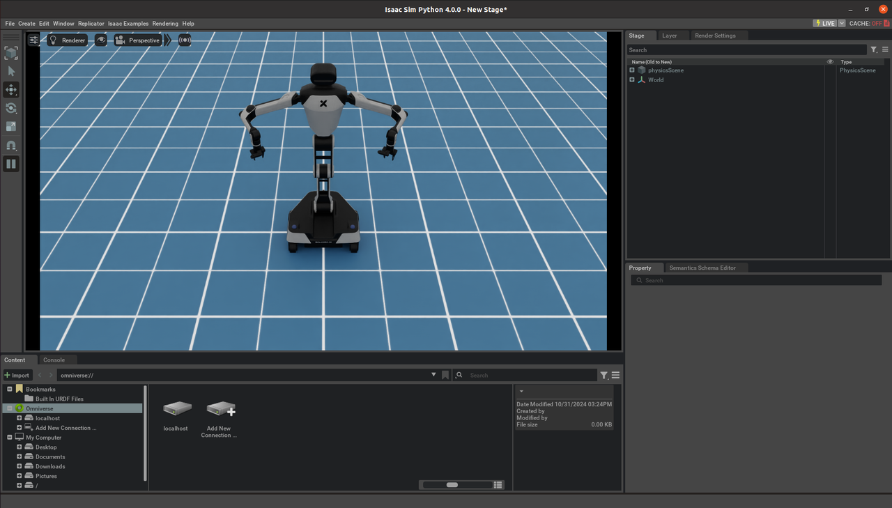
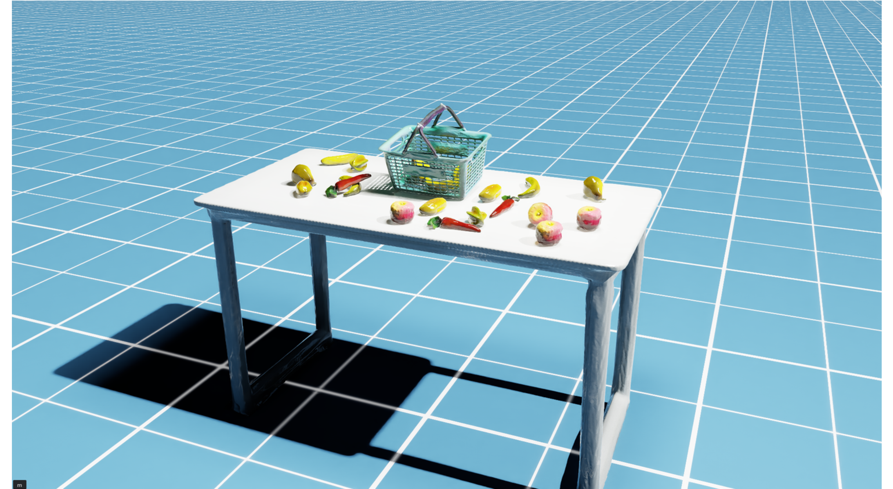
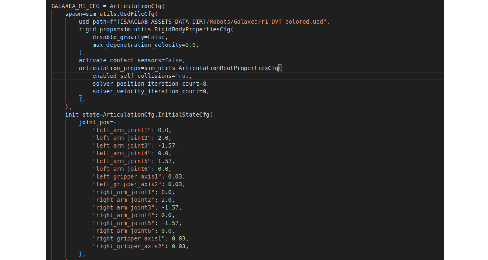

# Simulation_Isaac_Lab 仿真教程


## **开始使用**

**Galaxea Lab**基于**[Isaac Lab](https://isaac-sim.github.io/IsaacLab/main/index.html)** 代码库开发，我们在其基础上打造了一个专属的独立版本，用户可以在其中配置个人的仿真操作环境和操作任务。此外，我们还提供了内部的**Real-to-Sim资产**，包括一个桌面果篮抓取场景（持续更新中）。

通过阅读本用户指南，您将了解到以下信息：

- 如何安装 Galaxea Lab 环境。

- 如何运行抓取水果示例教程。

- 如何定义个人操作任务。

- 不同的3D重建资产（持续更新中...）


## **安装**

安装Galaxea Lab的主要步骤如下：

1. 可以通过[omniverse launcher](https://galaxea.ai/Guide/A1/Simulation_Isaac_Sim_Tutorial/)下载安装最新版本, 或者[pip](https://docs.omniverse.nvidia.com/isaacsim/latest/installation/install_python.html)安装（仅支持GLIBC 2.34+）
2. 安装Galaxea Lab后克隆代码库。
```Bash
git clone https://github.com/userguide-galaxea/galaxea_lab.git
```

3. 后续请参考[IsaacLab Binary Installation Guide](https://isaac-sim.github.io/IsaacLab/main/source/setup/installation/binaries_installation.html#creating-the-isaac-sim-symbolic-link)的教程进行安装。

请注意：

1. 由于Galaxea Lab依赖Isaac Lab代码库，因此无需再次克隆原始的Isaac Lab代码库。
2. 在文件*source/extensions/omni.isaac.lab/omni/isaac/lab/utils/assets.py* 内，所有默认的3D资产都定义在**`NUCLEUS_ASSET_ROOT_DIR`** 变量中。默认情况下，这些资产存储在AWS云上，加载速度较慢，甚至可能无法顺利加载。因此，我们在代码库中提供了一个包含相关资产的最小文件夹，路径为：*<u>isaac-sim-assets-1-4.0.0/Assets/Isaac/4.0/Isaac</u>*。如需自定义开发，您可以按照以下方法下载nv官方提供的3D模型：https://docs.omniverse.nvidia.com/IsaacSim/latest/installation/install_faq.html#assets-pack**（最新说明：由于 Nvidia 的维护，上述链接可能无法打开。不过，您仍然可以正常运行我们教程中的脚本，所有必要的资产已被复制到以下路径：isaac-sim-assets-1-4.0.0/Assets/Isaac/4.0/Isaac）**


下载所有资产后，请将 `NUCLEUS_ASSET_ROOT_DIR `设置为本地路径。

您可以通过运行以下命令来验证安装是否成功：

```Bash
./isaaclab.sh -p source/standalone/galaxea/basic/spawn_robot.py
```

当R1模型成功加载并显示时，即表示安装成功（如下图所示）。




## **示例**

在目录 source/standalone/galaxea/basic 下，我们提供了部分基本示例：

```Bash
# spawn the R1 robot and set random joint positions
./isaaclab.sh -p source/standalone/galaxea/basic/spawn_robot.py

# create a scene consisting of object, table, robot and so on
./isaaclab.sh -p source/standalone/galaxea/basic/creat_scene.py

#start to collected pick and place fruit data via Galaxea R1-DVT robot
./isaaclab.sh -p source/standalone/galaxea/rule_based_policy/collect_demos.py
```

运行最后一行代码后，您将看到如下演示：R1 将开始收集篮子里的水果，同时轨迹数据将以hdf5格式保存。


## **Real-to-Sim 资产**

所有R1的USD资产和水果模型都存储在以下路径：<u>*source/extensions/omni.isaac.lab_assets/data*</u>



###  **R1 URDF**

如需下载R1的URDF文件，请访问我们的开源GitHub社区进行下载[URDF](https://github.com/userguide-galaxea/URDF/tree/galaxea/main/R1/urdf)。


## **任务环境界面**

我们使用**OpenAI Gym**作为基本环境。对于自定义任务，请关注以下关键接口。我们提供了最小可执行的代码片段，帮助您理解任务逻辑。

### **初始化**

```Bash
from omni.isaac.lab_tasks.utils.parse_cfg import parse_env_cfg 

env_cfg = parse_env_cfg(
    task_name = "Isaac-R1-Multi-Fruit-IK-Abs-Direct-v0",
    use_gpu = True,
    num_envs = 1,
    use_fabric = True,
)
```

- **task_name**：定义特定的环境接口，您可以通过以下路径查看：： *<u>source/extensions/omni.isaac.lab_tasks/omni/isaac/lab_tasks/galaxea/direct/lift/init.py</u>*
- **use_gpu**：表示是否使用 GPU 进行模拟。
- **num_envs**：定义并行环境的数量。当值大于1时，将开始并行收集数据。
- **use_fabric**：定义是否使用当前 USD 进行 I/O。默认值为 True。


### **执行动作**

```Bash
obs, reward, terminated, truncated, info = env.step(actions)
```

- **obs**: 代表观察空间中的观察数据，定义在 _get_observations() 函数中，如下所示：

    ```Bash
     obs = {
         "joint_pos": 
         "joint_vel": 
         "left_ee_pose":
         "right_ee_pose": 
         "object_pose": 
         "goal_pose": 
         "last_joints":
         "front_rgb": 
         "front_depth": 
         "left_rgb": 
         "left_depth": 
         "right_rgb": 
         "right_depth"：
     }
    ```

- **actions:**一个16维的 torch 张量。

     - dim0 - dim6：代表左臂末端执行器的姿态，具体为 position_x, position_y, position_z, quaternion_z, quaternion_w, quaternion_x, 和 quaternion_y。

     - dim7：代表左臂夹爪的状态，值为0和1。

     - dim8 - dim14：代表右臂末端执行器的姿态，具体为 position_x, position_y, position_z, quaternion_z, quaternion_w, quaternion_x, 和 quaternion_y。

     - dim15：代表右臂夹爪的状态，值为0和1。

      ```Bash
      actions = torch.tensor([left_ee_pose, left_gripper_state, right_ee_pose, right_gripper_state])##7+1+7+1=16 dim
      ```

  - **terminated:** 一个布尔值，表示任务是否完成。任务完成的标准是胡萝卜成功落入篮子中。 该逻辑在`_get_dones() `函数中被定义。

      ```Bash
      def _get_dones(self) -> tuple[torch.Tensor, torch.Tensor]:
                  reached = self._object_reached_goal()
                  time_out = self.episode_length_buf >= self.max_episode_length - 1
                  return reached, time_out
      ```

- **truncated:**  表示任务是否因超出时间阈值而结束。当前的时间阈值为4秒（即400步，每步=0.01秒）

- **info:** 保存用户希望存储的任何额外信息。当前设置为空字典。


### **最小可执行代码单元**

我们为您提供了一个包含上述所有信息的最小可执行代码单元。您可以在以下路径找到该代码：  *<u>source/standalone/galaxea/basic/simple_env.py</u>* 。

```Bash
"""Script to run an environment with zero action agent."""

"""Launch Isaac Sim Simulator first."""

import argparse

from omni.isaac.lab.app import AppLauncher

# add argparse arguments
parser = argparse.ArgumentParser(description="Zero agent for Isaac Lab environments.")
AppLauncher.add_app_launcher_args(parser)
args_cli = parser.parse_args()

# launch omniverse app
app_launcher = AppLauncher(args_cli)

simulation_app = app_launcher.app

"""Rest everything follows."""

import gymnasium as gym
import torch

import omni.isaac.lab_tasks  # noqa: F401
from omni.isaac.lab_tasks.utils import parse_env_cfg

def main():
    """Zero actions agent with Isaac Lab environment."""
    env_cfg = parse_env_cfg(
        "Isaac-R1-Lift-Bin-IK-Rel-Direct-v0",
        use_gpu= True,
        num_envs= 1,
        use_fabric= True,
    )
    # create environment
    env = gym.make("Isaac-R1-Lift-Bin-IK-Rel-Direct-v0", cfg=env_cfg)

    # print info (this is vectorized environment)
    print(f"[INFO]: Gym observation space: {env.observation_space}")
    print(f"[INFO]: Gym action space: {env.action_space}")
    # reset environment
    env.reset()
    # simulate environment
    while simulation_app.is_running():
        # run everything in inference mode
        with torch.inference_mode():
            # compute zero actions
            actions = torch.zeros(env.action_space.shape, device=env.unwrapped.device)
            if True:
                # sample actions from -1 to 1
                actions = (
                    0.05 * torch.rand(env.action_space.shape, device=env.unwrapped.device)
                )
            # apply actions
            env.step(actions)

    # close the simulator
    env.close()

if __name__ == "__main__":
    # run the main function
    main()
    # close sim app
    simulation_app.close()
```

在运行以下代码后，理想情况下，您将看到如下所示的demo：向R1发送随机的关节命令。

```Bash
./isaaclab.sh -p source/standalone/galaxea/basic/simple_env.py
```


## **自定义任务**

### **自定义机器人**

机器人被设置为 Galaxea Lab 中的 **Articulation** 类。您可以参考以下路径来修改 kp、kd 等相关参数：

<u>*source/extensions/omni.isaac.lab_assets/omni/isaac/lab_assets/galaxea_robots.py*</u>



您可以通过以下脚本设置任务环境：

<u>*source/extensions/omni.isaac.lab_tasks/omni/isaac/lab_tasks/galaxea/direct/lift/lift_env_cfg.py*</u>


### **自定义任务**

您可以通过参考以下脚本来定义新的任务和新的入口点：

*<u>source/extensions/omni.isaac.lab_tasks/omni/isaac/lab_tasks/galaxea/direct/lift/__init__.py</u>*

*<u>source/extensions/omni.isaac.lab_tasks/omni/isaac/lab_tasks/galaxea/direct/lift/pick_fruit_env.py</u>*

```Bash
gym.register(
    id="Isaac-R1-Multi-Fruit-IK-Abs-Direct-v0",
    entry_point="omni.isaac.lab_tasks.galaxea.direct.lift:R1MultiFruitEnv",
    disable_env_checker=True,
    kwargs={
        "env_cfg_entry_point": R1MultiFruitAbsEnvCfg,
    },
)
```

### **自定义观察、动作、奖励等**

您可以通过路径*<u>source/extensions/omni.isaac.lab_tasks/omni/isaac/lab_tasks/galaxea/direct/lift/pick_fruit_env.py</u>*，查看我们如何定义环境的观察、动作、奖励等。以下是相关的代码段：

- **obs:**

```Bash
def _get_observations(self) -> dict:
    obs = {
            # robot joint position: dim=(6+2)*2
            "joint_pos": joint_pos,
            "joint_vel": joint_vel,
            # robot ee pose: dim=7*2
            "left_ee_pose": left_ee_pose,
            "right_ee_pose": right_ee_pose,
            # object pose: dim=7
            "object_pose": object_pose,
            # goal pose: dim=7
            "goal_pose": torch.cat([self.goal_pos, self.goal_rot], dim=-1),
            "last_joints": joint_pos,
            #...
            }
return {"policy": obs}
```

- **action:**

```Bash
def _apply_action(self):
    # set left/right arm/gripper joint position targets
    self._robot.set_joint_position_target(
        self.left_arm_joint_pos_target, self.left_arm_joint_ids
    )
    self._robot.set_joint_position_target(
        self.left_gripper_joint_pos_target, self.left_gripper_joint_ids
    )
    self._robot.set_joint_position_target(
        self.right_arm_joint_pos_target, self.right_arm_joint_ids
    )
    self._robot.set_joint_position_target(
        self.right_gripper_joint_pos_target, self.right_gripper_joint_ids
    )
```

- **reward:**

```Bash
def _get_rewards(self) -> torch.Tensor:
    reward = self._compute_reward()
    return reward
```

- **terminated:**

```Bash
def _get_dones(self) -> tuple[torch.Tensor, torch.Tensor]:
    reached = self._object_reached_goal()
    time_out = self.episode_length_buf >= self.max_episode_length - 1
    return reached, time_out
def _object_reached_goal(self):
    object_curr_pos = self._object[self.object_id].data.root_pos_w[:, :3]
    basket_pos = self._object[3].data.root_pos_w[:, :3]
    reached = self._within_basket(object_curr_pos, basket_pos)
    return reached
```