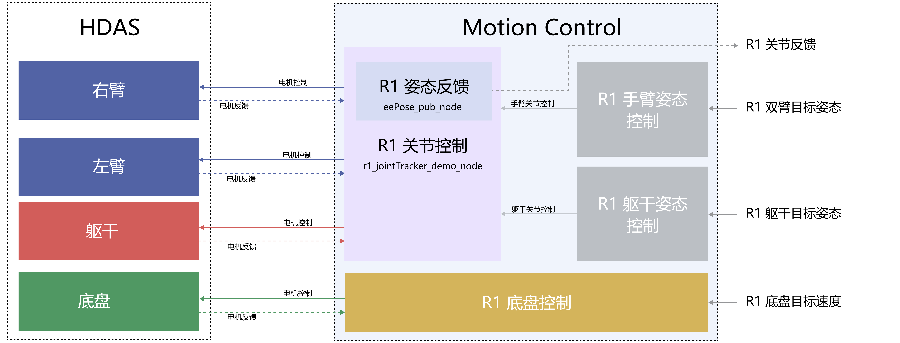

# Galaxea R1软件指南


## **软件依赖**

1. [Ubuntu](https://ubuntu.com/download) 20.04 LTS
2. ROS Noetic


## **安装**

[SDK](https://github.com/userguide-galaxea/R1_SDK) 不需要重新编译。请参考以下内容。


## **首次操作指引**

访问页面  R1_Demo ，并按照说明操作R1。


## **软件接口**

本章描述了 Galaxea R1 的各种控制和状态反馈接口，指导用户如何通过 ROS 软件包与 R1 通信和控制 R1。

### **驱动接口**

当前的Galaxea R1驱动由三个主要部分组成，包括四个独立的ROS节点：底盘、左右臂和躯干的驱动程序。这些驱动程序提供的接口可作为ROS话题，如下所述。

要启动相应的驱动程序，请输入以下命令：

```Bash
cd ~/work/galaxea/install/share/startup_config/script/
./ota_script.sh boot
```

#### 底盘驱动接口

本接口定义了多个话题以报告底盘电机的状态。以下是每个话题及其相关消息类型的详细描述：

<table style="width: 100%; border-collapse: collapse;table-layout: fixed;">
    <thead>
        <tr style="background-color: black; color: white; text-align: left;">
            <th style="width: 300px; padding: 8px; border: 1px solid #ddd;">话题名称</th>
            <th style="width: 300px; padding: 8px; border: 1px solid #ddd;">描述</th>
            <th style="width: 300px; padding: 8px; border: 1px solid #ddd;">消息类型</th>
        </tr>
    </thead>
    <tbody>
        <tr style="background-color: white; text-align: left;">
            <td style="padding: 8px; border: 1px solid #ddd;">/hdas/feedback_chassis</td>
            <td style="padding: 8px; border: 1px solid #ddd;">底盘轮毂和转向电机反馈</td>
            <td style="padding: 8px; border: 1px solid #ddd;">sensor_msgs::JointState</td>
        </tr>
        <tr style="background-color: white; text-align: left;">
            <td style="padding: 8px; border: 1px solid #ddd;">/hdas/feedback_status_chassis</td>
            <td style="padding: 8px; border: 1px solid #ddd;">底盘状态反馈</td>
            <td style="padding: 8px; border: 1px solid #ddd;">hdas_msg::feedback_status</td>
        </tr>
        <tr style="background-color: white; text-align: left;">
            <td style="padding: 8px; border: 1px solid #ddd;">/motion_control/control_chassis</td>
            <td style="padding: 8px; border: 1px solid #ddd;">底盘轮毂和转向电机控制</td>
            <td style="padding: 8px; border: 1px solid #ddd;">hdas_msg::motor_control</td>
        </tr>
    </tbody>
</table>


<table style="width: 100%; border-collapse: collapse;table-layout: fixed;">
    <thead>
        <tr style="background-color: black; color: white; text-align: left;">
            <th style="width: 300px; padding: 8px; border: 1px solid #ddd;">话题名称</th>
            <th style="width: 300px; padding: 8px; border: 1px solid #ddd;">字段</th>
            <th style="width: 300px; padding: 8px; border: 1px solid #ddd;">描述</th>
        </tr>
    </thead>
    <tbody>
        <tr style="background-color: white; text-align: left;">
            <td style="padding: 8px; border: 1px solid #ddd;" rowspan="4">/hdas/feedback_chassis</td>
            <td style="padding: 8px; border: 1px solid #ddd;">header</td>
            <td style="padding: 8px; border: 1px solid #ddd;">标准消息头</td>
        </tr>
        <tr style="background-color: white; text-align: left;">
            <td style="padding: 8px; border: 1px solid #ddd;">position</td>
            <td style="padding: 8px; border: 1px solid #ddd;">[左前轮角度,右前轮角度,后轮角度]</td>
        </tr>
        <tr style="background-color: white; text-align: left;">
            <td style="padding: 8px; border: 1px solid #ddd;">velocity</td>
            <td style="padding: 8px; border: 1px solid #ddd;">[左前轮线速度,右前轮线速度,</br>  后轮线速度, 0.0, 0.0, 0.0]</td>
        </tr>
        <tr style="background-color: white; text-align: left;">
            <td style="padding: 8px; border: 1px solid #ddd;">effort</td>
            <td style="padding: 8px; border: 1px solid #ddd;">[0.0, 0.0, 0.0, 0.0, 0.0, 0.0]</td>
        </tr>
        <tr style="background-color: white; text-align: left;">
            <td style="padding: 8px; border: 1px solid #ddd;" rowspan="3">/hdas/feedback_status_arm_right</td>
            <td style="padding: 8px; border: 1px solid #ddd;">header</td>
            <td style="padding: 8px; border: 1px solid #ddd;">标准消息头</td>
        </tr>
        <tr style="background-color: white; text-align: left;">
            <td style="padding: 8px; border: 1px solid #ddd;">name_id</td>
            <td style="padding: 8px; border: 1px solid #ddd;">关节名称</td>
        </tr>
        <tr style="background-color: white; text-align: left;">
            <td style="padding: 8px; border: 1px solid #ddd;">errors</td>
            <td style="padding: 8px; border: 1px solid #ddd;">包含错误码和对应的错误描述</td>
        </tr>
        <tr style="background-color: white; text-align: left;">
            <td style="padding: 8px; border: 1px solid #ddd;" rowspan="8">/motion_control/control_chassis</td>
            <td style="padding: 8px; border: 1px solid #ddd;">header</td>
            <td style="padding: 8px; border: 1px solid #ddd;">标准消息头</td>
        </tr>
        <tr style="background-color: white; text-align: left;">
            <td style="padding: 8px; border: 1px solid #ddd;">name</td>
            <td style="padding: 8px; border: 1px solid #ddd;">-</td>
        </tr>
        <tr style="background-color: white; text-align: left;">
            <td style="padding: 8px; border: 1px solid #ddd;">p_des</td>
            <td style="padding: 8px; border: 1px solid #ddd;">[左前轮角度, 右前轮角度期望,</br>  后轮角度期望]</td>
        </tr>
        <tr style="background-color: white; text-align: left;">
            <td style="padding: 8px; border: 1px solid #ddd;">v_des</td>
            <td style="padding: 8px; border: 1px solid #ddd;">[左前轮线速度,右前轮线速度, </br> 后轮线速度]</td>
        </tr>
        <tr style="background-color: white; text-align: left;">
            <td style="padding: 8px; border: 1px solid #ddd;">kp</td>
            <td style="padding: 8px; border: 1px solid #ddd;">-</td>
        </tr>
        <tr style="background-color: white; text-align: left;">
            <td style="padding: 8px; border: 1px solid #ddd;">kd</td>
            <td style="padding: 8px; border: 1px solid #ddd;">-</td>
        </tr>
        <tr style="background-color: white; text-align: left;">
            <td style="padding: 8px; border: 1px solid #ddd;">t_ff</td>
            <td style="padding: 8px; border: 1px solid #ddd;">-</td>
        </tr>
        <tr style="background-color: white; text-align: left;">
            <td style="padding: 8px; border: 1px solid #ddd;">mode</td>
            <td style="padding: 8px; border: 1px solid #ddd;">-</td>
        </tr>
    </tbody>
</table>


#### 手臂驱动接口

本接口定义了多个话题来发布和订阅臂的状态、控制命令和相关错误代码。以下是每个话题及其对应消息类型的详细描述：

<table style="width: 100%; border-collapse: collapse;table-layout: fixed;">
    <thead>
        <tr style="background-color: black; color: white; text-align: left;table-layout: fixed;">
            <th style="width: 33%; padding: 8px; border: 1px solid #ddd;">话题名称</th>
            <th style="width: 33%; padding: 8px; border: 1px solid #ddd;">描述</th>
            <th style="width: 33%; padding: 8px; border: 1px solid #ddd;">消息类型</th>
        </tr>
    </thead>
    <tbody>
        <tr style="background-color: white; text-align: left;">
            <td style="padding: 8px; border: 1px solid #ddd;">/hdas/feedback_arm_left</td>
            <td style="padding: 8px; border: 1px solid #ddd;">左臂关节反馈</td>
            <td style="padding: 8px; border: 1px solid #ddd;">sensor_msgs::JointState</td>
        </tr>
        <tr style="background-color: white; text-align: left;">
            <td style="padding: 8px; border: 1px solid #ddd;">/hdas/feedback_arm_right</td>
            <td style="padding: 8px; border: 1px solid #ddd;">右臂关节反馈</td>
            <td style="padding: 8px; border: 1px solid #ddd;">sensor_msgs::JointState</td>
        </tr>
        <tr style="background-color: white; text-align: left;">
            <td style="padding: 8px; border: 1px solid #ddd;">/hdas/feedback_gripper_left</td>
            <td style="padding: 8px; border: 1px solid #ddd;">左夹爪行程</td>
            <td style="padding: 8px; border: 1px solid #ddd;">sensor_msgs::JointState</td>
        </tr>
        <tr style="background-color: white; text-align: left;">
            <td style="padding: 8px; border: 1px solid #ddd;">/hdas/feedback_gripper_right</td>
            <td style="padding: 8px; border: 1px solid #ddd;">右夹爪行程</td>
            <td style="padding: 8px; border: 1px solid #ddd;">sensor_msgs::JointState</td>
        </tr>
        <tr style="background-color: white; text-align: left;">
            <td style="padding: 8px; border: 1px solid #ddd;">/hdas/feedback_status_arm_left</td>
            <td style="padding: 8px; border: 1px solid #ddd;">左臂状态反馈</td>
            <td style="padding: 8px; border: 1px solid #ddd;">hdas_msg::feedback_status</td>
        </tr>
        <tr style="background-color: white; text-align: left;">
            <td style="padding: 8px; border: 1px solid #ddd;">/hdas/feedback_status_arm_right</td>
            <td style="padding: 8px; border: 1px solid #ddd;">右臂状态反馈</td>
            <td style="padding: 8px; border: 1px solid #ddd;">hdas_msg::feedback_status</td>
        </tr>
        <tr style="background-color: white; text-align: left;">
            <td style="padding: 8px; border: 1px solid #ddd;">/hdas/feedback_status_gripper_left</td>
            <td style="padding: 8px; border: 1px solid #ddd;">左夹爪状态反馈</td>
            <td style="padding: 8px; border: 1px solid #ddd;">hdas_msg::feedback_status</td>
        </tr>
        <tr style="background-color: white; text-align: left;">
            <td style="padding: 8px; border: 1px solid #ddd;">/hdas/feedback_status_gripper_right</td>
            <td style="padding: 8px; border: 1px solid #ddd;">右夹爪状态反馈</td>
            <td style="padding: 8px; border: 1px solid #ddd;">hdas_msg::feedback_status</td>
        </tr>
        <tr style="background-color: white; text-align: left;">
            <td style="padding: 8px; border: 1px solid #ddd;">/motion_control/control_arm_left</td>
            <td style="padding: 8px; border: 1px solid #ddd;">左臂电机控制</td>
            <td style="padding: 8px; border: 1px solid #ddd;">hdas_msg::motor_control</td>
        </tr>
        <tr style="background-color: white; text-align: left;">
            <td style="padding: 8px; border: 1px solid #ddd;">/motion_control/control_arm_right</td>
            <td style="padding: 8px; border: 1px solid #ddd;">右臂电机控制</td>
            <td style="padding: 8px; border: 1px solid #ddd;">hdas_msg::motor_control</td>
        </tr>
        <tr style="background-color: white; text-align: left;">
            <td style="padding: 8px; border: 1px solid #ddd;">/motion_control/control_gripper_left</td>
            <td style="padding: 8px; border: 1px solid #ddd;">左夹爪电机控制</td>
            <td style="padding: 8px; border: 1px solid #ddd;">hdas_msg::motor_control</td>
        </tr>
        <tr style="background-color: white; text-align: left;">
            <td style="padding: 8px; border: 1px solid #ddd;">/motion_control/control_gripper_right</td>
            <td style="padding: 8px; border: 1px solid #ddd;">右夹爪电机控制</td>
            <td style="padding: 8px; border: 1px solid #ddd;">hdas_msg::motor_control</td>
        </tr>
        <tr style="background-color: white; text-align: left;">
            <td style="padding: 8px; border: 1px solid #ddd;">/motion_control/position_control_gripper_left</td>
            <td style="padding: 8px; border: 1px solid #ddd;">左夹爪位置控制</td>
            <td style="padding: 8px; border: 1px solid #ddd;">std_msgs::Float32</td>
        </tr>
        <tr style="background-color: white; text-align: left;">
            <td style="padding: 8px; border: 1px solid #ddd;">/motion_control/position_control_gripper_right</td>
            <td style="padding: 8px; border: 1px solid #ddd;">右夹爪位置控制</td>
            <td style="padding: 8px; border: 1px solid #ddd;">std_msgs::Float32</td>
        </tr>
    </tbody>
</table>


<table style="width: 100%; border-collapse: collapse;table-layout: fixed;">
    <thead>
        <tr style="background-color: black; color: white; text-align: left;">
            <th style="width: 33%; padding: 8px; border: 1px solid #ddd;">话题名称</th>
            <th style="width: 33%; padding: 8px; border: 1px solid #ddd;">字段</th>
            <th style="width: 33%; padding: 8px; border: 1px solid #ddd;">描述</th>
        </tr>
    </thead>
    <tbody>
        <tr>
            <td style="padding: 8px; border: 1px solid #ddd;" rowspan="4">/hdas/feedback_arm_left</td>
            <td style="padding: 8px; border: 1px solid #ddd;">header</td>
            <td style="padding: 8px; border: 1px solid #ddd;">标准消息头</td>
        </tr>
        <tr>
            <td style="padding: 8px; border: 1px solid #ddd;">position</td>
            <td style="padding: 8px; border: 1px solid #ddd;">[关节1位置, 关节2位置, 关节3位置, 关节4位置,  关节5位置, 关节6位置, 夹爪关节位置]</td>
        </tr>
        <tr>
            <td style="padding: 8px; border: 1px solid #ddd;">velocity</td>
            <td style="padding: 8px; border: 1px solid #ddd;">[关节1速度, 关节2速度, 关节3速度, 关节4速度, 关节5速度, 关节6速度, 夹爪关节速度]</td>
        </tr>
        <tr>
            <td style="padding: 8px; border: 1px solid #ddd;">effort</td>
            <td style="padding: 8px; border: 1px solid #ddd;">[关节1力矩, 关节2力矩, 关节3力矩, 关节4力矩,关节5力矩, 关节6力矩, 夹爪关节力矩]</td>
        </tr>
        <tr>
            <td style="padding: 8px; border: 1px solid #ddd;" rowspan="4">/hdas/feedback_arm_right</td>
            <td style="padding: 8px; border: 1px solid #ddd;">header</td>
            <td style="padding: 8px; border: 1px solid #ddd;">标准消息头</td>
        </tr>
        <tr>
            <td style="padding: 8px; border: 1px solid #ddd;">position</td>
            <td style="padding: 8px; border: 1px solid #ddd;">[关节1位置, 关节2位置, 关节3位置, 关节4位置, 关节5位置, 关节6位置, 夹爪关节位置]</td>
        </tr>
        <tr>
            <td style="padding: 8px; border: 1px solid #ddd;">velocity</td>
            <td style="padding: 8px; border: 1px solid #ddd;">[关节1速度, 关节2速度, 关节3速度, 关节4速度, 关节5速度, 关节6速度, 夹爪关节速度]</td>
        </tr>
        <tr>
            <td style="padding: 8px; border: 1px solid #ddd;">effort</td>
            <td style="padding: 8px; border: 1px solid #ddd;">[关节1力矩, 关节2力矩, 关节3力矩, 关节4力矩, 关节5力矩, 关节6力矩, 夹爪关节力矩]</td>
        </tr>
        <tr>
            <td style="padding: 8px; border: 1px solid #ddd;" rowspan="4">/hdas/feedback_gripper_left</td>
            <td style="padding: 8px; border: 1px solid #ddd;">header</td>
            <td style="padding: 8px; border: 1px solid #ddd;">标准消息头</td>
        </tr>
        <tr>
            <td style="padding: 8px; border: 1px solid #ddd;">position</td>
            <td style="padding: 8px; border: 1px solid #ddd;">夹爪行程 (0-100mm)</td>
        </tr>
        <tr>
            <td style="padding: 8px; border: 1px solid #ddd;">velocity</td>
            <td style="padding: 8px; border: 1px solid #ddd;">Not used</td>
        </tr>
        <tr>
            <td style="padding: 8px; border: 1px solid #ddd;">effort</td>
            <td style="padding: 8px; border: 1px solid #ddd;">Not used</td>
        </tr>
        <tr>
            <td style="padding: 8px; border: 1px solid #ddd;" rowspan="4">/hdas/feedback_gripper_right</td>
            <td style="padding: 8px; border: 1px solid #ddd;">header</td>
            <td style="padding: 8px; border: 1px solid #ddd;">标准消息头</td>
        </tr>
        <tr>
            <td style="padding: 8px; border: 1px solid #ddd;">position</td>
            <td style="padding: 8px; border: 1px solid #ddd;">[gripper_stroke]</td>
        </tr>
        <tr>
            <td style="padding: 8px; border: 1px solid #ddd;">velocity</td>
            <td style="padding: 8px; border: 1px solid #ddd;">Not used</td>
        </tr>
        <tr>
            <td style="padding: 8px; border: 1px solid #ddd;">effort</td>
            <td style="padding: 8px; border: 1px solid #ddd;">Not used</td>
        </tr>
        <tr>
            <td style="padding: 8px; border: 1px solid #ddd;" rowspan="3">/hdas/feedback_status_arm_left</td>
            <td style="padding: 8px; border: 1px solid #ddd;">header</td>
            <td style="padding: 8px; border: 1px solid #ddd;">标准消息头</td>
        </tr>
        <tr>
            <td style="padding: 8px; border: 1px solid #ddd;">name_id</td>
            <td style="padding: 8px; border: 1px solid #ddd;">关节名称</td>
        </tr>
        <tr>
            <td style="padding: 8px; border: 1px solid #ddd;">errors</td>
            <td style="padding: 8px; border: 1px solid #ddd;">包含错误码和对应的错误描述</td>
        </tr>
        <tr>
            <td style="padding: 8px; border: 1px solid #ddd;" rowspan="3">/hdas/feedback_status_arm_right</td>
            <td style="padding: 8px; border: 1px solid #ddd;">header</td>
            <td style="padding: 8px; border: 1px solid #ddd;">标准消息头</td>
        </tr>
        <tr>
            <td style="padding: 8px; border: 1px solid #ddd;">name_id</td>
            <td style="padding: 8px; border: 1px solid #ddd;">关节名称</td>
        </tr>
        <tr>
            <td style="padding: 8px; border: 1px solid #ddd;">errors</td>
            <td style="padding: 8px; border: 1px solid #ddd;">包含错误码和对应的错误描述</td>
        </tr>
        <tr>
            <td rowspan="3" style="padding: 8px; border: 1px solid #ddd;">/hdas/feedback_status_gripper_left</td>
            <td style="padding: 8px; border: 1px solid #ddd;">header</td>
            <td style="padding: 8px; border: 1px solid #ddd;">标准消息头</td>
        </tr>
        <tr>
            <td style="padding: 8px; border: 1px solid #ddd;">name_id</td>
            <td style="padding: 8px; border: 1px solid #ddd;">关节名称</td>
        </tr>
        <tr>
            <td style="padding: 8px; border: 1px solid #ddd;">errors</td>
            <td style="padding: 8px; border: 1px solid #ddd;">包含错误码和对应的错误描述</td>
        </tr>
        <tr>
            <td rowspan="3" style="padding: 8px; border: 1px solid #ddd;">/hdas/feedback_status_gripper_right</td>
            <td style="padding: 8px; border: 1px solid #ddd;">header</td>
            <td style="padding: 8px; border: 1px solid #ddd;">标准消息头</td>
        </tr>
        <tr>
            <td style="padding: 8px; border: 1px solid #ddd;">name_id</td>
            <td style="padding: 8px; border: 1px solid #ddd;">关节名称</td>
        </tr>
        <tr>
            <td style="padding: 8px; border: 1px solid #ddd;">errors</td>
            <td style="padding: 8px; border: 1px solid #ddd;">包含错误码和对应的错误描述</td>
        </tr>
        <tr>
            <td rowspan="8" style="padding: 8px; border: 1px solid #ddd;">/motion_control/control_arm_left</td>
            <td style="padding: 8px; border: 1px solid #ddd;">header</td>
            <td style="padding: 8px; border: 1px solid #ddd;">标准消息头</td>
        </tr>
        <tr>
            <td style="padding: 8px; border: 1px solid #ddd;">name</td>
            <td style="padding: 8px; border: 1px solid #ddd;">-</td>
        </tr>
        <tr>
            <td style="padding: 8px; border: 1px solid #ddd;">p_des</td>
            <td style="padding: 8px; border: 1px solid #ddd;">[关节1位置, 关节2位置, 关节3位置, 关节4位置, 关节5位置, 关节6位置, 夹爪关节位置]</td>
        </tr>
        <tr>
            <td style="padding: 8px; border: 1px solid #ddd;">v_des</td>
            <td style="padding: 8px; border: 1px solid #ddd;">[关节1速度, 关节2速度, 关节3速度, 关节4速度, 关节5速度, 关节6速度, 夹爪关节速度]</td>
        </tr>
        <tr>
            <td style="padding: 8px; border: 1px solid #ddd;">kp</td>
            <td style="padding: 8px; border: 1px solid #ddd;">[关节1kp, 关节2kp, 关节3kp, 关节4kp, 关节5kp, 关节6kp, 夹爪关节kp]</td>
        </tr>
        <tr>
            <td style="padding: 8px; border: 1px solid #ddd;">kd</td>
            <td style="padding: 8px; border: 1px solid #ddd;">[关节1kd, 关节2kd, 关节3kd, 关节4kd, 关节5kd, 关节6kd, 夹爪关节kd]</td>
        </tr>
        <tr>
            <td style="padding: 8px; border: 1px solid #ddd;">t_ff</td>
            <td style="padding: 8px; border: 1px solid #ddd;">[关节1力矩, 关节2力矩, 关节3力矩, 关节4力矩, 关节5力矩, 关节6力矩, 夹爪关节力矩]</td>
        </tr>
        <tr>
            <td style="padding: 8px; border: 1px solid #ddd;">mode</td>
            <td style="padding: 8px; border: 1px solid #ddd;">-</td>
        </tr>
        <tr>
            <td rowspan="8" style="padding: 8px; border: 1px solid #ddd;">/motion_control/control_arm_right</td>
            <td style="padding: 8px; border: 1px solid #ddd;">header</td>
            <td style="padding: 8px; border: 1px solid #ddd;">标准消息头</td>
        </tr>
        <tr>
            <td style="padding: 8px; border: 1px solid #ddd;">name</td>
            <td style="padding: 8px; border: 1px solid #ddd;">-</td>
        </tr>
        <tr>
            <td style="padding: 8px; border: 1px solid #ddd;">p_des</td>
            <td style="padding: 8px; border: 1px solid #ddd;">[关节1位置, 关节2位置, 关节3位置, 关节4位置,关节5位置, 关节6位置, 夹爪关节位置]</td>
        </tr>
        <tr>
            <td style="padding: 8px; border: 1px solid #ddd;">v_des</td>
            <td style="padding: 8px; border: 1px solid #ddd;">[关节1速度, 关节2速度, 关节3速度, 关节4速度,关节5速度, 关节6速度, 夹爪关节速度]</td>
        </tr>
        <tr>
            <td style="padding: 8px; border: 1px solid #ddd;">kp</td>
            <td style="padding: 8px; border: 1px solid #ddd;">[关节1kp, 关节2kp, 关节3kp, 关节4kp, 关节5kp, 关节6kp, 夹爪关节kp]</td>
        </tr>
        <tr>
            <td style="padding: 8px; border: 1px solid #ddd;">kd</td>
            <td style="padding: 8px; border: 1px solid #ddd;">[关节1kd, 关节2kd, 关节3kd, 关节4kd, 关节5kd, 关节6kd, 夹爪关节kd]</td>
        </tr>
        <tr>
            <td style="padding: 8px; border: 1px solid #ddd;">t_ff</td>
            <td style="padding: 8px; border: 1px solid #ddd;">[关节1力矩, 关节2力矩, 关节3力矩, 关节4力矩, 关节5力矩, 关节6力矩, 夹爪关节力矩]</td>
        </tr>
        <tr>
            <td style="padding: 8px; border: 1px solid #ddd;">mode</td>
            <td style="padding: 8px; border: 1px solid #ddd;">-</td>
        </tr>
        <tr>
            <td rowspan="8" style="padding: 8px; border: 1px solid #ddd;">/motion_control/control_gripper_left</td>
            <td style="padding: 8px; border: 1px solid #ddd;">header</td>
            <td style="padding: 8px; border: 1px solid #ddd;">标准消息头</td>
        </tr>
        <tr>
            <td style="padding: 8px; border: 1px solid #ddd;">name</td>
            <td style="padding: 8px; border: 1px solid #ddd;">-</td>
        </tr>
        <tr>
            <td style="padding: 8px; border: 1px solid #ddd;">p_des</td>
            <td style="padding: 8px; border: 1px solid #ddd;">[夹爪电机位置]</td>
        </tr>
        <tr>
            <td style="padding: 8px; border: 1px solid #ddd;">v_des</td>
            <td style="padding: 8px; border: 1px solid #ddd;">[夹爪电机速度]</td>
        </tr>
        <tr>
            <td style="padding: 8px; border: 1px solid #ddd;">kp</td>
            <td style="padding: 8px; border: 1px solid #ddd;">[夹爪电机kp]</td>
        </tr>
        <tr>
            <td style="padding: 8px; border: 1px solid #ddd;">kd</td>
            <td style="padding: 8px; border: 1px solid #ddd;">[夹爪电机kd]</td>
        </tr>
        <tr>
            <td style="padding: 8px; border: 1px solid #ddd;">t_ff</td>
            <td style="padding: 8px; border: 1px solid #ddd;">[夹爪电机力矩]</td>
        </tr>
        <tr>
            <td style="padding: 8px; border: 1px solid #ddd;">mode</td>
            <td style="padding: 8px; border: 1px solid #ddd;">-</td>
        </tr>
        <tr>
            <td rowspan="8" style="padding: 8px; border: 1px solid #ddd;">/motion_control/control_gripper_right</td>
            <td style="padding: 8px; border: 1px solid #ddd;">header</td>
            <td style="padding: 8px; border: 1px solid #ddd;">标准消息头</td>
        </tr>
        <tr>
            <td style="padding: 8px; border: 1px solid #ddd;">name</td>
            <td style="padding: 8px; border: 1px solid #ddd;">-</td>
        </tr>
        <tr>
            <td style="padding: 8px; border: 1px solid #ddd;">p_des</td>
            <td style="padding: 8px; border: 1px solid #ddd;">[夹爪电机位置]</td>
        </tr>
        <tr>
            <td style="padding: 8px; border: 1px solid #ddd;">v_des</td>
            <td style="padding: 8px; border: 1px solid #ddd;">[夹爪电机速度]</td>
        </tr>
        <tr>
            <td style="padding: 8px; border: 1px solid #ddd;">kp</td>
            <td style="padding: 8px; border: 1px solid #ddd;">[夹爪电机kp]</td>
        </tr>
        <tr>
            <td style="padding: 8px; border: 1px solid #ddd;">kd</td>
            <td style="padding: 8px; border: 1px solid #ddd;">[夹爪电机kd]</td>
        </tr>
        <tr>
            <td style="padding: 8px; border: 1px solid #ddd;">t_ff</td>
            <td style="padding: 8px; border: 1px solid #ddd;">[夹爪电机力矩]</td>
        </tr>
        <tr>
            <td style="padding: 8px; border: 1px solid #ddd;">mode</td>
            <td style="padding: 8px; border: 1px solid #ddd;">-</td>
        </tr>
         <tr>
            <td rowspan="2" style="padding: 8px; border: 1px solid #ddd;">/motion_control/position_control_gripper_left</td>
            <td style="padding: 8px; border: 1px solid #ddd;">header</td>
            <td style="padding: 8px; border: 1px solid #ddd;">标准消息头</td>
        </tr>
        <tr>
            <td style="padding: 8px; border: 1px solid #ddd;">data</td>
            <td style="padding: 8px; border: 1px solid #ddd;">夹爪行程 (0-100mm)</td>
        </tr>
        <tr>
            <td rowspan="2" style="padding: 8px; border: 1px solid #ddd;">/motion_control/position_control_gripper_right</td>
            <td style="padding: 8px; border: 1px solid #ddd;">header</td>
            <td style="padding: 8px; border: 1px solid #ddd;">标准消息头</td>
        </tr>
        <tr>
            <td style="padding: 8px; border: 1px solid #ddd;">data</td>
            <td style="padding: 8px; border: 1px solid #ddd;">夹爪行程 (0-100mm)</td>
        </tr>
    </tbody>
</table>


#### 躯干驱动接口

本接口定义了多个话题，用于发布和订阅躯干电机的状态和控制命令。以下是每个话题及其对应消息类型的详细描述：

<table style="width: 100%; border-collapse: collapse;table-layout: fixed;">
    <thead>
        <tr style="background-color: black; color: white; text-align: left;">
            <th style="width: 33%; padding: 8px; border: 1px solid #ddd;">话题名称</th>
            <th style="width: 33%; padding: 8px; border: 1px solid #ddd;">描述</th>
            <th style="width: 33%; padding: 8px; border: 1px solid #ddd;">消息类型</th>
        </tr>
    </thead>
    <tbody>
        <tr style="background-color: white; text-align: left;">
            <td style="padding: 8px; border: 1px solid #ddd;">/hdas/feedback_torso</td>
            <td style="padding: 8px; border: 1px solid #ddd;">躯干关节反馈</td>
            <td style="padding: 8px; border: 1px solid #ddd;">sensor_msgs/JointState</td>
        </tr>
        <tr style="background-color: white; text-align: left;">
            <td style="padding: 8px; border: 1px solid #ddd;">/hdas/feedback_status_torso</td>
            <td style="padding: 8px; border: 1px solid #ddd;">躯干状态反馈</td>
            <td style="padding: 8px; border: 1px solid #ddd;">hdas_msg::feedback_status</td>
        </tr>
        <tr style="background-color: white; text-align: left;">
            <td style="padding: 8px; border: 1px solid #ddd;">/motion_control/control_torso</td>
            <td style="padding: 8px; border: 1px solid #ddd;">躯干电机控制</td>
            <td style="padding: 8px; border: 1px solid #ddd;">hdas_msg::motor_control</td>
        </tr>
    </tbody>
</table>


<table style="width: 100%; border-collapse: collapse;table-layout: fixed;">
    <thead>
        <tr style="background-color: black; color: white; text-align: left;">
            <th style="width: 33%; padding: 8px; border: 1px solid #ddd;">话题名称</th>
            <th style="width: 33%; padding: 8px; border: 1px solid #ddd;">字段</th>
            <th style="width: 33%; padding: 8px; border: 1px solid #ddd;">描述</th>
        </tr>
    </thead>
    <tbody>
        <tr style="background-color: white; text-align: left;">
            <td style="padding: 8px; border: 1px solid #ddd;" rowspan="4">/hdas/feedback_torso</td>
            <td style="padding: 8px; border: 1px solid #ddd;">header</td>
            <td style="padding: 8px; border: 1px solid #ddd;">标准消息头</td>
        </tr>
        <tr style="background-color: white; text-align: left;">
            <td style="padding: 8px; border: 1px solid #ddd;">position</td>
            <td style="padding: 8px; border: 1px solid #ddd;">[关节1位置, 关节2位置, 关节3位置, 关节4位置]</td>
        </tr>
        <tr style="background-color: white; text-align: left;">
            <td style="padding: 8px; border: 1px solid #ddd;">velocity</td>
            <td style="padding: 8px; border: 1px solid #ddd;">[关节1速度, 关节2速度, 关节3速度, 关节4速度]</td>
        </tr>
        <tr style="background-color: white; text-align: left;">
            <td style="padding: 8px; border: 1px solid #ddd;">effort</td>
            <td style="padding: 8px; border: 1px solid #ddd;">[关节1力矩, 关节2力矩, 关节3力矩, 关节4力矩]</td>
        </tr>
        <tr style="background-color: white; text-align: left;">
            <td style="padding: 8px; border: 1px solid #ddd;" rowspan="3">/hdas/feedback_status_torso</td>
            <td style="padding: 8px; border: 1px solid #ddd;">header</td>
            <td style="padding: 8px; border: 1px solid #ddd;">标准消息头</td>
        </tr>
        <tr style="background-color: white; text-align: left;">
            <td style="padding: 8px; border: 1px solid #ddd;">name_id</td>
            <td style="padding: 8px; border: 1px solid #ddd;">关节名称</td>
        </tr>
        <tr style="background-color: white; text-align: left;">
            <td style="padding: 8px; border: 1px solid #ddd;">errors</td>
            <td style="padding: 8px; border: 1px solid #ddd;">包含错误码和对应的错误描述</td>
        </tr>
        <tr style="background-color: white; text-align: left;">
            <td style="padding: 8px; border: 1px solid #ddd;" rowspan="8">/motion_control/control_torso</td>
            <td style="padding: 8px; border: 1px solid #ddd;">header</td>
            <td style="padding: 8px; border: 1px solid #ddd;">标准消息头</td>
        </tr>
        <tr style="background-color: white; text-align: left;">
            <td style="padding: 8px; border: 1px solid #ddd;">name</td>
            <td style="padding: 8px; border: 1px solid #ddd;">-</td>
        </tr>
        <tr style="background-color: white; text-align: left;">
            <td style="padding: 8px; border: 1px solid #ddd;">p_des</td>
            <td style="padding: 8px; border: 1px solid #ddd;">[关节1位置, 关节2位置, 关节3位置, 关节4位置]</td>
        </tr>
        <tr style="background-color: white; text-align: left;">
            <td style="padding: 8px; border: 1px solid #ddd;">v_des</td>
            <td style="padding: 8px; border: 1px solid #ddd;">[关节1速度, 关节2速度, 关节3速度, 关节4速度]</td>
        </tr>
        <tr style="background-color: white; text-align: left;">
            <td style="padding: 8px; border: 1px solid #ddd;">kp</td>
            <td style="padding: 8px; border: 1px solid #ddd;">[关节1kp, 关节2kp, 关节3kp, 关节4kp]</td>
        </tr>
        <tr style="background-color: white; text-align: left;">
            <td style="padding: 8px; border: 1px solid #ddd;">kd</td>
            <td style="padding: 8px; border: 1px solid #ddd;">[关节1kd, 关节2kd, 关节3kd, 关节4kd]</td>
        </tr>
        <tr style="background-color: white; text-align: left;">
            <td style="padding: 8px; border: 1px solid #ddd;">t_ff</td>
            <td style="padding: 8px; border: 1px solid #ddd;">[关节1力矩, 关节2力矩, 关节3力矩, 关节4力矩]</td>
        </tr>
        <tr style="background-color: white; text-align: left;">
            <td style="padding: 8px; border: 1px solid #ddd;">mode</td>
            <td style="padding: 8px; border: 1px solid #ddd;">-</td>
        </tr>
    </tbody>
</table>


#### 相机接口

<table style="width: 100%; border-collapse: collapse;table-layout: fixed;">
    <thead>
        <tr style="background-color: black; color: white; text-align: left;">
            <th style="width: 33%; padding: 8px; border: 1px solid #ddd;">话题名称</th>
            <th style="width: 33%; padding: 8px; border: 1px solid #ddd;">描述</th>
            <th style="width: 33%; padding: 8px; border: 1px solid #ddd;">消息类型</th>
        </tr>
    </thead>
    <tbody>
        <tr style="background-color: white; text-align: left;">
            <td style="padding: 8px; border: 1px solid #ddd;">/hdas/camera_chassis_front_left/rgb/compressed</td>
            <td style="padding: 8px; border: 1px solid #ddd;">底盘左前相机RGB压缩图</td>
            <td style="padding: 8px; border: 1px solid #ddd;">sensor_msgs::CompressedImage</td>
        </tr>
        <tr style="background-color: white; text-align: left;">
            <td style="padding: 8px; border: 1px solid #ddd;">/hdas/camera_chassis_front_right/rgb/compressed</td>
            <td style="padding: 8px; border: 1px solid #ddd;">底盘右前相机RGB压缩图</td>
            <td style="padding: 8px; border: 1px solid #ddd;">sensor_msgs::CompressedImage</td>
        </tr>
        <tr style="background-color: white; text-align: left;">
            <td style="padding: 8px; border: 1px solid #ddd;">/hdas/camera_chassis_left/rgb/compressed</td>
            <td style="padding: 8px; border: 1px solid #ddd;">底盘左相机RGB压缩图</td>
            <td style="padding: 8px; border: 1px solid #ddd;">sensor_msgs::CompressedImage</td>
        </tr>
        <tr style="background-color: white; text-align: left;">
            <td style="padding: 8px; border: 1px solid #ddd;">/hdas/camera_chassis_right/rgb/compressed</td>
            <td style="padding: 8px; border: 1px solid #ddd;">底盘右相机RGB压缩图</td>
            <td style="padding: 8px; border: 1px solid #ddd;">sensor_msgs::CompressedImage</td>
        </tr>
        <tr style="background-color: white; text-align: left;">
            <td style="padding: 8px; border: 1px solid #ddd;">/hdas/camera_chassis_rear/rgb/compressed</td>
            <td style="padding: 8px; border: 1px solid #ddd;">底盘后相机RGB压缩图</td>
            <td style="padding: 8px; border: 1px solid #ddd;">sensor_msgs::CompressedImage</td>
        </tr>
        <tr style="background-color: white; text-align: left;">
            <td style="padding: 8px; border: 1px solid #ddd;">/hdas/camera_wrist_left/color/image_raw/compressed</td>
            <td style="padding: 8px; border: 1px solid #ddd;">左腕相机RGB压缩图（如存在）</td>
            <td style="padding: 8px; border: 1px solid #ddd;">sensor_msgs::CompressedImage</td>
        </tr>
        <tr style="background-color: white; text-align: left;">
            <td style="padding: 8px; border: 1px solid #ddd;">/hdas/camera_wrist_right/color/image_raw/compressed</td>
            <td style="padding: 8px; border: 1px solid #ddd;">右腕相机RGB压缩图（如存在）</td>
            <td style="padding: 8px; border: 1px solid #ddd;">sensor_msgs::CompressedImage</td>
        </tr>
        <tr style="background-color: white; text-align: left;">
            <td style="padding: 8px; border: 1px solid #ddd;">/hdas/camera_head/left_raw/image_raw_color/compressed</td>
            <td style="padding: 8px; border: 1px solid #ddd;">头部相机RGB压缩图（如存在）</td>
            <td style="padding: 8px; border: 1px solid #ddd;">sensor_msgs::CompressedImage</td>
        </tr>
        <tr style="background-color: white; text-align: left;">
            <td style="padding: 8px; border: 1px solid #ddd;">/hdas/camera_wrist_left/aligned_depth_to_color/image_raw</td>
            <td style="padding: 8px; border: 1px solid #ddd;">左腕相机深度图（如存在）</td>
            <td style="padding: 8px; border: 1px solid #ddd;">sensor_msgs::Image</td>
        </tr>
        <tr style="background-color: white; text-align: left;">
            <td style="padding: 8px; border: 1px solid #ddd;">/hdas/camera_wrist_right/aligned_depth_to_color/image_raw</td>
            <td style="padding: 8px; border: 1px solid #ddd;">右腕相机深度图（如存在）</td>
            <td style="padding: 8px; border: 1px solid #ddd;">sensor_msgs::Image</td>
        </tr>
        <tr style="background-color: white; text-align: left;">
            <td style="padding: 8px; border: 1px solid #ddd;">/hdas/camera_head/depth/depth_registered</td>
            <td style="padding: 8px; border: 1px solid #ddd;">头部相机深度图（如存在）</td>
            <td style="padding: 8px; border: 1px solid #ddd;">sensor_msgs::Image</td>
        </tr>
    </tbody>
</table>


<table style="width: 100%; border-collapse: collapse;table-layout: fixed;">
    <thead>
        <tr style="background-color: black; color: white; text-align: left;">
            <th style="width: 33%; padding: 8px; border: 1px solid #ddd;">话题名称</th>
            <th style="width: 33%; padding: 8px; border: 1px solid #ddd;">字段</th>
            <th style="width: 33%; padding: 8px; border: 1px solid #ddd;">描述</th>
        </tr>
    </thead>
    <tbody>
        <tr style="background-color: white; text-align: left;">
            <td style="padding: 8px; border: 1px solid #ddd;" rowspan="3">/hdas/camera_chassis_front_left/rgb/compressed</td>
            <td style="padding: 8px; border: 1px solid #ddd;">header</td>
            <td style="padding: 8px; border: 1px solid #ddd;">标准消息头</td>
        </tr>
        <tr style="background-color: white; text-align: left;">
            <td style="padding: 8px; border: 1px solid #ddd;">format</td>
            <td style="padding: 8px; border: 1px solid #ddd;">JPEG格式</td>
        </tr>
        <tr style="background-color: white; text-align: left;">
            <td style="padding: 8px; border: 1px solid #ddd;">data</td>
            <td style="padding: 8px; border: 1px solid #ddd;">图像数据</td>
        </tr>
         <tr style="background-color: white; text-align: left;">
            <td style="padding: 8px; border: 1px solid #ddd;" rowspan="3">/hdas/camera_chassis_front_right/rgb/compressed</td>
            <td style="padding: 8px; border: 1px solid #ddd;">header</td>
            <td style="padding: 8px; border: 1px solid #ddd;">标准消息头</td>
        </tr>
        <tr style="background-color: white; text-align: left;">
            <td style="padding: 8px; border: 1px solid #ddd;">format</td>
            <td style="padding: 8px; border: 1px solid #ddd;">JPEG格式</td>
        </tr>
        <tr style="background-color: white; text-align: left;">
            <td style="padding: 8px; border: 1px solid #ddd;">data</td>
            <td style="padding: 8px; border: 1px solid #ddd;">图像数据</td>
        </tr>
       	 <tr style="background-color: white; text-align: left;">
            <td style="padding: 8px; border: 1px solid #ddd;" rowspan="3">/hdas/camera_chassis_left/rgb/compressed</td>
            <td style="padding: 8px; border: 1px solid #ddd;">header</td>
            <td style="padding: 8px; border: 1px solid #ddd;">标准消息头</td>
        </tr>
        <tr style="background-color: white; text-align: left;">
            <td style="padding: 8px; border: 1px solid #ddd;">format</td>
            <td style="padding: 8px; border: 1px solid #ddd;">JPEG格式</td>
        </tr>
        <tr style="background-color: white; text-align: left;">
            <td style="padding: 8px; border: 1px solid #ddd;">data</td>
            <td style="padding: 8px; border: 1px solid #ddd;">图像数据</td>
        </tr>
        	<tr style="background-color: white; text-align: left;">
            <td style="padding: 8px; border: 1px solid #ddd;" rowspan="3">/hdas/camera_chassis_right/rgb/compressed</td>
            <td style="padding: 8px; border: 1px solid #ddd;">header</td>
            <td style="padding: 8px; border: 1px solid #ddd;">标准消息头</td>
        </tr>
        <tr style="background-color: white; text-align: left;">
            <td style="padding: 8px; border: 1px solid #ddd;">format</td>
            <td style="padding: 8px; border: 1px solid #ddd;">JPEG格式</td>
        </tr>
        <tr style="background-color: white; text-align: left;">
            <td style="padding: 8px; border: 1px solid #ddd;">data</td>
            <td style="padding: 8px; border: 1px solid #ddd;">图像数据</td>
        </tr>
        </tr>
        	<tr style="background-color: white; text-align: left;">
            <td style="padding: 8px; border: 1px solid #ddd;" rowspan="3">/hdas/camera_chassis_rear/rgb/compressed</td>
            <td style="padding: 8px; border: 1px solid #ddd;">header</td>
            <td style="padding: 8px; border: 1px solid #ddd;">标准消息头</td>
        </tr>
        <tr style="background-color: white; text-align: left;">
            <td style="padding: 8px; border: 1px solid #ddd;">format</td>
            <td style="padding: 8px; border: 1px solid #ddd;">JPEG格式</td>
        </tr>
        <tr style="background-color: white; text-align: left;">
            <td style="padding: 8px; border: 1px solid #ddd;">data</td>
            <td style="padding: 8px; border: 1px solid #ddd;">图像数据</td>
        </tr>
        <!-- ... -->
        <tr style="background-color: white; text-align: left;">
            <td style="padding: 8px; border: 1px solid #ddd;" rowspan="3">/hdas/camera_wrist_left/color/image_raw/compressed</td>
            <td style="padding: 8px; border: 1px solid #ddd;">header</td>
            <td style="padding: 8px; border: 1px solid #ddd;">标准消息头</td>
        </tr>
        <tr style="background-color: white; text-align: left;">
            <td style="padding: 8px; border: 1px solid #ddd;">format</td>
            <td style="padding: 8px; border: 1px solid #ddd;">JPEG格式</td>
        </tr>
        <tr style="background-color: white; text-align: left;">
            <td style="padding: 8px; border: 1px solid #ddd;">data</td>
            <td style="padding: 8px; border: 1px solid #ddd;">图像数据</td>
        </tr>
        <tr style="background-color: white; text-align: left;">
            <td style="padding: 8px; border: 1px solid #ddd;" rowspan="3">/hdas/camera_wrist_right/color/image_raw/compressed</td>
            <td style="padding: 8px; border: 1px solid #ddd;">header</td>
            <td style="padding: 8px; border: 1px solid #ddd;">标准消息头</td>
        </tr>
        <tr style="background-color: white; text-align: left;">
            <td style="padding: 8px; border: 1px solid #ddd;">format</td>
            <td style="padding: 8px; border: 1px solid #ddd;">JPEG格式</td>
        </tr>
        <tr style="background-color: white; text-align: left;">
            <td style="padding: 8px; border: 1px solid #ddd;">data</td>
            <td style="padding: 8px; border: 1px solid #ddd;">图像数据</td>
        </tr>
<tr style="background-color: white; text-align: left;">
            <td style="padding: 8px; border: 1px solid #ddd;" rowspan="3">/hdas/camera_head/left_raw/image_raw_color/compressed</td>
            <td style="padding: 8px; border: 1px solid #ddd;">header</td>
            <td style="padding: 8px; border: 1px solid #ddd;">标准消息头</td>
        </tr>
        <tr style="background-color: white; text-align: left;">
            <td style="padding: 8px; border: 1px solid #ddd;">format</td>
            <td style="padding: 8px; border: 1px solid #ddd;">JPEG格式</td>
        </tr>
        <tr style="background-color: white; text-align: left;">
            <td style="padding: 8px; border: 1px solid #ddd;">data</td>
            <td style="padding: 8px; border: 1px solid #ddd;">图像数据</td>
        </tr>
        <tr style="background-color: white; text-align: left;">
            <td style="padding: 8px; border: 1px solid #ddd;" rowspan="7">/hdas/camera_wrist_left/aligned_depth_to_color/image_raw</td>
            <td style="padding: 8px; border: 1px solid #ddd;">header</td>
            <td style="padding: 8px; border: 1px solid #ddd;">标准消息头</td>
        </tr>
        <tr style="background-color: white; text-align: left;">
            <td style="padding: 8px; border: 1px solid #ddd;">height</td>
            <td style="padding: 8px; border: 1px solid #ddd;">取决于设置</td>
        </tr>
        <tr style="background-color: white; text-align: left;">
            <td style="padding: 8px; border: 1px solid #ddd;">width</td>
            <td style="padding: 8px; border: 1px solid #ddd;">取决于设置</td>
        </tr>
        <tr style="background-color: white; text-align: left;">
            <td style="padding: 8px; border: 1px solid #ddd;">encoding</td>
            <td style="padding: 8px; border: 1px solid #ddd;">16UC1</td>
        </tr>
        <tr style="background-color: white; text-align: left;">
            <td style="padding: 8px; border: 1px solid #ddd;">is_bigendian</td>
            <td style="padding: 8px; border: 1px solid #ddd;">0</td>
        </tr>
        <tr style="background-color: white; text-align: left;">
            <td style="padding: 8px; border: 1px solid #ddd;">step</td>
            <td style="padding: 8px; border: 1px solid #ddd;">取决于设置</td>
        </tr>
        <tr style="background-color: white; text-align: left;">
            <td style="padding: 8px; border: 1px solid #ddd;">data</td>
            <td style="padding: 8px; border: 1px solid #ddd;">图像数据</td>
        </tr>
         <tr style="background-color: white; text-align: left;">
            <td style="padding: 8px; border: 1px solid #ddd;" rowspan="7">/hdas/camera_wrist_right/aligned_depth_to_color/image_raw</td>
            <td style="padding: 8px; border: 1px solid #ddd;">header</td>
            <td style="padding: 8px; border: 1px solid #ddd;">标准消息头</td>
        </tr>
        <tr style="background-color: white; text-align: left;">
            <td style="padding: 8px; border: 1px solid #ddd;">height</td>
            <td style="padding: 8px; border: 1px solid #ddd;">取决于设置</td>
        </tr>
        <tr style="background-color: white; text-align: left;">
            <td style="padding: 8px; border: 1px solid #ddd;">width</td>
            <td style="padding: 8px; border: 1px solid #ddd;">取决于设置</td>
        </tr>
        <tr style="background-color: white; text-align: left;">
            <td style="padding: 8px; border: 1px solid #ddd;">encoding</td>
            <td style="padding: 8px; border: 1px solid #ddd;">16UC1</td>
        </tr>
        <tr style="background-color: white; text-align: left;">
            <td style="padding: 8px; border: 1px solid #ddd;">is_bigendian</td>
            <td style="padding: 8px; border: 1px solid #ddd;">0</td>
        </tr>
        <tr style="background-color: white; text-align: left;">
            <td style="padding: 8px; border: 1px solid #ddd;">step</td>
            <td style="padding: 8px; border: 1px solid #ddd;">取决于设置</td>
        </tr>
        <tr style="background-color: white; text-align: left;">
            <td style="padding: 8px; border: 1px solid #ddd;">data</td>
            <td style="padding: 8px; border: 1px solid #ddd;">图像数据</td>
        </tr>
        <!-- Repeat the above structure for the other depth cameras -->
        <!-- ... -->
        <tr style="background-color: white; text-align: left;">
            <td style="padding: 8px; border: 1px solid #ddd;" rowspan="7">/hdas/camera_head/depth/depth_registered</td>
            <td style="padding: 8px; border: 1px solid #ddd;">header</td>
            <td style="padding: 8px; border: 1px solid #ddd;">标准消息头</td>
        </tr>
        <tr style="background-color: white; text-align: left;">
            <td style="padding: 8px; border: 1px solid #ddd;">height</td>
            <td style="padding: 8px; border: 1px solid #ddd;">取决于设置</td>
        </tr>
        <tr style="background-color: white; text-align: left;">
            <td style="padding: 8px; border: 1px solid #ddd;">width</td>
            <td style="padding: 8px; border: 1px solid #ddd;">取决于设置</td>
        </tr>
        <tr style="background-color: white; text-align: left;">
            <td style="padding: 8px; border: 1px solid #ddd;">encoding</td>
            <td style="padding: 8px; border: 1px solid #ddd;">32FC1</td>
        </tr>
        <tr style="background-color: white; text-align: left;">
            <td style="padding: 8px; border: 1px solid #ddd;">is_bigendian</td>
            <td style="padding: 8px; border: 1px solid #ddd;">0</td>
        </tr>
        <tr style="background-color: white; text-align: left;">
            <td style="padding: 8px; border: 1px solid #ddd;">step</td>
            <td style="padding: 8px; border: 1px solid #ddd;">取决于设置</td>
        </tr>
        <tr style="background-color: white; text-align: left;">
            <td style="padding: 8px; border: 1px solid #ddd;">data</td>
            <td style="padding: 8px; border: 1px solid #ddd;">图像数据</td>
        </tr>
    </tbody>
</table>


#### 激光雷达接口

<table style="width: 100%; border-collapse: collapse;">
    <thead>
        <tr style="background-color: black; color: white; text-align: left;">
            <th style="width: 300px; padding: 8px; border: 1px solid #ddd;">话题名称</th>
            <th style="width: 300px; padding: 8px; border: 1px solid #ddd;">描述</th>
            <th style="width: 300px; padding: 8px; border: 1px solid #ddd;">消息类型</th>
        </tr>
    </thead>
    <tbody>
        <tr style="background-color: white; text-align: left;">
            <td style="padding: 8px; border: 1px solid #ddd;">/hdas/lidar_chassis_left</td>
            <td style="padding: 8px; border: 1px solid #ddd;">雷达点云</td>
            <td style="padding: 8px; border: 1px solid #ddd;">sensor_msgs::PointCloud2</td>
        </tr>
    </tbody>
</table>


<table style="width: 100%; border-collapse: collapse;">
    <thead>
        <tr style="background-color: black; color: white; text-align: left;">
            <th style="width: 300px; padding: 8px; border: 1px solid #ddd;">话题名称</th>
            <th style="width: 300px; padding: 8px; border: 1px solid #ddd;">字段</th>
            <th style="width: 300px; padding: 8px; border: 1px solid #ddd;">描述</th>
        </tr>
    </thead>
    <tbody>
        <tr style="background-color: white; text-align: left;">
            <td style="padding: 8px; border: 1px solid #ddd;"rowspan="2">/hdas/lidar_chassis_left</td>
            <td style="padding: 8px; border: 1px solid #ddd;">header</td>
            <td style="padding: 8px; border: 1px solid #ddd;">标准消息头</td>
        </tr>
         <tr style="background-color: white; text-align: left;">
            <td style="padding: 8px; border: 1px solid #ddd;">fields</td>
            <td style="padding: 8px; border: 1px solid #ddd;">雷达数据</td>
        </tr>
    </tbody>
</table>


#### IMU 接口

<table style="width: 100%; border-collapse: collapse;">
    <thead>
        <tr style="background-color: black; color: white; text-align: left;">
            <th style="width: 300px; padding: 8px; border: 1px solid #ddd;">话题名称</th>
            <th style="width: 300px; padding: 8px; border: 1px solid #ddd;">描述</th>
            <th style="width: 300px; padding: 8px; border: 1px solid #ddd;">消息类型</th>
        </tr>
    </thead>
    <tbody>
        <tr style="background-color: white; text-align: left;">
            <td style="padding: 8px; border: 1px solid #ddd;">/hdas/imu_chassis</td>
            <td style="padding: 8px; border: 1px solid #ddd;">底盘IMU反馈</td>
            <td style="padding: 8px; border: 1px solid #ddd;">sensor_msgs::Imu</td>
        </tr>
        <tr style="background-color: white; text-align: left;">
            <td style="padding: 8px; border: 1px solid #ddd;">/hdas/imu_torso</td>
            <td style="padding: 8px; border: 1px solid #ddd;">躯干IMU反馈</td>
            <td style="padding: 8px; border: 1px solid #ddd;">sensor_msgs::Imu</td>
        </tr>
    </tbody>
</table>


<table style="width: 100%; border-collapse: collapse;">
    <thead>
        <tr style="background-color: black; color: white; text-align: left;">
            <th style="width: 300px; padding: 8px; border: 1px solid #ddd;">话题名称</th>
            <th style="width: 300px; padding: 8px; border: 1px solid #ddd;">字段</th>
            <th style="width: 300px; padding: 8px; border: 1px solid #ddd;">描述</th>
        </tr>
    </thead>
    <tbody>
        <tr style="background-color: white; text-align: left;">
            <td style="padding: 8px; border: 1px solid #ddd;" rowspan="11">/hdas/imu_chassis</td>
            <td style="padding: 8px; border: 1px solid #ddd;">header</td>
            <td style="padding: 8px; border: 1px solid #ddd;">标准消息头</td>
        </tr>
        <tr style="background-color: white; text-align: left;">
            <td style="padding: 8px; border: 1px solid #ddd;">orientation.x</td>
            <td style="padding: 8px; border: 1px solid #ddd;">四元数 x</td>
        </tr>
        <tr style="background-color: white; text-align: left;">
            <td style="padding: 8px; border: 1px solid #ddd;">orientation.y</td>
            <td style="padding: 8px; border: 1px solid #ddd;">四元数 y</td>
        </tr>
        <tr style="background-color: white; text-align: left;">
            <td style="padding: 8px; border: 1px solid #ddd;">orientation.z</td>
            <td style="padding: 8px; border: 1px solid #ddd;">四元数 z</td>
        </tr>
        <tr style="background-color: white; text-align: left;">
            <td style="padding: 8px; border: 1px solid #ddd;">orientation.w</td>
            <td style="padding: 8px; border: 1px solid #ddd;">四元数 w</td>
        </tr>
        <tr style="background-color: white; text-align: left;">
            <td style="padding: 8px; border: 1px solid #ddd;">angular_velocity.x</td>
            <td style="padding: 8px; border: 1px solid #ddd;">陀螺仪角速度 x</td>
        </tr>
        <tr style="background-color: white; text-align: left;">
            <td style="padding: 8px; border: 1px solid #ddd;">angular_velocity.y</td>
            <td style="padding: 8px; border: 1px solid #ddd;">陀螺仪角速度 y</td>
        </tr>
        <tr style="background-color: white; text-align: left;">
            <td style="padding: 8px; border: 1px solid #ddd;">angular_velocity.z</td>
            <td style="padding: 8px; border: 1px solid #ddd;">陀螺仪角速度 z</td>
        </tr>
        <tr style="background-color: white; text-align: left;">
            <td style="padding: 8px; border: 1px solid #ddd;">linear_acceleration.x</td>
            <td style="padding: 8px; border: 1px solid #ddd;">线加速度 x</td>
        </tr>
        <tr style="background-color: white; text-align: left;">
            <td style="padding: 8px; border: 1px solid #ddd;">linear_acceleration.y</td>
            <td style="padding: 8px; border: 1px solid #ddd;">线加速度 y</td>
        </tr>
        <tr style="background-color: white; text-align: left;">
            <td style="padding: 8px; border: 1px solid #ddd;">linear_acceleration.z</td>
            <td style="padding: 8px; border: 1px solid #ddd;">线加速度 z</td>
        </tr>
        <!-- Repeat the structure for /hdas/imu_torso -->
        <tr style="background-color: white; text-align: left;">
            <td style="padding: 8px; border: 1px solid #ddd;" rowspan="11">/hdas/imu_torso</td>
            <td style="padding: 8px; border: 1px solid #ddd;">header</td>
            <td style="padding: 8px; border: 1px solid #ddd;">标准消息头</td>
        </tr>
        <tr style="background-color: white; text-align: left;">
            <td style="padding: 8px; border: 1px solid #ddd;">orientation.x</td>
            <td style="padding: 8px; border: 1px solid #ddd;">四元数 x</td>
        </tr>
        <tr style="background-color: white; text-align: left;">
            <td style="padding: 8px; border: 1px solid #ddd;">orientation.y</td>
            <td style="padding: 8px; border: 1px solid #ddd;">四元数 y</td>
        </tr>
        <tr style="background-color: white; text-align: left;">
            <td style="padding: 8px; border: 1px solid #ddd;">orientation.z</td>
            <td style="padding: 8px; border: 1px solid #ddd;">四元数 z</td>
        </tr>
        <tr style="background-color: white; text-align: left;">
            <td style="padding: 8px; border: 1px solid #ddd;">orientation.w</td>
            <td style="padding: 8px; border: 1px solid #ddd;">四元数 w</td>
        </tr>
        <tr style="background-color: white; text-align: left;">
            <td style="padding: 8px; border: 1px solid #ddd;">angular_velocity.x</td>
            <td style="padding: 8px; border: 1px solid #ddd;">陀螺仪角速度x</td>
        </tr>
        <tr style="background-color: white; text-align: left;">
            <td style="padding: 8px; border: 1px solid #ddd;">angular_velocity.y</td>
            <td style="padding: 8px; border: 1px solid #ddd;">陀螺仪角速度y</td>
        </tr>
        <tr style="background-color: white; text-align: left;">
            <td style="padding: 8px; border: 1px solid #ddd;">angular_velocity.z</td>
            <td style="padding: 8px; border: 1px solid #ddd;">陀螺仪角速度 z</td>
        </tr>
        <tr style="background-color: white; text-align: left;">
            <td style="padding: 8px; border: 1px solid #ddd;">linear_acceleration.x</td>
            <td style="padding: 8px; border: 1px solid #ddd;">线加速度 x</td>
        </tr>
        <tr style="background-color: white; text-align: left;">
            <td style="padding: 8px; border: 1px solid #ddd;">linear_acceleration.y</td>
            <td style="padding: 8px; border: 1px solid #ddd;">线加速度 y</td>
        </tr>
        <tr style="background-color: white; text-align: left;">
            <td style="padding: 8px; border: 1px solid #ddd;">linear_acceleration.z</td>
            <td style="padding: 8px; border: 1px solid #ddd;">线加速度 z</td>
        </tr>
    </tbody>
</table>


#### BMS 接口

<table style="width: 100%; border-collapse: collapse;">
    <thead>
        <tr style="background-color: black; color: white; text-align: left;">
            <th style="width: 300px; padding: 8px; border: 1px solid #ddd;">话题名称</th>
            <th style="width: 300px; padding: 8px; border: 1px solid #ddd;">描述</th>
            <th style="width: 300px; padding: 8px; border: 1px solid #ddd;">消息类型</th>
        </tr>
    </thead>
    <tbody>
        <tr style="background-color: white; text-align: left;">
            <td style="padding: 8px; border: 1px solid #ddd;">/hdas/bms</td>
            <td style="padding: 8px; border: 1px solid #ddd;">电池BMS信息</td>
            <td style="padding: 8px; border: 1px solid #ddd;">hdas_msg::bms</td>
        </tr>
    </tbody>
</table>
<table style="width: 100%; border-collapse: collapse;">
    <thead>
        <tr style="background-color: black; color: white; text-align: left;">
            <th style="width: 300px; padding: 8px; border: 1px solid #ddd;">话题名称</th>
            <th style="width: 300px; padding: 8px; border: 1px solid #ddd;">字段</th>
            <th style="width: 300px; padding: 8px; border: 1px solid #ddd;">描述</th>
        </tr>
    </thead>
    <tbody>
        <tr style="background-color: white; text-align: left;">
            <td style="padding: 8px; border: 1px solid #ddd;" rowspan="4">/hdas/bms</td>
            <td style="padding: 8px; border: 1px solid #ddd;">header</td>
            <td style="padding: 8px; border: 1px solid #ddd;">标准消息头</td>
        </tr>
        <tr style="background-color: white; text-align: left;">
            <td style="padding: 8px; border: 1px solid #ddd;">voltage</td>
            <td style="padding: 8px; border: 1px solid #ddd;">电压(V)</td>
        </tr>
        <tr style="background-color: white; text-align: left;">
            <td style="padding: 8px; border: 1px solid #ddd;">current</td>
            <td style="padding: 8px; border: 1px solid #ddd;">电流(A)</td>
        </tr>
        <tr style="background-color: white; text-align: left;">
            <td style="padding: 8px; border: 1px solid #ddd;">capital</td>
            <td style="padding: 8px; border: 1px solid #ddd;">电量剩余 (%)</td>
        </tr>
    </tbody>
</table>


#### 遥控器接口

<table style="width: 100%; border-collapse: collapse;">
    <thead>
        <tr style="background-color: black; color: white; text-align: left;">
            <th style="width: 300px; padding: 8px; border: 1px solid #ddd;">话题名称</th>
            <th style="width: 300px; padding: 8px; border: 1px solid #ddd;">描述</th>
            <th style="width: 300px; padding: 8px; border: 1px solid #ddd;">消息类型</th>
        </tr>
    </thead>
    <tbody>
        <tr style="background-color: white; text-align: left;">
            <td style="padding: 8px; border: 1px solid #ddd;">/hdas/controller</td>
            <td style="padding: 8px; border: 1px solid #ddd;">遥控器信号</td>
            <td style="padding: 8px; border: 1px solid #ddd;">hdas_msg::controller_signal_stamped</td>
        </tr>
    </tbody>
</table>


<table style="width: 100%; border-collapse: collapse;">
    <thead>
        <tr style="background-color: black; color: white; text-align: left;">
            <th style="width: 300px; padding: 8px; border: 1px solid #ddd;">话题名称</th>
            <th style="width: 300px; padding: 8px; border: 1px solid #ddd;">字段</th>
            <th style="width: 300px; padding: 8px; border: 1px solid #ddd;">描述</th>
        </tr>
    </thead>
    <tbody>
        <tr style="background-color: white; text-align: left;">
            <td style="padding: 8px; border: 1px solid #ddd;" rowspan="6">/hdas/controller</td>
            <td style="padding: 8px; border: 1px solid #ddd;">header</td>
            <td style="padding: 8px; border: 1px solid #ddd;">标准消息头</td>
        </tr>
        <tr style="background-color: white; text-align: left;">
            <td style="padding: 8px; border: 1px solid #ddd;">data.left_x_axis</td>
            <td style="padding: 8px; border: 1px solid #ddd;">左摇杆x方向</td>
        </tr>
        <tr style="background-color: white; text-align: left;">
            <td style="padding: 8px; border: 1px solid #ddd;">data.left_y_axis</td>
            <td style="padding: 8px; border: 1px solid #ddd;">左摇杆y方向</td>
        </tr>
        <tr style="background-color: white; text-align: left;">
            <td style="padding: 8px; border: 1px solid #ddd;">data.right_x_axis</td>
            <td style="padding: 8px; border: 1px solid #ddd;">右摇杆x方向</td>
        </tr>
         <tr style="background-color: white; text-align: left;">
            <td style="padding: 8px; border: 1px solid #ddd;">data.right_y_axis</td>
            <td style="padding: 8px; border: 1px solid #ddd;">	右摇杆y方向</td>
        </tr>
        <tr style="background-color: white; text-align: left;">
            <td style="padding: 8px; border: 1px solid #ddd;">mode</td>
            <td style="padding: 8px; border: 1px solid #ddd;">2: 遥控器控制底盘 </br>
5: 遥控器控制底盘</td>
        </tr>
    </tbody>
</table>


### **控制接口**

当前Galaxea R1的控制由五个主要部分组成：R1姿态反馈 (R1 Pose Feedback) 、R1关节控制 (R1 Joint Control) 、R1底盘控制 (R1 Chassis Control) 、R1手臂姿态控制 (R1 Arm Pose Control) 和R1躯干姿态控制 ( R1 Torso Pose Control) ，如下图所示。整个软件包被简称为“mobiman”,表示移动操作。



#### **R1 底盘控制**

R1底盘控制是一个使用矢量控制来控制R1底盘的节点，它允许您同时发送三个方向的速度命令：x、y 和w。这个节点可以通过命令来启动。

```Plain
roslaunch mobiman r1_chassis_control.launch
```

这个启动文件将启动两个节点：chassis_control_node 和 r1_control_manager。`chassis_control_node `负责R1底盘的速度控制。其接口如下所示：

<table style="width: 100%; border-collapse: collapse;">
    <thead>
        <tr style="background-color: black; color: white; text-align: left;">
            <th style="width: 300px; padding: 8px; border: 1px solid #ddd;">话题名称</th>
            <th style="width: 300px; padding: 8px; border: 1px solid #ddd;">描述</th>
            <th style="width: 300px; padding: 8px; border: 1px solid #ddd;">消息类型</th>
        </tr>
    </thead>
    <tbody>
        <tr style="background-color: white; text-align: left;">
            <td style="padding: 8px; border: 1px solid #ddd;">/motion_target/target_speed_chassis</td>
            <td style="padding: 8px; border: 1px solid #ddd;">底盘的目标速度，包括vx, vy and omega.</td>
            <td style="padding: 8px; border: 1px solid #ddd;">geometry_msgs::Twist</td>
        </tr>
        <tr style="background-color: white; text-align: left;">
            <td style="padding: 8px; border: 1px solid #ddd;">/motion_target/chassis_acc_limit</td>
            <td style="padding: 8px; border: 1px solid #ddd;">底盘的加速度限制，最大值分别为2.5, 1.0, 1.0</td>
            <td style="padding: 8px; border: 1px solid #ddd;">geometry_msgs::Twist</td>
        </tr>
        <tr style="background-color: white; text-align: left;">
            <td style="padding: 8px; border: 1px solid #ddd;">/motion_target/brake_mode</td>
            <td style="padding: 8px; border: 1px solid #ddd;">发出底盘是否进入制动模式的指令。如果处于制动模式，当速度为0 时，底盘将通过将车轮转动一定角度来锁定自身。</td>
            <td style="padding: 8px; border: 1px solid #ddd;">std_msgs::Bool</td>
        </tr>
        <tr style="background-color: white; text-align: left;">
            <td style="padding: 8px; border: 1px solid #ddd;">/hdas/feedback_chassis</td>
            <td style="padding: 8px; border: 1px solid #ddd;">请参考底盘驱动接口</td>
            <td style="padding: 8px; border: 1px solid #ddd;">sensor_msgs::JointState</td>
        </tr>
        <tr style="background-color: white; text-align: left;">
            <td style="padding: 8px; border: 1px solid #ddd;">/motion_control/control_chassis</td>
            <td style="padding: 8px; border: 1px solid #ddd;">请参考底盘驱动接口</td>
            <td style="padding: 8px; border: 1px solid #ddd;">hdas_msg::motor_control</td>
        </tr>
    </tbody>
</table>


<table style="width: 100%; border-collapse: collapse;">
    <thead>
        <tr style="background-color: black; color: white; text-align: left;">
            <th style="width: 300px; padding: 8px; border: 1px solid #ddd;">话题名称</th>
            <th style="width: 200px; padding: 8px; border: 1px solid #ddd;">字段</th>
            <th style="width: 400px; padding: 8px; border: 1px solid #ddd;">描述</th>
        </tr>
    </thead>
    <tbody>
        <tr style="background-color: white; text-align: left;">
            <td style="padding: 8px; border: 1px solid #ddd;" rowspan="6">/motion_target/target_speed_chassis</td>
            <td style="padding: 8px; border: 1px solid #ddd;">header</td>
            <td style="padding: 8px; border: 1px solid #ddd;">标准消息头</td>
        </tr>
        <tr style="background-color: white; text-align: left;">
            <td style="padding: 8px; border: 1px solid #ddd;">linear</td>
            <td style="padding: 8px; border: 1px solid #ddd;">线速度</td>
        </tr>
        <tr style="background-color: white; text-align: left;">
            <td style="padding: 8px; border: 1px solid #ddd;">.x</td>
            <td style="padding: 8px; border: 1px solid #ddd;">线速度 x, 范围 (-1.5 to 1.5) m/s</td>
        </tr>
        <tr style="background-color: white; text-align: left;">
            <td style="padding: 8px; border: 1px solid #ddd;">.y</td>
            <td style="padding: 8px; border: 1px solid #ddd;">线速度 y, 范围 (-1.5 to 1.5) m/s</td>
        </tr>
        <tr style="background-color: white; text-align: left;">
            <td style="padding: 8px; border: 1px solid #ddd;">angular</td>
            <td style="padding: 8px; border: 1px solid #ddd;">角速度</td>
        </tr>
        <tr style="background-color: white; text-align: left;">
            <td style="padding: 8px; border: 1px solid #ddd;">.z</td>
            <td style="padding: 8px; border: 1px solid #ddd;">角速度，范围（-3 - 3） rad/s</td>
        </tr>
        <tr style="background-color: white; text-align: left;">
            <td style="padding: 8px; border: 1px solid #ddd;" rowspan="6">/motion_target/chassis_acc_limit</td>
            <td style="padding: 8px; border: 1px solid #ddd;">header</td>
            <td style="padding: 8px; border: 1px solid #ddd;">标准消息头</td>
        </tr>
        <tr style="background-color: white; text-align: left;">
            <td style="padding: 8px; border: 1px solid #ddd;">linear</td>
            <td style="padding: 8px; border: 1px solid #ddd;">线速度</td>
        </tr>
        <tr style="background-color: white; text-align: left;">
            <td style="padding: 8px; border: 1px solid #ddd;">.x</td>
            <td style="padding: 8px; border: 1px solid #ddd;">加速度限制 x, 范围 (-2.5 to 2.5) m/s^2</td>
        </tr>
        <tr style="background-color: white; text-align: left;">
            <td style="padding: 8px; border: 1px solid #ddd;">.y</td>
            <td style="padding: 8px; border: 1px solid #ddd;">加速度限制 y, 范围 (-1.0 to 1.0) m/s^2</td>
        </tr>
        <tr style="background-color: white; text-align: left;">
            <td style="padding: 8px; border: 1px solid #ddd;">angular</td>
            <td style="padding: 8px; border: 1px solid #ddd;">角速度</td>
        </tr>
        <tr style="background-color: white; text-align: left;">
            <td style="padding: 8px; border: 1px solid #ddd;">.z</td>
            <td style="padding: 8px; border: 1px solid #ddd;">角速度限制，范围 (-3 - 3) rad/s^2</td>
        </tr>
        <tr style="background-color: white; text-align: left;">
            <td style="padding: 8px; border: 1px solid #ddd;">/motion_target/brake_mode</td>
            <td style="padding: 8px; border: 1px solid #ddd;">data</td>
            <td style="padding: 8px; border: 1px solid #ddd;">布尔值，</br>
进入刹车模式：True</br>
退出刹车模式：False</td>
        </tr>
        <tr style="background-color: white; text-align: left;">
            <td style="padding: 8px; border: 1px solid #ddd;">/hdas/feedback_chassis</td>
            <td style="padding: 8px; border: 1px solid #ddd;">-</td>
            <td style="padding: 8px; border: 1px solid #ddd;">请参考底盘驱动接口</td>
        </tr>
        <tr style="background-color: white; text-align: left;">
            <td style="padding: 8px; border: 1px solid #ddd;">/motion_control/control_chassis</td>
            <td style="padding: 8px; border: 1px solid #ddd;">-</td>
            <td style="padding: 8px; border: 1px solid #ddd;">请参考底盘驱动接口</td>
        </tr>
    </tbody>
</table>


#### R1关节控制

R1底盘控制节点负责控制R1躯干和手臂的每个关节，总共有16个关节。它可以通过命令启动。

```Plain
source ~/work/galaxea/install/setup.bash
roslaunch mobiman r1_jointTrackerdemo.launchch
```

这个启动文件将启动机器人状态发布器、`eepose_pub_node`和`r1_jointTracker_demo_node`。机器人状态发布器是一个ROS提供的工具，它基于`/joint_states`发布tf数据给RVIZ。`r1_jointTracker_demo_node`是负责控制每个关节的主要节点。

`r1_jointTracker_demo_node`的接口如下所示。

<table style="width: 100%; border-collapse: collapse;table-layout: fixed;">
    <thead>
        <tr style="background-color: black; color: white; text-align: left;">
            <th style="width: 33%; padding: 8px; border: 1px solid #ddd;">话题名称</th>
            <th style="width: 33%; padding: 8px; border: 1px solid #ddd;">描述</th>
            <th style="width: 33%; padding: 8px; border: 1px solid #ddd;">消息类型</th>
        </tr>
    </thead>
    <tbody>
        <tr style="background-color: white; text-align: left;">
            <td style="padding: 8px; border: 1px solid #ddd;">/motion_target/target_joint_state_arm_left</td>
            <td style="padding: 8px; border: 1px solid #ddd;">左臂各关节的目标位置</td>
            <td style="padding: 8px; border: 1px solid #ddd;">Sensor_msgs::JointState</td>
        </tr>
        <tr style="background-color: white; text-align: left;">
            <td style="padding: 8px; border: 1px solid #ddd;">/motion_target/target_joint_state_arm_right</td>
            <td style="padding: 8px; border: 1px solid #ddd;">右臂各关节的目标位置</td>
            <td style="padding: 8px; border: 1px solid #ddd;">Sensor_msgs::JointState</td>
        </tr>
        <tr style="background-color: white; text-align: left;">
            <td style="padding: 8px; border: 1px solid #ddd;">/motion_target/target_joint_state_torso</td>
            <td style="padding: 8px; border: 1px solid #ddd;">躯干各关节目标位置</td>
            <td style="padding: 8px; border: 1px solid #ddd;">Sensor_msgs::JointState</td>
        </tr>
        <tr style="background-color: white; text-align: left;">
            <td style="padding: 8px; border: 1px solid #ddd;">/hdas/feedback_arm_left</td>
            <td style="padding: 8px; border: 1px solid #ddd;">请参考手臂驱动接口</td>
            <td style="padding: 8px; border: 1px solid #ddd;">Sensor_msgs::JointState</td>
        </tr>
        <tr style="background-color: white; text-align: left;">
            <td style="padding: 8px; border: 1px solid #ddd;">/hdas/feedback_arm_right</td>
            <td style="padding: 8px; border: 1px solid #ddd;">请参考手臂驱动接口</td>
            <td style="padding: 8px; border: 1px solid #ddd;">Sensor_msgs::JointState</td>
        </tr>
        <tr style="background-color: white; text-align: left;">
            <td style="padding: 8px; border: 1px solid #ddd;">/hdas/feedback_torso</td>
            <td style="padding: 8px; border: 1px solid #ddd;">请参考躯干驱动接口</td>
            <td style="padding: 8px; border: 1px solid #ddd;">Sensor_msgs::JointState</td>
        </tr>
        <tr style="background-color: white; text-align: left;">
            <td style="padding: 8px; border: 1px solid #ddd;">/motion_control/control_arm_left</td>
            <td style="padding: 8px; border: 1px solid #ddd;">请参考手臂驱动接口</td>
            <td style="padding: 8px; border: 1px solid #ddd;">hdas_msg::motor_control</td>
        </tr>
        <tr style="background-color: white; text-align: left;">
            <td style="padding: 8px; border: 1px solid #ddd;">/motion_control/control_arm_right</td>
            <td style="padding: 8px; border: 1px solid #ddd;">请参考手臂驱动接口</td>
            <td style="padding: 8px; border: 1px solid #ddd;">hdas_msg::motor_control</td>
        </tr>
        <tr style="background-color: white; text-align: left;">
            <td style="padding: 8px; border: 1px solid #ddd;">/motion_control/control_torso</td>
            <td style="padding: 8px; border: 1px solid #ddd;">请参考躯干驱动接口</td>
            <td style="padding: 8px; border: 1px solid #ddd;">hdas_msg::motor_control</td>
        </tr>
    </tbody>
</table>


<table style="width: 100%; border-collapse: collapse;table-layout: fixed;">
    <thead>
        <tr style="background-color: black; color: white; text-align: left;">
            <th style="width: 33%; padding: 8px; border: 1px solid #ddd;">话题名称</th>
            <th style="width: 33%; padding: 8px; border: 1px solid #ddd;">字段</th>
            <th style="width: 33%; padding: 8px; border: 1px solid #ddd;">描述</th>
        </tr>
    </thead>
    <tbody>
        <tr style="background-color: white; text-align: left;">
            <td style="padding: 8px; border: 1px solid #ddd;" rowspan="2">/motion_target/target_joint_state_arm_left<br>/motion_target/target_joint_state_arm_right</td>
            <td style="padding: 8px; border: 1px solid #ddd;">position</td>
            <td style="padding: 8px; border: 1px solid #ddd;">是一个包含六个元素的向量，代表每个关节的六个目标位置。</td>
        </tr>
        <tr style="background-color: white; text-align: left;">
            <td style="padding: 8px; border: 1px solid #ddd;">velocity</td>
            <td style="padding: 8px; border: 1px solid #ddd;">这是一个包含六个元素的向量，代表每个关节在运动过程中的最大速度。最大速度如下：{3, 3, 3, 5, 5, 5}。 加速度和加加速度限制设置为速度限制的1.5倍。</td>
        </tr>
        <tr style="background-color: white; text-align: left;">
            <td style="padding: 8px; border: 1px solid #ddd;" rowspan="2">/motion_target/target_joint_state_torso</td>
            <td style="padding: 8px; border: 1px solid #ddd;">position</td>
            <td style="padding: 8px; border: 1px solid #ddd;">这是一个包含四个元素的向量，代表每个关节的四个目标位置。</td>
        </tr>
        <tr style="background-color: white; text-align: left;">
            <td style="padding: 8px; border: 1px solid #ddd;">velocity</td>
            <td style="padding: 8px; border: 1px solid #ddd;">这是一个包含四个元素的向量，代表每个关节在运动过程中的速度。最大速度如下：{1.5, 1.5, 1.5, 1.5}。
加速度和加加速度限制设置为速度限制的1.5倍。</td>
        </tr>
        <tr style="background-color: white; text-align: left;">
            <td style="padding: 8px; border: 1px solid #ddd;">/hdas/feedback_arm_left</td>
            <td style="padding: 8px; border: 1px solid #ddd;">-</td>
            <td style="padding: 8px; border: 1px solid #ddd;">请参考手臂驱动接口</td>
        </tr>
        <tr style="background-color: white; text-align: left;">
            <td style="padding: 8px; border: 1px solid #ddd;">/hdas/feedback_arm_right</td>
            <td style="padding: 8px; border: 1px solid #ddd;">-</td>
            <td style="padding: 8px; border: 1px solid #ddd;">请参考手臂驱动接口</td>
        </tr>
        <tr style="background-color: white; text-align: left;">
            <td style="padding: 8px; border: 1px solid #ddd;">/hdas/feedback_torso</td>
            <td style="padding: 8px; border: 1px solid #ddd;">-</td>
            <td style="padding: 8px; border: 1px solid #ddd;">请参考躯干驱动接口</td>
        </tr>
        <tr style="background-color: white; text-align: left;">
            <td style="padding: 8px; border: 1px solid #ddd;">/motion_control/control_arm_left</td>
            <td style="padding: 8px; border: 1px solid #ddd;">-</td>
            <td style="padding: 8px; border: 1px solid #ddd;">请参考手臂驱动接口</td>
        </tr>
        <tr style="background-color: white; text-align: left;">
            <td style="padding: 8px; border: 1px solid #ddd;">/motion_control/control_arm_right</td>
            <td style="padding: 8px; border: 1px solid #ddd;">-</td>
            <td style="padding: 8px; border: 1px solid #ddd;">请参考手臂驱动接口</td>
        </tr>
        <tr style="background-color: white; text-align: left;">
            <td style="padding: 8px; border: 1px solid #ddd;">/motion_control/control_torso</td>
            <td style="padding: 8px; border: 1px solid #ddd;">-</td>
            <td style="padding: 8px; border: 1px solid #ddd;">请参考躯干驱动接口</td>
        </tr>
    </tbody>
</table>


`eepose_pub_node`定义了三个坐标帧：基座链接帧 the base link frame（左），浮动基座帧 the floating base frame（中），和末端执行器姿态帧 the end-effector (ee) pose frame（右）。


<table style="width: 100%; border-collapse: collapse;table-layout: fixed;">
    <thead>
        <tr style="background-color: black; color: white; text-align: left;">
            <th style="padding: 8px; border: 1px solid #ddd;">话题名称</th>
            <th style="padding: 8px; border: 1px solid #ddd;">描述</th>
            <th style="padding: 8px; border: 1px solid #ddd;">消息类型</th>
        </tr>
    </thead>
    <tbody>
        <tr>
            <td style="padding: 8px; border: 1px solid #ddd;">/motion_control/pose_ee_arm_left</td>
            <td style="padding: 8px; border: 1px solid #ddd;">从浮动基座变换到左端执行器姿态</td>
            <td style="padding: 8px; border: 1px solid #ddd;">geometry_msgs::PoseStamped</td>
        </tr>
        <tr>
            <td style="padding: 8px; border: 1px solid #ddd;">/motion_control/pose_ee_arm_right</td>
            <td style="padding: 8px; border: 1px solid #ddd;">从浮动基座变换到右端执行器姿态</td>
            <td style="padding: 8px; border: 1px solid #ddd;">geometry_msgs::PoseStamped</td>
        </tr>
        <tr>
            <td style="padding: 8px; border: 1px solid #ddd;">/motion_control/pose_floating_base</td>
            <td style="padding: 8px; border: 1px solid #ddd;">从基座链接变换到浮动基座</td>
            <td style="padding: 8px; border: 1px solid #ddd;">geometry_msgs::PoseStamped</td>
        </tr>
    </tbody>
</table>


<table style="width: 100%; border-collapse: collapse;table-layout: fixed;">
    <thead>
        <tr style="background-color: black; color: white; text-align: left;">
            <th style="padding: 8px; border: 1px solid #ddd;">话题名称</th>
            <th style="padding: 8px; border: 1px solid #ddd;">字段</th>
            <th style="padding: 8px; border: 1px solid #ddd;">描述</th>
        </tr>
    </thead>
    <tbody>
        <tr>
            <td rowspan="9" style="padding: 8px; border: 1px solid #ddd;">/motion_control/pose_ee_arm_right<br>/motion_control/pose_ee_arm_left<br>/motion_control/pose_floating_base</td>
            <td style="padding: 8px; border: 1px solid #ddd;">position</td>
            <td style="padding: 8px; border: 1px solid #ddd;">平移信息</td>
        </tr>
        <tr>
            <td style="padding: 8px; border: 1px solid #ddd;">pose.position.x</td>
            <td style="padding: 8px; border: 1px solid #ddd;">X 轴偏移</td>
        </tr>
        <tr>
            <td style="padding: 8px; border: 1px solid #ddd;">pose.position.y</td>
            <td style="padding: 8px; border: 1px solid #ddd;">Y 轴偏移</td>
        </tr>
        <tr>
            <td style="padding: 8px; border: 1px solid #ddd;">pose.position.z</td>
            <td style="padding: 8px; border: 1px solid #ddd;"> Z 轴偏移</td>
        </tr>
        <tr>
            <td style="padding: 8px; border: 1px solid #ddd;">orientation</td>
            <td style="padding: 8px; border: 1px solid #ddd;">旋转信息</td>
        </tr>
        <tr>
            <td style="padding: 8px; border: 1px solid #ddd;">pose.orientation.x</td>
            <td style="padding: 8px; border: 1px solid #ddd;">旋转四元数</td>
        </tr>
        <tr>
            <td style="padding: 8px; border: 1px solid #ddd;">pose.orientation.y</td>
            <td style="padding: 8px; border: 1px solid #ddd;">旋转四元数</td>
        </tr>
        <tr>
            <td style="padding: 8px; border: 1px solid #ddd;">pose.orientation.z</td>
            <td style="padding: 8px; border: 1px solid #ddd;">旋转四元数</td>
        </tr>
        <tr>
            <td style="padding: 8px; border: 1px solid #ddd;">pose.orientation.w</td>
            <td style="padding: 8px; border: 1px solid #ddd;">旋转四元数</td>
        </tr>
    </tbody>
</table>


#### R1手臂姿态控制 - 即将推出

R1臂部姿态控制是一个用于控制手臂移动到目标末端执行器（ee）坐标帧的ROS软件包。它可以通过以下命令启动：

```Plain
source ~/work/galaxea/install/setup.bash
roslaunch mobiman r1_arm_pose_control.launch
```

该接口如下所示。

<table style="width: 100%; border-collapse: collapse;table-layout: fixed;">
    <thead>
        <tr style="background-color: black; color: white; text-align: left;">
            <th style="width: 33%; padding: 8px; border: 1px solid #ddd;">话题名称</th>
            <th style="width: 33%; padding: 8px; border: 1px solid #ddd;">描述</th>
            <th style="width: 33%; padding: 8px; border: 1px solid #ddd;">消息类型</th>
        </tr>
    </thead>
    <tbody>
        <tr style="background-color: white; text-align: left;">
            <td style="padding: 8px; border: 1px solid #ddd;">/motion_target/pose_ee_arm_left/motion_target/pose_ee_arm_right</td>
            <td style="padding: 8px; border: 1px solid #ddd;">目标手臂末端执行器姿态</td>
            <td style="padding: 8px; border: 1px solid #ddd;">Geometry_msgs::PoseStamped</td>
        </tr>
        <tr style="background-color: white; text-align: left;">
            <td style="padding: 8px; border: 1px solid #ddd;">/motion_target/target_joint_state_arm_left/motion_target/target_joint_state_arm_right</td>
            <td style="padding: 8px; border: 1px solid #ddd;"> 目标手臂各关节位置</td>
            <td style="padding: 8px; border: 1px solid #ddd;">Sensor_msgs::JointState</td>
        </tr>
        <tr style="background-color: white; text-align: left;">
            <td style="padding: 8px; border: 1px solid #ddd;">/hdas/feedback_arm_left/hdas/feedback_arm_right</td>
            <td style="padding: 8px; border: 1px solid #ddd;">手臂关节反馈</td>
            <td style="padding: 8px; border: 1px solid #ddd;">Sensor_msgs::JointState</td>
        </tr>
    </tbody>
</table>


<table style="width: 100%; border-collapse: collapse;table-layout: fixed;">
    <thead>
        <tr style="background-color: black; color: white; text-align: left;">
            <th style="width: 300px; padding: 8px; border: 1px solid #ddd;">话题名称</th>
            <th style="width: 300px; padding: 8px; border: 1px solid #ddd;">字段</th>
            <th style="width: 300px; padding: 8px; border: 1px solid #ddd;">描述</th>
        </tr>
    </thead>
    <tbody>
        <tr style="background-color: white; text-align: left;">
            <td style="padding: 8px; border: 1px solid #ddd;"rowspan="8">/motion_target/pose_ee_arm_left/motion_target/pose_ee_arm_right</td>
            <td style="padding: 8px; border: 1px solid #ddd;">header</td>
            <td style="padding: 8px; border: 1px solid #ddd;">标准消息头</td>
        </tr>
        <tr style="background-color: white; text-align: left;">
            <td style="padding: 8px; border: 1px solid #ddd;">pose.position.x</td>
            <td style="padding: 8px; border: 1px solid #ddd;">X轴偏移</td>
        </tr>
        <tr style="background-color: white; text-align: left;">
            <td style="padding: 8px; border: 1px solid #ddd;">pose.position.y</td>
            <td style="padding: 8px; border: 1px solid #ddd;">Y轴偏移</td>
        </tr>
        <tr style="background-color: white; text-align: left;">
            <td style="padding: 8px; border: 1px solid #ddd;">pose.position.z</td>
            <td style="padding: 8px; border: 1px solid #ddd;">Z轴偏移</td>
        </tr>
        <tr style="background-color: white; text-align: left;">
            <td style="padding: 8px; border: 1px solid #ddd;">pose.orientation.x</td>
            <td style="padding: 8px; border: 1px solid #ddd;">旋转四元数</td>
        </tr>
        <tr style="background-color: white; text-align: left;">
            <td style="padding: 8px; border: 1px solid #ddd;">pose.orientation.y</td>
            <td style="padding: 8px; border: 1px solid #ddd;">旋转四元数</td>
        </tr>
        <tr style="background-color: white; text-align: left;">
            <td style="padding: 8px; border: 1px solid #ddd;">pose.orientation.z</td>
            <td style="padding: 8px; border: 1px solid #ddd;">旋转四元数</td>
        </tr>
        <tr style="background-color: white; text-align: left;">
            <td style="padding: 8px; border: 1px solid #ddd;">pose.orientation.w</td>
            <td style="padding: 8px; border: 1px solid #ddd;">旋转四元数</td>
        </tr>
        <tr style="background-color: white; text-align: left;">
            <td style="padding: 8px; border: 1px solid #ddd;">/motion_target/target_joint_state_arm_left/motion_target/target_joint_state_arm_right</td>
            <td style="padding: 8px; border: 1px solid #ddd;">-</td>
            <td style="padding: 8px; border: 1px solid #ddd;">请参考R1关节控制</td>
        </tr>
        <tr style="background-color: white; text-align: left;">
            <td style="padding: 8px; border: 1px solid #ddd;">/hdas/feedback_arm_left/hdas/feedback_arm_right</td>
            <td style="padding: 8px; border: 1px solid #ddd;">-</td>
            <td style="padding: 8px; border: 1px solid #ddd;">请参考手臂驱动接口</td>
        </tr>
    </tbody>
</table>


#### R1躯干姿态控制 - 即将推出

R1躯干姿态控制是一个用于控制躯干移动到目标浮动基座坐标帧的ROS软件包。它可以通过以下命令启动：

```Plain
source ~/work/galaxea/install/setup.bash
roslaunch mobiman r1_torso_pos_control.launch
```

这个姿态受到某些约束，如下所述。

<table style="width: 100%; border-collapse: collapse;table-layout: fixed;">
    <thead>
        <tr style="background-color: black; color: white; text-align: left;">
            <th style="width: 33%; padding: 8px; border: 1px solid #ddd;">话题名称</th>
            <th style=" padding: 8px; border: 1px solid #ddd;">描述</th>
            <th style="padding: 8px; border: 1px solid #ddd;">消息类型</th>
        </tr>
    </thead>
    <tbody>
        <tr style="background-color: white; text-align: left;">
            <td style="padding: 8px; border: 1px solid #ddd;">/motion_target/target_pose_torso</td>
            <td style="padding: 8px; border: 1px solid #ddd;">目标浮动基座姿态</td>
            <td style="padding: 8px; border: 1px solid #ddd;">Geometry_msgs::PoseStamped</td>
        </tr>
        <tr style="background-color: white; text-align: left;">
            <td style="padding: 8px; border: 1px solid #ddd;">/motion_target/target_joint_state_torso</td>
            <td style="padding: 8px; border: 1px solid #ddd;">目标躯干各关节位置 </td>
            <td style="padding: 8px; border: 1px solid #ddd;">Sensor_msgs::JointState</td>
        </tr>
        <tr style="background-color: white; text-align: left;">
            <td style="padding: 8px; border: 1px solid #ddd;">/hdas/feedback_torso</td>
            <td style="padding: 8px; border: 1px solid #ddd;">躯干关节反馈</td>
            <td style="padding: 8px; border: 1px solid #ddd;">Sensor_msgs::JointState</td>
        </tr>
    </tbody>
</table>
<table style="width: 100%; border-collapse: collapse;table-layout: fixed;">
    <thead>
        <tr style="background-color: black; color: white; text-align: left;">
            <th style="width: 33%; padding: 8px; border: 1px solid #ddd;">话题名称</th>
            <th style="width: 25%; padding: 8px; border: 1px solid #ddd;">字段</th>
            <th style="width: 42%; padding: 8px; border: 1px solid #ddd;">描述</th>
        </tr>
    </thead>
    <tbody>
        <tr style="background-color: white; text-align: left;">
            <td rowspan="8" style="padding: 8px; border: 1px solid #ddd;">/motion_target/target_pose_torso</td>
            <td style="padding: 8px; border: 1px solid #ddd;">header</td>
            <td style="padding: 8px; border: 1px solid #ddd;">Standard Header</td>
        </tr>
        <tr style="background-color: white; text-align: left;">
            <td style="padding: 8px; border: 1px solid #ddd;">pose.position.x</td>
            <td style="padding: 8px; border: 1px solid #ddd;">X轴偏移 范围 (0,0.25)</td>
        </tr>
        <tr style="background-color: white; text-align: left;">
            <td style="padding: 8px; border: 1px solid #ddd;">pose.position.z</td>
            <td style="padding: 8px; border: 1px solid #ddd;">Z轴偏移 范围 (0,1)</td>
        </tr>
        <tr style="background-color: white; text-align: left;">
            <td style="padding: 8px; border: 1px solid #ddd;">pose.orientation</td>
            <td style="padding: 8px; border: 1px solid #ddd;">俯仰角的约束满足 sin(pitch) 在 (-x/0.32, (0.25-x)/0.32) 范围内。</br>偏航角的约束满足 ±3.05. 范围内。</td>
        </tr>
        <tr style="background-color: white; text-align: left;">
            <td style="padding: 8px; border: 1px solid #ddd;">pose.orientation.x</td>
            <td style="padding: 8px; border: 1px solid #ddd;">旋转四元数</td>
        </tr>
        <tr style="background-color: white; text-align: left;">
            <td style="padding: 8px; border: 1px solid #ddd;">pose.orientation.y</td>
            <td style="padding: 8px; border: 1px solid #ddd;">旋转四元数</td>
        </tr>
        <tr style="background-color: white; text-align: left;">
            <td style="padding: 8px; border: 1px solid #ddd;">pose.orientation.z</td>
            <td style="padding: 8px; border: 1px solid #ddd;">旋转四元数</td>
        </tr>
        <tr style="background-color: white; text-align: left;">
            <td style="padding: 8px; border: 1px solid #ddd;">pose.orientation.w</td>
            <td style="padding: 8px; border: 1px solid #ddd;">旋转四元数</td>
        </tr>
        <tr style="background-color: white; text-align: left;">
            <td style="padding: 8px; border: 1px solid #ddd;">/motion_target/target_joint_state_torso</td>
            <td style="padding: 8px; border: 1px solid #ddd;">-</td>
            <td style="padding: 8px; border: 1px solid #ddd;">请参考R1关节控制</td>
        </tr>
        <tr style="background-color: white; text-align: left;">
            <td style="padding: 8px; border: 1px solid #ddd;">/hdas/feedback_torso</td>
            <td style="padding: 8px; border: 1px solid #ddd;">-</td>
            <td style="padding: 8px; border: 1px solid #ddd;">请参考躯干驱动接口</td>
        </tr>
    </tbody>
</table>