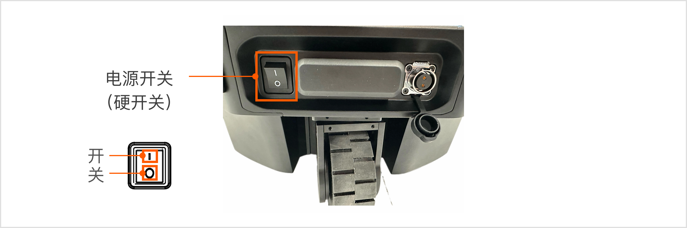
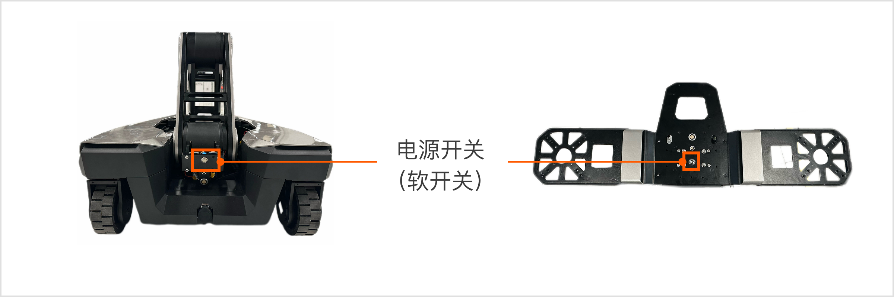
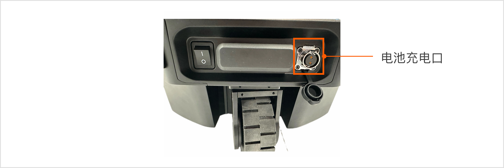
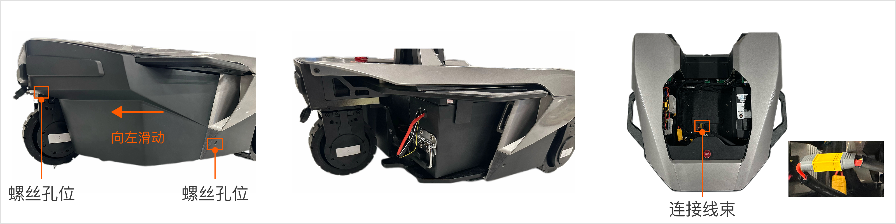
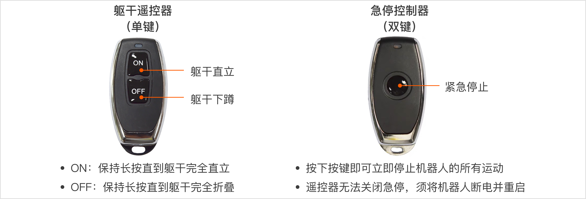
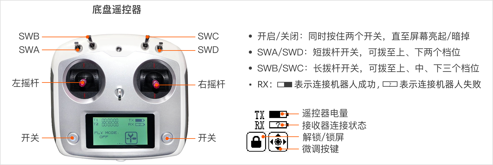
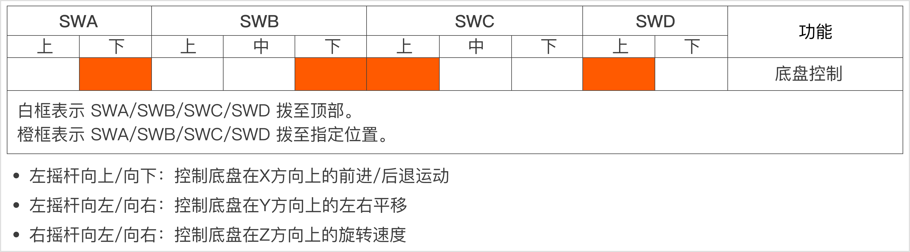

# R1 Lite 快速开始
> 欢迎使用 Galaxea R1 Lite！本文档详细介绍了机器人的使用操作流程，包括开机与关机、充电与换电、急停开关的使用，以及遥控器操作方法，旨在帮助用户快速掌握与R1 Lite的互动方式。

## 机器开关
### 硬开关
R1 Lite底盘尾端底部设有一个黑色船形电源按钮。按下该按钮，即可开机/关机。

### 软开关
R1 Lite躯干顶端处配备了一个银色圆形电源按钮：

（左图为躯干未站立时软开关位置，右图为平台安装至躯干后软开关位置)

- 开机：按下按钮并松开，蓝色指示灯亮起表示R1 Lite已开机。
- 关机：按下按钮后保持不动至少3秒，再松开，蓝色指示灯熄灭表示R1 Lite已关机。

## 充电/换电
电源插口位于底盘前方（底盘内部默认已装有电池）。

电池充电步骤如下：

1. 拧下电池充电插口盖子；
2. 使用2-芯航空插头充电线，一端接入底盘充电口，一端接入交流电源输入接口。
3. 当充电器上的红色指示灯亮起，即表示R1 Lite正在充电中。

电池更换步骤如下：

1. 使用L型扳手拆除底盘右侧盖板的两个螺丝，如图左所示；
2. 将盖板向左滑动，即可拆卸电池盖。
3. 把电池放入底盘，连接好电池线缆到底盘。
4. 安装电池盖。

## 急停开关
紧急停机按钮（E-Stop）是一个基于软件的开关，不会切断电源，位于底盘尾端表面。遇到紧急情况或危险时，请立即使用急停按钮停止所有操作。

**注意：请确保在开机时，紧急停止按钮处于释放状态。**

## 遥控器使用说明
R1 Lite共有3个遥控器来分别控制机器人的躯干、底盘和紧急停止。请按照以下说明，使用适当的遥控器来完成不同的任务。

**注意：在遥控底盘之前，请确认遥控器的4个拨杆开关（SWA/SWB/SWC/SWD）都已拨至最上方档位，使R1 Lite处于停止状态，防止其意外运行。**

请按照下图所示，将4个拨杆拨到指定位置控制底盘移动：

## 下一步

我们的快速入门之旅已告一段落。为了更深入地掌握Galaxea R1 Lite，我们强烈建议您查阅[R1 Lite产品硬件介绍](./R1Lite_Hardware_Introduction.md)和R1 Lite产品软件介绍中的章节。这些资源包含了丰富的信息以及实际示例，能够帮助您更轻松、更好地使用Galaxea R1 Lite。