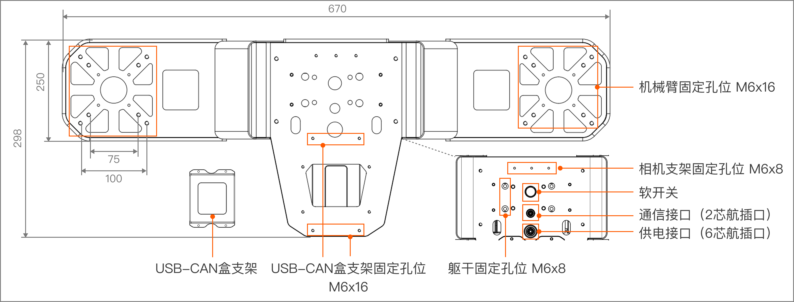
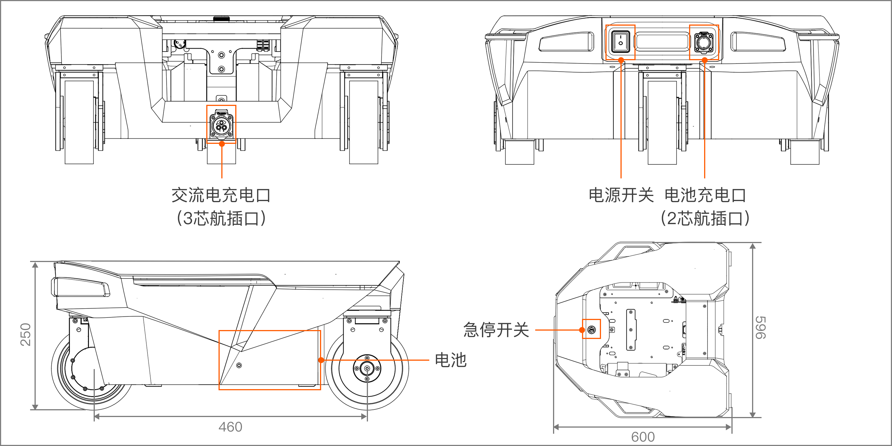

# R1 Lite 产品硬件介绍
> R1 Lite是一款集成化、模块化设计的专注于数据采集开发任务的双臂移动平台，其结构主要分为机械臂、平台、躯干和底盘四大区域。每个区域都经过精心设计，以确保整体性能的高效性和稳定性。本文档详细介绍了R1 Lite的性能参数、电气配置、及机械结构等方面的信息，帮助您更好地了解和使用本产品。

## 参数规格
<table style="width: 100%; border-collapse: collapse;">
    <thead>
        <tr style="background-color: black; color: white; text-align: left;">
            <th style="width: 300px; padding: 8px; border: 1px solid #ddd;">机械参数</th>
            <th style="width: 400px; padding: 8px; border: 1px solid #ddd;">数值</th>
        </tr>
    </thead>
    <tbody>
        <tr style="background-color: white; text-align: left;">
            <td style="padding: 8px; border: 1px solid #ddd;">高度</td>
            <td style="padding: 8px; border: 1px solid #ddd;">977 mm（站立时）</td>
        </tr>
        <tr style="background-color: white; text-align: left;">
            <td style="padding: 8px; border: 1px solid #ddd;">宽度</td>
            <td style="padding: 8px; border: 1px solid #ddd;">596 mm</td>
        </tr>
        <tr style="background-color: white; text-align: left;">
            <td style="padding: 8px; border: 1px solid #ddd;">重量</td>
            <td style="padding: 8px; border: 1px solid #ddd;">55 kg（含电池）</td>
        </tr>
        <tr style="background-color: white; text-align: left;">
            <td style="padding: 8px; border: 1px solid #ddd;">额定电压</td>
            <td style="padding: 8px; border: 1px solid #ddd;">48 V</td>
        </tr>
        <tr style="background-color: white; text-align: left;">
            <td style="padding: 8px; border: 1px solid #ddd;">电池</td>
            <td style="padding: 8px; border: 1px solid #ddd;">锂电池</td>
        </tr>
        <tr style="background-color: white; text-align: left;">
            <td style="padding: 8px; border: 1px solid #ddd;">电池容量</td>
            <td style="padding: 8px; border: 1px solid #ddd;">15Ah</td>
        </tr>
        <tr style="background-color: white; text-align: left;">
            <td style="padding: 8px; border: 1px solid #ddd;">电池能量</td>
            <td style="padding: 8px; border: 1px solid #ddd;">720Wh</td>
        </tr>
        <tr style="background-color: white; text-align: left;">
            <td style="padding: 8px; border: 1px solid #ddd;">电池管理系统 (BMS)</td>
            <td style="padding: 8px; border: 1px solid #ddd;">支持</td>
        </tr>        
    </tbody>
</table>

<table style="width: 100%; border-collapse: collapse;">
    <thead>
        <tr style="background-color: black; color: white; text-align: left;">
            <th style="width: 300px; padding: 8px; border: 1px solid #ddd;">性能参数</th>
            <th style="width: 400px; padding: 8px; border: 1px solid #ddd;">数值</th>
        </tr>
    </thead>
    <tbody>
        <tr style="background-color: white; text-align: left;">
            <td style="padding: 8px; border: 1px solid #ddd;">自由度</td>
            <td style="padding: 8px; border: 1px solid #ddd;">全身共 23 DOF: 底盘 6 DOF 躯干 3 DOF 单臂带夹爪 7 DOF</td>
        </tr>
        <tr style="background-color: white; text-align: left;">
            <td style="padding: 8px; border: 1px solid #ddd;">手臂负载</td>
            <td style="padding: 8px; border: 1px solid #ddd;">额定: 3 kg@0.6 m 最大: 5 kg@0.6 m</td>
        </tr>
        <tr style="background-color: white; text-align: left;">
            <td style="padding: 8px; border: 1px solid #ddd;">操作范围</td>
            <td style="padding: 8px; border: 1px solid #ddd;">55 kg（含电池）</td>
        </tr>
        <tr style="background-color: white; text-align: left;">
            <td style="padding: 8px; border: 1px solid #ddd;">额定电压</td>
            <td style="padding: 8px; border: 1px solid #ddd;">垂直: 0-1600mm(距离车轮前面250mm距离) 水平:  0-760mm（高度750mm，距离车轮前面距离760mm）</td>
        </tr>
        <tr style="background-color: white; text-align: left;">
            <td style="padding: 8px; border: 1px solid #ddd;">功能</td>
            <td style="padding: 8px; border: 1px solid #ddd;">躯干：升降/俯仰 底盘：阿克曼/平移/旋转</td>
        </tr>
    </tbody>
</table>

## 机器人结构
### 机械臂
机械臂是R1 Lite的核心操作部件，安装在平台上，用于执行各种精细操作任务。R1 Lite 配备两条Galaxea A1X机械臂和两个Galaxea G1夹爪。它共具备7自由度的运动能力，能够实现灵活的抓取和操作。机械臂6个关节配备了高精度和大扭矩的行星电机，能够实现独立的变速操作。

**注意：目前关节电机没有制动器，为了您的安全，在关闭R1 Lite电源之前，请用手扶住两只机械臂，以防止其突然坠落。**

<table style="width: 100%; border-collapse: collapse;">
    <thead>
        <tr style="background-color: black; color: white; text-align: left;">
            <th style="width: 300px; padding: 8px; border: 1px solid #ddd;">手臂（不带夹爪）</th>
            <th style="width: 400px; padding: 8px; border: 1px solid #ddd;">备注</th>
        </tr>
    </thead>
    <tbody>
        <tr style="background-color: white; text-align: left;">
            <td style="padding: 8px; border: 1px solid #ddd;">尺寸</td>
            <td style="padding: 8px; border: 1px solid #ddd;">展开：600L x 100W mm 折叠：385L x 100W mm</td>
        </tr>
        <tr style="background-color: white; text-align: left;">
            <td style="padding: 8px; border: 1px solid #ddd;">手臂自由度</td>
            <td style="padding: 8px; border: 1px solid #ddd;">6</td>
        </tr>
        <tr style="background-color: white; text-align: left;">
            <td style="padding: 8px; border: 1px solid #ddd;">负载</td>
            <td style="padding: 8px; border: 1px solid #ddd;">额定：3 kg@0.6 m 峰值：5 kg@0.6 m</td>
        </tr>
        <tr style="background-color: white; text-align: left;">
            <td style="padding: 8px; border: 1px solid #ddd;">重量</td>
            <td style="padding: 8px; border: 1px solid #ddd;">4.2 kg</td>
        </tr>
    </tbody>
</table>

<table style="width: 100%; border-collapse: collapse;">
    <thead>
        <tr style="background-color: black; color: white; text-align: left;">
            <th style="width: 300px; padding: 8px; border: 1px solid #ddd;">夹爪</th>
            <th style="width: 400px; padding: 8px; border: 1px solid #ddd;">备注</th>
        </tr>
    </thead>
    <tbody>
        <tr style="background-color: white; text-align: left;">
            <td style="padding: 8px; border: 1px solid #ddd;">夹爪额定力</td>
            <td style="padding: 8px; border: 1px solid #ddd;">100 N</td>
        </tr>
        <tr style="background-color: white; text-align: left;">
            <td style="padding: 8px; border: 1px solid #ddd;">夹爪运动范围</td>
            <td style="padding: 8px; border: 1px solid #ddd;">0 ~ 100 mm</td>
        </tr>
    </tbody>
</table>

### 平台
平台是机械臂的安装基础，架设在躯干的顶端。它为机械臂提供了稳定的支撑，并通过与躯干的连接，实现整体结构的协调性。平台的设计注重结构强度和稳定性，能够承受机械臂在操作过程中产生的各种力和力矩；同时配备精准的安装接口，便于机械臂的快速安装和调试。

<table style="width: 100%; border-collapse: collapse;">
    <thead>
        <tr style="background-color: black; color: white; text-align: left;">
            <th style="width: 300px; padding: 8px; border: 1px solid #ddd;">平台</th>
            <th style="width: 400px; padding: 8px; border: 1px solid #ddd;">备注</th>
        </tr>
    </thead>
    <tbody>
        <tr style="background-color: white; text-align: left;">
            <td style="padding: 8px; border: 1px solid #ddd;">尺寸</td>
            <td style="padding: 8px; border: 1px solid #ddd;">670L x 298W mm</td>
        </tr>
        <tr style="background-color: white; text-align: left;">
            <td style="padding: 8px; border: 1px solid #ddd;">外设接口</td>
            <td style="padding: 8px; border: 1px solid #ddd;">2芯航插口用于通讯连接 6芯航插口用于供电连接</td>
        </tr>
    </tbody>
</table>

### 躯干
躯干是R1 Lite的主体结构，用于连接平台和底盘。它不仅为机械臂和平台提供支撑，还内置了部分关键的电气和控制系统，是整个机器人的重要组成部分。躯干的设计注重结构的紧凑性和可靠性，同时兼顾了内部空间的合理利用。

<table style="width: 100%; border-collapse: collapse;">
    <thead>
        <tr style="background-color: black; color: white; text-align: left;">
            <th style="width: 300px; padding: 8px; border: 1px solid #ddd;">平台</th>
            <th style="width: 400px; padding: 8px; border: 1px solid #ddd;">备注</th>
        </tr>
    </thead>
    <tbody>
        <tr style="background-color: white; text-align: left;">
            <td style="padding: 8px; border: 1px solid #ddd;">腰部运动空间（偏航）</td>
            <td style="padding: 8px; border: 1px solid #ddd;">± 170°</td>
        </tr>
        <tr style="background-color: white; text-align: left;">
            <td style="padding: 8px; border: 1px solid #ddd;">臀部运动空间（俯仰）</td>
            <td style="padding: 8px; border: 1px solid #ddd;">± 100°</td>
        </tr>
        <tr style="background-color: white; text-align: left;">
            <td style="padding: 8px; border: 1px solid #ddd;">膝关节运动空间</td>
            <td style="padding: 8px; border: 1px solid #ddd;">W1: 0°~100° W2: -154°~145°</td>
        </tr>
        <tr style="background-color: white; text-align: left;">
            <td style="padding: 8px; border: 1px solid #ddd;">躯干电机扭矩</td>
            <td style="padding: 8px; border: 1px solid #ddd;">额定: 108 Nm 最大: 304 Nm</td>
        </tr>
        <tr style="background-color: white; text-align: left;">
            <td style="padding: 8px; border: 1px solid #ddd;">软开关</td>
            <td style="padding: 8px; border: 1px solid #ddd;">用于开启/关闭R1 Lite电源</td>
        </tr>
    </tbody>
</table>

### 底盘
底盘是R1 Lite的基础支撑结构，采用三舵轮自研舵轮模组W1，总共6自由度，可以实现360°旋转无限位。这种设计使得机器人在移动和转向时更加灵活，能够适应复杂的环境和任务需求。

**注意：R1 Lite支持两种供电方式：电池供电或交流电供电。用户可根据实际情况选择机器人的供电配置。**

<table style="width: 100%; border-collapse: collapse;">
    <thead>
        <tr style="background-color: black; color: white; text-align: left;">
            <th style="width: 300px; padding: 8px; border: 1px solid #ddd;">底盘</th>
            <th style="width: 400px; padding: 8px; border: 1px solid #ddd;">备注</th>
        </tr>
    </thead>
    <tbody>
        <tr style="background-color: white; text-align: left;">
            <td style="padding: 8px; border: 1px solid #ddd;">尺寸</td>
            <td style="padding: 8px; border: 1px solid #ddd;">596L x 600W x 250H mm</td>
        </tr>
        <tr style="background-color: white; text-align: left;">
            <td style="padding: 8px; border: 1px solid #ddd;">电源开关</td>
            <td style="padding: 8px; border: 1px solid #ddd;">硬开关，用于开/关闭R1 Lite电源。</td>
        </tr>
        <tr style="background-color: white; text-align: left;">
            <td style="padding: 8px; border: 1px solid #ddd;">急停开关</td>
            <td style="padding: 8px; border: 1px solid #ddd;">紧急或危险情况下，按下可立即停止所有操作。</td>
        </tr>
        <tr style="background-color: white; text-align: left;">
            <td style="padding: 8px; border: 1px solid #ddd;">电池充电口</td>
            <td style="padding: 8px; border: 1px solid #ddd;">额定电压 48V</td>
        </tr>
        <tr style="background-color: white; text-align: left;">
            <td style="padding: 8px; border: 1px solid #ddd;">交流电供电口</td>
            <td style="padding: 8px; border: 1px solid #ddd;">额定电压 110 - 220 V（选配）</td>
        </tr>
    </tbody>
</table>

### 传感器
Galaxea R1 Lite可选配平台双目相机和机械臂腕部相机。

<table style="width: 100%; border-collapse: collapse;">
    <thead>
        <tr style="background-color: black; color: white; text-align: left;">
            <th style="width: 300px; padding: 8px; border: 1px solid #ddd;">传感器</th>
            <th style="width: 400px; padding: 8px; border: 1px solid #ddd;">备注</th>
        </tr>
    </thead>
    <tbody>
        <tr style="background-color: white; text-align: left;">
            <td style="padding: 8px; border: 1px solid #ddd;">相机</td>
            <td style="padding: 8px; border: 1px solid #ddd;">平台：1 x 纯双目视觉相机 腕部：2 x 单目深度相机</td>
        </tr>
    </tbody>
</table>

#### 相机
<table style="width: 100%; border-collapse: collapse;">
    <thead>
        <tr style="background-color: black; color: white; text-align: left;">
            <th style="width: 150px; padding: 8px; border: 1px solid #ddd;">规格</th>
            <th style="width: 250px; padding: 8px; border: 1px solid #ddd;">平台</th>
            <th style="width: 250px; padding: 8px; border: 1px solid #ddd;">腕部</th>
        </tr>
    </thead>
    <tbody>
        <tr style="background-color: white; text-align: left;">
            <td style="padding: 8px; border: 1px solid #ddd;">类型</td>
            <td style="padding: 8px; border: 1px solid #ddd;">纯双目视觉相机</td>
            <td style="padding: 8px; border: 1px solid #ddd;">单目深度相机</td>
        </tr>
        <tr style="background-color: white; text-align: left;">
            <td style="padding: 8px; border: 1px solid #ddd;">数量</td>
            <td style="padding: 8px; border: 1px solid #ddd;">1</td>
            <td style="padding: 8px; border: 1px solid #ddd;">2</td>
        </tr>
        <tr style="background-color: white; text-align: left;">
            <td style="padding: 8px; border: 1px solid #ddd;">输出分辨率</td>
            <td style="padding: 8px; border: 1px solid #ddd;">2560*720 @15/30/60FPS  </td>
            <td style="padding: 8px; border: 1px solid #ddd;">1280 x 720 @30FPS  (RGB 1920 x 1080)</td>
        </tr>
        <tr style="background-color: white; text-align: left;">
            <td style="padding: 8px; border: 1px solid #ddd;">视场角</td>
            <td style="padding: 8px; border: 1px solid #ddd;">126°H x 116°V x 80°D</td>
            <td style="padding: 8px; border: 1px solid #ddd;">87°H x 58°V x 95°D</td>
        </tr>
        <tr style="background-color: white; text-align: left;">
            <td style="padding: 8px; border: 1px solid #ddd;">深度范围</td>
            <td style="padding: 8px; border: 1px solid #ddd;">0.25 m ~ 10 m</td>
            <td style="padding: 8px; border: 1px solid #ddd;">0.2 m ~ 3 m</td>
        </tr>
        <tr style="background-color: white; text-align: left;">
            <td style="padding: 8px; border: 1px solid #ddd;">工作温度</td>
            <td style="padding: 8px; border: 1px solid #ddd;">-10 °C ~ +45°C</td>
            <td style="padding: 8px; border: 1px solid #ddd;">0 ~ +85℃</td>
        </tr>
        <tr style="background-color: white; text-align: left;">
            <td style="padding: 8px; border: 1px solid #ddd;">尺寸</td>
            <td style="padding: 8px; border: 1px solid #ddd;">90L x 18W x 17.8H mm</td>
            <td style="padding: 8px; border: 1px solid #ddd;">90L x 25W x 25H mm</td>
        </tr>
        <tr style="background-color: white; text-align: left;">
            <td style="padding: 8px; border: 1px solid #ddd;">重量</td>
            <td style="padding: 8px; border: 1px solid #ddd;">50 g</td>
            <td style="padding: 8px; border: 1px solid #ddd;">75 g</td>
        </tr>
    </tbody>
</table>

### 计算单元
<table style="width: 100%; border-collapse: collapse;table-layout: fixed;">
    <thead>
        <tr style="background-color: black; color: white; text-align: left;">
            <th style="width: 300px; padding: 8px; border: 1px solid #ddd;">单元</th>
            <th style="width: 400px; padding: 8px; border: 1px solid #ddd;">单 SoC</th>
            <th style="width: 400px; padding: 8px; border: 1px solid #ddd;">双 SoC</th>
        </tr>
    </thead>
    <tbody>
        <tr style="background-color: white; text-align: left;">
            <td style="padding: 8px; border: 1px solid #ddd;">基本计算能力</td>
            <td style="padding: 8px; border: 1px solid #ddd;">8核 2.2GHz CPU</td>
            <td style="padding: 8px; border: 1px solid #ddd;">2 * 8核 2.2GHz CPU</td>
        </tr>
        <tr style="background-color: white; text-align: left;">
            <td style="padding: 8px; border: 1px solid #ddd;">内存芯片</td>
            <td style="padding: 8px; border: 1px solid #ddd;">1 x LPDDR5@32G</td>
            <td style="padding: 8px; border: 1px solid #ddd;">2 x LPDDR5@32G</td>
        </tr>
        <tr style="background-color: white; text-align: left;">
            <td style="padding: 8px; border: 1px solid #ddd;">硬盘</td>
            <td style="padding: 8px; border: 1px solid #ddd;">1 x SSD@1T</td>
            <td style="padding: 8px; border: 1px solid #ddd;">2 x SSD@512G</td>
        </tr>
        <tr style="background-color: white; text-align: left;">
            <td style="padding: 8px; border: 1px solid #ddd;">相机</td>
            <td style="padding: 8px; border: 1px solid #ddd;">8 x GMSL</td>
            <td style="padding: 8px; border: 1px solid #ddd;">8 x GMSL (SoC-1) + 8 x GMSL (SoC-2)</td>
        </tr>
        <tr style="background-color: white; text-align: left;">
            <td style="padding: 8px; border: 1px solid #ddd;">以太网</td>
            <td style="padding: 8px; border: 1px solid #ddd;">4 x 千兆以太网 (M12)</td>
            <td style="padding: 8px; border: 1px solid #ddd;">3 x SoC-1 千兆以太网 (M12) + 3 x SoC-2 千兆以太网 (M12)</td>
        </tr>
        <tr style="background-color: white; text-align: left;">
            <td style="padding: 8px; border: 1px solid #ddd;">WiFi 模块</td>
            <td style="padding: 8px; border: 1px solid #ddd;">M.2 WiFi 带AP模式</td>
            <td style="padding: 8px; border: 1px solid #ddd;">M.2 WiFi 带AP模式</td>
        </tr>
    </tbody>
</table>

如需不同配置，请联系我们product@galaxea.ai。

## 下一步
Galaxea R1 Lite 硬件指南到这里就结束了。我们建议您阅读Galaxea R1 Lite 软件指南以获取更多详细信息。