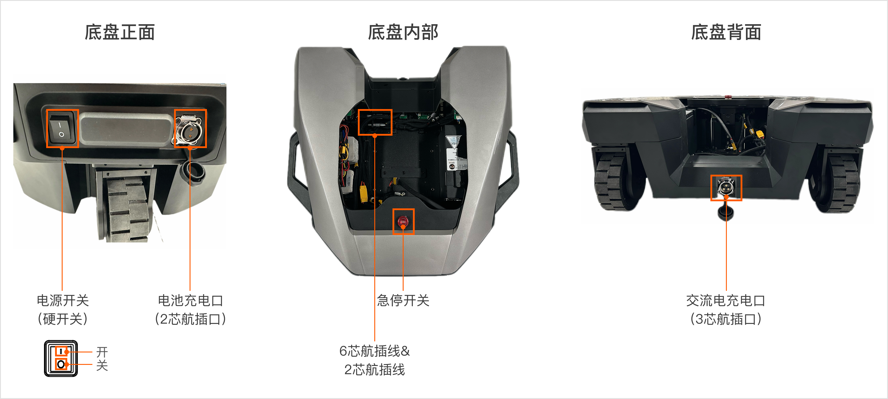
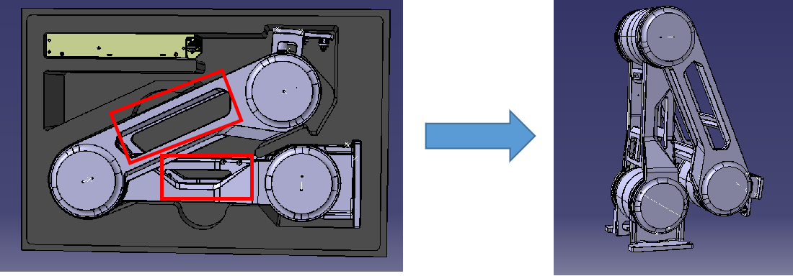
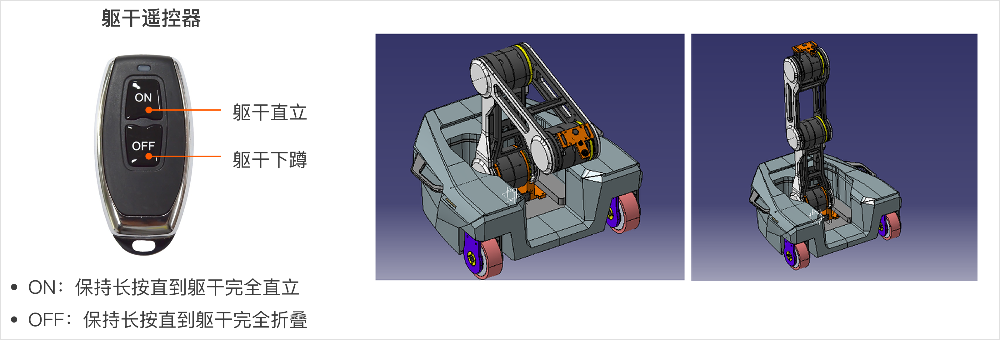

# R1 Lite 开箱安装指南 
> 在本教程中，我们将提供详细的说明，指导您如何正确地开箱Galaxea R1 Lite，连接电缆，安装机械臂，以及如何远程控制R1，以实现更好的通信和探索更多功能。

## 指导视频
<iframe width="720" height="350" src="https://youtu.be/jPyW3BnnwwY" title="R1 Lite Unboxing and Startup Guide" frameborder="0" allow="accelerometer; autoplay; clipboard-write; encrypted-media; gyroscope; picture-in-picture; web-share" referrerpolicy="strict-origin-when-cross-origin" allowfullscreen></iframe>

## 1. 发货物品清单检查

收到产品时，请根据以下清单检查包装盒内的物品是否齐全。

<table style="width: 100%; border-collapse: collapse;">
    <thead>
        <tr style="background-color: black; color: white; text-align: left;">
            <th style="width: 300px; padding: 8px; border: 1px solid #ddd;">物品</th>
            <th style="width: 400px; padding: 8px; border: 1px solid #ddd;">数量</th>
        </tr>
    </thead>
    <tbody>
        <tr style="background-color: white; text-align: left;">
            <td style="padding: 8px; border: 1px solid #ddd;">R1 Lite底盘本体</td>
            <td style="padding: 8px; border: 1px solid #ddd;">1</td>
        </tr>
        <tr style="background-color: white; text-align: left;">
            <td style="padding: 8px; border: 1px solid #ddd;">R1 Lite躯干本体</td>
            <td style="padding: 8px; border: 1px solid #ddd;">1</td>
        </tr>
        <tr style="background-color: white; text-align: left;">
            <td style="padding: 8px; border: 1px solid #ddd;">R1 Lite平台本体</td>
            <td style="padding: 8px; border: 1px solid #ddd;">1</td>
        </tr>
        <tr style="background-color: white; text-align: left;">
            <td style="padding: 8px; border: 1px solid #ddd;">供电弹簧线</td>
            <td style="padding: 8px; border: 1px solid #ddd;">1</td>
        </tr>
        <tr style="background-color: white; text-align: left;">
            <td style="padding: 8px; border: 1px solid #ddd;">侧装配套件</td>
            <td style="padding: 8px; border: 1px solid #ddd;">2</td>
        </tr>
        <tr style="background-color: white; text-align: left;">
            <td style="padding: 8px; border: 1px solid #ddd;">航模遥控器</td>
            <td style="padding: 8px; border: 1px solid #ddd;">1</td>
        </tr>
        <tr style="background-color: white; text-align: left;">
            <td style="padding: 8px; border: 1px solid #ddd;">单键小遥控器</td>
            <td style="padding: 8px; border: 1px solid #ddd;">1</td>
        </tr>
        <tr style="background-color: white; text-align: left;">
            <td style="padding: 8px; border: 1px solid #ddd;">双键小遥控器</td>
            <td style="padding: 8px; border: 1px solid #ddd;">1</td>
        </tr>        
        <tr style="background-color: white; text-align: left;">
            <td style="padding: 8px; border: 1px solid #ddd;">USBCAN盒 & 2芯航插线 & USB线</td>
            <td style="padding: 8px; border: 1px solid #ddd;">1</td>
        </tr>
        <tr style="background-color: white; text-align: left;">
            <td style="padding: 8px; border: 1px solid #ddd;">6芯航插线 & 对应供电线</td>
            <td style="padding: 8px; border: 1px solid #ddd;">1</td>
        </tr>        
    </tbody>
</table>
<table style="width: 100%; border-collapse: collapse;">
    <thead>
        <tr style="background-color: black; color: white; text-align: left;">
            <th style="width: 300px; padding: 8px; border: 1px solid #ddd;">W1配套标定板</th>
            <th style="width: 400px; padding: 8px; border: 1px solid #ddd;">3</th>
        </tr>
    </thead>
    <tbody>
        <tr style="background-color: white; text-align: left;">
            <td style="padding: 8px; border: 1px solid #ddd;">扳手</td>
            <td style="padding: 8px; border: 1px solid #ddd;">1</td>
        </tr>
        <tr style="background-color: white; text-align: left;">
            <td style="padding: 8px; border: 1px solid #ddd;">维修小包</td>
            <td style="padding: 8px; border: 1px solid #ddd;">1</td>
        </tr>
        <tr style="background-color: white; text-align: left;">
            <td style="padding: 8px; border: 1px solid #ddd;">螺钉 M6*16</td>
            <td style="padding: 8px; border: 1px solid #ddd;">8</td>
        </tr>
        <tr style="background-color: white; text-align: left;">
            <td style="padding: 8px; border: 1px solid #ddd;">螺钉 M6*12</td>
            <td style="padding: 8px; border: 1px solid #ddd;">8</td>
        </tr>
    </tbody>
</table>

此外，仍需准备以下物品：
<table style="width: 100%; border-collapse: collapse;">
    <thead>
        <tr style="background-color: black; color: white; text-align: left;">
            <th style="width: 300px; padding: 8px; border: 1px solid #ddd;">物品</th>
            <th style="width: 400px; padding: 8px; border: 1px solid #ddd;">数量</th>
        </tr>
    </thead>
    <tbody>
        <tr style="background-color: white; text-align: left;">
            <td style="padding: 8px; border: 1px solid #ddd;">老虎钳或类似开箱工具</td>
            <td style="padding: 8px; border: 1px solid #ddd;">1</td>
        </tr>
    </tbody>
</table>

## 2. 打开货箱
使用开箱工具将货箱周围的铁片拆除，即可打开箱盖。

## 3. 取出底盘
抓住底盘两侧的把手，将底盘从包装箱中取出。

- 底盘正面有一个电源开关和电池充电口（2芯）。
- 底盘内部装有一个6芯航插线和一个2芯航插线，用于连接底盘和躯干。
- 底盘背面有一个交流电充电口（3芯），如您的机器人未配置电池模块，机器人需接入交流电才可以正常启动。

## 4. 安装躯干
请按照以下步骤操作，确保顺利完成安装和启动过程。

### 4.1 取出躯干
抓住躯干两侧（如图所示），将躯干从箱中取出。

### 4.2 连接底盘和躯干线束
将底盘内部的6芯航插头和2芯航插头分别接入躯干上的对应接口。

### 4.3 固定躯干
注意：为方便您连接线束， 建议您先进行第3节接入航空插头后再将躯干放进底盘。

使用4颗M6x16螺钉将躯干安装到底盘内部，并按下图所示的位置固定。

注意：请确保使用的是M6x16型号的螺钉。使用不正确的型号可能会导致组件损坏。

## 5. 安装电池
电池单元默认已安装在机器人底盘内部。但由于不同地区的发货限制，电池单元会单独发货，需要收到产品后自行安装电池。（若底盘内部已安装电池，请跳过本节，直接进行[第6节-开机](#6-开机)。）

电池安装步骤如下：

1. 使用L-型扳手拆除底盘左前方盖板的2颗螺钉，并向左滑动盖板即可拆除；
2. 将电池水平装入底盘内部；
3. 连接电池和底盘内部的线束；
4. 重新将盖板安装回底盘。

## 6. 开机
如您的机器人有内置电池且电量充足，请按照以下步骤开机：

1. 按下底盘后方的电源按钮；
2. 长按躯干上的软开关保持3秒，当听到启动声音即可松手。

如您的机器人为充电版本，请按照以下步骤开机：

1. 将电源线（3芯航插头）连接到底盘前端的电源输入端口；
2. 按下底盘后方的电源按钮；
3. 长按躯干上的软开关保持3秒，当听到启动声音即可松手。

## 7. 升起躯干
躯干控制器有两个按钮，操作如下：

- “ON”：保持长按，直到躯干完全直立，方可松开；
- “OFF”：保持长按，知道躯干完全折叠，方可松开。

## 8. 安装平台
将平台从包装箱中取出，并按照图示的方式，使用4颗M6x8螺钉将平台固定在躯干顶端。

注意：请确保使用的是M6x8型号的螺钉。使用不正确的型号可能会导致组件损坏。

请按照以上步骤进行操作，确保每个连接和安装都正确无误。如果在操作过程中遇到任何问题，请参考本手册中的注意事项，或者联系我们的客服团队获取支持。