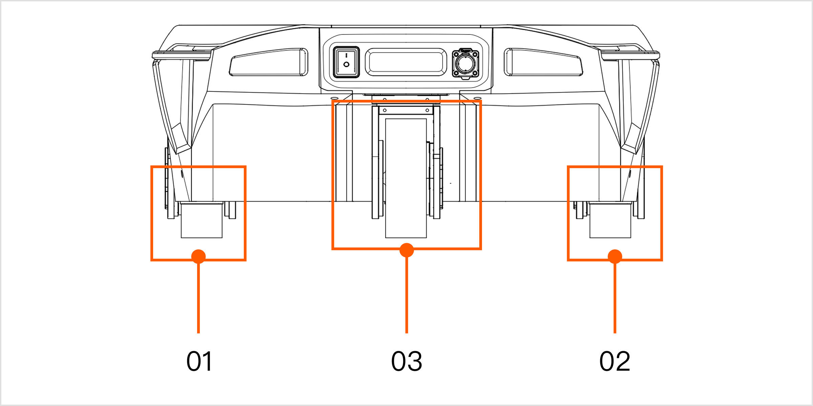
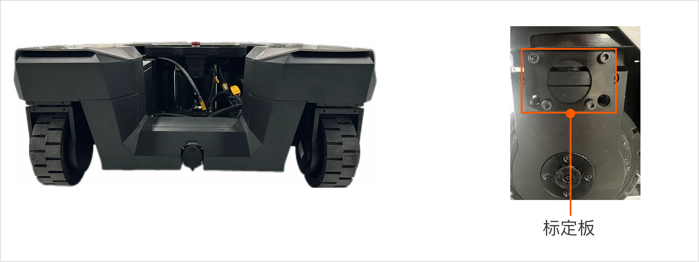

# R1 Lite_舵轮电机零点标定说明
<span style="color: red;">**重要提示：请严格按照以下步骤逐一操作。错误的操作可能会导致 W1 模块和标定工具损坏，甚至可能影响机器人的正常使用。如果您在操作过程中遇到任何问题，请及时联系技术支持。**</span>

## 1. 准备工作
### 1.1  硬件准备
<table style="width: 100%; border-collapse: collapse;">
    <thead>
        <tr style="background-color: black; color: white; text-align: left;">
            <th style="width: 300px; padding: 8px; border: 1px solid #ddd;">物品</th>
            <th style="width: 400px; padding: 8px; border: 1px solid #ddd;">数量</th>
            <th style="width: 400px; padding: 8px; border: 1px solid #ddd;">备注</th>
        </tr>
    </thead>
    <tbody>
        <tr style="background-color: white; text-align: left;">
            <td style="padding: 8px; border: 1px solid #ddd;">迷你电脑</td>
            <td style="padding: 8px; border: 1px solid #ddd;">1</td>
            <td style="padding: 8px; border: 1px solid #ddd;">用于控制和标定机器人。</br>系统：Ubuntu20.04 ROS Noetic</td>
        </tr>
        <tr style="background-color: white; text-align: left;">
            <td style="padding: 8px; border: 1px solid #ddd;">USB-CAN盒子</td>
            <td style="padding: 8px; border: 1px solid #ddd;">1</td>
            <td style="padding: 8px; border: 1px solid #ddd;">用于与机器人通信。</td>
        </tr>
        <tr style="background-color: white; text-align: left;">
            <td style="padding: 8px; border: 1px solid #ddd;">标定板</td>
            <td style="padding: 8px; border: 1px solid #ddd;">1</td>
            <td style="padding: 8px; border: 1px solid #ddd;">用于标定机器人的零位。</td>
        </tr>
        <tr style="background-color: white; text-align: left;">
            <td style="padding: 8px; border: 1px solid #ddd;">扳手</td>
            <td style="padding: 8px; border: 1px solid #ddd;">1</td>
            <td style="padding: 8px; border: 1px solid #ddd;">用于安装和拆卸标定板。</td>
        </tr>
    </tbody>
</table>

### 1.2  安装必要工具
在迷你电脑上安装必要的工具，以确保与机器人通信顺畅。

```Bash
sudo apt install can-utils
```
## 2. 标定步骤
### 2.1 开机与连接
打开机器人电源，将USB-CAN线连接到迷你电脑的USB端口，并确保所有设备连接正确且电源指示灯亮起。

### 2.2 启用 FDCAN 通信
```Bash
sudo ip link set dev can0 type can bitrate 1000000 dbitrate 5000000 fd on
sudo ip link set up can0
```
<span style="color: red;">**注意：如果命令执行失败，请检查USBCAN是否正确连接，以及迷你电脑的网络配置是否正确。**</span>

### 2.3 禁用转向电机



执行以下命令禁用转向电机：
<span style="color: red;">**注意：请确保机器人此时处于静止状态。**</span>

```Bash
cansend can0 034#0102  #禁用01号电机
cansend can0 034#0202  #禁用02号电机
cansend can0 034#0302  #禁用03号电机

# 命令格式：
# cansend <CAN_Interface> <CANID>#<COMMAND>
    # CANID: 034
    # COMMAND: 电机索引号+命令代码。（命令代码：01表示启用，02表示禁用）
```

### 2.4 安装标定板

请严格按照舵轮的方向进行安装，确保三个舵轮方向一致且朝前，同时与地面保持90度垂直（如下图所示）。如果安装方向有误，可能会导致底盘意外移动，影响机器人的稳定性。

在安装标定板时，请确保所有螺丝都已拧紧。这是为了防止在标定过程中标定板出现松动，从而保证标定的准确性和可靠性。



### 2.5 重新标定零点
执行以下命令重新标定每个舵轮。

<span style="color: red;">**注意：请确保机器人此时处于静止状态。**</span>

```Bash
cansend can0 034#0103  #标定01号电机
cansend can0 034#0203  #标定02号电机
cansend can0 034#0303  #标定03号电机

# 命令格式：
# cansend <CAN_Interface> <CANID>#<COMMAND>
	# CANID: 034
	# COMMAND: 电机索引号+命令代码。（命令代码：01表示启用，02表示禁用，03表示标定）
```

### 2.6 移除标定板并关机
请小心移除标定板，然后关闭机器人总电源。

<span style="color: red;">**注意：在移除标定板时，请小心操作，避免损坏标定板或机器人。**</span>

## 3. 重启并检查零点
重新打开机器人电源，并检查是否到达期望的零位。如果机器人未到达期望的零位，请重复[第2.5节](#25-重新标定零点)进行标定；如果问题仍然存在，请联系技术支持。