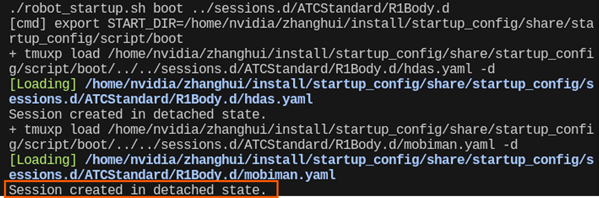

# Galaxea R1 Pro软件版本 - V2.0.3 - 更新日志

## 更新说明

**产品名称：**Galaxea R1 Pro

**软件版本号：**V2.0.3

**Ubuntu 系统：** 22.04 LTS

**ROS版本：** ROS 2 Humble

**发布日期：**2025.5.12

**更新项：**

1. **运控内容更新项**

    a）新增开箱Demo脚本；

    b）优化躯干速度控制；

    c）优化A2机械臂伺服控制模式（PID）参数。

2. **驱动内容更新项：**

    a）优化底盘速度控制；

    b）修复A2机械臂夹爪反馈问题。

3. **遥操作功能更新项：**

    a）VR遥操修复躯干控制问题。

4. **导航功能更新项：**

    a）优化局部地图更新tf获取逻辑；

    b）优化实机导航日志存储；
    
    c）优化参数文件路径加载。

5. **工具模块更新项：**

    a）增加system-manager状态机log文件存储服务。

5. **其他内容更新项：**

    a）新增ROS2升级烧录操作方法及相关软件资源，详见文档[《ROS2 升级烧录操作教程》](../../../ROS2_upgrade/ROS2_upgrade_guide.md)。

    b）开启默认配置，其中：eth1开机默认IP为`192.168.2.150`，主要用于自动连接雷达；can0节点启动已加入开机自启动，机器人开机后将直接拉起can0虚拟网卡。

## 更新说明

1. 在升级过程中，请不要中止系统运行，也不要进行任何控制操作，否则可能导致升级失败，影响系统正常使用。
2. 升级完成后，请关闭机器人电源，并重新进行上电操作，以确保系统更新完全生效。

**请严格按照以下教程完成本次系统更新，如遇问题，请及时联系我们至 [support@galaxea.ai](mailto:support@galaxea.ai)获得技术支持!**


## 更新教程
### 下载更新包

`atc_standard-V2.0.3.tar.gz`
`atc_navigation_V2.0.3.tar.gz`

- 百度云：[ATC_SDK_V2.0.3](https://pan.baidu.com/s/1eohcj2zqruORswWf5NOPvQ?pwd=v203)
- Google Drive：[ATC_SDK_V2.0.3](https://drive.google.com/drive/folders/1Q-gjRDun5v7nWxJ5Yaqr4230IlDlcdRb?usp=sharing)

### 解压更新包

```Bash
tar -xf ${your_download_path}/atc_standard-V2.0.3.tar.gz -C ~/
```

### 启动CAN通信

```Bash
# 终端1
sudo ip link set can0 down
sudo ip link set can0 type can bitrate 1000000 dbitrate 5000000 fd on       
sudo ip link set can0 up
```

### 更新嵌入式固件

```Bash
# 终端2
cd ~/ && source install/setup.bash
cd ~/install/Embedded_Software_Firmware/share/tools

# 根据机器型号升级，以R1 Pro为例：
cd R1PRO
./r1pro_embedded_firmware_upgrade.sh ls ../../firmware/R1PRO
```

等待几秒后，出现“GET OTA finished!！”即表示更新成功。


<span style="color:red;">**注意：更新完毕后，请关闭机器人电源并重新上电。**</span>

### 运行整机功能
在`atc_standard-V2.0.3.tar.gz`中:

```Bash
cd install/startup_config/share/startup_config/script/

# R1PRO BODY:
./robot_startup.sh boot ../session.d/ATCStandard/R1PROBody.d/

# R1PRO VRTELEOP：
./robot_startup.sh boot ../session.d/ATCStandard/R1PROVRTeleop.d/
```

在`atc_navigation-V2.0.3.tar.gz`中:

```Bash
cd install/startup_config/share/startup_config/script/

# R1PRO NAVIGATION:
./robot_startup.sh boot ../sessions.d/ATCNavigation/R1PROVRTeleopNAV.d/
```


### 关闭整机功能
```Bash
# 关闭上述操作开启的全部进程
tmux kill-server
```