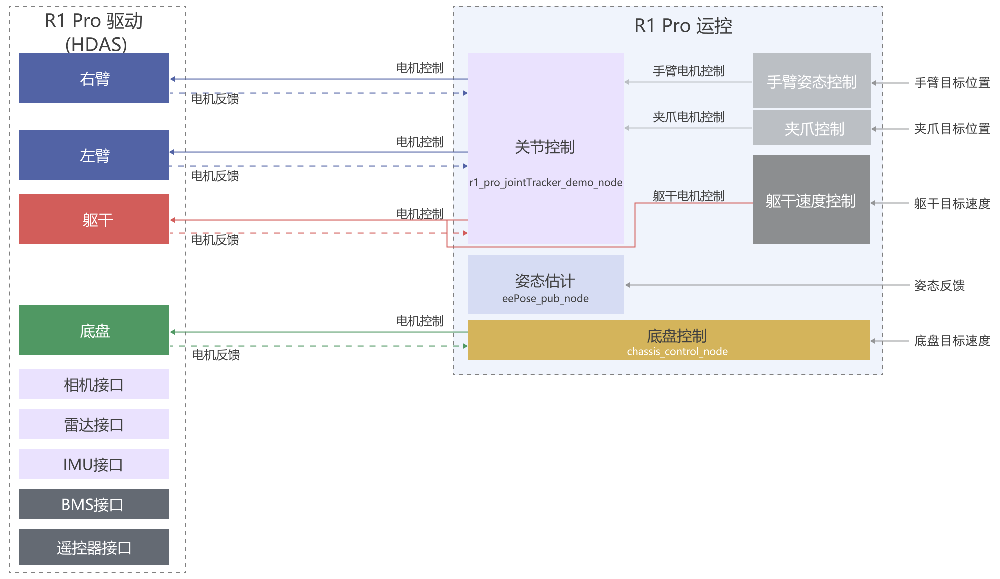
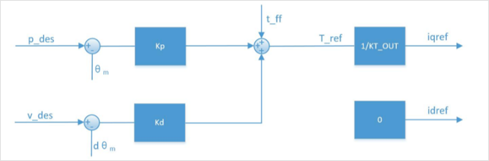

# R1 Pro 软件介绍
## 环境依赖

1. 硬件依赖：R1 Pro计算单元
2. 操作系统依赖：Ubuntu 20.04 LTS（PC安装双系统，非虚拟机）
3. 中间件依赖：ROS Noetic

## 获取SDK

点击下方链接获取最新版本

- 百度云盘：[R1 Pro SDK V1.1.4](https://pan.baidu.com/s/1rQd3_Cu4E9PjygupxeQDig?pwd=v114)
- Google Drive: [R1 Pro SDK V1.1.4](https://drive.google.com/drive/folders/1RTt6NMOoA0pjbx5qXkYCb2fyQyUHyZFf?usp=sharing)

所有版本更新后续可在R1 Pro软件版本更新日志中查看。

## 启动SDK
Galaxea R1 Pro驱动程序由多个组件组成，包括执行器接口、传感器接口和外部功能接口。

当前支持分开启动和一键启动两种方式启动软件接口。为了您的安全，建议使用分开启动的方式启动SDK。

### 分开启动各接口
所有组件可以通过以下命令模板启动。

```Bash
source ~{your_download_path}/install/setup.bash
roslaunch <Package Name> <Launch File>
# 示例
roslaunch HDAS r1pro.launch
```

<table style="width: 100%; border-collapse: collapse;">
  <thead>
    <tr style="background-color: black; color: white; text-align: left;">
      <th style="padding: 8px; border: 1px solid #ddd; width: 200px;">接口信息</th>
      <th style="padding: 8px; border: 1px solid #ddd; width: 200px;">文件包名</th>
      <th style="padding: 8px; border: 1px solid #ddd; width: 200px;">路径</th>
      <th style="padding: 8px; border: 1px solid #ddd; width: 200px;">启动文件</th>
    </tr>
  </thead>
  <tbody>
    <tr style="background-color: white; text-align: left;">
      <td style="padding: 8px; border: 1px solid #ddd;">Arms Driver Interface<br>Torso Driver Interface<br>Chassis Driver Interface<br>IMU Interface<br>BMS Interface<br>Remote Controller Interface</td>
      <td style="padding: 8px; border: 1px solid #ddd;">HDAS</td>
      <td style="padding: 8px; border: 1px solid #ddd;">/install/share/HDAS/launch</td>
      <td style="padding: 8px; border: 1px solid #ddd;">r1pro.launch</td>
    </tr>
     <tr style="background-color: white; text-align: left;">
      <td style="padding: 8px; border: 1px solid #ddd;">Camera Interface</td>
      <td style="padding: 8px; border: 1px solid #ddd;">signal_camera</td>
      <td style="padding: 8px; border: 1px solid #ddd;">/install/share/signal_camera/launch</td>
      <td style="padding: 8px; border: 1px solid #ddd;">signal_camera.launch</td>
    </tr>
      <tr style="background-color: white; text-align: left;">
      <td style="padding: 8px; border: 1px solid #ddd;">LiDAR Interface</td>
      <td style="padding: 8px; border: 1px solid #ddd;">livox_ros_driver2</td>
      <td style="padding: 8px; border: 1px solid #ddd;">/install/share/livox_ros_driver2/launch_ROS1</td>
      <td style="padding: 8px; border: 1px solid #ddd;">msg_MID360.launch</td>
    </tr>
  </tbody>
</table>

### 一键启动所有接口
<span style="color:red;">**注意：执行以下命令将启动所有驱动和运控接口。**</span>

```Bash
sudo apt-get install tmux tmuxp
cd {your_download_path}/install/share/startup_config/script
./ota_script.sh boot ../session.d/ATCStandard/R1PROBody.d/
```

## Demo演示

访问页面 [R1 Pro Demo演示指南](./R1 Pro_Demo_Guide.md)，并按照说明操作R1 Pro。

## 软件接口
当前的Galaxea R1 Pro控制图如下所示，由6个主要部分组成：关节控制、手臂姿态控制、夹爪控制、躯干速度控制、底盘控制和姿态估计。整个软件包被简称为“mobiman”,表示移动操作。



### 驱动接口
#### 手臂驱动接口
该接口是用于机械臂控制和状态反馈的ROS软件包，定义了多个话题用于发布和订阅臂的状态、控制命令和相关错误代码。接口信息如下所示：
<table style="width: 100%; border-collapse: collapse;">
    <thead>
        <tr style="background-color: black; color: white; text-align: left;table-layout: fixed;">
            <th style="width: 200px; padding: 8px; border: 1px solid #ddd;">话题名称</th>
            <th style="width: 100px; padding: 8px; border: 1px solid #ddd;">I/O</th>          
            <th style="width: 200px; padding: 8px; border: 1px solid #ddd;">描述</th>
            <th style="width: 200px; padding: 8px; border: 1px solid #ddd;">消息类型</th>
        </tr>
    </thead>
    <tbody>
        <tr style="background-color: white; text-align: left;">
            <td style="padding: 8px; border: 1px solid #ddd;">/hdas/feedback_arm_left</td>
            <td style="padding: 8px; border: 1px solid #ddd;">Output</td>                    
            <td style="padding: 8px; border: 1px solid #ddd;">左臂关节反馈</td>
            <td style="padding: 8px; border: 1px solid #ddd;">sensor_msgs::JointState</td>
        </tr>
        <tr style="background-color: white; text-align: left;">
            <td style="padding: 8px; border: 1px solid #ddd;">/hdas/feedback_arm_right</td>
            <td style="padding: 8px; border: 1px solid #ddd;">Output</td>                                   
            <td style="padding: 8px; border: 1px solid #ddd;">右臂关节反馈</td>
            <td style="padding: 8px; border: 1px solid #ddd;">sensor_msgs::JointState</td>
        </tr>
        <tr style="background-color: white; text-align: left;">
            <td style="padding: 8px; border: 1px solid #ddd;">/hdas/feedback_gripper_left</td>
            <td style="padding: 8px; border: 1px solid #ddd;">Output</td>                    
            <td style="padding: 8px; border: 1px solid #ddd;">左夹爪行程</td>
            <td style="padding: 8px; border: 1px solid #ddd;">sensor_msgs::JointState</td>
        </tr>
        <tr style="background-color: white; text-align: left;">
            <td style="padding: 8px; border: 1px solid #ddd;">/hdas/feedback_gripper_right</td>
            <td style="padding: 8px; border: 1px solid #ddd;">Output</td>                                   
            <td style="padding: 8px; border: 1px solid #ddd;">右夹爪行程</td>
            <td style="padding: 8px; border: 1px solid #ddd;">sensor_msgs::JointState</td>
        </tr>
        <tr style="background-color: white; text-align: left;">
            <td style="padding: 8px; border: 1px solid #ddd;">/hdas/feedback_status_arm_left*</td>
            <td style="padding: 8px; border: 1px solid #ddd;">Output</td>                                   
            <td style="padding: 8px; border: 1px solid #ddd;">左臂状态反馈</td>
            <td style="padding: 8px; border: 1px solid #ddd;">hdas_msg::feedback_status</td>
        </tr>
        <tr style="background-color: white; text-align: left;">
            <td style="padding: 8px; border: 1px solid #ddd;">/hdas/feedback_status_arm_right*</td>
            <td style="padding: 8px; border: 1px solid #ddd;">Output</td>   
            <td style="padding: 8px; border: 1px solid #ddd;">右臂状态反馈</td>
            <td style="padding: 8px; border: 1px solid #ddd;">hdas_msg::feedback_status</td>
        </tr>
        <tr style="background-color: white; text-align: left;">
            <td style="padding: 8px; border: 1px solid #ddd;">/hdas/feedback_status_gripper_left</td>
            <td style="padding: 8px; border: 1px solid #ddd;">Output</td>                
            <td style="padding: 8px; border: 1px solid #ddd;">左夹爪状态反馈</td>
            <td style="padding: 8px; border: 1px solid #ddd;">hdas_msg::feedback_status</td>
        </tr>
        <tr style="background-color: white; text-align: left;">
            <td style="padding: 8px; border: 1px solid #ddd;">/hdas/feedback_status_gripper_right</td>
            <td style="padding: 8px; border: 1px solid #ddd;">Output</td>                    
            <td style="padding: 8px; border: 1px solid #ddd;">右夹爪状态反馈</td>
            <td style="padding: 8px; border: 1px solid #ddd;">hdas_msg::feedback_status</td>
        </tr>
        <tr style="background-color: white; text-align: left;">
            <td style="padding: 8px; border: 1px solid #ddd;">/motion_control/control_arm_left</td>
            <td style="padding: 8px; border: 1px solid #ddd;">Input</td>                   
            <td style="padding: 8px; border: 1px solid #ddd;">左臂电机控制</td>
            <td style="padding: 8px; border: 1px solid #ddd;">hdas_msg::motor_control</td>
        </tr>
        <tr style="background-color: white; text-align: left;">
            <td style="padding: 8px; border: 1px solid #ddd;">/motion_control/control_arm_right</td>
            <td style="padding: 8px; border: 1px solid #ddd;">Input</td>                     
            <td style="padding: 8px; border: 1px solid #ddd;">右臂电机控制</td>
            <td style="padding: 8px; border: 1px solid #ddd;">hdas_msg::motor_control</td>
        </tr>
        <tr style="background-color: white; text-align: left;">
            <td style="padding: 8px; border: 1px solid #ddd;">/motion_control/control_gripper_left</td>
            <td style="padding: 8px; border: 1px solid #ddd;">Input</td>                 
            <td style="padding: 8px; border: 1px solid #ddd;">左夹爪电机控制</td>
            <td style="padding: 8px; border: 1px solid #ddd;">hdas_msg::motor_control</td>
        </tr>
        <tr style="background-color: white; text-align: left;">
            <td style="padding: 8px; border: 1px solid #ddd;">/motion_control/control_gripper_right</td>
            <td style="padding: 8px; border: 1px solid #ddd;">Input</td>                    
            <td style="padding: 8px; border: 1px solid #ddd;">右夹爪电机控制</td>
            <td style="padding: 8px; border: 1px solid #ddd;">hdas_msg::motor_control</td>
        </tr>
        <tr style="background-color: white; text-align: left;">
            <td style="padding: 8px; border: 1px solid #ddd;">/motion_control/position_control_gripper_left</td>
            <td style="padding: 8px; border: 1px solid #ddd;">Input</td>                    
            <td style="padding: 8px; border: 1px solid #ddd;">左夹爪位置控制</td>
            <td style="padding: 8px; border: 1px solid #ddd;">std_msgs::Float32</td>
        </tr>
        <tr style="background-color: white; text-align: left;">
            <td style="padding: 8px; border: 1px solid #ddd;">/motion_control/position_control_gripper_right</td>
            <td style="padding: 8px; border: 1px solid #ddd;">Input</td>              
            <td style="padding: 8px; border: 1px solid #ddd;">右夹爪位置控制</td>
            <td style="padding: 8px; border: 1px solid #ddd;">std_msgs::Float32</td>
        </tr>
    </tbody>
</table>

针对以上话题的具体字段及其详细描述如下表所示：
<table style="width: 100%; border-collapse: collapse;">
  <thead>
    <tr>
      <th style="background-color: black; color: white; vertical-align: middle; padding: 8px; border: 1px solid #ddd; width: 200px;">话题名称</th>
      <th style="background-color: black; color: white; vertical-align: middle; padding: 8px; border: 1px solid #ddd; width: 200px;">字段</th>
      <th style="background-color: black; color: white; vertical-align: middle; padding: 8px; border: 1px solid #ddd;width: 600px;">描述</th>
    </tr>
  </thead>
  <tbody>
    <tr style="background-color: white;">
      <td style="vertical-align: middle; padding: 8px; border: 1px solid #ddd; width: 200px;" rowspan="4">/hdas/feedback_arm_left</td>
      <td style="vertical-align: middle; padding: 8px; border: 1px solid #ddd;">header</td>
      <td style="vertical-align: middle; padding: 8px; border: 1px solid #ddd;">标准消息头</td>
    </tr>
    <tr style="background-color: white;">
      <td style="vertical-align: middle; padding: 8px; border: 1px solid #ddd;">position</td>
      <td style="vertical-align: middle; padding: 8px; border: 1px solid #ddd;">[关节1位置, 关节2位置, 关节3位置, 关节4位置, 关节5位置, 关节6位置, 关节7位置]</td>
    </tr>
    <tr style="background-color: white;">
      <td style="vertical-align: middle; padding: 8px; border: 1px solid #ddd;">velocity</td>
      <td style="vertical-align: middle; padding: 8px; border: 1px solid #ddd;">[关节1速度, 关节2速度, 关节3速度, 关节4速度, 关节5速度, 关节6速度, 关节7速度]</td>
    </tr>
    <tr style="background-color: white;">
      <td style="vertical-align: middle; padding: 8px; border: 1px solid #ddd;">effort</td>
      <td style="vertical-align: middle; padding: 8px; border: 1px solid #ddd;">[关节1力矩, 关节2力矩, 关节3力矩, 关节4力矩, 关节5力矩, 关节6力矩, 关节7力矩]</td>
<tr style="background-color: white;">
      <td style="vertical-align: middle; padding: 8px; border: 1px solid #ddd; width: 200px;" rowspan="4">/hdas/feedback_arm_right</td>
      <td style="vertical-align: middle; padding: 8px; border: 1px solid #ddd;">header</td>
      <td style="vertical-align: middle; padding: 8px; border: 1px solid #ddd;">标准消息头</td>
    </tr>
    <tr style="background-color: white;">
      <td style="vertical-align: middle; padding: 8px; border: 1px solid #ddd;">position</td>
      <td style="vertical-align: middle; padding: 8px; border: 1px solid #ddd;">[关节1位置, 关节2位置, 关节3位置, 关节4位置, 关节5位置, 关节6位置, 关节7位置]</td>
    </tr>
    <tr style="background-color: white;">
      <td style="vertical-align: middle; padding: 8px; border: 1px solid #ddd;">velocity</td>
      <td style="vertical-align: middle; padding: 8px; border: 1px solid #ddd;">[关节1速度, 关节2速度, 关节3速度, 关节4速度, 关节5速度, 关节6速度, 关节7速度]</td>
    </tr>
    <tr style="background-color: white;">
      <td style="vertical-align: middle; padding: 8px; border: 1px solid #ddd;">effort</td>
      <td style="vertical-align: middle; padding: 8px; border: 1px solid #ddd;">[关节1力矩, 关节2力矩, 关节3力矩, 关节4力矩, 关节5力矩, 关节6力矩, 关节7力矩]</td>
    <tr style="background-color: white;">
      <td style="vertical-align: middle; padding: 8px; border: 1px solid #ddd; width: 200px;" rowspan="4">/hdas/feedback_gripper_left</td>
      <td style="vertical-align: middle; padding: 8px; border: 1px solid #ddd;">header</td>
      <td style="vertical-align: middle; padding: 8px; border: 1px solid #ddd;">标准消息头</td>
    </tr>
    <tr style="background-color: white;">
      <td style="vertical-align: middle; padding: 8px; border: 1px solid #ddd;">position</td>
      <td style="vertical-align: middle; padding: 8px; border: 1px solid #ddd;">夹爪行程 (0-100mm)</td>
    </tr>
    <tr style="background-color: white;">
      <td style="vertical-align: middle; padding: 8px; border: 1px solid #ddd;">velocity</td>
      <td style="vertical-align: middle; padding: 8px; border: 1px solid #ddd;">暂不使用</td>
    </tr>
    <tr style="background-color: white;">
      <td style="vertical-align: middle; padding: 8px; border: 1px solid #ddd;">effort</td>
      <td style="vertical-align: middle; padding: 8px; border: 1px solid #ddd;">暂不使用</td>
    </tr>
    <tr style="background-color: white;">
      <td style="vertical-align: middle; padding: 8px; border: 1px solid #ddd; width: 200px;" rowspan="4">/hdas/feedback_gripper_right</td>
      <td style="vertical-align: middle; padding: 8px; border: 1px solid #ddd;">header</td>
      <td style="vertical-align: middle; padding: 8px; border: 1px solid #ddd;">标准消息头</td>
    </tr>
    <tr style="background-color: white;">
      <td style="vertical-align: middle; padding: 8px; border: 1px solid #ddd;">position</td>
      <td style="vertical-align: middle; padding: 8px; border: 1px solid #ddd;">夹爪行程 (0-100mm)</td>
    </tr>
    <tr style="background-color: white;">
      <td style="vertical-align: middle; padding: 8px; border: 1px solid #ddd;">velocity</td>
      <td style="vertical-align: middle; padding: 8px; border: 1px solid #ddd;">暂不使用</td>
    </tr>
    <tr style="background-color: white;">
      <td style="vertical-align: middle; padding: 8px; border: 1px solid #ddd;">effort</td>
      <td style="vertical-align: middle; padding: 8px; border: 1px solid #ddd;">暂不使用</td>
    </tr>        
    <tr style="background-color: white;">
      <td style="vertical-align: middle; padding: 8px; border: 1px solid #ddd; width: 200px;" rowspan="3">/hdas/feedback_status_arm_left</td>
      <td style="vertical-align: middle; padding: 8px; border: 1px solid #ddd;">header</td>
      <td style="vertical-align: middle; padding: 8px; border: 1px solid #ddd;">标准消息头</td>
    </tr>
    <tr style="background-color: white;">
      <td style="vertical-align: middle; padding: 8px; border: 1px solid #ddd;">name_id</td>
      <td style="vertical-align: middle; padding: 8px; border: 1px solid #ddd;">关节名称</td>
    </tr>
    <tr style="background-color: white;">
      <td style="vertical-align: middle; padding: 8px; border: 1px solid #ddd;">errors</td>
      <td style="vertical-align: middle; padding: 8px; border: 1px solid #ddd;">包含错误码和对应的错误描述</td>
    </tr>
    <tr style="background-color: white;">
      <td style="vertical-align: middle; padding: 8px; border: 1px solid #ddd; width: 200px;" rowspan="3">/hdas/feedback_status_arm_right</td>
      <td style="vertical-align: middle; padding: 8px; border: 1px solid #ddd;">header</td>
      <td style="vertical-align: middle; padding: 8px; border: 1px solid #ddd;">标准消息头</td>
    </tr>
    <tr style="background-color: white;">
      <td style="vertical-align: middle; padding: 8px; border: 1px solid #ddd;">name_id</td>
      <td style="vertical-align: middle; padding: 8px; border: 1px solid #ddd;">关节名称</td>
    </tr>
    <tr style="background-color: white;">
      <td style="vertical-align: middle; padding: 8px; border: 1px solid #ddd;">errors</td>
      <td style="vertical-align: middle; padding: 8px; border: 1px solid #ddd;">包含错误码和对应的错误描述</td>
    </tr>
    <tr style="background-color: white;">
      <td style="vertical-align: middle; padding: 8px; border: 1px solid #ddd; width: 200px;" rowspan="3">/hdas/feedback_status_gripper_left</td>
      <td style="vertical-align: middle; padding: 8px; border: 1px solid #ddd;">header</td>
      <td style="vertical-align: middle; padding: 8px; border: 1px solid #ddd;">标准消息头</td>
    </tr>
    <tr style="background-color: white;">
      <td style="vertical-align: middle; padding: 8px; border: 1px solid #ddd;">name_id</td>
      <td style="vertical-align: middle; padding: 8px; border: 1px solid #ddd;">关节名称</td>
    </tr>
    <tr style="background-color: white;">
      <td style="vertical-align: middle; padding: 8px; border: 1px solid #ddd;">errors</td>
      <td style="vertical-align: middle; padding: 8px; border: 1px solid #ddd;">包含错误码和对应的错误描述</td>
    </tr>
    <tr style="background-color: white;">
      <td style="vertical-align: middle; padding: 8px; border: 1px solid #ddd; width: 200px;" rowspan="3">/hdas/feedback_status_gripper_right</td>
      <td style="vertical-align: middle; padding: 8px; border: 1px solid #ddd;">header</td>
      <td style="vertical-align: middle; padding: 8px; border: 1px solid #ddd;">标准消息头</td>
    </tr>
    <tr style="background-color: white;">
      <td style="vertical-align: middle; padding: 8px; border: 1px solid #ddd;">name_id</td>
      <td style="vertical-align: middle; padding: 8px; border: 1px solid #ddd;">关节名称</td>
    </tr>
    <tr style="background-color: white;">
      <td style="vertical-align: middle; padding: 8px; border: 1px solid #ddd;">errors</td>
      <td style="vertical-align: middle; padding: 8px; border: 1px solid #ddd;">包含错误码和对应的错误描述</td>
    </tr>
    <tr style="background-color: white;">
      <td style="vertical-align: middle; padding: 8px; border: 1px solid #ddd; width: 200px;" rowspan="6">/motion_control/control_arm_left</br>（伺服模式）</td>
      <td style="vertical-align: middle; padding: 8px; border: 1px solid #ddd;">header</td>
      <td style="vertical-align: middle; padding: 8px; border: 1px solid #ddd;">标准消息头</td>
    </tr>
    <tr style="background-color: white;">
      <td style="vertical-align: middle; padding: 8px; border: 1px solid #ddd;">name</td>
      <td style="vertical-align: middle; padding: 8px; border: 1px solid #ddd;">-</td>
    </tr>
    <tr style="background-color: white;">
      <td style="vertical-align: middle; padding: 8px; border: 1px solid #ddd;">p_des</td>
      <td style="vertical-align: middle; padding: 8px; border: 1px solid #ddd;">[关节1位置, 关节2位置, 关节3位置, 关节4位置, 关节5位置, 关节6位置, 关节7位置]</td>
    </tr>
    <tr style="background-color: white;">
      <td style="vertical-align: middle; padding: 8px; border: 1px solid #ddd;">v_des</td>
      <td style="vertical-align: middle; padding: 8px; border: 1px solid #ddd;">[关节1速度最大限制, 关节2速度最大限制, 关节3速度最大限制, 关节4速度最大限制, 关节5速度最大限制, 关节6速度最大限制, 关节7速度最大限制]</td>
    </tr>
    <tr style="background-color: white;">
      <td style="vertical-align: middle; padding: 8px; border: 1px solid #ddd;">t_ff</td>
      <td style="vertical-align: middle; padding: 8px; border: 1px solid #ddd;">[关节1力矩最大限制, 关节2力矩最大限制, 关节3力矩最大限制, 关节4力矩最大限制, 关节5力矩最大限制, 关节6力矩最大限制, 关节7力矩最大限制]</td>
    </tr>
    <tr style="background-color: white;">
      <td style="vertical-align: middle; padding: 8px; border: 1px solid #ddd;">mode</td>
      <td style="vertical-align: middle; padding: 8px; border: 1px solid #ddd;">-</td>
    </tr>
    <tr style="background-color: white;">
      <td style="vertical-align: middle; padding: 8px; border: 1px solid #ddd; width: 200px;" rowspan="8">/motion_control/control_arm_left</br>（力位混合控制模式）</td>
      <td style="vertical-align: middle; padding: 8px; border: 1px solid #ddd;">header</td>
      <td style="vertical-align: middle; padding: 8px; border: 1px solid #ddd;">标准消息头</td>
    </tr>
    <tr style="background-color: white;">
      <td style="vertical-align: middle; padding: 8px; border: 1px solid #ddd;">name</td>
      <td style="vertical-align: middle; padding: 8px; border: 1px solid #ddd;">-</td>
    </tr>
    <tr style="background-color: white;">
      <td style="vertical-align: middle; padding: 8px; border: 1px solid #ddd;">p_des</td>
      <td style="vertical-align: middle; padding: 8px; border: 1px solid #ddd;">[关节1位置, 关节2位置, 关节3位置, 关节4位置, 关节5位置, 关节6位置, 关节7位置]</td>
    </tr>
    <tr style="background-color: white;">
      <td style="vertical-align: middle; padding: 8px; border: 1px solid #ddd;">v_des</td>
      <td style="vertical-align: middle; padding: 8px; border: 1px solid #ddd;">[关节1速度, 关节2速度, 关节3速度, 关节4速度, 关节5速度, 关节6速度, 关节7速度]</td>
    </tr>
    <tr style="background-color: white;">
      <td style="vertical-align: middle; padding: 8px; border: 1px solid #ddd;">kp</td>
      <td style="vertical-align: middle; padding: 8px; border: 1px solid #ddd;">[关节1kp, 关节2kp, 关节3kp, 关节4kp, 关节5kp, 关节6kp, 关节7kp]</td>
    </tr>
    <tr style="background-color: white;">
      <td style="vertical-align: middle; padding: 8px; border: 1px solid #ddd;">kd</td>
      <td style="vertical-align: middle; padding: 8px; border: 1px solid #ddd;">[关节1kd, 关节2kd, 关节3kd, 关节4kd, 关节5kd, 关节6kd, 关节7kd]</td>
    </tr>
    <tr style="background-color: white;">
      <td style="vertical-align: middle; padding: 8px; border: 1px solid #ddd;">t_ff</td>
      <td style="vertical-align: middle; padding: 8px; border: 1px solid #ddd;">[关节1力矩, 关节2力矩, 关节3力矩, 关节4力矩, 关节5力矩, 关节6力矩, 关节7力矩]</td>
    </tr>
    <tr style="background-color: white;">
      <td style="vertical-align: middle; padding: 8px; border: 1px solid #ddd;">mode</td>
      <td style="vertical-align: middle; padding: 8px; border: 1px solid #ddd;">-</td>
    </tr>
    <tr style="background-color: white;">
      <td style="vertical-align: middle; padding: 8px; border: 1px solid #ddd; width: 200px;" rowspan="6">/motion_control/control_arm_right</br>（伺服模式）</td>
      <td style="vertical-align: middle; padding: 8px; border: 1px solid #ddd;">header</td>
      <td style="vertical-align: middle; padding: 8px; border: 1px solid #ddd;">标准消息头</td>
    </tr>
    <tr style="background-color: white;">
      <td style="vertical-align: middle; padding: 8px; border: 1px solid #ddd;">name</td>
      <td style="vertical-align: middle; padding: 8px; border: 1px solid #ddd;">-</td>
    </tr>
    <tr style="background-color: white;">
      <td style="vertical-align: middle; padding: 8px; border: 1px solid #ddd;">p_des</td>
      <td style="vertical-align: middle; padding: 8px; border: 1px solid #ddd;">[关节1位置, 关节2位置, 关节3位置, 关节4位置, 关节5位置, 关节6位置, 关节7位置]</td>
    </tr>
    <tr style="background-color: white;">
      <td style="vertical-align: middle; padding: 8px; border: 1px solid #ddd;">v_des</td>
      <td style="vertical-align: middle; padding: 8px; border: 1px solid #ddd;">[关节1速度最大限制, 关节2速度最大限制, 关节3速度最大限制, 关节4速度最大限制, 关节5速度最大限制, 关节6速度最大限制, 关节7速度最大限制]</td>
    </tr>
    <tr style="background-color: white;">
      <td style="vertical-align: middle; padding: 8px; border: 1px solid #ddd;">t_ff</td>
      <td style="vertical-align: middle; padding: 8px; border: 1px solid #ddd;">[关节1力矩最大限制, 关节2力矩最大限制, 关节3力矩最大限制, 关节4力矩最大限制, 关节5力矩最大限制, 关节6力矩最大限制, 关节7力矩最大限制]</td>
    </tr>
    <tr style="background-color: white;">
      <td style="vertical-align: middle; padding: 8px; border: 1px solid #ddd;">mode</td>
      <td style="vertical-align: middle; padding: 8px; border: 1px solid #ddd;">-</td>
    </tr>
     <tr style="background-color: white;">
      <td style="vertical-align: middle; padding: 8px; border: 1px solid #ddd; width: 200px;" rowspan="8">/motion_control/control_arm_right</br>（力位混合控制模式）</td>
      <td style="vertical-align: middle; padding: 8px; border: 1px solid #ddd;">header</td>
      <td style="vertical-align: middle; padding: 8px; border: 1px solid #ddd;">标准消息头</td>
    </tr>
    <tr style="background-color: white;">
      <td style="vertical-align: middle; padding: 8px; border: 1px solid #ddd;">name</td>
      <td style="vertical-align: middle; padding: 8px; border: 1px solid #ddd;">-</td>
    </tr>
    <tr style="background-color: white;">
      <td style="vertical-align: middle; padding: 8px; border: 1px solid #ddd;">p_des</td>
      <td style="vertical-align: middle; padding: 8px; border: 1px solid #ddd;">[关节1位置, 关节2位置, 关节3位置, 关节4位置, 关节5位置, 关节6位置, 关节7位置]</td>
    </tr>
    <tr style="background-color: white;">
      <td style="vertical-align: middle; padding: 8px; border: 1px solid #ddd;">v_des</td>
      <td style="vertical-align: middle; padding: 8px; border: 1px solid #ddd;">[关节1速度, 关节2速度, 关节3速度, 关节4速度, 关节5速度, 关节6速度, 关节7速度]</td>
    </tr>
        <tr style="background-color: white;">
      <td style="vertical-align: middle; padding: 8px; border: 1px solid #ddd;">kp</td>
      <td style="vertical-align: middle; padding: 8px; border: 1px solid #ddd;">[关节1kp, 关节2kp, 关节3kp, 关节4kp, 关节5kp, 关节6kp, 关节7kp]</td>
    </tr>
    <tr style="background-color: white;">
      <td style="vertical-align: middle; padding: 8px; border: 1px solid #ddd;">kd</td>
      <td style="vertical-align: middle; padding: 8px; border: 1px solid #ddd;">[关节1kd, 关节2kd, 关节3kd, 关节4kd, 关节5kd, 关节6kd, 关节7kd]</td>
    </tr>
    <tr style="background-color: white;">
      <td style="vertical-align: middle; padding: 8px; border: 1px solid #ddd;">t_ff</td>
      <td style="vertical-align: middle; padding: 8px; border: 1px solid #ddd;">[关节1力矩, 关节2力矩, 关节3力矩, 关节4力矩, 关节5力矩, 关节6力矩, 关节7力矩]</td>
    </tr>
    <tr style="background-color: white;">
      <td style="vertical-align: middle; padding: 8px; border: 1px solid #ddd;">mode</td>
      <td style="vertical-align: middle; padding: 8px; border: 1px solid #ddd;">-</td>
    </tr>
    <tr style="background-color: white;">
      <td style="vertical-align: middle; padding: 8px; border: 1px solid #ddd; width: 200px;" rowspan="8">/motion_control/control_gripper_left</td>
      <td style="vertical-align: middle; padding: 8px; border: 1px solid #ddd;">header</td>
      <td style="vertical-align: middle; padding: 8px; border: 1px solid #ddd;">标准消息头</td>
    </tr>
    <tr style="background-color: white;">
      <td style="vertical-align: middle; padding: 8px; border: 1px solid #ddd;">name</td>
      <td style="vertical-align: middle; padding: 8px; border: 1px solid #ddd;">-</td>
    </tr>
    <tr style="background-color: white;">
      <td style="vertical-align: middle; padding: 8px; border: 1px solid #ddd;">p_des</td>
      <td style="vertical-align: middle; padding: 8px; border: 1px solid #ddd;">夹爪电机位置</td>
    </tr>
    <tr style="background-color: white;">
      <td style="vertical-align: middle; padding: 8px; border: 1px solid #ddd;">v_des</td>
      <td style="vertical-align: middle; padding: 8px; border: 1px solid #ddd;">夹爪电机速度</td>
    </tr>
    <tr style="background-color: white;">
      <td style="vertical-align: middle; padding: 8px; border: 1px solid #ddd;">kp</td>
      <td style="vertical-align: middle; padding: 8px; border: 1px solid #ddd;">夹爪电机kp</td>
    </tr>
    <tr style="background-color: white;">
      <td style="vertical-align: middle; padding: 8px; border: 1px solid #ddd;">kd</td>
      <td style="vertical-align: middle; padding: 8px; border: 1px solid #ddd;">夹爪电机kd</td>
    </tr>
    <tr style="background-color: white;">
      <td style="vertical-align: middle; padding: 8px; border: 1px solid #ddd;">t_ff</td>
      <td style="vertical-align: middle; padding: 8px; border: 1px solid #ddd;">夹爪力矩</td>
    </tr>
    <tr style="background-color: white;">
      <td style="vertical-align: middle; padding: 8px; border: 1px solid #ddd;">mode</td>
      <td style="vertical-align: middle; padding: 8px; border: 1px solid #ddd;">-</td>
    </tr>
    <tr style="background-color: white;">
      <td style="vertical-align: middle; padding: 8px; border: 1px solid #ddd; width: 200px;" rowspan="8">/motion_control/control_gripper_right</td>
      <td style="vertical-align: middle; padding: 8px; border: 1px solid #ddd;">header</td>
      <td style="vertical-align: middle; padding: 8px; border: 1px solid #ddd;">标准消息头</td>
    </tr>
    <tr style="background-color: white;">
      <td style="vertical-align: middle; padding: 8px; border: 1px solid #ddd;">name</td>
      <td style="vertical-align: middle; padding: 8px; border: 1px solid #ddd;">-</td>
    </tr>
    <tr style="background-color: white;">
      <td style="vertical-align: middle; padding: 8px; border: 1px solid #ddd;">p_des</td>
      <td style="vertical-align: middle; padding: 8px; border: 1px solid #ddd;">夹爪电机位置</td>
    </tr>
    <tr style="background-color: white;">
      <td style="vertical-align: middle; padding: 8px; border: 1px solid #ddd;">v_des</td>
      <td style="vertical-align: middle; padding: 8px; border: 1px solid #ddd;">夹爪电机速度</td>
    </tr>
    <tr style="background-color: white;">
      <td style="vertical-align: middle; padding: 8px; border: 1px solid #ddd;">kp</td>
      <td style="vertical-align: middle; padding: 8px; border: 1px solid #ddd;">夹爪电机kp</td>
    </tr>
    <tr style="background-color: white;">
      <td style="vertical-align: middle; padding: 8px; border: 1px solid #ddd;">kd</td>
      <td style="vertical-align: middle; padding: 8px; border: 1px solid #ddd;">夹爪电机kd</td>
    </tr>
    <tr style="background-color: white;">
      <td style="vertical-align: middle; padding: 8px; border: 1px solid #ddd;">t_ff</td>
      <td style="vertical-align: middle; padding: 8px; border: 1px solid #ddd;">夹爪力矩</td>
    </tr>
    <tr style="background-color: white;">
      <td style="vertical-align: middle; padding: 8px; border: 1px solid #ddd;">mode</td>
      <td style="vertical-align: middle; padding: 8px; border: 1px solid #ddd;">-</td>
    </tr>
    <tr style="background-color: white;">
      <td style="vertical-align: middle; padding: 8px; border: 1px solid #ddd; width: 200px;" rowspan="2">/motion_control/position_control_gripper_left</td>
      <td style="vertical-align: middle; padding: 8px; border: 1px solid #ddd;">header</td>
      <td style="vertical-align: middle; padding: 8px; border: 1px solid #ddd;">标准消息头</td>
    </tr>
    <tr style="background-color: white;">
      <td style="vertical-align: middle; padding: 8px; border: 1px solid #ddd;">data</td>
      <td style="vertical-align: middle; padding: 8px; border: 1px solid #ddd;">夹爪行程期待值 (0-100mm)</td>
    </tr>
    <tr style="background-color: white;">
      <td style="vertical-align: middle; padding: 8px; border: 1px solid #ddd; width: 200px;" rowspan="2">/motion_control/position_control_gripper_right</td>
      <td style="vertical-align: middle; padding: 8px; border: 1px solid #ddd;">header</td>
      <td style="vertical-align: middle; padding: 8px; border: 1px solid #ddd;">标准消息头</td>
    </tr>
    <tr style="background-color: white;">
      <td style="vertical-align: middle; padding: 8px; border: 1px solid #ddd;">data</td>
      <td style="vertical-align: middle; padding: 8px; border: 1px solid #ddd;">夹爪行程期待值 (0-100mm)</td>
    </tr>
  </tbody>
</table>

***机械臂关节电机控制接口说明**

- `/hdas/feedback_status_arm_left `
- `/hdas/feedback_status_arm_right`

下图为力位混合控制模式架构：



电机的输出扭矩公式用于计算电流环给定跟踪的力矩值 `Tref`，公式如下：

$K_p(p_d - p_e) + K_d(v_d - v_e)+t_{ff} = T_{ref}$，其中：

- `Kp`，`Kd` 为位置增益和速度增益的比例项；`pd`，`vd` 为期望的位置和速度；`t_ff` 为前馈力矩；`pe` 为编码器反馈的位置，`ve` 为微分得到的电机转速。
- 输入项包括：`Kp`，`Kd`，`pd`，`vd`，`t_ff`。
- 反馈项 `pe` 和 `ve` 无需手动输入。

**注意:**

1. 前馈力矩是必须项。位置项和速度项无法弥补过大的力矩误差，前馈力矩至少应补偿机械臂自身重力的影响。
2. 以下是A2机械臂电机的推荐 `kp` 和 `kd` 值，调整时请谨慎操作。

    `R1_Pro_A2_left_kp = [2.0, 2.0, 2.0, 2.0, 2.0, 2.0, 2.0]`

    `R1_Pro_A2_left_kd = [25.0, 25.0, 25.0, 25.0, 25.0, 25.0, 25.0]`

    `R1_Pro_A2_right_kp = [2.0, 2.0, 2.0, 2.0, 2.0, 2.0, 2.0]`
    
    `R1_Pro_A2_right_kd = [25.0, 25.0, 25.0, 25.0, 25.0, 25.0, 25.0]`
    

#### 躯干驱动接口
该接口是用于躯干控制和提供状态反馈的ROS软件包，它定义了多个话题，用于发布和订阅躯干电机的状态和控制命令。接口信息如下所示：
<table style="width: 100%; border-collapse: collapse;table-layout: fixed;">
    <thead>
        <tr style="background-color: black; color: white; text-align: left;">
            <th style="width: 33%; padding: 8px; border: 1px solid #ddd;">话题名称</th>
            <th style="width: 33%; padding: 8px; border: 1px solid #ddd;">I/O</th>                
            <th style="width: 33%; padding: 8px; border: 1px solid #ddd;">描述</th>
            <th style="width: 33%; padding: 8px; border: 1px solid #ddd;">消息类型</th>
        </tr>
    </thead>
    <tbody>
        <tr style="background-color: white; text-align: left;">
            <td style="padding: 8px; border: 1px solid #ddd;">/hdas/feedback_torso</td>
            <td style="padding: 8px; border: 1px solid #ddd;">Output</td>                 
            <td style="padding: 8px; border: 1px solid #ddd;">躯干关节反馈</td>
            <td style="padding: 8px; border: 1px solid #ddd;">sensor_msgs/JointState</td>
        </tr>
        <tr style="background-color: white; text-align: left;">
            <td style="padding: 8px; border: 1px solid #ddd;">/hdas/feedback_status_torso</td>
            <td style="padding: 8px; border: 1px solid #ddd;">Output</td>    
            <td style="padding: 8px; border: 1px solid #ddd;">躯干状态反馈</td>
            <td style="padding: 8px; border: 1px solid #ddd;">hdas_msg::feedback_status</td>
        </tr>
        <tr style="background-color: white; text-align: left;">
            <td style="padding: 8px; border: 1px solid #ddd;">/motion_control/control_torso</td>
            <td style="padding: 8px; border: 1px solid #ddd;">Input</td>    
            <td style="padding: 8px; border: 1px solid #ddd;">躯干电机控制</td>
            <td style="padding: 8px; border: 1px solid #ddd;">hdas_msg::motor_control</td>
        </tr>
    </tbody>
</table>

针对以上话题的具体字段及其详细描述如下表所示：
<table style="width: 100%; border-collapse: collapse;">
  <thead>
    <tr>
      <th style="background-color: black; color: white; vertical-align: middle; padding: 8px; border: 1px solid #ddd; width: 200px;">话题名称</th>
      <th style="background-color: black; color: white; vertical-align: middle; padding: 8px; border: 1px solid #ddd; width: 100px;">字段</th>
      <th style="background-color: black; color: white; vertical-align: middle; padding: 8px; border: 1px solid #ddd; width: 300px;">描述</th>
    </tr>
  </thead>
  <tbody>
    <tr style="background-color: white;">
      <td style="vertical-align: middle; padding: 8px; border: 1px solid #ddd;" rowspan="4">/hdas/feedback_torso</td>
      <td style="vertical-align: middle; padding: 8px; border: 1px solid #ddd;">header</td>
      <td style="vertical-align: middle; padding: 8px; border: 1px solid #ddd;">标准消息头</td>
    </tr>
    <tr style="background-color: white;">
      <td style="vertical-align: middle; padding: 8px; border: 1px solid #ddd;">position</td>
      <td style="vertical-align: middle; padding: 8px; border: 1px solid #ddd;">[关节1位置, 关节2位置, 关节3位置, 关节4位置]</td>
    </tr>
    <tr style="background-color: white;">
      <td style="vertical-align: middle; padding: 8px; border: 1px solid #ddd;">velocity</td>
      <td style="vertical-align: middle; padding: 8px; border: 1px solid #ddd;">[关节1速度, 关节2速度, 关节3速度, 关节4速度]</td>
    </tr>
    <tr style="background-color: white;">
      <td style="vertical-align: middle; padding: 8px; border: 1px solid #ddd;">effort</td>
      <td style="vertical-align: middle; padding: 8px; border: 1px solid #ddd;">暂不使用</td>
    </tr>
    <tr style="background-color: white;">
      <td style="vertical-align: middle; padding: 8px; border: 1px solid #ddd;" rowspan="3">/hdas/feedback_status_torso</td>
      <td style="vertical-align: middle; padding: 8px; border: 1px solid #ddd;">header</td>
      <td style="vertical-align: middle; padding: 8px; border: 1px solid #ddd;">标准消息头</td>
    </tr>
    <tr style="background-color: white;">
      <td style="vertical-align: middle; padding: 8px; border: 1px solid #ddd;">name_id</td>
      <td style="vertical-align: middle; padding: 8px; border: 1px solid #ddd;">关节名称</td>
    </tr>
    <tr style="background-color: white;">
      <td style="vertical-align: middle; padding: 8px; border: 1px solid #ddd;">errors</td>
      <td style="vertical-align: middle; padding: 8px; border: 1px solid #ddd;">包含错误码和对应的错误描述</td>
    </tr>
    <tr style="background-color: white;">
      <td style="vertical-align: middle; padding: 8px; border: 1px solid #ddd;" rowspan="8">/motion_control/control_torso</td>
      <td style="vertical-align: middle; padding: 8px; border: 1px solid #ddd;">header</td>
      <td style="vertical-align: middle; padding: 8px; border: 1px solid #ddd;">标准消息头</td>
    </tr>
    <tr style="background-color: white;">
      <td style="vertical-align: middle; padding: 8px; border: 1px solid #ddd;">name</td>
      <td style="vertical-align: middle; padding: 8px; border: 1px solid #ddd;">-</td>
    </tr>
    <tr style="background-color: white;">
      <td style="vertical-align: middle; padding: 8px; border: 1px solid #ddd;">p_des</td>
      <td style="vertical-align: middle; padding: 8px; border: 1px solid #ddd;">[关节1位置, 关节2位置, 关节3位置, 关节4位置]</td>
    </tr>
    <tr style="background-color: white;">
      <td style="vertical-align: middle; padding: 8px; border: 1px solid #ddd;">v_des</td>
      <td style="vertical-align: middle; padding: 8px; border: 1px solid #ddd;">[关节1速度, 关节2速度, 关节3速度, 关节4速度]</td>
    </tr>
    <tr style="background-color: white;">
      <td style="vertical-align: middle; padding: 8px; border: 1px solid #ddd;">kp</td>
      <td style="vertical-align: middle; padding: 8px; border: 1px solid #ddd;">[关节1kp, 关节2kp, 关节3kp, 关节4kp]</td>
    </tr>
    <tr style="background-color: white;">
      <td style="vertical-align: middle; padding: 8px; border: 1px solid #ddd;">kd</td>
      <td style="vertical-align: middle; padding: 8px; border: 1px solid #ddd;">[关节1kd, 关节2kd, 关节3kd, 关节4kd]</td>
    </tr>
    <tr style="background-color: white;">
      <td style="vertical-align: middle; padding: 8px; border: 1px solid #ddd;">t_ff</td>
      <td style="vertical-align: middle; padding: 8px; border: 1px solid #ddd;">[关节1力矩, 关节2力矩, 关节3力矩, 关节4力矩]</td>
    </tr>
    <tr style="background-color: white;">
      <td style="vertical-align: middle; padding: 8px; border: 1px solid #ddd;">mode</td>
      <td style="vertical-align: middle; padding: 8px; border: 1px solid #ddd;">-</td>
    </tr>
  </tbody>
</table>

#### 底盘驱动接口
该接口是用于底盘状态反馈的ROS软件包，定义了多个话题以报告底盘电机的状态。以下是每个话题及其相关消息类型的详细描述：
<table style="width: 100%; border-collapse: collapse;table-layout: fixed;">
    <thead>
        <tr style="background-color: black; color: white; text-align: left;">
            <th style="width: 300px; padding: 8px; border: 1px solid #ddd;">话题名称</th>
            <th style="width: 200px; padding: 8px; border: 1px solid #ddd;">I/O</th>                
            <th style="width: 300px; padding: 8px; border: 1px solid #ddd;">描述</th>
            <th style="width: 300px; padding: 8px; border: 1px solid #ddd;">消息类型</th>
        </tr>
    </thead>
    <tbody>
        <tr style="background-color: white; text-align: left;">
            <td style="padding: 8px; border: 1px solid #ddd;">/hdas/feedback_chassis</td>
            <td style="padding: 8px; border: 1px solid #ddd;">Output</td>   
            <td style="padding: 8px; border: 1px solid #ddd;">底盘轮毂和转向电机反馈</td>
            <td style="padding: 8px; border: 1px solid #ddd;">sensor_msgs::JointState</td>
        </tr>
        <tr style="background-color: white; text-align: left;">
            <td style="padding: 8px; border: 1px solid #ddd;">/hdas/feedback_status_chassis</td>
            <td style="padding: 8px; border: 1px solid #ddd;">Output</td>   
            <td style="padding: 8px; border: 1px solid #ddd;">底盘状态反馈</td>
            <td style="padding: 8px; border: 1px solid #ddd;">hdas_msg::feedback_status</td>
        </tr>
        <tr style="background-color: white; text-align: left;">
            <td style="padding: 8px; border: 1px solid #ddd;">/motion_control/control_chassis</td>
            <td style="padding: 8px; border: 1px solid #ddd;">Input</td>   
            <td style="padding: 8px; border: 1px solid #ddd;">底盘轮毂和转向电机控制</td>
            <td style="padding: 8px; border: 1px solid #ddd;">hdas_msg::motor_control</td>
        </tr>
    </tbody>
</table>

针对以上话题的具体字段及其详细描述如下表所示：
<table style="width: 100%; border-collapse: collapse;">
  </thead>
    <th style="background-color: black; color: white; vertical-align: middle; padding: 8px; border: 1px solid #ddd; width: 200px;">话题名称</th>
    <th style="background-color: black; color: white; vertical-align: middle; padding: 8px; border: 1px solid #ddd; width: 200px;">字段</th>
    <th style="background-color: black; color: white; vertical-align: middle; padding: 8px; border: 1px solid #ddd; width: 300px;">描述</th>
    </tr>
  </thead>
  <tbody>
  <tr style="background-color: white;">
    <td style="vertical-align: middle; padding: 8px; border: 1px solid #ddd; width: 200px;" rowspan="4">/hdas/feedback_chassis</td>
    <td style="vertical-align: middle; padding: 8px; border: 1px solid #ddd;">header</td>
    <td style="vertical-align: middle; padding: 8px; border: 1px solid #ddd;">标准消息头</td>
  </tr>
  <tr style="background-color: white;">
    <td style="vertical-align: middle; padding: 8px; border: 1px solid #ddd;">position</td>
    <td style="vertical-align: middle; padding: 8px; border: 1px solid #ddd;">[左前轮角度, 右前轮角度, 后轮角度]</td>
  </tr>
  <tr style="background-color: white;">
    <td style="vertical-align: middle; padding: 8px; border: 1px solid #ddd;">velocity</td>
    <td style="vertical-align: middle; padding: 8px; border: 1px solid #ddd;">[左前轮线速度, 右前轮线速度, 后轮线速度]<br>[0.0, 0.0, 0.0]</td>
  </tr>
  <tr style="background-color: white;">
    <td style="vertical-align: middle; padding: 8px; border: 1px solid #ddd;">effort</td>
    <td style="vertical-align: middle; padding: 8px; border: 1px solid #ddd;">[0.0, 0.0, 0.0, 0.0, 0.0, 0.0]</td>
  </tr>
  <tr style="background-color: white;">
    <td style="vertical-align: middle; padding: 8px; border: 1px solid #ddd; width: 200px;" rowspan="3">/hdas/feedback_status_chassis</td>
    <td style="vertical-align: middle; padding: 8px; border: 1px solid #ddd;">header</td>
    <td style="vertical-align: middle; padding: 8px; border: 1px solid #ddd;">标准消息头</td>
  </tr>
  <tr style="background-color: white;">
    <td style="vertical-align: middle; padding: 8px; border: 1px solid #ddd;">name_id</td>
    <td style="vertical-align: middle; padding: 8px; border: 1px solid #ddd;">关节名称</td>
  </tr>
  <tr style="background-color: white;">
    <td style="vertical-align: middle; padding: 8px; border: 1px solid #ddd;">errors</td>
    <td style="vertical-align: middle; padding: 8px; border: 1px solid #ddd;">包含错误码和对应的错误描述</td>
  </tr>
<tr style="background-color: white;">
    <td style="vertical-align: middle; padding: 8px; border: 1px solid #ddd; width: 200px;" rowspan="8">/motion_control/control_chassis</td>
    <td style="vertical-align: middle; padding: 8px; border: 1px solid #ddd;">header</td>
    <td style="vertical-align: middle; padding: 8px; border: 1px solid #ddd;">标准消息头</td>
  </tr>
  <tr style="background-color: white;">
    <td style="vertical-align: middle; padding: 8px; border: 1px solid #ddd;">name</td>
    <td style="vertical-align: middle; padding: 8px; border: 1px solid #ddd;">-</td>
  </tr>
  <tr style="background-color: white;">
    <td style="vertical-align: middle; padding: 8px; border: 1px solid #ddd;">p_des</td>
    <td style="vertical-align: middle; padding: 8px; border: 1px solid #ddd;">[左前轮角度, 右前轮角度, 后轮角度]</td>
  </tr>
  <tr style="background-color: white;">
    <td style="vertical-align: middle; padding: 8px; border: 1px solid #ddd;">v_des</td>
    <td style="vertical-align: middle; padding: 8px; border: 1px solid #ddd;">[左前轮线速度, 右前轮线速度, 后轮线速度]</td>
  </tr>
  <tr style="background-color: white;">
    <td style="vertical-align: middle; padding: 8px; border: 1px solid #ddd;">kp</td>
    <td style="vertical-align: middle; padding: 8px; border: 1px solid #ddd;">-</td>
  </tr>
  <tr style="background-color: white;">
    <td style="vertical-align: middle; padding: 8px; border: 1px solid #ddd;">kd</td>
    <td style="vertical-align: middle; padding: 8px; border: 1px solid #ddd;">-</td>
  </tr>    
  <tr style="background-color: white;">
    <td style="vertical-align: middle; padding: 8px; border: 1px solid #ddd;">t_ff</td>
    <td style="vertical-align: middle; padding: 8px; border: 1px solid #ddd;">-</td>
  </tr> 
  <tr style="background-color: white;">
    <td style="vertical-align: middle; padding: 8px; border: 1px solid #ddd;">mode</td>
    <td style="vertical-align: middle; padding: 8px; border: 1px solid #ddd;">-</td>
  	</tr>  
   </tbody>
</table>

#### 相机接口
接口信息如下所示：：
<table style="width: 100%; border-collapse: collapse;table-layout: fixed;">
    <thead>
        <tr style="background-color: black; color: white; text-align: left;">
            <th style="width: 200px; padding: 8px; border: 1px solid #ddd;">话题名称</th>
            <th style="width: 100px; padding: 8px; border: 1px solid #ddd;">I/O</th>
            <th style="width: 200px; padding: 8px; border: 1px solid #ddd;">描述</th>
            <th style="width: 200px; padding: 8px; border: 1px solid #ddd;">消息类型</th>
        </tr>
    </thead>
    <tbody>
        <tr style="background-color: white; text-align: left;">
            <td style="padding: 8px; border: 1px solid #ddd;">/hdas/camera_chassis_front_left/rgb/compressed</td>
            <td style="padding: 8px; border: 1px solid #ddd;">Output</td>   
            <td style="padding: 8px; border: 1px solid #ddd;">底盘左前相机RGB压缩图</td>
            <td style="padding: 8px; border: 1px solid #ddd;">sensor_msgs::CompressedImage</td>
        </tr>
        <tr style="background-color: white; text-align: left;">
            <td style="padding: 8px; border: 1px solid #ddd;">/hdas/camera_chassis_front_right/rgb/compressed</td>
            <td style="padding: 8px; border: 1px solid #ddd;">Output</td>   
            <td style="padding: 8px; border: 1px solid #ddd;">底盘右前相机RGB压缩图</td>
            <td style="padding: 8px; border: 1px solid #ddd;">sensor_msgs::CompressedImage</td>
        </tr>
        <tr style="background-color: white; text-align: left;">
            <td style="padding: 8px; border: 1px solid #ddd;">/hdas/camera_chassis_left/rgb/compressed</td>
            <td style="padding: 8px; border: 1px solid #ddd;">Output</td>   
            <td style="padding: 8px; border: 1px solid #ddd;">底盘左相机RGB压缩图</td>
            <td style="padding: 8px; border: 1px solid #ddd;">sensor_msgs::CompressedImage</td>
        </tr>
        <tr style="background-color: white; text-align: left;">
            <td style="padding: 8px; border: 1px solid #ddd;">/hdas/camera_chassis_right/rgb/compressed</td>
            <td style="padding: 8px; border: 1px solid #ddd;">Output</td>   
            <td style="padding: 8px; border: 1px solid #ddd;">底盘右相机RGB压缩图</td>
            <td style="padding: 8px; border: 1px solid #ddd;">sensor_msgs::CompressedImage</td>
        </tr>
        <tr style="background-color: white; text-align: left;">
            <td style="padding: 8px; border: 1px solid #ddd;">/hdas/camera_chassis_rear/rgb/compressed</td>
            <td style="padding: 8px; border: 1px solid #ddd;">Output</td>   
            <td style="padding: 8px; border: 1px solid #ddd;">底盘后相机RGB压缩图</td>
            <td style="padding: 8px; border: 1px solid #ddd;">sensor_msgs::CompressedImage</td>
        </tr>
        <tr style="background-color: white; text-align: left;">
            <td style="padding: 8px; border: 1px solid #ddd;">/hdas/camera_wrist_left/color/image_raw/compressed</td>
            <td style="padding: 8px; border: 1px solid #ddd;">Output</td>   
            <td style="padding: 8px; border: 1px solid #ddd;">右腕相机RGB压缩图（如存在）</td>
            <td style="padding: 8px; border: 1px solid #ddd;">sensor_msgs::CompressedImage</td>
        </tr>
        <tr style="background-color: white; text-align: left;">
            <td style="padding: 8px; border: 1px solid #ddd;">/hdas/camera_wrist_right/color/image_raw/compressed</td>
            <td style="padding: 8px; border: 1px solid #ddd;">Output</td>   
            <td style="padding: 8px; border: 1px solid #ddd;">左腕相机RGB压缩图（如存在）</td>
            <td style="padding: 8px; border: 1px solid #ddd;">sensor_msgs::CompressedImage</td>
        </tr>
        <tr style="background-color: white; text-align: left;">
            <td style="padding: 8px; border: 1px solid #ddd;">/hdas/camera_head/left_raw/image_raw_color/compressed</td>
            <td style="padding: 8px; border: 1px solid #ddd;">Output</td>   
            <td style="padding: 8px; border: 1px solid #ddd;">头部相机RGB压缩图（如存在）</td>
            <td style="padding: 8px; border: 1px solid #ddd;">sensor_msgs::CompressedImage</td>
        </tr>
        <tr style="background-color: white; text-align: left;">
            <td style="padding: 8px; border: 1px solid #ddd;">/hdas/camera_wrist_left/aligned_depth_to_color/image_raw</td>
            <td style="padding: 8px; border: 1px solid #ddd;">Output</td>   
            <td style="padding: 8px; border: 1px solid #ddd;">左腕相机深度图（如存在）</td>
            <td style="padding: 8px; border: 1px solid #ddd;">sensor_msgs::Image</td>
        </tr>
        <tr style="background-color: white; text-align: left;">
            <td style="padding: 8px; border: 1px solid #ddd;">/hdas/camera_wrist_right/aligned_depth_to_color/image_raw</td>
            <td style="padding: 8px; border: 1px solid #ddd;">Output</td>   
            <td style="padding: 8px; border: 1px solid #ddd;">右腕相机深度图（如存在）</td>
            <td style="padding: 8px; border: 1px solid #ddd;">sensor_msgs::Image</td>
        </tr>
        <tr style="background-color: white; text-align: left;">
            <td style="padding: 8px; border: 1px solid #ddd;">/hdas/camera_head/depth/depth_registered</td>
            <td style="padding: 8px; border: 1px solid #ddd;">Output</td>   
            <td style="padding: 8px; border: 1px solid #ddd;">头部相机深度图（如存在）</td>
            <td style="padding: 8px; border: 1px solid #ddd;">sensor_msgs::Image</td>
        </tr>
    </tbody>
</table>

针对以上话题的具体字段及其详细描述如下表所示：
<table style="width: 100%; border-collapse: collapse;">
  <thead>
    <tr>
      <th style="background-color: black; color: white; vertical-align: middle; padding: 8px; border: 1px solid #ddd; width: 200px;">话题名称</th>
      <th style="background-color: black; color: white; vertical-align: middle; padding: 8px; border: 1px solid #ddd; width: 300px;">字段</th>
      <th style="background-color: black; color: white; vertical-align: middle; padding: 8px; border: 1px solid #ddd; width: 300px;">描述</th>
    </tr>
  </thead>
  <tbody>
    <tr style="background-color: white;">
      <td style="vertical-align: middle; padding: 8px; border: 1px solid #ddd; width: 200px;" rowspan="3">/hdas/camera_chassis_front_left/rgb/compressed</td>
      <td style="vertical-align: middle; padding: 8px; border: 1px solid #ddd;">header</td>
      <td style="vertical-align: middle; padding: 8px; border: 1px solid #ddd;">标准消息头</td>
    </tr>
    <tr style="background-color: white;">
      <td style="vertical-align: middle; padding: 8px; border: 1px solid #ddd;">format</td>
      <td style="vertical-align: middle; padding: 8px; border: 1px solid #ddd;">JPEG</td>
    </tr>
    <tr style="background-color: white;">
      <td style="vertical-align: middle; padding: 8px; border: 1px solid #ddd;">data</td>
      <td style="vertical-align: middle; padding: 8px; border: 1px solid #ddd;">图像数据</td>
    </tr>
<tr style="background-color: white;">
      <td style="vertical-align: middle; padding: 8px; border: 1px solid #ddd; width: 200px;" rowspan="3">/hdas/camera_chassis_front_right/rgb/compressed</td>
      <td style="vertical-align: middle; padding: 8px; border: 1px solid #ddd;">header</td>
      <td style="vertical-align: middle; padding: 8px; border: 1px solid #ddd;">标准消息头</td>
    </tr>
      <tr style="background-color: white;">
      <td style="vertical-align: middle; padding: 8px; border: 1px solid #ddd;">format</td>
      <td style="vertical-align: middle; padding: 8px; border: 1px solid #ddd;">JPEG</td>
    </tr>
    <tr style="background-color: white;">
      <td style="vertical-align: middle; padding: 8px; border: 1px solid #ddd;">data</td>
      <td style="vertical-align: middle; padding: 8px; border: 1px solid #ddd;">图像数据</td>
    </tr>
    <tr style="background-color: white;">
      <td style="vertical-align: middle; padding: 8px; border: 1px solid #ddd; width: 200px;" rowspan="3">/hdas/camera_chassis_left/rgb/compressed</td>
      <td style="vertical-align: middle; padding: 8px; border: 1px solid #ddd;">header</td>
      <td style="vertical-align: middle; padding: 8px; border: 1px solid #ddd;">标准消息头</td>
    </tr>
      <tr style="background-color: white;">
      <td style="vertical-align: middle; padding: 8px; border: 1px solid #ddd;">format</td>
      <td style="vertical-align: middle; padding: 8px; border: 1px solid #ddd;">JPEG</td>
    </tr>
    <tr style="background-color: white;">
      <td style="vertical-align: middle; padding: 8px; border: 1px solid #ddd;">data</td>
      <td style="vertical-align: middle; padding: 8px; border: 1px solid #ddd;">图像数据</td>
    </tr>
    <tr style="background-color: white;">
      <td style="vertical-align: middle; padding: 8px; border: 1px solid #ddd; width: 200px;" rowspan="3">/hdas/camera_chassis_right/rgb/compressed</td>
       <td style="vertical-align: middle; padding: 8px; border: 1px solid #ddd;">header</td>
      <td style="vertical-align: middle; padding: 8px; border: 1px solid #ddd;">标准消息头</td>
    </tr>
      <tr style="background-color: white;">
      <td style="vertical-align: middle; padding: 8px; border: 1px solid #ddd;">format</td>
      <td style="vertical-align: middle; padding: 8px; border: 1px solid #ddd;">JPEG</td>
    </tr>
    <tr style="background-color: white;">
      <td style="vertical-align: middle; padding: 8px; border: 1px solid #ddd;">data</td>
      <td style="vertical-align: middle; padding: 8px; border: 1px solid #ddd;">图像数据</td>
    </tr>
    <tr style="background-color: white;">
      <td style="vertical-align: middle; padding: 8px; border: 1px solid #ddd; width: 200px;" rowspan="3">/hdas/camera_chassis_rear/rgb/compressed</td>
       <td style="vertical-align: middle; padding: 8px; border: 1px solid #ddd;">header</td>
      <td style="vertical-align: middle; padding: 8px; border: 1px solid #ddd;">标准消息头</td>
    </tr>
      <tr style="background-color: white;">
      <td style="vertical-align: middle; padding: 8px; border: 1px solid #ddd;">format</td>
      <td style="vertical-align: middle; padding: 8px; border: 1px solid #ddd;">JPEG</td>
    </tr>
    <tr style="background-color: white;">
      <td style="vertical-align: middle; padding: 8px; border: 1px solid #ddd;">data</td>
      <td style="vertical-align: middle; padding: 8px; border: 1px solid #ddd;">图像数据</td>
    </tr>
    <tr style="background-color: white;">
      <td style="vertical-align: middle; padding: 8px; border: 1px solid #ddd; width: 200px;" rowspan="3">/hdas/camera_wrist_left/color/image_raw/compressed</td>
      <td style="vertical-align: middle; padding: 8px; border: 1px solid #ddd;">header</td>
      <td style="vertical-align: middle; padding: 8px; border: 1px solid #ddd;">标准消息头</td>
    </tr>
      <tr style="background-color: white;">
      <td style="vertical-align: middle; padding: 8px; border: 1px solid #ddd;">format</td>
      <td style="vertical-align: middle; padding: 8px; border: 1px solid #ddd;">JPEG</td>
    </tr>
    <tr style="background-color: white;">
      <td style="vertical-align: middle; padding: 8px; border: 1px solid #ddd;">data</td>
      <td style="vertical-align: middle; padding: 8px; border: 1px solid #ddd;">图像数据</td>
    </tr>
    <tr style="background-color: white;">
      <td style="vertical-align: middle; padding: 8px; border: 1px solid #ddd; width: 200px;" rowspan="3">/hdas/camera_wrist_right/color/image_raw/compressed</td>
        <td style="vertical-align: middle; padding: 8px; border: 1px solid #ddd;">header</td>
      <td style="vertical-align: middle; padding: 8px; border: 1px solid #ddd;">标准消息头</td>
    </tr>
      <tr style="background-color: white;">
      <td style="vertical-align: middle; padding: 8px; border: 1px solid #ddd;">format</td>
      <td style="vertical-align: middle; padding: 8px; border: 1px solid #ddd;">JPEG</td>
    </tr>
    <tr style="background-color: white;">
      <td style="vertical-align: middle; padding: 8px; border: 1px solid #ddd;">data</td>
      <td style="vertical-align: middle; padding: 8px; border: 1px solid #ddd;">图像数据</td>
    </tr>
    <tr style="background-color: white;">
      <td style="vertical-align: middle; padding: 8px; border: 1px solid #ddd; width: 200px;" rowspan="3">/hdas/camera_head/left_raw/image_raw_color/compressed</td>
       <td style="vertical-align: middle; padding: 8px; border: 1px solid #ddd;">header</td>
      <td style="vertical-align: middle; padding: 8px; border: 1px solid #ddd;">标准消息头</td>
    </tr>
      <tr style="background-color: white;">
      <td style="vertical-align: middle; padding: 8px; border: 1px solid #ddd;">format</td>
      <td style="vertical-align: middle; padding: 8px; border: 1px solid #ddd;">JPEG</td>
    </tr>
    <tr style="background-color: white;">
      <td style="vertical-align: middle; padding: 8px; border: 1px solid #ddd;">data</td>
      <td style="vertical-align: middle; padding: 8px; border: 1px solid #ddd;">图像数据</td>
    </tr>
    <tr style="background-color: white;">
      <td style="vertical-align: middle; padding: 8px; border: 1px solid #ddd; width: 200px;" rowspan="7">/hdas/camera_wrist_left/aligned_depth_to_color/image_raw</td>
      <td style="vertical-align: middle; padding: 8px; border: 1px solid #ddd;">header</td>
      <td style="vertical-align: middle; padding: 8px; border: 1px solid #ddd;">标准消息头</td>
    </tr>
    <tr style="background-color: white;">
      <td style="vertical-align: middle; padding: 8px; border: 1px solid #ddd;">height</td>
      <td style="vertical-align: middle; padding: 8px; border: 1px solid #ddd;">取决于设置</td>
    </tr>
    <tr style="background-color: white;">
      <td style="vertical-align: middle; padding: 8px; border: 1px solid #ddd;">width</td>
      <td style="vertical-align: middle; padding: 8px; border: 1px solid #ddd;">取决于设置</td>
    </tr>
    <tr style="background-color: white;">
      <td style="vertical-align: middle; padding: 8px; border: 1px solid #ddd;">encoding</td>
      <td style="vertical-align: middle; padding: 8px; border: 1px solid #ddd;">16UC1</td>
    </tr>
    <tr style="background-color: white;">
      <td style="vertical-align: middle; padding: 8px; border: 1px solid #ddd;">is_bigendian</td>
      <td style="vertical-align: middle; padding: 8px; border: 1px solid #ddd;">0</td>
    </tr>
    <tr style="background-color: white;">
      <td style="vertical-align: middle; padding: 8px; border: 1px solid #ddd;">step</td>
      <td style="vertical-align: middle; padding: 8px; border: 1px solid #ddd;">根据配置决定</td>
    </tr>
    <tr style="background-color: white;">
      <td style="vertical-align: middle; padding: 8px; border: 1px solid #ddd;">data</td>
      <td style="vertical-align: middle; padding: 8px; border: 1px solid #ddd;">图像数据</td>
    </tr>
    <tr style="background-color: white;">
      <td style="vertical-align: middle; padding: 8px; border: 1px solid #ddd; width: 200px;" rowspan="7">/hdas/camera_wrist_right/aligned_depth_to_color/image_raw</td>
    <td style="vertical-align: middle; padding: 8px; border: 1px solid #ddd;">header</td>
      <td style="vertical-align: middle; padding: 8px; border: 1px solid #ddd;">标准消息头</td>
    </tr>
    <tr style="background-color: white;">
      <td style="vertical-align: middle; padding: 8px; border: 1px solid #ddd;">height</td>
      <td style="vertical-align: middle; padding: 8px; border: 1px solid #ddd;">取决于设置</td>
    </tr>
    <tr style="background-color: white;">
      <td style="vertical-align: middle; padding: 8px; border: 1px solid #ddd;">width</td>
      <td style="vertical-align: middle; padding: 8px; border: 1px solid #ddd;">取决于设置</td>
    </tr>
    <tr style="background-color: white;">
      <td style="vertical-align: middle; padding: 8px; border: 1px solid #ddd;">encoding</td>
      <td style="vertical-align: middle; padding: 8px; border: 1px solid #ddd;">16UC1</td>
    </tr>
    <tr style="background-color: white;">
      <td style="vertical-align: middle; padding: 8px; border: 1px solid #ddd;">is_bigendian</td>
      <td style="vertical-align: middle; padding: 8px; border: 1px solid #ddd;">0</td>
    </tr>
    <tr style="background-color: white;">
      <td style="vertical-align: middle; padding: 8px; border: 1px solid #ddd;">step</td>
      <td style="vertical-align: middle; padding: 8px; border: 1px solid #ddd;">根据配置决定</td>
    </tr>
    <tr style="background-color: white;">
      <td style="vertical-align: middle; padding: 8px; border: 1px solid #ddd;">data</td>
      <td style="vertical-align: middle; padding: 8px; border: 1px solid #ddd;">图像数据</td>
    </tr>
    <tr style="background-color: white;">
      <td style="vertical-align: middle; padding: 8px; border: 1px solid #ddd; width: 200px;" rowspan="7">/hdas/camera_head/depth/depth_registered</td>
    <td style="vertical-align: middle; padding: 8px; border: 1px solid #ddd;">header</td>
      <td style="vertical-align: middle; padding: 8px; border: 1px solid #ddd;">标准消息头</td>
    </tr>
    <tr style="background-color: white;">
      <td style="vertical-align: middle; padding: 8px; border: 1px solid #ddd;">height</td>
      <td style="vertical-align: middle; padding: 8px; border: 1px solid #ddd;">取决于设置</td>
    </tr>
    <tr style="background-color: white;">
      <td style="vertical-align: middle; padding: 8px; border: 1px solid #ddd;">width</td>
      <td style="vertical-align: middle; padding: 8px; border: 1px solid #ddd;">取决于设置</td>
    </tr>
    <tr style="background-color: white;">
      <td style="vertical-align: middle; padding: 8px; border: 1px solid #ddd;">encoding</td>
      <td style="vertical-align: middle; padding: 8px; border: 1px solid #ddd;">32FC1</td>
    </tr>
    <tr style="background-color: white;">
      <td style="vertical-align: middle; padding: 8px; border: 1px solid #ddd;">is_bigendian</td>
      <td style="vertical-align: middle; padding: 8px; border: 1px solid #ddd;">0</td>
    </tr>
    <tr style="background-color: white;">
      <td style="vertical-align: middle; padding: 8px; border: 1px solid #ddd;">step</td>
      <td style="vertical-align: middle; padding: 8px; border: 1px solid #ddd;">取决于设置</td>
    </tr>
    <tr style="background-color: white;">
      <td style="vertical-align: middle; padding: 8px; border: 1px solid #ddd;">data</td>
      <td style="vertical-align: middle; padding: 8px; border: 1px solid #ddd;">图像数据</td>
    </tr>
  </tbody>
</table>

#### 激光雷达接口
接口信息如下所示：：
<table style="width: 100%; border-collapse: collapse;">
    <thead>
        <tr style="background-color: black; color: white; text-align: left;">
            <th style="width: 300px; padding: 8px; border: 1px solid #ddd;">话题名称</th>
            <th style="width: 100px; padding: 8px; border: 1px solid #ddd;">I/O</th>
            <th style="width: 300px; padding: 8px; border: 1px solid #ddd;">描述</th>
            <th style="width: 300px; padding: 8px; border: 1px solid #ddd;">消息类型</th>
        </tr>
    </thead>
    <tbody>
        <tr style="background-color: white; text-align: left;">
            <td style="padding: 8px; border: 1px solid #ddd;">/hdas/lidar_chassis_left</td>
            <td style="padding: 8px; border: 1px solid #ddd;">Output</td>   
            <td style="padding: 8px; border: 1px solid #ddd;">雷达点云图</td>
            <td style="padding: 8px; border: 1px solid #ddd;">sensor_msgs::PointCloud2</td>
        </tr>
    </tbody>
</table>

针对以上话题的具体字段及其详细描述如下表所示：
<table style="width: 100%; border-collapse: collapse;">
    <thead>
        <tr style="background-color: black; color: white; text-align: left;">
            <th style="width: 300px; padding: 8px; border: 1px solid #ddd;">话题名称</th>
            <th style="width: 300px; padding: 8px; border: 1px solid #ddd;">字段</th>
            <th style="width: 300px; padding: 8px; border: 1px solid #ddd;">描述</th>
        </tr>
    </thead>
    <tbody>
        <tr style="background-color: white; text-align: left;">
            <td style="padding: 8px; border: 1px solid #ddd;"rowspan="2">/hdas/lidar_chassis_left</td>
            <td style="padding: 8px; border: 1px solid #ddd;">header</td>
            <td style="padding: 8px; border: 1px solid #ddd;">标准消息头</td>
        </tr>
         <tr style="background-color: white; text-align: left;">
            <td style="padding: 8px; border: 1px solid #ddd;">fields</td>
            <td style="padding: 8px; border: 1px solid #ddd;">雷达数据</td>
        </tr>
    </tbody>
</table>

#### IMU 接口
接口信息如下所示：：
<table style="width: 100%; border-collapse: collapse;">
    <thead>
        <tr style="background-color: black; color: white; text-align: left;">
            <th style="width: 300px; padding: 8px; border: 1px solid #ddd;">话题名称</th>
            <th style="width: 100px; padding: 8px; border: 1px solid #ddd;">I/O</th>
            <th style="width: 300px; padding: 8px; border: 1px solid #ddd;">描述</th>
            <th style="width: 300px; padding: 8px; border: 1px solid #ddd;">消息类型</th>
        </tr>
    </thead>
    <tbody>
        <tr style="background-color: white; text-align: left;">
            <td style="padding: 8px; border: 1px solid #ddd;">/hdas/imu_chassis</td>
            <td style="padding: 8px; border: 1px solid #ddd;">Output</td>
            <td style="padding: 8px; border: 1px solid #ddd;">底盘IMU反馈</td>
            <td style="padding: 8px; border: 1px solid #ddd;">sensor_msgs::Imu</td>
        </tr>
        <tr style="background-color: white; text-align: left;">
            <td style="padding: 8px; border: 1px solid #ddd;">/hdas/imu_torso</td>
            <td style="padding: 8px; border: 1px solid #ddd;">Output</td>   
            <td style="padding: 8px; border: 1px solid #ddd;">躯干IMU反馈</td>
            <td style="padding: 8px; border: 1px solid #ddd;">sensor_msgs::Imu</td>
        </tr>
    </tbody>
</table>

针对以上话题的具体字段及其详细描述如下表所示：
<table style="width: 100%; border-collapse: collapse;">
    <thead>
        <tr style="background-color: black; color: white; text-align: left;">
            <th style="width: 300px; padding: 8px; border: 1px solid #ddd;">话题名称</th>
            <th style="width: 300px; padding: 8px; border: 1px solid #ddd;">字段</th>
            <th style="width: 300px; padding: 8px; border: 1px solid #ddd;">描述</th>
        </tr>
    </thead>
    <tbody>
        <tr style="background-color: white; text-align: left;">
            <td style="padding: 8px; border: 1px solid #ddd;" rowspan="11">/hdas/imu_chassis</td>
            <td style="padding: 8px; border: 1px solid #ddd;">header</td>
            <td style="padding: 8px; border: 1px solid #ddd;">标准消息头</td>
        </tr>
        <tr style="background-color: white; text-align: left;">
            <td style="padding: 8px; border: 1px solid #ddd;">orientation.x</td>
            <td style="padding: 8px; border: 1px solid #ddd;">四元数x</td>
        </tr>
        <tr style="background-color: white; text-align: left;">
            <td style="padding: 8px; border: 1px solid #ddd;">orientation.y</td>
            <td style="padding: 8px; border: 1px solid #ddd;">四元数y</td>
        </tr>
        <tr style="background-color: white; text-align: left;">
            <td style="padding: 8px; border: 1px solid #ddd;">orientation.z</td>
            <td style="padding: 8px; border: 1px solid #ddd;">四元数z</td>
        </tr>
        <tr style="background-color: white; text-align: left;">
            <td style="padding: 8px; border: 1px solid #ddd;">orientation.w</td>
            <td style="padding: 8px; border: 1px solid #ddd;">四元数w</td>
        </tr>
        <tr style="background-color: white; text-align: left;">
            <td style="padding: 8px; border: 1px solid #ddd;">angular_velocity.x</td>
            <td style="padding: 8px; border: 1px solid #ddd;">陀螺仪角速度x</td>
        </tr>
        <tr style="background-color: white; text-align: left;">
            <td style="padding: 8px; border: 1px solid #ddd;">angular_velocity.y</td>
            <td style="padding: 8px; border: 1px solid #ddd;">陀螺仪角速度y</td>
        </tr>
        <tr style="background-color: white; text-align: left;">
            <td style="padding: 8px; border: 1px solid #ddd;">angular_velocity.z</td>
            <td style="padding: 8px; border: 1px solid #ddd;">陀螺仪角速度z</td>
        </tr>
        <tr style="background-color: white; text-align: left;">
            <td style="padding: 8px; border: 1px solid #ddd;">linear_acceleration.x</td>
            <td style="padding: 8px; border: 1px solid #ddd;">线加速度x</td>
        </tr>
        <tr style="background-color: white; text-align: left;">
            <td style="padding: 8px; border: 1px solid #ddd;">linear_acceleration.y</td>
            <td style="padding: 8px; border: 1px solid #ddd;">线加速度y</td>
        </tr>
        <tr style="background-color: white; text-align: left;">
            <td style="padding: 8px; border: 1px solid #ddd;">linear_acceleration.z</td>
            <td style="padding: 8px; border: 1px solid #ddd;">线加速度z</td>
        </tr>
        <tr style="background-color: white; text-align: left;">
            <td style="padding: 8px; border: 1px solid #ddd;" rowspan="11">/hdas/imu_torso</td>
            <td style="padding: 8px; border: 1px solid #ddd;">header</td>
            <td style="padding: 8px; border: 1px solid #ddd;">标准消息头</td>
        </tr>
        <tr style="background-color: white; text-align: left;">
            <td style="padding: 8px; border: 1px solid #ddd;">orientation.x</td>
            <td style="padding: 8px; border: 1px solid #ddd;">四元数x</td>
        </tr>
        <tr style="background-color: white; text-align: left;">
            <td style="padding: 8px; border: 1px solid #ddd;">orientation.y</td>
            <td style="padding: 8px; border: 1px solid #ddd;">四元数y</td>
        </tr>
        <tr style="background-color: white; text-align: left;">
            <td style="padding: 8px; border: 1px solid #ddd;">orientation.z</td>
            <td style="padding: 8px; border: 1px solid #ddd;">四元数z</td>
        </tr>
        <tr style="background-color: white; text-align: left;">
            <td style="padding: 8px; border: 1px solid #ddd;">orientation.w</td>
            <td style="padding: 8px; border: 1px solid #ddd;">四元数w</td>
        </tr>
        <tr style="background-color: white; text-align: left;">
            <td style="padding: 8px; border: 1px solid #ddd;">angular_velocity.x</td>
            <td style="padding: 8px; border: 1px solid #ddd;">陀螺仪角速度x</td>
        </tr>
        <tr style="background-color: white; text-align: left;">
            <td style="padding: 8px; border: 1px solid #ddd;">angular_velocity.y</td>
            <td style="padding: 8px; border: 1px solid #ddd;">陀螺仪角速度y</td>
        </tr>
        <tr style="background-color: white; text-align: left;">
            <td style="padding: 8px; border: 1px solid #ddd;">angular_velocity.z</td>
            <td style="padding: 8px; border: 1px solid #ddd;">陀螺仪角速度z</td>
        </tr>
        <tr style="background-color: white; text-align: left;">
            <td style="padding: 8px; border: 1px solid #ddd;">linear_acceleration.x</td>
            <td style="padding: 8px; border: 1px solid #ddd;">线加速度x</td>
        </tr>
        <tr style="background-color: white; text-align: left;">
            <td style="padding: 8px; border: 1px solid #ddd;">linear_acceleration.y</td>
            <td style="padding: 8px; border: 1px solid #ddd;">线加速度y</td>
        </tr>
        <tr style="background-color: white; text-align: left;">
            <td style="padding: 8px; border: 1px solid #ddd;">linear_acceleration.z</td>
            <td style="padding: 8px; border: 1px solid #ddd;">线加速度z</td>
        </tr>
    </tbody>
</table>

#### BMS 接口
接口信息如下所示：：
<table style="width: 100%; border-collapse: collapse;">
    <thead>
        <tr style="background-color: black; color: white; text-align: left;">
            <th style="width: 300px; padding: 8px; border: 1px solid #ddd;">话题名称</th>
            <th style="width: 300px; padding: 8px; border: 1px solid #ddd;">I/O</th>
            <th style="width: 300px; padding: 8px; border: 1px solid #ddd;">描述</th>
            <th style="width: 300px; padding: 8px; border: 1px solid #ddd;">消息类型</th>
        </tr>
    </thead>
    <tbody>
        <tr style="background-color: white; text-align: left;">
            <td style="padding: 8px; border: 1px solid #ddd;">/hdas/bms</td>
            <td style="padding: 8px; border: 1px solid #ddd;">Output</td>
            <td style="padding: 8px; border: 1px solid #ddd;">电池BMS消息</td>
            <td style="padding: 8px; border: 1px solid #ddd;">hdas_msg::bms</td>
        </tr>
    </tbody>
</table>

针对以上话题的具体字段及其详细描述如下表所示：
<table style="width: 100%; border-collapse: collapse;">
    <thead>
        <tr style="background-color: black; color: white; text-align: left;">
            <th style="width: 300px; padding: 8px; border: 1px solid #ddd;">话题名称</th>
            <th style="width: 300px; padding: 8px; border: 1px solid #ddd;">字段</th>
            <th style="width: 300px; padding: 8px; border: 1px solid #ddd;">描述</th>
        </tr>
    </thead>
    <tbody>
        <tr style="background-color: white; text-align: left;">
            <td style="padding: 8px; border: 1px solid #ddd;" rowspan="4">/hdas/bms</td>
            <td style="padding: 8px; border: 1px solid #ddd;">header</td>
            <td style="padding: 8px; border: 1px solid #ddd;">标准消息头</td>
        </tr>
        <tr style="background-color: white; text-align: left;">
            <td style="padding: 8px; border: 1px solid #ddd;">voltage</td>
            <td style="padding: 8px; border: 1px solid #ddd;">电压 (V)</td>
        </tr>
        <tr style="background-color: white; text-align: left;">
            <td style="padding: 8px; border: 1px solid #ddd;">current</td>
            <td style="padding: 8px; border: 1px solid #ddd;">电流 (I)</td>
        </tr>
        <tr style="background-color: white; text-align: left;">
            <td style="padding: 8px; border: 1px solid #ddd;">capital</td>
            <td style="padding: 8px; border: 1px solid #ddd;">电量剩余 (%)</td>
        </tr>
    </tbody>
</table>

#### 遥控器接口
接口信息如下所示：：
<table style="width: 100%; border-collapse: collapse;">
    <thead>
        <tr style="background-color: black; color: white; text-align: left;">
            <th style="width: 300px; padding: 8px; border: 1px solid #ddd;">话题名称</th>
            <th style="width: 300px; padding: 8px; border: 1px solid #ddd;">I/O</th>
            <th style="width: 300px; padding: 8px; border: 1px solid #ddd;">描述</th>
            <th style="width: 300px; padding: 8px; border: 1px solid #ddd;">消息类型</th>
        </tr>
    </thead>
    <tbody>
        <tr style="background-color: white; text-align: left;">
            <td style="padding: 8px; border: 1px solid #ddd;">/controller</td>
            <td style="padding: 8px; border: 1px solid #ddd;">Output</td>
            <td style="padding: 8px; border: 1px solid #ddd;">遥控器信号</td>
            <td style="padding: 8px; border: 1px solid #ddd;">hdas_msg::controller_signal_stamped</td>
        </tr>
    </tbody>
</table>

针对以上话题的具体字段及其详细描述如下表所示：
<table style="width: 100%; border-collapse: collapse;">
    <thead>
        <tr style="background-color: black; color: white; text-align: left;">
            <th style="width: 300px; padding: 8px; border: 1px solid #ddd;">话题名称</th>
            <th style="width: 300px; padding: 8px; border: 1px solid #ddd;">字段</th>
            <th style="width: 300px; padding: 8px; border: 1px solid #ddd;">描述</th>
        </tr>
    </thead>
    <tbody>
        <tr style="background-color: white; text-align: left;">
            <td style="padding: 8px; border: 1px solid #ddd;" rowspan="6">/controller</td>
            <td style="padding: 8px; border: 1px solid #ddd;">header</td>
            <td style="padding: 8px; border: 1px solid #ddd;">标准消息头</td>
        </tr>
        <tr style="background-color: white; text-align: left;">
            <td style="padding: 8px; border: 1px solid #ddd;">data.left_x_axis</td>
            <td style="padding: 8px; border: 1px solid #ddd;">左摇杆x方向</td>
        </tr>
        <tr style="background-color: white; text-align: left;">
            <td style="padding: 8px; border: 1px solid #ddd;">data.left_y_axis</td>
            <td style="padding: 8px; border: 1px solid #ddd;">左摇杆y方向</td>
        </tr>
        <tr style="background-color: white; text-align: left;">
            <td style="padding: 8px; border: 1px solid #ddd;">data.right_x_axis</td>
            <td style="padding: 8px; border: 1px solid #ddd;">右摇杆x方向</td>
        </tr>
         <tr style="background-color: white; text-align: left;">
            <td style="padding: 8px; border: 1px solid #ddd;">data.right_y_axis</td>
            <td style="padding: 8px; border: 1px solid #ddd;">右摇杆y方向</td>
        </tr>
        <tr style="background-color: white; text-align: left;">
            <td style="padding: 8px; border: 1px solid #ddd;">mode</td>
            <td style="padding: 8px; border: 1px solid #ddd;">2: 遥控器控制 (底盘)</br>5: 上位机控制 (底盘)</td>
        </tr>
    </tbody>
</table>

### 运动控制接口

- [**关节控制：**](#关节控制)该节点控制R1 Pro躯干和手臂的每个关节。

- [**手臂姿态控制：**](#手臂姿态控制)该节点控制手臂运动至目标末端执行器（ee）的坐标系。

- [**夹爪控制：**](#夹爪控制)该节点控制末端执行器夹爪运动至目标位置。

- [**躯干速度控制：**](#躯干速度控制)该节点控制躯干运动至目标浮动基座坐标系。

- [**底盘控制：**](#底盘控制)该节点使用矢量控制来控制R1 Pro底盘，允许同时发送x、y和w三个方向的速度命令。

- [**姿态估计：**](#姿态估计)该节点接收来自HDAS的关节角反馈，并计算出对应三个坐标系的反馈。

#### 关节控制
R1 Pro关节控制节点负责控制R1 Pro躯干和手臂的每个关节，总共有18个关节。可通过以下命令启动：

```Bash
source {your_download_path}/install/setup.bash
roslaunch mobiman r1_pro_jointTrackerdemo_pid.launch
```

该文件将启动 `r1_pro_jointTracker_demo_node`，该节点是负责控制每个关节的主要节点。接口信息如下所示：：

<table style="width: 100%; border-collapse: collapse;">
  <thead>
    <tr>
      <th style="background-color: black; color: white; vertical-align: middle; padding: 8px; border: 1px solid #ddd; width: 200px;">Topic Name</th>
      <th style="background-color: black; color: white; vertical-align: middle; padding: 8px; border: 1px solid #ddd; width: 100px;">I/O</th>
      <th style="background-color: black; color: white; vertical-align: middle; padding: 8px; border: 1px solid #ddd; width: 200px;">Description</th>
      <th style="background-color: black; color: white; vertical-align: middle; padding: 8px; border: 1px solid #ddd; width: 200px;">Message Type</th>
    </tr>
  </thead>
    <tbody>
    <tr style="background-color: white;">
      <td style="vertical-align: middle; padding: 8px; border: 1px solid #ddd;">/hdas/feedback_arm_left</td>
      <td style="vertical-align: middle; padding: 8px; border: 1px solid #ddd;">Input</td>
      <td style="vertical-align: middle; padding: 8px; border: 1px solid #ddd;">左臂关节反馈</td>
      <td style="vertical-align: middle; padding: 8px; border: 1px solid #ddd;">sensor_msgs::JointState</td>
    </tr>
    <tr style="background-color: white;">
      <td style="vertical-align: middle; padding: 8px; border: 1px solid #ddd;">/hdas/feedback_arm_right</td>
      <td style="vertical-align: middle; padding: 8px; border: 1px solid #ddd;">Input</td>
      <td style="vertical-align: middle; padding: 8px; border: 1px solid #ddd;">右臂关节反馈</td>
      <td style="vertical-align: middle; padding: 8px; border: 1px solid #ddd;">sensor_msgs::JointState</td>
    </tr>
    <tr style="background-color: white;">
      <td style="vertical-align: middle; padding: 8px; border: 1px solid #ddd;">/hdas/feedback_torso</td>
      <td style="vertical-align: middle; padding: 8px; border: 1px solid #ddd;">Input</td>
      <td style="vertical-align: middle; padding: 8px; border: 1px solid #ddd;">躯干关节反馈</td>
      <td style="vertical-align: middle; padding: 8px; border: 1px solid #ddd;">sensor_msgs::JointState</td>
    </tr>
      <tr style="background-color: white;">
          <td style="vertical-align: middle; padding: 8px; border: 1px solid #ddd;">/motion_target/target_joint_state_arm_left</td>
          <td style="vertical-align: middle; padding: 8px; border: 1px solid #ddd;">Input</td>
          <td style="vertical-align: middle; padding: 8px; border: 1px solid #ddd;">左臂各关节的目标位置</td>
          <td style="vertical-align: middle; padding: 8px; border: 1px solid #ddd;">sensor_msgs::JointState</td>
        </tr>
        <tr style="background-color: white;">
          <td style="vertical-align: middle; padding: 8px; border: 1px solid #ddd;">/motion_target/target_joint_state_arm_right</td>
          <td style="vertical-align: middle; padding: 8px; border: 1px solid #ddd;">Input</td>
          <td style="vertical-align: middle; padding: 8px; border: 1px solid #ddd;">右臂各关节的目标位置</td>
          <td style="vertical-align: middle; padding: 8px; border: 1px solid #ddd;">sensor_msgs::JointState</td>
        </tr>
        <tr style="background-color: white;">
          <td style="vertical-align: middle; padding: 8px; border: 1px solid #ddd;">/motion_target/target_joint_state_torso</td>
          <td style="vertical-align: middle; padding: 8px; border: 1px solid #ddd;">Input</td>
          <td style="vertical-align: middle; padding: 8px; border: 1px solid #ddd;">躯干各关节目标位置</td>
          <td style="vertical-align: middle; padding: 8px; border: 1px solid #ddd;">sensor_msgs::JointState</td>
        </tr>
        <tr style="background-color: white;">
          <td style="vertical-align: middle; padding: 8px; border: 1px solid #ddd;">/motion_control/control_arm_left</td>
          <td style="vertical-align: middle; padding: 8px; border: 1px solid #ddd;">Output</td>
          <td style="vertical-align: middle; padding: 8px; border: 1px solid #ddd;">左臂电机控制</td>
          <td style="vertical-align: middle; padding: 8px; border: 1px solid #ddd;">hdas_msg::motor_control</td>
        </tr>
        <tr style="background-color: white;">
          <td style="vertical-align: middle; padding: 8px; border: 1px solid #ddd;">/motion_control/control_arm_right</td>
          <td style="vertical-align: middle; padding: 8px; border: 1px solid #ddd;">Output</td>
          <td style="vertical-align: middle; padding: 8px; border: 1px solid #ddd;">右臂电机控制</td>
          <td style="vertical-align: middle; padding: 8px; border: 1px solid #ddd;">hdas_msg::motor_control</td>
        </tr>
        <tr style="background-color: white;">
          <td style="vertical-align: middle; padding: 8px; border: 1px solid #ddd;">/motion_control/control_torso</td>
          <td style="vertical-align: middle; padding: 8px; border: 1px solid #ddd;">Output</td>
          <td style="vertical-align: middle; padding: 8px; border: 1px solid #ddd;">躯干电机控制</td>
          <td style="vertical-align: middle; padding: 8px; border: 1px solid #ddd;">hdas_msg::motor_control</td>
        </tr>
   </tbody>
</table>

针对以上话题的具体字段及其详细描述如下表所示：
<table style="width: 100%; border-collapse: collapse;">
  <thead>
    <tr>
      <th style="background-color: black; color: white; vertical-align: middle; padding: 8px; border: 1px solid #ddd; width: 200px;">话题名称</th>
      <th style="background-color: black; color: white; vertical-align: middle; padding: 8px; border: 1px solid #ddd; width: 200px;">字段</th>
      <th style="background-color: black; color: white; vertical-align: middle; padding: 8px; border: 1px solid #ddd; width: 500px;">描述</th>
    </tr>
  </thead>
  <tbody>
    <tr style="background-color: white;">
      <td style="vertical-align: middle; padding: 8px; border: 1px solid #ddd;" rowspan="2">/motion_target/target_joint_state_arm_left <br>/motion_target/target_joint_state_arm_right</td>
      <td style="vertical-align: middle; padding: 8px; border: 1px solid #ddd;">position</td>
      <td style="vertical-align: middle; padding: 8px; border: 1px solid #ddd;">这是一个包含六个元素的向量，代表每个关节的六个目标位置。</td>
    </tr>
    <tr style="background-color: white;">
      <td style="vertical-align: middle; padding: 8px; border: 1px solid #ddd;">velocity</td>
      <td style="vertical-align: middle; padding: 8px; border: 1px solid #ddd;">这是一个包含六个元素的向量，代表每个关节在运动过程中的最大速度。最大速度如下：{3, 3, 3, 5, 5, 5}。 加速度和加加速度限制设置为速度限制的1.5倍。</td>
    </tr>
    <tr style="background-color: white;">
      <td style="vertical-align: middle; padding: 8px; border: 1px solid #ddd;" rowspan="2">/motion_target/target_joint_state_torso</td>
      <td style="vertical-align: middle; padding: 8px; border: 1px solid #ddd;">position</td>
      <td style="vertical-align: middle; padding: 8px; border: 1px solid #ddd;">这是一个包含四个元素的向量，代表每个关节的四个目标位置。</td>
    </tr>
    <tr style="background-color: white;">
      <td style="vertical-align: middle; padding: 8px; border: 1px solid #ddd;">velocity</td>
      <td style="vertical-align: middle; padding: 8px; border: 1px solid #ddd;">这是一个包含四个元素的向量，代表每个关节在运动过程中的速度。最大速度如下：{1.5, 1.5, 1.5, 1.5}。
加速度和加加速度限制设置为速度限制的1.5倍。</td>
    </tr>
    <tr style="background-color: white;">
      <td style="vertical-align: middle; padding: 8px; border: 1px solid #ddd;">/hdas/feedback_arm_left</td>
      <td style="vertical-align: middle; padding: 8px; border: 1px solid #ddd;">-</td>
      <td style="vertical-align: middle; padding: 8px; border: 1px solid #ddd;">请参考手臂驱动接口</td>
    </tr>
    <tr style="background-color: white;">
      <td style="vertical-align: middle; padding: 8px; border: 1px solid #ddd;">/hdas/feedback_arm_right</td>
      <td style="vertical-align: middle; padding: 8px; border: 1px solid #ddd;">-</td>
      <td style="vertical-align: middle; padding: 8px; border: 1px solid #ddd;">请参考手臂驱动接口</td>
    </tr>
    <tr style="background-color: white;">
      <td style="vertical-align: middle; padding: 8px; border: 1px solid #ddd;">/hdas/feedback_torso</td>
      <td style="vertical-align: middle; padding: 8px; border: 1px solid #ddd;">-</td>
      <td style="vertical-align: middle; padding: 8px; border: 1px solid #ddd;">请参考躯干驱动接口</td>
    </tr>
    <tr style="background-color: white;">
      <td style="vertical-align: middle; padding: 8px; border: 1px solid #ddd;">/motion_control/control_arm_left</td>
      <td style="vertical-align: middle; padding: 8px; border: 1px solid #ddd;">-</td>
      <td style="vertical-align: middle; padding: 8px; border: 1px solid #ddd;">请参考手臂驱动接口</td>
    </tr>
    <tr style="background-color: white;">
      <td style="vertical-align: middle; padding: 8px; border: 1px solid #ddd;">/motion_control/control_arm_right</td>
      <td style="vertical-align: middle; padding: 8px; border: 1px solid #ddd;">-</td>
      <td style="vertical-align: middle; padding: 8px; border: 1px solid #ddd;">请参考手臂驱动接口</td>
    </tr>
    <tr style="background-color: white;">
      <td style="vertical-align: middle; padding: 8px; border: 1px solid #ddd;">/motion_control/control_torso</td>
      <td style="vertical-align: middle; padding: 8px; border: 1px solid #ddd;">-</td>
      <td style="vertical-align: middle; padding: 8px; border: 1px solid #ddd;">请参考躯干驱动接口</td>
    </tr>
  </tbody>
</table>
#### 手臂姿态控制
R1 Pro手臂姿态控制是一个用于控制手臂移动到目标末端执行器（ee）坐标帧的ROS软件包。它主要包括两个launch文件,分别对应 左臂的姿态控制和右臂的姿态控制, 可以通过以下命令启动

#### 手臂姿态控制
R1 Pro手臂姿态控制是一个用于控制手臂移动到目标末端执行器（ee）坐标帧的ROS软件包。它主要包括两个launch文件,分别对应 左臂的姿态控制和右臂的姿态控制, 可以通过以下命令启动：

```bash
source {your_download_path}/install/setup.bash
roslaunch mobiman r1_pro_left_arm_relaxed_ik.launch
roslaunch mobiman r1_pro_right_arm_relaxed_ik.launch
```

请注意：

- 当双臂姿态控制器启动后，左右双臂将自动调整至左图所示的状态。请确保将机械臂置于双臂自然垂下的位置，以避免因运动角度过大导致初始化失败。
- 当前末端姿态控制的相对位姿是URDF中`gripper_link`相对于`torso_link4`的姿态转换。以下图中的左臂为例，左臂的`left_gripper_link`坐标系相对于躯干的`torso_link4`坐标系的相对关系中，包含了x、y、z的偏移量以及orientation对应的旋转偏移。
  

接口信息如下所示：
<table style="width: 100%; border-collapse: collapse;">
  <thead>
    <tr>
      <th style="background-color: black; color: white; vertical-align: middle; padding: 8px; border: 1px solid #ddd; width: 200px;">话题名称</th>
      <th style="background-color: black; color: white; vertical-align: middle; padding: 8px; border: 1px solid #ddd; width: 100px;">I/O</th>
      <th style="background-color: black; color: white; vertical-align: middle; padding: 8px; border: 1px solid #ddd; width: 500px;">描述</th>
      <th style="background-color: black; color: white; vertical-align: middle; padding: 8px; border: 1px solid #ddd; width: 200px;">消息类型</th>
    </tr>
  </thead>
  <tbody>
    <tr style="background-color: white;">
      <td style="vertical-align: middle; padding: 8px; border: 1px solid #ddd;">/motion_target/pose_target_arm_left</td>
      <td style="vertical-align: middle; padding: 8px; border: 1px solid #ddd;">Input</td>
      <td style="vertical-align: middle; padding: 8px; border: 1px solid #ddd;">左臂目标姿态</td>
      <td style="vertical-align: middle; padding: 8px; border: 1px solid #ddd;">Geometry_msgs::PoseStamped</td>
    </tr>
    <tr style="background-color: white;">
      <td style="vertical-align: middle; padding: 8px; border: 1px solid #ddd;">/motion_target/pose_target_arm_right</td>
      <td style="vertical-align: middle; padding: 8px; border: 1px solid #ddd;">Input</td>        
      <td style="vertical-align: middle; padding: 8px; border: 1px solid #ddd;">右臂目标姿态</td>
      <td style="vertical-align: middle; padding: 8px; border: 1px solid #ddd;">Geometry_msgs::PoseStamped</td>
    </tr>
    <tr style="background-color: white;">
      <td style="vertical-align: middle; padding: 8px; border: 1px solid #ddd;">/hdas/feedback_arm_left</td>
      <td style="vertical-align: middle; padding: 8px; border: 1px solid #ddd;">Input</td>   
      <td style="vertical-align: middle; padding: 8px; border: 1px solid #ddd;">左臂关节反馈</td>
      <td style="vertical-align: middle; padding: 8px; border: 1px solid #ddd;">Sensor_msgs::JointState</td>
    </tr>
    <tr style="background-color: white;">
      <td style="vertical-align: middle; padding: 8px; border: 1px solid #ddd;">/hdas/feedback_arm_right</td>
      <td style="vertical-align: middle; padding: 8px; border: 1px solid #ddd;">Input</td>   
      <td style="vertical-align: middle; padding: 8px; border: 1px solid #ddd;">右臂关节反馈</td>
      <td style="vertical-align: middle; padding: 8px; border: 1px solid #ddd;">Sensor_msgs::JointState</td>
    </tr>
    <tr style="background-color: white;">
      <td style="vertical-align: middle; padding: 8px; border: 1px solid #ddd;">/motion_control/control_arm_left</td>
      <td style="vertical-align: middle; padding: 8px; border: 1px solid #ddd;">Output</td>   
      <td style="vertical-align: middle; padding: 8px; border: 1px solid #ddd;">左臂关节控制</td>
      <td style="vertical-align: middle; padding: 8px; border: 1px solid #ddd;">hdas_msg::motor_control</td>
    </tr>
    <tr style="background-color: white;">
      <td style="vertical-align: middle; padding: 8px; border: 1px solid #ddd;">/motion_control/control_arm_right</td>
      <td style="vertical-align: middle; padding: 8px; border: 1px solid #ddd;">Output</td>   
      <td style="vertical-align: middle; padding: 8px; border: 1px solid #ddd;">右臂关节控制</td>
      <td style="vertical-align: middle; padding: 8px; border: 1px solid #ddd;">hdas_msg::motor_control</td>
    </tr>
  </tbody>
</table>

针对以上话题的具体字段及其详细描述如下表所示：
<table style="width: 100%; border-collapse: collapse;">
  <thead>
    <tr>
      <th style="background-color: black; color: white; vertical-align: middle; padding: 8px; border: 1px solid #ddd; width: 200px;">话题名称</th>
      <th style="background-color: black; color: white; vertical-align: middle; padding: 8px; border: 1px solid #ddd; width: 500px;">字段</th>
      <th style="background-color: black; color: white; vertical-align: middle; padding: 8px; border: 1px solid #ddd; width: 500px;">描述</th>
    </tr>
  </thead>
  <tbody>
    <tr style="background-color: white;">
      <td style="vertical-align: middle; padding: 8px; border: 1px solid #ddd;" rowspan="8">/motion_target/pose_ee_arm_left<br>/motion_target/pose_ee_arm_right</td>
      <td style="vertical-align: middle; padding: 8px; border: 1px solid #ddd;">header</td>
      <td style="vertical-align: middle; padding: 8px; border: 1px solid #ddd;">标准消息头</td>
    </tr>
    <tr style="background-color: white;">
      <td style="vertical-align: middle; padding: 8px; border: 1px solid #ddd;">pose.position.x</td>
      <td style="vertical-align: middle; padding: 8px; border: 1px solid #ddd;">X轴偏移</td>
    </tr>
    <tr style="background-color: white;">
      <td style="vertical-align: middle; padding: 8px; border: 1px solid #ddd;">pose.position.y</td>
      <td style="vertical-align: middle; padding: 8px; border: 1px solid #ddd;">Y轴偏移</td>
    </tr>
    <tr style="background-color: white;">
      <td style="vertical-align: middle; padding: 8px; border: 1px solid #ddd;">pose.position.z</td>
      <td style="vertical-align: middle; padding: 8px; border: 1px solid #ddd;">Z轴偏移</td>
    </tr>
    <tr style="background-color: white;">
      <td style="vertical-align: middle; padding: 8px; border: 1px solid #ddd;">pose.orientation.x</td>
      <td style="vertical-align: middle; padding: 8px; border: 1px solid #ddd;">旋转四元数</td>
    </tr>
    <tr style="background-color: white;">
      <td style="vertical-align: middle; padding: 8px; border: 1px solid #ddd;">pose.orientation.y</td>
      <td style="vertical-align: middle; padding: 8px; border: 1px solid #ddd;">旋转四元数</td>
    </tr>
    <tr style="background-color: white;">
      <td style="vertical-align: middle; padding: 8px; border: 1px solid #ddd;">pose.orientation.z</td>
      <td style="vertical-align: middle; padding: 8px; border: 1px solid #ddd;">旋转四元数</td>
    </tr>
    <tr style="background-color: white;">
      <td style="vertical-align: middle; padding: 8px; border: 1px solid #ddd;">pose.orientation.w</td>
      <td style="vertical-align: middle; padding: 8px; border: 1px solid #ddd;">旋转四元数</td>
    </tr>      
    <tr style="background-color: white;">
      <td style="vertical-align: middle; padding: 8px; border: 1px solid #ddd;">/hdas/feedback_arm_left<br>/hdas/feedback_arm_right</td>
      <td style="vertical-align: middle; padding: 8px; border: 1px solid #ddd;">-</td>
      <td style="vertical-align: middle; padding: 8px; border: 1px solid #ddd;">请参考手臂驱动接口</td>
    </tr>
  </tbody>
</table>


#### 夹爪控制

夹爪控制是一个用于控制末端执行器夹爪的ROS node，可通过以下命令启动：
```bash
source {your_download_path}/install/setup.bash
roslaunch mobiman r1_gripperController.launch robot_type:=R1PRO 
```
该文件将启动一个节点`R1_Gripper_Controller` (注意：此处不是R1_Pro_Gripper_Controller)。接口信息如下所示：：

<table style="width: 100%; border-collapse: collapse;">
  <thead>
    <tr>
      <th style="background-color: black; color: white; vertical-align: middle; padding: 8px; border: 1px solid #ddd; width: 200px;">话题名称</th>
      <th style="background-color: black; color: white; vertical-align: middle; padding: 8px; border: 1px solid #ddd; width: 100px;">I/O</th>
      <th style="background-color: black; color: white; vertical-align: middle; padding: 8px; border: 1px solid #ddd; width: 500px;">描述</th>
      <th style="background-color: black; color: white; vertical-align: middle; padding: 8px; border: 1px solid #ddd; width: 200px;">消息类型</th>
    </tr>
  </thead>
  <tbody>
    <tr style="background-color: white;">
      <td style="vertical-align: middle; padding: 8px; border: 1px solid #ddd;">/motion_target/target_position_gripper_left</td>
      <td style="vertical-align: middle; padding: 8px; border: 1px solid #ddd;">Input</td>
      <td style="vertical-align: middle; padding: 8px; border: 1px solid #ddd;">左夹爪目标位置</td>
      <td style="vertical-align: middle; padding: 8px; border: 1px solid #ddd;">Sensor_msgs::JointState</td>
    </tr>
    <tr style="background-color: white;">
      <td style="vertical-align: middle; padding: 8px; border: 1px solid #ddd;">/motion_target/target_position_gripper_right</td>
      <td style="vertical-align: middle; padding: 8px; border: 1px solid #ddd;">Input</td>        
      <td style="vertical-align: middle; padding: 8px; border: 1px solid #ddd;">右夹爪目标位置</td>
      <td style="vertical-align: middle; padding: 8px; border: 1px solid #ddd;">Sensor_msgs::JointState</td>
    </tr>
    <tr style="background-color: white;">
      <td style="vertical-align: middle; padding: 8px; border: 1px solid #ddd;">/motion_control/control_gripper</td>
      <td style="vertical-align: middle; padding: 8px; border: 1px solid #ddd;">Output</td>   
      <td style="vertical-align: middle; padding: 8px; border: 1px solid #ddd;">夹爪电机控制</td>
      <td style="vertical-align: middle; padding: 8px; border: 1px solid #ddd;">Sensor_msgs::JointState</td>
    </tr>
  </tbody>
</table>

针对以上话题的具体字段及其详细描述如下表所示：
<table style="width: 100%; border-collapse: collapse;">
  <thead>
    <tr>
      <th style="background-color: black; color: white; vertical-align: middle; padding: 8px; border: 1px solid #ddd; width: 200px;">话题名称</th>
      <th style="background-color: black; color: white; vertical-align: middle; padding: 8px; border: 1px solid #ddd; width: 500px;">字段</th>
      <th style="background-color: black; color: white; vertical-align: middle; padding: 8px; border: 1px solid #ddd; width: 500px;">描述</th>
    </tr>
  </thead>
  <tbody>
    <tr style="background-color: white;">
      <td style="vertical-align: middle; padding: 8px; border: 1px solid #ddd;" rowspan="2">/motion_target/target_position_gripper_left<br>/motion_target/target_position_gripper_right</td>
      <td style="vertical-align: middle; padding: 8px; border: 1px solid #ddd;">position</td>
      <td style="vertical-align: middle; padding: 8px; border: 1px solid #ddd;">表示左右夹爪的目标位置，[0，100]，0为完全闭合，100为完全张开。</td>
    </tr>
    <tr style="background-color: white;">
      <td style="vertical-align: middle; padding: 8px; border: 1px solid #ddd;">/motion_control/control_gripper</td>
      <td style="vertical-align: middle; padding: 8px; border: 1px solid #ddd;">-</td>
      <td style="vertical-align: middle; padding: 8px; border: 1px solid #ddd;">请参考手臂驱动接口</td>
    </tr>
  </tbody>
</table>

#### 躯干速度控制
躯干速度控制是一个用于控制躯干移动到目标浮动基座坐标帧的ROS软件包。通过以下命令启动：

```bash
source {your_download_path}/install/setup.bash
roslaunch mobiman torso_control_r1.launch
# 注意，此命令不能与 joint_tracker 同时执行。
# 如果需要同时使用 joint_tracker，请改用 joint_tracker_disable_torso。
# 详细信息可在关节控制小节查询。
```

该控制节点如图所显示，表示`torsolink3`相对`base_link`的的速度控制，其方向与`base_link`的frame相同。


- `v_x`是torso frame相对于`base_link`的x方向的速度（最大速度是0.1m/s），正值表示基于`base_link`向前，负值表示向后；
- `v_z`是torso frame相对于`base_link`的z方向的速度（最大速度是0.1m/s），方向正值表示基于`base_link`向上，负值表示向下;
- `w_pitch`是torso frame相对于`base_link`的y方向的角速度（最大速度是0.3rad/s），方向符合右手坐标系；
- `w_yaw`是torso frame相对于`base_link`的z方向的角速度（最大速度是0.3rad/s），方向符合右手坐标系。

接口信息如下所示。
<table style="width: 100%; border-collapse: collapse;">
  <thead>
    <tr>
      <th style="background-color: black; color: white; vertical-align: middle; padding: 8px; border: 1px solid #ddd; width: 200px;">话题名称</th>
      <th style="background-color: black; color: white; vertical-align: middle; padding: 8px; border: 1px solid #ddd; width: 100px;">I/O</th>
      <th style="background-color: black; color: white; vertical-align: middle; padding: 8px; border: 1px solid #ddd; width: 500px;">描述</th>
      <th style="background-color: black; color: white; vertical-align: middle; padding: 8px; border: 1px solid #ddd; width: 200px;">消息类型</th>
    </tr>
  </thead>
  <tbody>
    <tr style="background-color: white;">
      <td style="vertical-align: middle; padding: 8px; border: 1px solid #ddd;">/hdas/feedback_torso</td>
      <td style="vertical-align: middle; padding: 8px; border: 1px solid #ddd;">Input</td>
      <td style="vertical-align: middle; padding: 8px; border: 1px solid #ddd;">躯干关节反馈</td>
      <td style="vertical-align: middle; padding: 8px; border: 1px solid #ddd;">Sensor_msgs::JointState</td>
    </tr>
    <tr style="background-color: white;">
      <td style="vertical-align: middle; padding: 8px; border: 1px solid #ddd;">/motion_target/target_speed_torso</td>
      <td style="vertical-align: middle; padding: 8px; border: 1px solid #ddd;">Input</td>
      <td style="vertical-align: middle; padding: 8px; border: 1px solid #ddd;">浮动基座框架的目标速度 </td>
      <td style="vertical-align: middle; padding: 8px; border: 1px solid #ddd;">geometry_msgs::TwistStamped</td>
    </tr>
    <tr style="background-color: white;">
      <td style="vertical-align: middle; padding: 8px; border: 1px solid #ddd;">/motion_control/control_torso</td>
      <td style="vertical-align: middle; padding: 8px; border: 1px solid #ddd;">Output </td>
      <td style="vertical-align: middle; padding: 8px; border: 1px solid #ddd;">躯干各关节目标位置 </td>
      <td style="vertical-align: middle; padding: 8px; border: 1px solid #ddd;">hdas_msg::motor_control</td>
    </tr>
  </tbody>
</table>


针对以上话题的具体字段及其详细描述如下表所示：
<table style="width: 100%; border-collapse: collapse;">
  <thead>
    <tr>
      <th style="background-color: black; color: white; vertical-align: middle; padding: 8px; border: 1px solid #ddd; width: 200px;">话题名称</th>
      <th style="background-color: black; color: white; vertical-align: middle; padding: 8px; border: 1px solid #ddd; width: 200px;">字段</th>
      <th style="background-color: black; color: white; vertical-align: middle; padding: 8px; border: 1px solid #ddd; width: 600px;">描述</th>
    </tr>
  </thead>
  <tbody>   
    <tr style="background-color: white;">
      <td style="vertical-align: middle; padding: 8px; border: 1px solid #ddd;">/hdas/feedback_torso</td>
      <td style="vertical-align: middle; padding: 8px; border: 1px solid #ddd;">-</td>
      <td style="vertical-align: middle; padding: 8px; border: 1px solid #ddd;">请参考躯干驱动接口</td>
    </tr>
    <tr style="background-color: white;">
      <td style="vertical-align: middle; padding: 8px; border: 1px solid #ddd;" rowspan="4">/motion_target/target_speed_torso</td>
      <td style="vertical-align: middle; padding: 8px; border: 1px solid #ddd;">target_speed.v_x = msg.twist.linear.x</td>
      <td style="vertical-align: middle; padding: 8px; border: 1px solid #ddd;">躯干笛卡尔空间x方向线速度，[-0.2,0.2]m/s，<br>-0.1≤x≤0.2</td>
    </tr>
    <tr style="background-color: white;">
      <td style="vertical-align: middle; padding: 8px; border: 1px solid #ddd;">target_speed.v_z = msg.twist.linear.z</td>
      <td style="vertical-align: middle; padding: 8px; border: 1px solid #ddd;">躯干笛卡尔空间z方向线速度，[-0.1,0.1]m/s，<br>0.3≤z≤0.7</td>
    </tr>
    <tr style="background-color: white;">
      <td style="vertical-align: middle; padding: 8px; border: 1px solid #ddd;">target_speed.w_pitch =msg.twist.angular.y</td>
      <td style="vertical-align: middle; padding: 8px; border: 1px solid #ddd;">躯干笛卡尔空间y方向角速度，[-0.3,0.3]m/s，<br>-1.75≤z≤1.75</td>
    </tr>
    <tr style="background-color: white;">
      <td style="vertical-align: middle; padding: 8px; border: 1px solid #ddd;">target_speed.w_yaw =msg.twist.angular.z</td>
      <td style="vertical-align: middle; padding: 8px; border: 1px solid #ddd;">躯干笛卡尔空间z方向角速度，[-0.3,0.3]m/s，<br>-0.75≤z≤0.75</td>
    </tr>
  </tbody>
</table>

#### 底盘控制
底盘控制是一个矢量控制节点，允许同时发送三个方向的速度命令：x、y 和w。通过以下命令启动：

```bash
roslaunch mobiman r1_chassis_control.launch
```

该文件将启动两个节点：`chassis_control_node` 和 `r1_control_manager`。`chassis_control_node `负责R1底盘的速度控制。接口信息如下所示：
<table style="width: 100%; border-collapse: collapse;">
  <thead>
    <tr>
      <th style="background-color: black; color: white; vertical-align: middle; padding: 8px; border: 1px solid #ddd; width: 200px;">话题名称</th>
      <th style="background-color: black; color: white; vertical-align: middle; padding: 8px; border: 1px solid #ddd; width: 100px;">I/O</th>
      <th style="background-color: black; color: white; vertical-align: middle; padding: 8px; border: 1px solid #ddd; width: 300px;">描述</th>
      <th style="background-color: black; color: white; vertical-align: middle; padding: 8px; border: 1px solid #ddd; width: 200px;">消息类型</th>
    </tr>
  </thead>
  <tbody>
    <tr style="background-color: white;">
      <td style="vertical-align: middle; padding: 8px; border: 1px solid #ddd;">/motion_target/target_speed_chassis</td>
      <td style="vertical-align: middle; padding: 8px; border: 1px solid #ddd;">Input</td>
      <td style="vertical-align: middle; padding: 8px; border: 1px solid #ddd;">底盘的目标速度，包括vx, vy and omega.</td>
      <td style="vertical-align: middle; padding: 8px; border: 1px solid #ddd;">geometry_msgs::Twist</td>
    </tr>
    <tr style="background-color: white;">
      <td style="vertical-align: middle; padding: 8px; border: 1px solid #ddd;">/motion_target/chassis_acc_limit</td>
      <td style="vertical-align: middle; padding: 8px; border: 1px solid #ddd;">Input</td>
      <td style="vertical-align: middle; padding: 8px; border: 1px solid #ddd;">底盘的加速度限制，最大值分别为2.5, 1.0, 1.0</td>
      <td style="vertical-align: middle; padding: 8px; border: 1px solid #ddd;">geometry_msgs::Twist</td>
    </tr>
    <tr style="background-color: white;">
      <td style="vertical-align: middle; padding: 8px; border: 1px solid #ddd;">/motion_target/brake_mode</td>
      <td style="vertical-align: middle; padding: 8px; border: 1px solid #ddd;">Input</td>
      <td style="vertical-align: middle; padding: 8px; border: 1px solid #ddd;">发出底盘是否进入制动模式的指令。如果处于制动模式，当速度为0时，底盘将通过将车轮转动一定角度来锁定自身。</td>
      <td style="vertical-align: middle; padding: 8px; border: 1px solid #ddd;">std_msgs::Bool</td>
    </tr>
    <tr style="background-color: white;">
      <td style="vertical-align: middle; padding: 8px; border: 1px solid #ddd;">/hdas/feedback_chassis</td>
      <td style="vertical-align: middle; padding: 8px; border: 1px solid #ddd;">Input</td>
      <td style="vertical-align: middle; padding: 8px; border: 1px solid #ddd;">R1底盘控制订阅此话题并控制底盘的目标速度。</td>
      <td style="vertical-align: middle; padding: 8px; border: 1px solid #ddd;">sensor_msgs::JointState</td>
    </tr>
    <tr style="background-color: white;">
      <td style="vertical-align: middle; padding: 8px; border: 1px solid #ddd;">/motion_control/control_chassis</td>
      <td style="vertical-align: middle; padding: 8px; border: 1px solid #ddd;">Output</td>
      <td style="vertical-align: middle; padding: 8px; border: 1px solid #ddd;">R1底盘控制发布此话题以控制电机。</td>
      <td style="vertical-align: middle; padding: 8px; border: 1px solid #ddd;">hdas_msg::motor_control</td>
    </tr>
  </tbody>
</table>

针对以上话题的具体字段及其详细描述如下表所示：
<table style="width: 100%; border-collapse: collapse;">
  <thead>
    <tr>
      <th style="background-color: black; color: white; vertical-align: middle; padding: 8px; border: 1px solid #ddd; width: 200px;">消息名称</th>
      <th style="background-color: black; color: white; vertical-align: middle; padding: 8px; border: 1px solid #ddd; width: 200px;">字段</th>
      <th style="background-color: black; color: white; vertical-align: middle; padding: 8px; border: 1px solid #ddd; width: 500px;">描述</th>
    </tr>
  </thead>
  <tbody>
    <tr style="background-color: white;">
      <td style="vertical-align: middle; padding: 8px; border: 1px solid #ddd;" rowspan="6">/motion_target/target_speed_chassis</td>
      <td style="vertical-align: middle; padding: 8px; border: 1px solid #ddd;">header</td>
      <td style="vertical-align: middle; padding: 8px; border: 1px solid #ddd;">标准消息头</td>
    </tr>
    <tr style="background-color: white;">
      <td style="vertical-align: middle; padding: 8px; border: 1px solid #ddd;">linear</td>
      <td style="vertical-align: middle; padding: 8px; border: 1px solid #ddd;">线速度</td>
    </tr>
    <tr style="background-color: white;">
      <td style="vertical-align: middle; padding: 8px; border: 1px solid #ddd;">.x</td>
      <td style="vertical-align: middle; padding: 8px; border: 1px solid #ddd;">线速度x, 范围 (-1.5, 1.5) m/s</td>
    </tr>
    <tr style="background-color: white;">
      <td style="vertical-align: middle; padding: 8px; border: 1px solid #ddd;">.y</td>
      <td style="vertical-align: middle; padding: 8px; border: 1px solid #ddd;">线速度y, 范围 (-1.5, 1.5) m/s</td>
    </tr>
    <tr style="background-color: white;">
      <td style="vertical-align: middle; padding: 8px; border: 1px solid #ddd;">angular</td>
      <td style="vertical-align: middle; padding: 8px; border: 1px solid #ddd;">角速度</td>
    </tr>
    <tr style="background-color: white;">
      <td style="vertical-align: middle; padding: 8px; border: 1px solid #ddd;">.z</td>
      <td style="vertical-align: middle; padding: 8px; border: 1px solid #ddd;">角速度, 范围  (-3 - 3) rad/s</td>
    </tr>
    <tr style="background-color: white;">
      <td style="vertical-align: middle; padding: 8px; border: 1px solid #ddd;" rowspan="6">/motion_target/chassis_acc_limit</td>
      <td style="vertical-align: middle; padding: 8px; border: 1px solid #ddd;">header</td>
      <td style="vertical-align: middle; padding: 8px; border: 1px solid #ddd;">标准消息头</td>
    </tr>
    <tr style="background-color: white;">
      <td style="vertical-align: middle; padding: 8px; border: 1px solid #ddd;">linear</td>
      <td style="vertical-align: middle; padding: 8px; border: 1px solid #ddd;">线速度</td>
    </tr>
    <tr style="background-color: white;">
      <td style="vertical-align: middle; padding: 8px; border: 1px solid #ddd;">.x</td>
      <td style="vertical-align: middle; padding: 8px; border: 1px solid #ddd;">加速度限制x, 范围 (-2.5, 2.5) m/s²</td>
    </tr>
    <tr style="background-color: white;">
      <td style="vertical-align: middle; padding: 8px; border: 1px solid #ddd;">.y</td>
      <td style="vertical-align: middle; padding: 8px; border: 1px solid #ddd;">加速度限制y, 范围 (-1.0, 1.0) m/s²</td>
    </tr>
    <tr style="background-color: white;">
      <td style="vertical-align: middle; padding: 8px; border: 1px solid #ddd;">angular</td>
      <td style="vertical-align: middle; padding: 8px; border: 1px solid #ddd;">角速度</td>
    </tr>
    <tr style="background-color: white;">
      <td style="vertical-align: middle; padding: 8px; border: 1px solid #ddd;">.z</td>
      <td style="vertical-align: middle; padding: 8px; border: 1px solid #ddd;">角速度限制, 范围 (-3, 3) rad/s²</td>
    </tr>
    <tr style="background-color: white;">
      <td style="vertical-align: middle; padding: 8px; border: 1px solid #ddd;">/motion_target/brake_mode</td>
      <td style="vertical-align: middle; padding: 8px; border: 1px solid #ddd;">data</td>
      <td style="vertical-align: middle; padding: 8px; border: 1px solid #ddd;">布尔值<br>进入刹车模式：True<br>退出刹车模式：False</td>
    </tr>
    <tr style="background-color: white;">
      <td style="vertical-align: middle; padding: 8px; border: 1px solid #ddd;">/hdas/feedback_chassis</td>
      <td style="vertical-align: middle; padding: 8px; border: 1px solid #ddd;">-</td>
      <td style="vertical-align: middle; padding: 8px; border: 1px solid #ddd;">请参考底盘驱动接口</td>
    </tr>
    <tr style="background-color: white;">
      <td style="vertical-align: middle; padding: 8px; border: 1px solid #ddd;">/motion_control/control_chassis</td>
      <td style="vertical-align: middle; padding: 8px; border: 1px solid #ddd;">-</td>
      <td style="vertical-align: middle; padding: 8px; border: 1px solid #ddd;">请参考底盘驱动接口</td>
    </tr>
  </tbody>
</table>


#### 底盘控制
底盘控制是一个矢量控制节点，允许同时发送三个方向的速度命令：x、y 和w。通过以下命令启动：

```bash
roslaunch mobiman r1_pro_chassis_control.launch
```

该文件将启动两个节点：`chassis_control_node` 和 `r1_pro_eepose_pub_node`，其中`chassis_control_node `为R1 Pro底盘的速度控制。接口信息如下所示：
<table style="width: 100%; border-collapse: collapse;">
  <thead>
    <tr>
      <th style="background-color: black; color: white; vertical-align: middle; padding: 8px; border: 1px solid #ddd; width: 200px;">话题名称</th>
      <th style="background-color: black; color: white; vertical-align: middle; padding: 8px; border: 1px solid #ddd; width: 100px;">I/O</th>
      <th style="background-color: black; color: white; vertical-align: middle; padding: 8px; border: 1px solid #ddd; width: 300px;">描述</th>
      <th style="background-color: black; color: white; vertical-align: middle; padding: 8px; border: 1px solid #ddd; width: 200px;">消息类型</th>
    </tr>
  </thead>
  <tbody>
    <tr style="background-color: white;">
      <td style="vertical-align: middle; padding: 8px; border: 1px solid #ddd;">/motion_target/target_speed_chassis</td>
      <td style="vertical-align: middle; padding: 8px; border: 1px solid #ddd;">Input</td>
      <td style="vertical-align: middle; padding: 8px; border: 1px solid #ddd;">底盘的目标速度，包括vx, vy and omega.</td>
      <td style="vertical-align: middle; padding: 8px; border: 1px solid #ddd;">geometry_msgs::Twist</td>
    </tr>
    <tr style="background-color: white;">
      <td style="vertical-align: middle; padding: 8px; border: 1px solid #ddd;">/motion_target/chassis_acc_limit</td>
      <td style="vertical-align: middle; padding: 8px; border: 1px solid #ddd;">Input</td>
      <td style="vertical-align: middle; padding: 8px; border: 1px solid #ddd;">底盘的加速度限制，最大值分别为2.5, 1.0, 1.0</td>
      <td style="vertical-align: middle; padding: 8px; border: 1px solid #ddd;">geometry_msgs::Twist</td>
    </tr>
    <tr style="background-color: white;">
      <td style="vertical-align: middle; padding: 8px; border: 1px solid #ddd;">/motion_target/brake_mode</td>
      <td style="vertical-align: middle; padding: 8px; border: 1px solid #ddd;">Input</td>
      <td style="vertical-align: middle; padding: 8px; border: 1px solid #ddd;">发出底盘是否进入制动模式的指令。如果处于制动模式，当速度为0时，底盘将通过将车轮转动一定角度来锁定自身。</td>
      <td style="vertical-align: middle; padding: 8px; border: 1px solid #ddd;">std_msgs::Bool</td>
    </tr>
    <tr style="background-color: white;">
      <td style="vertical-align: middle; padding: 8px; border: 1px solid #ddd;">/hdas/feedback_chassis</td>
      <td style="vertical-align: middle; padding: 8px; border: 1px solid #ddd;">Input</td>
      <td style="vertical-align: middle; padding: 8px; border: 1px solid #ddd;">R1底盘控制订阅此话题并控制底盘的目标速度。</td>
      <td style="vertical-align: middle; padding: 8px; border: 1px solid #ddd;">sensor_msgs::JointState</td>
    </tr>
    <tr style="background-color: white;">
      <td style="vertical-align: middle; padding: 8px; border: 1px solid #ddd;">/motion_control/control_chassis</td>
      <td style="vertical-align: middle; padding: 8px; border: 1px solid #ddd;">Output</td>
      <td style="vertical-align: middle; padding: 8px; border: 1px solid #ddd;">R1底盘控制发布此话题以控制电机。</td>
      <td style="vertical-align: middle; padding: 8px; border: 1px solid #ddd;">hdas_msg::motor_control</td>
    </tr>
  </tbody>
</table>

针对以上话题的具体字段及其详细描述如下表所示：
<table style="width: 100%; border-collapse: collapse;">
  <thead>
    <tr>
      <th style="background-color: black; color: white; vertical-align: middle; padding: 8px; border: 1px solid #ddd; width: 200px;">消息名称</th>
      <th style="background-color: black; color: white; vertical-align: middle; padding: 8px; border: 1px solid #ddd; width: 200px;">字段</th>
      <th style="background-color: black; color: white; vertical-align: middle; padding: 8px; border: 1px solid #ddd; width: 500px;">描述</th>
    </tr>
  </thead>
  <tbody>
    <tr style="background-color: white;">
      <td style="vertical-align: middle; padding: 8px; border: 1px solid #ddd;" rowspan="6">/motion_target/target_speed_chassis</td>
      <td style="vertical-align: middle; padding: 8px; border: 1px solid #ddd;">header</td>
      <td style="vertical-align: middle; padding: 8px; border: 1px solid #ddd;">标准消息头</td>
    </tr>
    <tr style="background-color: white;">
      <td style="vertical-align: middle; padding: 8px; border: 1px solid #ddd;">linear</td>
      <td style="vertical-align: middle; padding: 8px; border: 1px solid #ddd;">线速度</td>
    </tr>
    <tr style="background-color: white;">
      <td style="vertical-align: middle; padding: 8px; border: 1px solid #ddd;">.x</td>
      <td style="vertical-align: middle; padding: 8px; border: 1px solid #ddd;">线速度x, 范围 (-1.5, 1.5) m/s</td>
    </tr>
    <tr style="background-color: white;">
      <td style="vertical-align: middle; padding: 8px; border: 1px solid #ddd;">.y</td>
      <td style="vertical-align: middle; padding: 8px; border: 1px solid #ddd;">线速度y, 范围 (-1.5, 1.5) m/s</td>
    </tr>
    <tr style="background-color: white;">
      <td style="vertical-align: middle; padding: 8px; border: 1px solid #ddd;">angular</td>
      <td style="vertical-align: middle; padding: 8px; border: 1px solid #ddd;">角速度</td>
    </tr>
    <tr style="background-color: white;">
      <td style="vertical-align: middle; padding: 8px; border: 1px solid #ddd;">.z</td>
      <td style="vertical-align: middle; padding: 8px; border: 1px solid #ddd;">角速度, 范围  (-3 - 3) rad/s</td>
    </tr>
    <tr style="background-color: white;">
      <td style="vertical-align: middle; padding: 8px; border: 1px solid #ddd;" rowspan="6">/motion_target/chassis_acc_limit</td>
      <td style="vertical-align: middle; padding: 8px; border: 1px solid #ddd;">header</td>
      <td style="vertical-align: middle; padding: 8px; border: 1px solid #ddd;">标准消息头</td>
    </tr>
    <tr style="background-color: white;">
      <td style="vertical-align: middle; padding: 8px; border: 1px solid #ddd;">linear</td>
      <td style="vertical-align: middle; padding: 8px; border: 1px solid #ddd;">线速度</td>
    </tr>
    <tr style="background-color: white;">
      <td style="vertical-align: middle; padding: 8px; border: 1px solid #ddd;">.x</td>
      <td style="vertical-align: middle; padding: 8px; border: 1px solid #ddd;">加速度限制x, 范围 (-2.5, 2.5) m/s²</td>
    </tr>
    <tr style="background-color: white;">
      <td style="vertical-align: middle; padding: 8px; border: 1px solid #ddd;">.y</td>
      <td style="vertical-align: middle; padding: 8px; border: 1px solid #ddd;">加速度限制y, 范围 (-1.0, 1.0) m/s²</td>
    </tr>
    <tr style="background-color: white;">
      <td style="vertical-align: middle; padding: 8px; border: 1px solid #ddd;">angular</td>
      <td style="vertical-align: middle; padding: 8px; border: 1px solid #ddd;">角速度</td>
    </tr>
    <tr style="background-color: white;">
      <td style="vertical-align: middle; padding: 8px; border: 1px solid #ddd;">.z</td>
      <td style="vertical-align: middle; padding: 8px; border: 1px solid #ddd;">角速度限制, 范围 (-3, 3) rad/s²</td>
    </tr>
    <tr style="background-color: white;">
      <td style="vertical-align: middle; padding: 8px; border: 1px solid #ddd;">/motion_target/brake_mode</td>
      <td style="vertical-align: middle; padding: 8px; border: 1px solid #ddd;">data</td>
      <td style="vertical-align: middle; padding: 8px; border: 1px solid #ddd;">布尔值<br>进入刹车模式：True<br>退出刹车模式：False</td>
    </tr>
    <tr style="background-color: white;">
      <td style="vertical-align: middle; padding: 8px; border: 1px solid #ddd;">/hdas/feedback_chassis</td>
      <td style="vertical-align: middle; padding: 8px; border: 1px solid #ddd;">-</td>
      <td style="vertical-align: middle; padding: 8px; border: 1px solid #ddd;">请参考底盘驱动接口</td>
    </tr>
    <tr style="background-color: white;">
      <td style="vertical-align: middle; padding: 8px; border: 1px solid #ddd;">/motion_control/control_chassis</td>
      <td style="vertical-align: middle; padding: 8px; border: 1px solid #ddd;">-</td>
      <td style="vertical-align: middle; padding: 8px; border: 1px solid #ddd;">请参考底盘驱动接口</td>
    </tr>
  </tbody>
</table>

#### 姿态估计
在底盘控制的launch文件中，还会启动一个名为`eepose_pub_node`的节点。该节点接收来自HDAS的关节角反馈，并计算出对应于三个坐标系的反馈。`eepose_pub_node`定义了三个坐标帧：基座连接框架（Base Link Frame，左图）、浮动基座框架（Floating Base Frame，中图）和末端执行器姿态框架（End-Effector Pose Frame，右图）。


接口信息如下所示：:
<table style="width: 100%; border-collapse: collapse;">
  <thead>
    <tr>
      <th style="background-color: black; color: white; vertical-align: middle; padding: 8px; border: 1px solid #ddd; width: 200px;">话题名称</th>
      <th style="background-color: black; color: white; vertical-align: middle; padding: 8px; border: 1px solid #ddd; width: 100px;">I/O</th>
      <th style="background-color: black; color: white; vertical-align: middle; padding: 8px; border: 1px solid #ddd; width: 500px;">描述</th>
      <th style="background-color: black; color: white; vertical-align: middle; padding: 8px; border: 1px solid #ddd; width: 200px;">消息类型</th>
    </tr>
  </thead>
  <tbody>
    <tr style="background-color: white;">
      <td style="vertical-align: middle; padding: 8px; border: 1px solid #ddd;">/motion_control/pose_ee_arm_left</td>
      <td style="vertical-align: middle; padding: 8px; border: 1px solid #ddd;">Output</td>
      <td style="vertical-align: middle; padding: 8px; border: 1px solid #ddd;">从浮动基座变换到左端执行器姿态</td>
      <td style="vertical-align: middle; padding: 8px; border: 1px solid #ddd;">Geometry_msgs::PoseStamped</td>
    </tr>
    <tr style="background-color: white;">
      <td style="vertical-align: middle; padding: 8px; border: 1px solid #ddd;">/motion_control/pose_ee_arm_right</td>
      <td style="vertical-align: middle; padding: 8px; border: 1px solid #ddd;">Output</td>
      <td style="vertical-align: middle; padding: 8px; border: 1px solid #ddd;">从浮动基座变换到右端执行器姿态</td>
      <td style="vertical-align: middle; padding: 8px; border: 1px solid #ddd;">Geometry_msgs::PoseStamped</td>
    </tr>
    <tr style="background-color: white;">
      <td style="vertical-align: middle; padding: 8px; border: 1px solid #ddd;">/motion_control/pose_floating_base</td>
      <td style="vertical-align: middle; padding: 8px; border: 1px solid #ddd;">Output</td>
      <td style="vertical-align: middle; padding: 8px; border: 1px solid #ddd;">从基座链接变换到浮动基座</td>
      <td style="vertical-align: middle; padding: 8px; border: 1px solid #ddd;">Geometry_msgs::PoseStamped</td>
    </tr>
    <tr style="background-color: white;">
      <td style="vertical-align: middle; padding: 8px; border: 1px solid #ddd;">/hdas/feedback_arm_right</td>
      <td style="vertical-align: middle; padding: 8px; border: 1px solid #ddd;">Input</td>
      <td style="vertical-align: middle; padding: 8px; border: 1px solid #ddd;">左臂电机反馈</td>
      <td style="vertical-align: middle; padding: 8px; border: 1px solid #ddd;">Sensor_msgs::JointState</td>
    </tr>
    <tr style="background-color: white;">
      <td style="vertical-align: middle; padding: 8px; border: 1px solid #ddd;">/hdas/feedback_arm_left</td>
      <td style="vertical-align: middle; padding: 8px; border: 1px solid #ddd;">Input</td>
      <td style="vertical-align: middle; padding: 8px; border: 1px solid #ddd;">右臂电机反馈</td>
      <td style="vertical-align: middle; padding: 8px; border: 1px solid #ddd;">Sensor_msgs::JointState</td>
    </tr>
    <tr style="background-color: white;">
      <td style="vertical-align: middle; padding: 8px; border: 1px solid #ddd;">/hdas/feedback_torso</td>
      <td style="vertical-align: middle; padding: 8px; border: 1px solid #ddd;">Input</td>
      <td style="vertical-align: middle; padding: 8px; border: 1px solid #ddd;">躯干电机反馈</td>
      <td style="vertical-align: middle; padding: 8px; border: 1px solid #ddd;">Sensor_msgs::JointState</td>
    </tr>
  </tbody>
</table>

针对以上话题的具体字段及其详细描述如下表所示：
<table style="width: 100%; border-collapse: collapse;">
  <thead>
    <tr>
      <th style="background-color: black; color: white; vertical-align: middle; padding: 8px; border: 1px solid #ddd; width: 200px;">话题名称</th>
      <th style="background-color: black; color: white; vertical-align: middle; padding: 8px; border: 1px solid #ddd; width: 400px;">字段</th>
      <th style="background-color: black; color: white; vertical-align: middle; padding: 8px; border: 1px solid #ddd; width: 600px;">描述</th>
    </tr>
  </thead>
  <tbody>
    <tr style="background-color: white;">
      <td style="vertical-align: middle; padding: 8px; border: 1px solid #ddd;" rowspan="9">/motion_control/pose_ee_arm_right<br>/motion_control/pose_ee_arm_left<br>/motion_control/pose_floating_base</td>
      <td style="vertical-align: middle; padding: 8px; border: 1px solid #ddd;">position</td>
      <td style="vertical-align: middle; padding: 8px; border: 1px solid #ddd;">平移信息</td>
    </tr>
    <tr style="background-color: white;">
      <td style="vertical-align: middle; padding: 8px; border: 1px solid #ddd;">pose.position.x</td>
      <td style="vertical-align: middle; padding: 8px; border: 1px solid #ddd;">X轴偏移</td>
    </tr>
    <tr style="background-color: white;">
      <td style="vertical-align: middle; padding: 8px; border: 1px solid #ddd;">pose.position.y</td>
      <td style="vertical-align: middle; padding: 8px; border: 1px solid #ddd;">Y轴偏移</td>
    </tr>
    <tr style="background-color: white;">
      <td style="vertical-align: middle; padding: 8px; border: 1px solid #ddd;">pose.position.z</td>
      <td style="vertical-align: middle; padding: 8px; border: 1px solid #ddd;">Z轴偏移</td>
    </tr>
      <td style="vertical-align: middle; padding: 8px; border: 1px solid #ddd;">orientation</td>
      <td style="vertical-align: middle; padding: 8px; border: 1px solid #ddd;">旋转信息</td>
    </tr>
    <tr style="background-color: white;">
      <td style="vertical-align: middle; padding: 8px; border: 1px solid #ddd;">pose.orientation.x</td>
      <td style="vertical-align: middle; padding: 8px; border: 1px solid #ddd;">旋转四元数</td>
    </tr>
    <tr style="background-color: white;">
      <td style="vertical-align: middle; padding: 8px; border: 1px solid #ddd;">pose.orientation.y</td>
      <td style="vertical-align: middle; padding: 8px; border: 1px solid #ddd;">旋转四元数</td>
    </tr>
    <tr style="background-color: white;">
      <td style="vertical-align: middle; padding: 8px; border: 1px solid #ddd;">pose.orientation.z</td>
      <td style="vertical-align: middle; padding: 8px; border: 1px solid #ddd;">旋转四元数</td>
    </tr>
    <tr style="background-color: white;">
      <td style="vertical-align: middle; padding: 8px; border: 1px solid #ddd;">pose.orientation.w</td>
      <td style="vertical-align: middle; padding: 8px; border: 1px solid #ddd;">旋转四元数</td>
    </tr>
  </tbody>
</table>