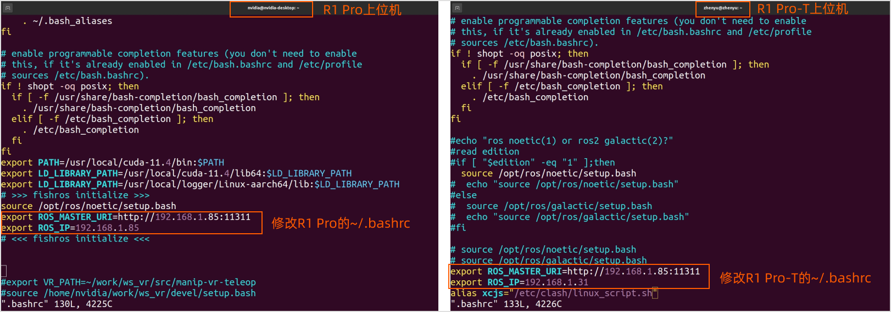
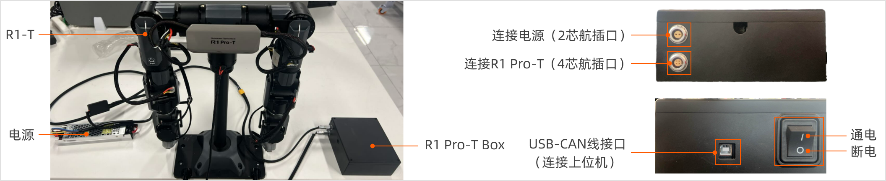
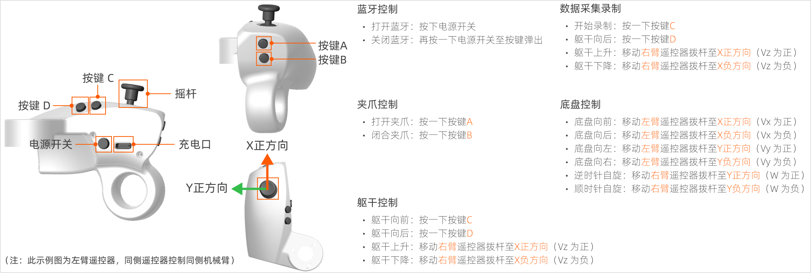
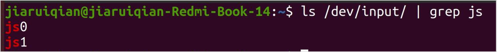

# R1 Pro Teleop 同构遥操作 ROS1使用说明
请下载[ROS1 SDK](./R1Pro_Teleop_Usage_Tutorial.md)并使用Ubuntu20.04系统，即可执行以下操作。


## 1. 软件准备
#### 1.2 安装软件依赖环境
请在R1 Pro-T上位机安装以下环境依赖。

```Bash
sudo apt install ros-noetic-joy 
sudo apt install ros-noetic-trac-ik
sudo apt install tmuxp
sudo apt install tmux
```

### 1.2 多机通信配置
<span style="color:red;">注意：确保R1Pro和R1Pro-T在同一网关时，分别修改R1 Pro和R1 Pro-T上位机环境的`~/.bashrc`文件。</span>

1. 在R1 Pro ECU的`~/.bashrc`文件末尾加入以下内容：
    ```Bash
    export ROS_MASTER_URI=http://R1 Pro的ip地址:11311
    export ROS_IP=R1 Pro的ip地址
    ```
2. 在R1 Pro-T上位机的`~/.bashrc`文件末尾加入以下内容：
    ```Bash
    export ROS_MASTER_URI=http://R1 Pro的ip地址:11311
    export ROS_IP=R1 Pro-T的ip地址
    ```
3. 示例：

    R1 Pro和R1 Pro-T上位机同处于192.168.10.0网关下，分别修改R1Pro和R1Pro-T上位机的`~/.bashrc`。

    

## 2. 连接R1 Pro-T 本体
### 2.1 固定设备
请使用G夹固定器将R1-T Base固定至桌面，如下图所示：


### 2.2 连接设备
请按下图所示连接设备。



1. 将2芯航插连接线的一端连接至R1 Pro-T Box，另一端连接至电源适配器的XT60母头。
2. 将4芯航插连接线的一端连接至R1 Pro-T Box，另一端连接至R1 Pro-T的躯干电机。
3. 将蓝色USB-CAN线一端连至接R1 Pro-T Box，另一端连接至上位机的USB接口。

**<span style="color:red;">注意：连接完成后不要立刻上电，请按照以下步骤继续操作。</span>**

### 2.3 打开电源
将R1 Pro-T固定至桌面后，按下图所示的初始位置摆放手臂和躯干，<span style="color:red;">**确保左右臂的J5、J6、J7电机及R1 Pro-T均处于零点位置后**，</span>方可计入电源，然后打开R1 Pro-T Box上的电源按键上电。


**<span style="color:red;">注意：每次启动R1 Pro-T之前，请务必将其姿态调整为零点姿态。</span>**

### 2.4 连接蓝牙遥控手柄
请务必依次将左臂和右臂连接至R1 Pro-T上位机，确保**<span style="color:red;">先连接左臂手柄，再连接右臂手柄</span>**。

<span style="color:red;">注意：由于程序设置，如若手柄连接顺序错误，请关闭两个蓝牙手柄电源后重新上电，再按正确顺序进行连接。</span>

#### 2.4.1 遥控器使用说明



#### 2.4.2 连接蓝牙

1. 按下电源开关，打开手柄蓝牙。
2. 打开上位机的蓝牙，连接两个名称为“HID”的设备。
3. 连接后显示“设备已连接”。输入以下命令确认是否连接成功：
   ```Python
   ls /dev/input/ | grep js
   ```
    当同时返回`js0`（后续代码将此设备符识别为左臂手柄）和`js1`（后续代码将此设备符识别为右臂手柄），即为连接成功。
    

## 3. 启动SDK
### 3.1 启动R1 Pro SDK

使用以下脚本，一键启动R1 Pro。

```bash
cd ${SDK_path}/install/share/startup_config/script/
./robot_startup.sh boot ../session.d/ATCStandard/R1PROIsomorphicTeleop.d/
```

此脚本会拉起roscore、HDAS、mobiman、相机、雷达等节点。


### 3.2 启动R1 Pro-T SDK

**<span style="color:red;">注意：此步骤须在R1 Pro-T上位机中执行。</span>**

在控制R1 Teleop的整个过程中，您需要打开多个窗口。我们建议您使用TMUX。常用指令如下：

- 创建新窗口：按`Ctrl + B`然后按`C`。
- 切换窗口：按`Ctrl + B`然后按数字，数字表示窗口的序号。

现在，您可以按照以下步骤启动CAN驱动程序。

1. 启动TMUX。
   ```bash
   tmux
   ```
2. 启动FDCAN通信。
   ```bash
   sudo ip link set dev can0 type can bitrate 1000000 dbitrate 5000000 fd on
   sudo ip link set up can0
   ```
3. 按下`Ctrl + D`退出TMUX。
4. 启动R1 Pro-T HDAS节点。
   ```bash
   cd ${R1Pro-T_SDK_path}/install
   source setup.bash
   roslaunch HDAS r1prot.launch
   ```
5. 启动R1 Pro-T teleoperation节点。
   ```bash
   cd ${R1Pro-T_SDK_path}/install
   source setup.bash
   roslaunch mobiman r1_pro_teleoperation.launch
   ```

完成以上步骤后，等待3-5秒钟，便可操控R1 Pro-T。


## 4. 数据采集
### 4.1 数据格式介绍
数据采集的文件格式为rosbag，文件后缀为`*.bag`。

### 4.2 数据获取

默认存储路径：`/home/nvidia/GalaxeaDataset/{date}/`

> date 为当天日期，格式如下：20250307

### 4.3 数据落盘文件介绍

数据以 `rosbag + json` 格式保存，文件一一对应。

```JSON
# 例如以下两个文件代表了一个数据包：

S2R12000P18245_20240213173320125_RAW.bag
S2R12000P18245_20240213173320125_RAW.json

# 格式为 robot_serial_number+timestamp+RAW
# robot_serial_number：机器人序列号，位于 /opt/galaxea/body/RSN
# timestamp：数据采集的时间戳精确到毫秒
# RAW：代表数据采集原始落盘数据
```
### 4.4 录制数据
使用左手柄进行数据录制操作：

<table style="width: 100%; border-collapse: collapse;">
    <thead>
        <tr style="background-color: black; color: white; text-align: left;">
            <th style="width: 200px; padding: 8px; border: 1px solid #ddd;">功能</th>
            <th style="width: 400px; padding: 8px; border: 1px solid #ddd;">操作</th>
            <th style="width: 400px; padding: 8px; border: 1px solid #ddd;">描述</th>
        </tr>
    </thead>
    <tbody>
        <tr style="background-color: white; text-align: left;">
            <td style="padding: 8px; border: 1px solid #ddd;">开启录制</td>
            <td style="padding: 8px; border: 1px solid #ddd;">点击一下左手柄 C 键</td>
            <td style="padding: 8px; border: 1px solid #ddd;">开始数据录制</span></td>
        </tr>
        <tr style="background-color: white; text-align: left;">
                <td style="padding: 8px; border: 1px solid #ddd;">停止录制</td>
            <td style="padding: 8px; border: 1px solid #ddd;">点击一下左手柄 D 键</td>
            <td style="padding: 8px; border: 1px solid #ddd;">停止数据录制</td>
        </tr>
        <tr style="background-color: white; text-align: left;">
            <td style="padding: 8px; border: 1px solid #ddd;">删除当前录制</td>
            <td style="padding: 8px; border: 1px solid #ddd;">点击一下左手柄 C 键</td>
            <td style="padding: 8px; border: 1px solid #ddd;">若已经有录制在进行中，再点击一下C键将结束并删除当前录制（两次按键的间隔在5秒以上），数据不会落盘。</td>
        </tr>
    </tbody>
</table>

如在安装和启动过程中有任何问题，请及时与我们联系至[support@galaxea.ai](mailto:support@galaxea.ai)或致电4008 780 980获得技术支持！
