# R1 Pro VR遥操作使用教程
## 1. 产品介绍
VR遥操作系统提供沉浸式的远程控制体验，使操作员能够通过精准反馈和实时响应控制 R1 Pro 机器人。系统支持全身同步，提供直观且高精度的操作界面，具备毫米级精度和毫秒级响应速度。该系统设计用于在复杂环境中无缝互动，非常适合需要精细和精准机器人控制的任务。

接下来的教程将详细介绍VR遥操作产品的激活方法、使用手册和实际视频演示，助您迅速体验这款高性能遥操作平台。

## 2. 启动前准备
### 2.1 硬件准备
<table style="width: 100%; border-collapse: collapse;">
    <thead>
        <tr style="background-color: black; color: white; text-align: left;">
            <th style="width: 200px; padding: 8px; border: 1px solid #ddd;">物品</th>
            <th style="width: 100px; padding: 8px; border: 1px solid #ddd;">数量</th>
            <th style="width: 400px; padding: 8px; border: 1px solid #ddd;">备注</th>
        </tr>
    </thead>
    <tbody>
        <tr style="background-color: white; text-align: left;">
            <td style="padding: 8px; border: 1px solid #ddd;">Meta Quest 3 VR设备</td>
            <td style="padding: 8px; border: 1px solid #ddd;">1</td>
            <td style="padding: 8px; border: 1px solid #ddd;">包含1个头戴设备、2个手持遥控器和Type-C连接线。</td>
        </tr>
        <tr style="background-color: white; text-align: left;">
                <td style="padding: 8px; border: 1px solid #ddd;">R1 Pro Base</td>
            <td style="padding: 8px; border: 1px solid #ddd;">1</td>
            <td style="padding: 8px; border: 1px solid #ddd;">机器人本体。</td>
        </tr>
        <tr style="background-color: white; text-align: left;">
            <td style="padding: 8px; border: 1px solid #ddd;">R1 Pro 遥控器</td>
            <td style="padding: 8px; border: 1px solid #ddd;">1</td>
            <td style="padding: 8px; border: 1px solid #ddd;">控制R1机器人</td>
        </tr>
        <tr style="background-color: white; text-align: left;">
            <td style="padding: 8px; border: 1px solid #ddd;">R1 Pro 上位机（双系统，非虚拟机）</td>
            <td style="padding: 8px; border: 1px solid #ddd;">1</td>
            <td style="padding: 8px; border: 1px solid #ddd;">系统：Ubuntu20.04 ROS Noetic</br>用于给R1 Pro Base升级软件程序</td>
        </tr>
        <tr style="background-color: white; text-align: left;">
            <td style="padding: 8px; border: 1px solid #ddd;">局域网</td>
            <td style="padding: 8px; border: 1px solid #ddd;">1</td>
            <td style="padding: 8px; border: 1px solid #ddd;">用于连接VR设备和R1 Pro Base。</td>
        </tr>
    </tbody>
</table>


### 2.2 软件准备
点击下方链接获取R1 Pro VR 遥操作SDK`V1.1.4`。(R1 Pro整机SDK版本中包含VR遥操作SDK)

- 百度云盘：[R1 Pro SDK V1.1.4](https://pan.baidu.com/s/1rQd3_Cu4E9PjygupxeQDig?pwd=v114)
- Google Drive: [R1 Pro SDK V1.1.4](https://drive.google.com/drive/folders/1RTt6NMOoA0pjbx5qXkYCb2fyQyUHyZFf?usp=sharing)

VR设备配置SDK：

- `Meta 相关安装包.zip`：用于新设备激活。
- `platform-tools-latest-windows.zip`：adb文件，用于安装VR头显内部的数据采集APP。
- `GalaxeaVR-V1-0-1.apk`：VR头显内部的数据采集APP。

## 3. VR 设备配置
### 3.1 VR设备开发者模式激活

请参考 [Meta Quest 3 开发者模式使用说明](https://blog.csdn.net/weixin_44234976/article/details/145135895?spm=1001.2014.3001.5502) 完成激活。

### 3.2 VR设备SDK安装

1. 解压ADB文件：下载并解压`platform-tools-latest-windows.zip`文件。
2. 连接VR设备：使用Type-C数据线将 VR 设备连接到电脑。
3. 授权USB连接：在VR设备中，确认并允许USB设备连接（如图所示）。
   

4. 进入ADB解压路径：打开文件资源管理器，进入解压后的ADB工具文件夹路径。
5. 拷贝APK文件：将 `GalaxeaVR-V1-0-1.apk` 文件拷贝到该路径下。
6. 安装APK：在该路径下打开命令提示符（CMD），执行以下命令安装应用：
   ```Bash
   .\adb.exe install GalaxeaVR-V1-0-1.apk 
   ```
   如果命令执行后显示 **Success**，则表示安装成功。
   

### 3.3 VR 设备配置
在 Meta Quest 3 的初始界面下，连接与R1 Pro 相同的WiFi网络。 

**注意：提示网络受限是正常现象，因为该网络无法访问外网。**

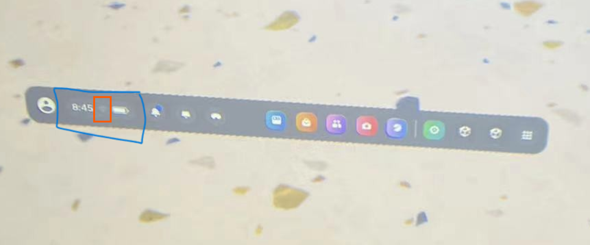

### 3.4 获取VR设备的IP地址
在VR设备内，点击已连接的WiFi，打开网络页面后向下划，找到并记录IP地址（如：192.168.5.24）。

## 4. R1 Pro 配置
安装 Galaxea R1 Pro VR遥操作SDK

1. 解压SDK文件`r1_pro_sdk_v1.1.4.tar.gz`，执行以下命令拷贝SDK到 R1 Pro 上。
    ```Bash
    scp r1_pro_sdk_v1.1.4.tar.gz nvidia@${R1_Pro_IP}:~/Downloads
    ```

2. 登陆 R1 Pro
    ```Bash
    ssh nvidia@${R1_Pro_IP}
    ```

3. 解压SDK到 R1 Pro
    ```Bash
    mkdir ~/vr_workspace
    tar -zxvf ~/Downloads/r1_pro_sdk_v1.1.4.tar.gz -C ~/vr_workspace
    ```

4. 安装额外依赖
    ```Bash
    pip3 install websockets pyquaternion
    ```

升级完成后，将机器人 R1 Pro 下电并重新启动。重启后，软件包配置完成，VR遥操作功能即可使用。

## 5.遥操作启动
<span style="color:red;">**注意：每次启动时都需要完成并确认本章节的所有操作。**</span>

### 5.1 R1 Pro 本体程序启动

1. 登录R1 Pro
    ```Bash
    ssh nvidia@${R1_Pro_IP}
    ```

2. 进入软件包启动目录
    ```Bash
    cd ~/vr_workspace/install/share/startup_config/script/
    ```

3. 启动程序
    ```Bash
    ROS_IP=${R1_Pro_IP} ROS_MASTER_URI=http://${R1_Pro_IP}:11311 VR_IP=${VR_IP} ./robot_startup.sh boot ../session.d/ATCStandard/R1PROVRTeleop.d/
    ```

### 5.2 VR设备程序启动
<span style="color:red;">**注意：请佩戴好VR设备并手持两个遥控器，开始以下操作。**</span>

#### 5.2.1. 连接WiFi
确认VR设备已成功连接到与 R1 Pro 本体相同的WiFi网络。

#### 5.2.2. 新建边界

1. 点击左下角的WiFi和电池界面，选择**“边界”**。
   

2. 根据提示选择**”新建边界”**，可以看到脚下出现一个蓝色的圈，表示边界已建立。
   

   <span style="color:red;">**新建边界后，直到结束 VR 遥操作任务前，请不要挪动双脚。**</span>

#### 5.2.3. 启动GalaxeaVR APP

1. **打开GalaxeaVR应用**：

    点击右下角的正方体图标启动GalaxeaVR应用。
   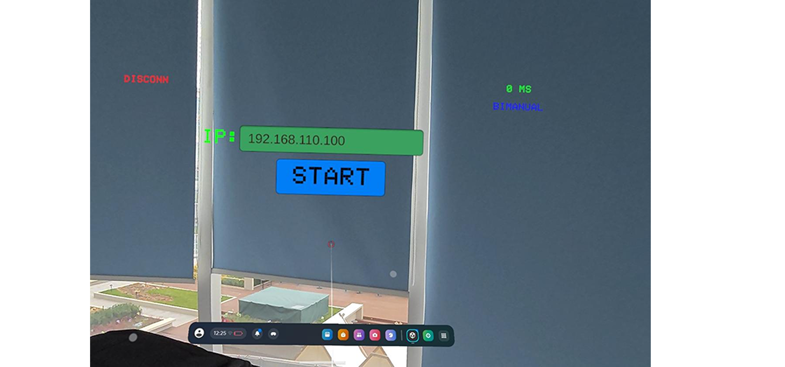

2. **输入R1 Pro的IP地址**：

    进入GalaxeaVR应用后，将VR手柄发射的射线对准绿色的IP输入框。

    等待绿色输入框轻微变色后，用右控制器的T键（食指键）点击输入框（光标位置需要偏下一些）。

    键盘弹出后，输入机器人端的IP地址（即R1_Pro_IP）。

3. **操控VR设备**:

    设置好IP后点击**Start**按钮开始。

    双手立刻自然下垂放在身体两侧，等待3秒后开始操控。

    **注意：此时机器人会同步您的操作，请注意安全，先进行小幅移动，确保周围没有障碍物。**
    

4. **VR设备图像显示** :

    此时，您可以看到机器人头部相机的图像。
    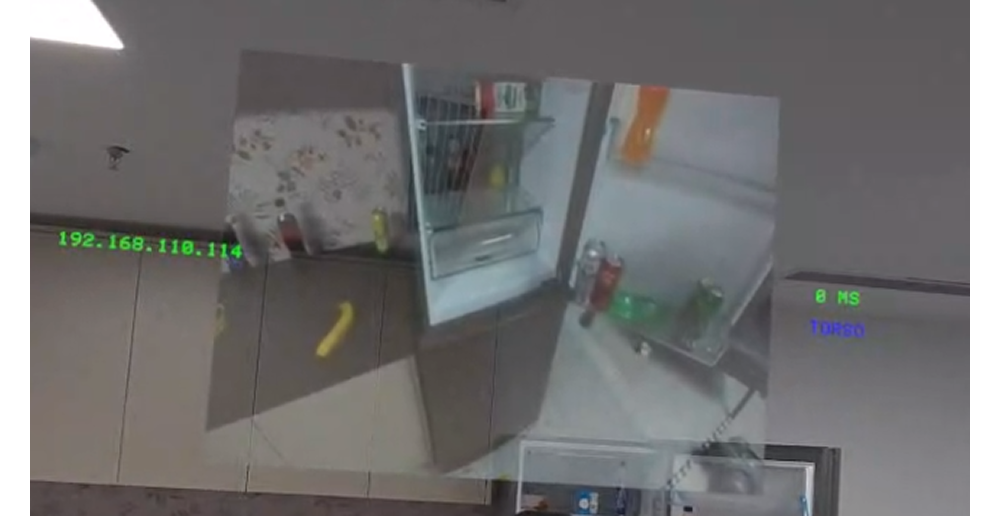
   
您可使用以下步骤完成简易操作：

- **停止操作**：长按 B 键 2 秒以上，停止VR遥操作。
- **控制夹爪**：手的移动会控制机器人手臂的移动。左遥控器的 T 键和右遥控器的 T 键分别控制左右手的夹爪闭合。
- **暂停右臂**：短按右遥控器 G 键一下，右臂会停在当前的位置；再按一下 G 键解除暂停。
- **暂停左臂**：短按左遥控器 G 键一下，左臂会停在当前的位置；再按一下 G 键解除暂停。

详细操作说明请参考[第6章节：遥操作控制说明](#61遥控器使用说明)。

## 6.遥操作控制说明
请在确保人员与物品安全的情况下，于开阔场地练习本产品的使用。

建议待熟悉本产品的使用后，再开始正式数据采集。

### 6.1遥控器使用说明
#### 6.1.1 R1 Pro 航空遥控器

遥控器使用说明如下：

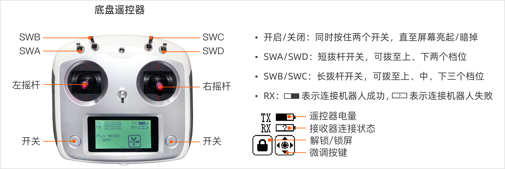

<span style="color:red;">**注意：在进行任何操作之前，请确认所有拨杆开关（SWA/SWB/SWC/SWD）都拨至最上方档位，这样能使 R1 Pro 处于停止状态，防止其意外运行。**</span>

在不同功能下，各拨杆开关切换到不同位置的操作说明如下：


#### 6.1.2 VR手持遥控器

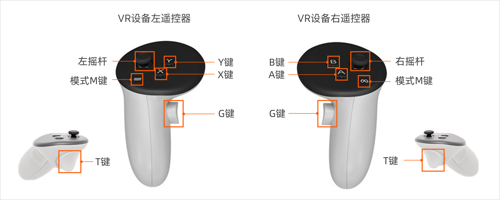

### 6.2 VR设备APP显示按键

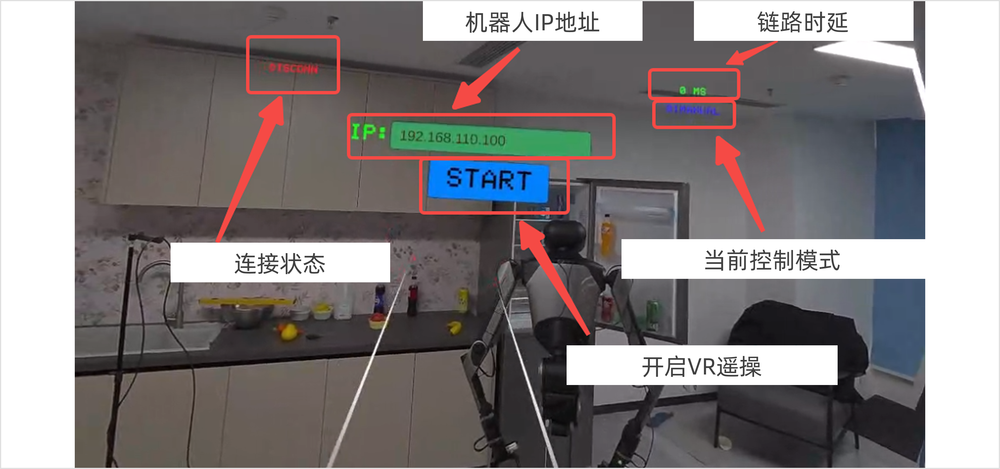

### 6.3 模式切换

遥操作启动后，默认模式为**双臂操控模式**。用户可以通过VR设备遥控器切换不同的操作模式。
<table style="width: 100%; border-collapse: collapse;">
    <thead>
        <tr style="background-color: black; color: white; text-align: left;">
            <th style="width: 200px; padding: 8px; border: 1px solid #ddd;">模式</th>
            <th style="width: 300px; padding: 8px; border: 1px solid #ddd;">切换方式</th>
            <th style="width: 300px; padding: 8px; border: 1px solid #ddd;">备注</th>
        </tr>
    </thead>
    <tbody>
        <tr style="background-color: white; text-align: left;">
            <td style="padding: 8px; border: 1px solid #ddd;">双臂操控模式</br>
（BIMANUAL）</td>
            <td style="padding: 8px; border: 1px solid #ddd;">左右两个摇杆同时向下长按1秒
</td>
            <td style="padding: 8px; border: 1px solid #ddd;">默认模式，如需控制底盘，需要开启 R1 Pro 遥控器，并将 SWA，SWB，SWC，SWD全部拨至上方。</td>
        </tr>
        <tr style="background-color: white; text-align: left;">
            <td style="padding: 8px; border: 1px solid #ddd;">躯干模式</br>
（Torso）</td>
            <td style="padding: 8px; border: 1px solid #ddd;">右摇杆向下长按1秒</td>
            <td style="padding: 8px; border: 1px solid #ddd;">-</td>
        </tr>
    </tbody>
</table>


#### 6.3.1双臂操控模式
<table style="width: 100%; border-collapse: collapse;">
    <thead>
        <tr style="background-color: black; color: white; text-align: left;">
            <th style="width: 200px; padding: 8px; border: 1px solid #ddd;">功能</th>
            <th style="width: 300px; padding: 8px; border: 1px solid #ddd;">描述</th>
            <th style="width: 300px; padding: 8px; border: 1px solid #ddd;">备注</th>
        </tr>
    </thead>
    <tbody>
        <tr style="background-color: white; text-align: left;">
            <td style="padding: 8px; border: 1px solid #ddd;">双手跟随</td>
            <td style="padding: 8px; border: 1px solid #ddd;">R1 Pro 机械臂末端位置会跟随VR手持遥控器的移动而移动。
</td>
            <td style="padding: 8px; border: 1px solid #ddd;">-</td>
        </tr>
        <tr style="background-color: white; text-align: left;">
                <td style="padding: 8px; border: 1px solid #ddd;">夹爪夹取</td>
            <td style="padding: 8px; border: 1px solid #ddd;">VR右遥控器的 T 键控制右夹爪开合</br>VR左遥控器的 T 键控制左夹爪开合</td>
            <td style="padding: 8px; border: 1px solid #ddd;">-</td>
        </tr>
        <tr style="background-color: white; text-align: left;">
            <td style="padding: 8px; border: 1px solid #ddd;">手臂暂停</td>
            <td style="padding: 8px; border: 1px solid #ddd;">VR右遥控器的 G 键控制右臂的暂停</br>VR左遥控器的 G 键控制左臂的暂停</br>按一下暂停，再按一下解除暂停</td>
            <td style="padding: 8px; border: 1px solid #ddd;">解除暂停时，要确保手持遥控器的位置与点击暂停时的位置一致，否则机械臂可能会出现较大幅度的突然移动。</td>
        </tr>
        <tr style="background-color: white; text-align: left;">
                <td style="padding: 8px; border: 1px solid #ddd;">底盘前进/后退</td>
            <td style="padding: 8px; border: 1px solid #ddd;">VR左遥控器摇杆向前/向后</td>
            <td style="padding: 8px; border: 1px solid #ddd;">-</td>
        </tr>
                <tr style="background-color: white; text-align: left;">
                <td style="padding: 8px; border: 1px solid #ddd;">底盘平移</td>
            <td style="padding: 8px; border: 1px solid #ddd;">VR左遥控器摇杆向左/向右</td>
            <td style="padding: 8px; border: 1px solid #ddd;">-</td>
        </tr>
                <tr style="background-color: white; text-align: left;">
                <td style="padding: 8px; border: 1px solid #ddd;">底盘自旋</td>
            <td style="padding: 8px; border: 1px solid #ddd;">VR右遥控器摇杆向左/向右</td>
            <td style="padding: 8px; border: 1px solid #ddd;">-</td>
        </tr>
    </tbody>
</table>


#### 6.3.2躯干模式
<table style="width: 100%; border-collapse: collapse;">
    <thead>
        <tr style="background-color: black; color: white; text-align: left;">
            <th style="width: 200px; padding: 8px; border: 1px solid #ddd;">功能</th>
            <th style="width: 300px; padding: 8px; border: 1px solid #ddd;">描述</th>
            <th style="width: 300px; padding: 8px; border: 1px solid #ddd;">备注</th>
        </tr>
    </thead>
    <tbody>
        <tr style="background-color: white; text-align: left;">
            <td style="padding: 8px; border: 1px solid #ddd;">腰部左右旋转</td>
            <td style="padding: 8px; border: 1px solid #ddd;">VR左遥控器摇杆向左/向右
</td>
            <td style="padding: 8px; border: 1px solid #ddd;">关节1运动</td>
        </tr>
        <tr style="background-color: white; text-align: left;">
                <td style="padding: 8px; border: 1px solid #ddd;">腰部前后俯仰</td>
            <td style="padding: 8px; border: 1px solid #ddd;">VR左遥控器摇杆向前/向后</td>
            <td style="padding: 8px; border: 1px solid #ddd;">关节2运动</td>
        </tr>
        <tr style="background-color: white; text-align: left;">
                <td style="padding: 8px; border: 1px solid #ddd;">躯干上下升降</td>
            <td style="padding: 8px; border: 1px solid #ddd;">VR右遥控器摇杆向前/向后</td>
            <td style="padding: 8px; border: 1px solid #ddd;">关节3运动</td>
        </tr>
        <tr style="background-color: white; text-align: left;">
                <td style="padding: 8px; border: 1px solid #ddd;">躯干前后俯仰</td>
            <td style="padding: 8px; border: 1px solid #ddd;">VR右遥控器T/G键</td>
            <td style="padding: 8px; border: 1px solid #ddd;">关节4运动</td>
        </tr>
    </tbody>
</table>


### 6.4 连接腕部相机
#### 6.4.1 连接前准备
请在连接腕部相机前，准备好以下物品：
<table style="width: 100%; border-collapse: collapse;">
    <thead>
        <tr style="background-color: black; color: white; text-align: left;">
            <th style="width: 200px; padding: 8px; border: 1px solid #ddd;">物品</th>
            <th style="width: 100px; padding: 8px; border: 1px solid #ddd;">数量</th>
            <th style="width: 400px; padding: 8px; border: 1px solid #ddd;">备注</th>
        </tr>
    </thead>
    <tbody>
        <tr style="background-color: white; text-align: left;">
            <td style="padding: 8px; border: 1px solid #ddd;">腕部相机</td>
            <td style="padding: 8px; border: 1px solid #ddd;">2</td>
            <td style="padding: 8px; border: 1px solid #ddd;">-</td>
        </tr>
        <tr style="background-color: white; text-align: left;">
                <td style="padding: 8px; border: 1px solid #ddd;">腕部相机支架</td>
            <td style="padding: 8px; border: 1px solid #ddd;">2</td>
            <td style="padding: 8px; border: 1px solid #ddd;">用于固定相机至机器人腕部</td>
        </tr>
        <tr style="background-color: white; text-align: left;">
            <td style="padding: 8px; border: 1px solid #ddd;">USB-A转USB-C转接线</td>
            <td style="padding: 8px; border: 1px solid #ddd;">2</td>
            <td style="padding: 8px; border: 1px solid #ddd;">用于连接机器人背部的USB-A外设接口和腕部相机的USB-C接口<br>转接线的长度需≥1.5m</td>
        </tr>
    </tbody>
</table>


#### 6.4.2 连接相机线束
1. 安装腕部相机支架至机器人腕部，并固定相机。
2. 使用USB-A转USB-C转接线，连接机器人背部的任一USB-A外设接口和腕部相机的USB-C接口。

#### 6.4.3 配置相机
<span style="color:red;">**注意：为避免在配置相机过程中混淆两个相机的序列号，建议您先连接一个相机进行配置，然后再连接第二个相机进行配置。**</span>

1. 进入腕部相机配置目录：
    ```bash
    cd ~/vr_workspace/install/share/realsense2_camera/launch
    ```
2. （以先连接左腕相机为例）连接左腕相机线束后，执行以下命令查看并记录该相机的序列号`Serial Number`:
    ```bash
    rs-enumerate-devices  | grep Serial
    ```
    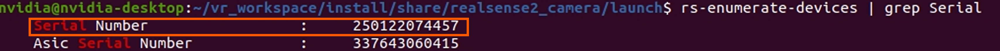
3. 连接右腕相机线束后，再次执行命令查看并记录该相机的序列号`Serial Number`:
    ```bash
    rs-enumerate-devices  | grep Serial
    ```
    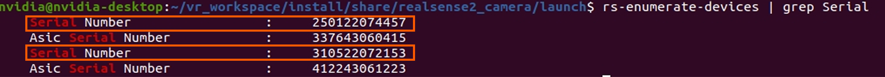
    <span style="color:red;">注意：序列号的排列先后与相机连接的顺序无关，因此建议您先连接一个相机并记录其序列号后，再连接第二个相机记录其序列号。</span>

4. 使用vim工具修改launch文件中的相机序列号：
    ```bash
    vim rs_multiple_devices.launch
    #无论先连接哪个相机，左腕相机名称固定为“camera1”,右腕相机名称固定为“camera2”。
    ```
    在对应名称的位置填入此前记录的两个相机序列号。
    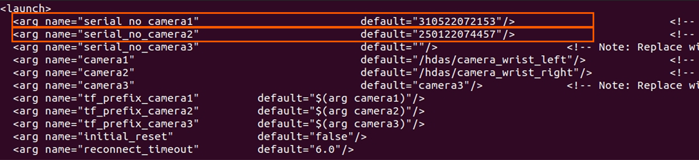
5. 重新启动程序：
    ```bash
    cd ~/vr_workspace/install/share/startup_config/script/
    ./robot_startup.sh kill
    ./robot_startup.sh boot ../session.d/ATCStandard/R1PROVRTeleop.d/
    ```
6. 检查相机帧率：
    ```bash
    cd ~/vr_workspace/install/
    source setup.bash
    rostopic hz /hdas/camera_wrist_right/color/image_raw/compressed /hdas/camera_wrist_left/color/image_raw/compressed
    ```
    若出现两个摄像头的数值，且数值均在15hz左右即为连接成功。
    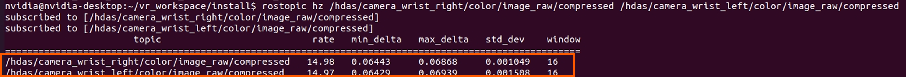

<span style="color:red;">**注意：每台机器人的腕部相机仅需配置一次，后续可按照5.1的方式，在启动机器人时直接启动相机。**</span>

## 7. 数据采集流程
### 7.1 数据格式介绍
数据采集的文件格式为**rosbag**，文件后缀为`*.bag`。

### 7.2 数据获取
**默认存储路径：`/home/nvidia/GalaxeaDataset/{data}/`**

date 为当天日期，格式如下：20250307

### 7.3  数据录制配置文件介绍
默认数据录制使用的配置文件位于：

```Bash
/opt/galaxea/data_collection/data_task_config.json
```

**配置文件说明**：配置文件用于描述此次采集任务的信息，用户可以根据需求自行修改。

```YAML
{
    "project_info": {
        "project_name": "sop_test"
    },
    "task_info": {
        "task_name": "sop_test_data_collection",
        "task_owner": "hengyi.fei"  
    },
    "operation_info": {
        "teleoperation_type": "VR",
        "location": "suzhou",
        "operator_name": "jiahao.wu"
    }
}
```

### 7.4  数据落盘文件介绍
数据以 **`rosbag + json`** 格式保存，文件一一对应。例如：

```YAML
 # 例如以下两个文件代表了一个数据包
 S2R12000P18245_20240213173320125_RAW.bag
 S2R12000P18245_20240213173320125_RAW.json
 # 格式为 robot_serial_number+timestamp+RAW
 # robot_serial_number：机器人序列号，位于 /opt/galaxea/body/RSN，章节4中配置过
 # timestamp：数据采集的时间戳精确到毫秒。
 # RAW：代表数据采集原始落盘数据
```

###  7.5 开启录制
通过VR左遥控器进行数据录制操作：
<table style="width: 100%; border-collapse: collapse;">
    <thead>
        <tr style="background-color: black; color: white; text-align: left;">
            <th style="width: 200px; padding: 8px; border: 1px solid #ddd;">功能</th>
            <th style="width: 300px; padding: 8px; border: 1px solid #ddd;">操作</th>
            <th style="width: 300px; padding: 8px; border: 1px solid #ddd;">描述</th>
        </tr>
    </thead>
    <tbody>
        <tr style="background-color: white; text-align: left;">
            <td style="padding: 8px; border: 1px solid #ddd;">开启录制</td>
            <td style="padding: 8px; border: 1px solid #ddd;">左手柄 X 键点击一下
</td>
            <td style="padding: 8px; border: 1px solid #ddd;">开始数据录制</td>
        </tr>
        <tr style="background-color: white; text-align: left;">
                <td style="padding: 8px; border: 1px solid #ddd;">停止录制</td>
            <td style="padding: 8px; border: 1px solid #ddd;">左手柄 Y 键点击一下</td>
            <td style="padding: 8px; border: 1px solid #ddd;">停止数据录制</td>
        </tr>
        <tr style="background-color: white; text-align: left;">
                <td style="padding: 8px; border: 1px solid #ddd;">删除当前录制</td>
            <td style="padding: 8px; border: 1px solid #ddd;">左手柄 X 键点击一下</td>
            <td style="padding: 8px; border: 1px solid #ddd;">已经有录制在进行中，再点击一下X键，则结束并删除当前录制，不会落盘。</td>
        </tr>
    </tbody>
</table>

### 8. 夹爪夹持力更改
当前默认的加持速度较快，夹持力较大。如需更改，可手动调整配置文件。

```bash
/home/nvidia/vr_workspace/install/share/mobiman/config/gripper_controller_kp_kd.toml
```
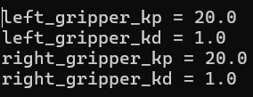

### 9.机器人监控平台
该平台包含了机器人状态上报及报警功能。

<span style="color:blue;">**机器人监控平台为付费启用功能，目前处于测试阶段，如需深入了解及购买试用，请联系product@galaxea.ai或致电4008 780 980。**</span>

1. 启动遥操作后，请登录星海图EDP具身数据平台 [https://edp.galaxea-ai.com](https://edp.galaxea-ai.com)
   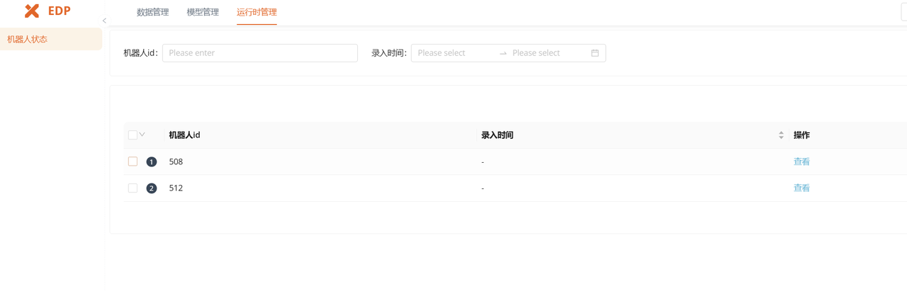

2. 选择对应机器人ID，即可监控topic状态等信息。
   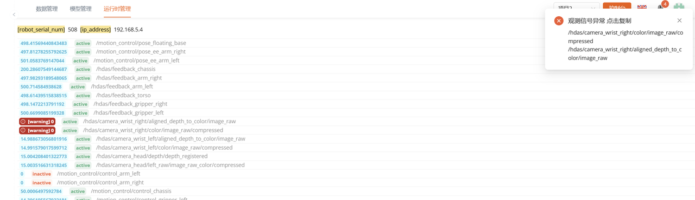

<span style="color:blue;">如在安装和启动过程中有任何问题，请及时与我们联系至support@galaxea.ai或致电4008-780-980获得技术支持！</span>