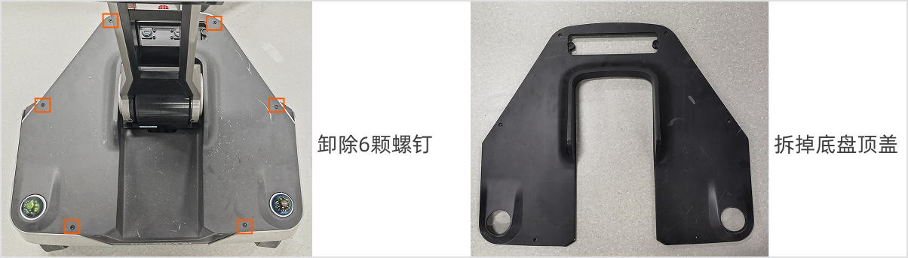
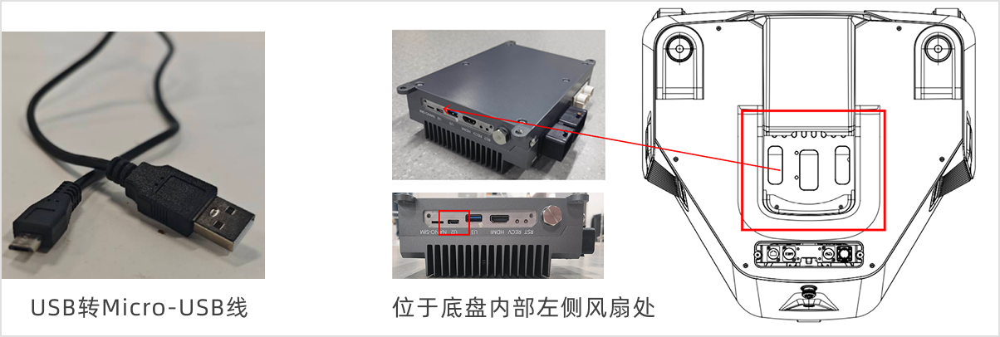
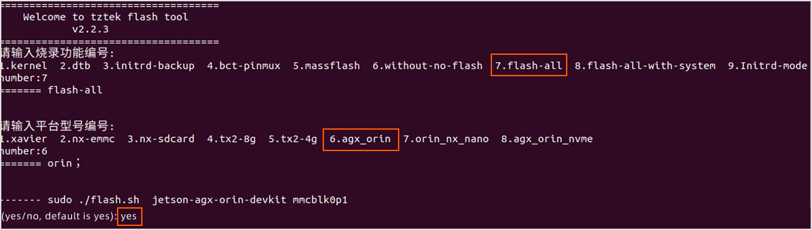
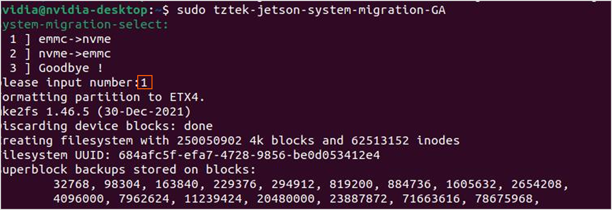

# ROS2 升级烧录操作教程
> 本节概述了在机器设备上从ROS1升级到ROS2的详细操作说明。本流程将一次性完整安装ROS2系统和机器人SDK软件依赖。

## 升级版本信息
- JetPack版本：6.0
- 操作系统：Ubuntu 22.04
- 机器人操作版本：ROS2 Humble

## 1. 升级前准备
### 1.1 硬件准备
<table style="width: 100%; border-collapse: collapse;">
    <thead>
        <tr style="background-color: black; color: white; text-align: left;">
            <th style="width: 300px; padding: 8px; border: 1px solid #ddd;">物品</th>
            <th style="width: 200px; padding: 8px; border: 1px solid #ddd;">数量</th>
            <th style="width: 400px; padding: 8px; border: 1px solid #ddd;">备注</th>
        </tr>
    </thead>
    <tbody>
        <tr style="background-color: white; text-align: left;">
            <td style="padding: 8px; border: 1px solid #ddd;">电脑</td>
            <td style="padding: 8px; border: 1px solid #ddd;">1</td>
            <td style="padding: 8px; border: 1px solid #ddd;">系统：Ubuntu 20.04，x86型号<br>环境：Python<br>硬盘空间：至少预留110G</td>
        </tr>
        <tr style="background-color: white; text-align: left;">
            <td style="padding: 8px; border: 1px solid #ddd;">USB转Micro-USB数据线</td>
            <td style="padding: 8px; border: 1px solid #ddd;">1</td>
            <td style="padding: 8px; border: 1px solid #ddd;">用于连接机器与电脑，进行烧录操作。</td>
        </tr>
        <tr style="background-color: white; text-align: left;">
            <td style="padding: 8px; border: 1px solid #ddd;">网线</td>
            <td style="padding: 8px; border: 1px solid #ddd;">1</td>
            <td style="padding: 8px; border: 1px solid #ddd;">用于连接机器与电脑，获取IP地址。</td>
        </tr>
        <tr style="background-color: white; text-align: left;">
            <td style="padding: 8px; border: 1px solid #ddd;">内六角扳手</td>
            <td style="padding: 8px; border: 1px solid #ddd;">1</td>
            <td style="padding: 8px; border: 1px solid #ddd;">用于拆除机器底盘螺丝。</td>
        </tr>
    </tbody>
</table>

<span style="color:red;">**注意：**</span>

1. <span style="color:red;">建议使用Ubuntu20.04进行烧录，经测试其他版本可能导致烧录异常。</span>
2. <span style="color:red;">建议烧录前关闭电脑的防火墙，以免出现报错。</span>

在上位机执行以下命令配置Python环境：
```Bash
sudo apt install python3
```

### 1.2 软件准备

点击以下链接获取内核文件：

- 百度云:  [ROS2 升级烧录软件](https://pan.baidu.com/s/1StcwZWdzdwKeXJvXYBMTtA?pwd=ros2)
- Google Cloud：[ROS2 Upgrade Resources](https://drive.google.com/drive/folders/1it93gjL04eEj1ruAoGWRckGS6Q3ycgIt?usp=sharing)


<span style="color:red;">**注意：建议将所有文件下载到路径`~/Downloads/ROS2_software_flashing_tool`中。软件路径下禁止使用中文字符。**</span>

## 2. 连接烧录线
### 2.1 拆除底盘盖板
将机器人关机断电，使用L型六角扳手卸下底盘盖板的6个固定螺钉，卸下盖板。


### 2.2 连接线束
使用USB转Micro-USB数据线，将Micro-USB端连接到ECU的U2接口（如图所示，ECU位于底盘中央，建议从底盘左侧风扇处的空隙将线束接入插口），USB端接入上位机的USB插口。


## 3. 软件烧录流程
### 3.1 SSH连接机器人
请在上位机终端中输入以下命令以连接机器人Orin。
```Bash
ssh nvidia@IP address
# 密码（默认）：nvidia
```

### 3.2 进入烧录模式
请在上位机中输入以下命令重启机器，使其进入烧录模式。
```Bash
sudo reboot --force forced-recovery
```

### 3.3 检查设备挂载
请在上位机终端中多次输入以下命令，以检查烧录USB线束连接重启后是否出现名为“Nvidia Crop”的串口设备，若存在,即表示已成功进入烧录模式。
```Bash
lsusb
```


### 3.4 解压烧录和镜像文件
下载并进入文件路径。
```Bash
# 建议下载路径为：
cd /home/$USER/Downloads/ROS2_software_flashing_tool
```

解压烧录工具`flashtool`。

```Bash
tar -xpf flashtool_tztek_geac_orin_jp6.0.0_GA_GEACX1_R3.0_Kv6.0.3_1126.tar.bz2
# 工具目录名过长，可重命名为flashtool：
mv flashtool_tztek_geac_orin_jp6.0.0_GA_GEACX1_R3.0_Kv6.0.3_1126 flashtool
```

解压镜像文件`system.img.raw`（硬盘空间至少预留110G）。

```Bash
tar -xpf XingHaiTu-system-20250510.tar.gz
```

### 3.5 挂载系统镜像
将镜像文件`system.img.raw`挂载到指定烧录包路径`{your_flashing_file_path}`。

```Bash
sudo mount system.img.raw /home/$USER/Downloads/ROS2_software_flashing_tool/flashtool/Linux_for_Tegra/rootfs
```

### 3.6 安装刷机运行依赖项
```Bash
# 首次烧录镜像，请先安装：
sudo apt install qemu-user-static -y
sudo ./flashtool/Linux_for_Tegra/tools/l4t_flash_prerequisites.sh

# 如遇“ E: 无法获得锁 /var/lib/apt/lists/lock。锁正由进程 xx_pid（packagekitd）持有”的错误，
# 请先执行以下命令后，再执行上述命令：
    # kill -9 xx_pid 
```

### 3.7 更新驱动
烧录之前请务必更新`initrd`驱动。
```Bash
cd flashtool/Linux_for_Tegra
sudo ./tools/l4t_update_initrd.sh 
```

暂时禁用新的USB设备插入。
```Bash
systemctl stop udisks2.service
```

### 3.8 运行烧录脚本
<span style="color:red;">注意：整个烧录过程预计持续30~40分钟，期间请勿插拔电脑和机器之间的USB-Micro数据线。烧录完成后将自动进入系统。</span>

```Bash
sudo ./tztek_flash.sh 

# 返回烧录功能编号，请输入“7“（flash_all）；
# 返回平台型号编号，请输入“6”（agx_orin）；
# 返回烧录确认，请输入“yes”，然后按下“Enter”，即可开始烧录。
```



## 4. 内核升级
### 4.1 获取机器人IP地址
将网线连接至底盘外设以太网接口，多次执行以下命令获取电脑共享给机器人设备的局域网IP地址。
```Bash
arp -a
```

在本地终端上执行以下命令。
```Bash
cd /home/$USER/Downloads/ROS2_software_flashing_tool
scp tztek-jetson-tool-eeprom-info-v1.1.deb nvidia@<ecu-ip>:~/
```

在机器人ECU的SSH终端执行以下命令。
```Bash
sudo dpkg -i tztek-jetson-tool-eeprom-info-v1.1.deb

# 查看ECU主板型号：r2.1或r3.0
sudo tztek-jetson-tool-eeprom-info -a
```

### 4.2 贝内核安装包
在本地终端上执行以下命令，拷贝内核安装包到机器人。
```Bash
# 若ECU主板型号为r2.1，输入以下指令：
scp tztek-jetson-firmware-kernel-dtb-510jx0-r2.1-jp6.0.0-v6.0.3.deb nvidia@<ecu-ip>:~/

# 若ECU主板型号为r3.0，输入以下指令：
scp tztek-jetson-firmware-kernel-dtb-510jx0-r3.0-jp6.0.0-v6.0.3.deb nvidia@<ecu-ip>:~/
```

### 4.3 安装新内核
在机器人ECU的SSH终端上执行以下命令，拷贝内核安装包到机器人设备。
<span style="color:red;">注：内核安装持续时间可能较长，期间请勿中断程序。</span>

```Bash
# 若ECU主板型号为r2.1，输入以下指令：
sudo dpkg -i ~/tztek-jetson-firmware-kernel-dtb-510jx0-r2.1-jp6.0.0-v6.0.3.deb

# 若ECU主板型号为r3.0，输入以下指令：
sudo dpkg -i ~/tztek-jetson-firmware-kernel-dtb-510jx0-r3.0-jp6.0.0-v6.0.3.deb

# 启用新内核：
sudo tztek-jetson-firmware-kernel-dtb-510jx0

# 输入以下命令重启或者通过电源按钮重启：
sudo reboot
```

### 4.4 检查内核信息
在机器人ECU的SSH终端上执行以下命令。
```Bash
cat /proc/version
```

## 5. 复制系统至SSD
系统烧录完成后，进入EMMC系统环境，并执行以下命令复制系统到SSD。（若用户无需安装系统到ECU的SSD，只将SSD作为数据盘挂载，则无需执行之后的操作。）
```Bash
# 执行内核：
sudo tztek-jetson-firmware-kernel-dtb-510jx0
sudo tztek-jetson-system-migration-GA
## 输入“1”
```

<span style="color:red;">注意：整个过程预计持续5~10分钟，请耐心等待，期间请勿中途终止或执行其他操作。</span>

等待系统复制到SSD后，重启ECU，进入SSD系统环境。输入以下指令，检查系统环境是否正确。
```Bash
df -h
```


至此，ROS2 升级烧录结束，ROS2系统、雷达、相机及机器人本体SDK模块等相关依赖均已安装完毕。

## FAQ