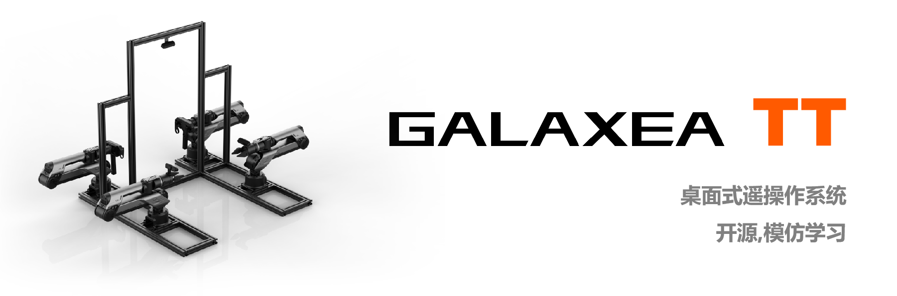
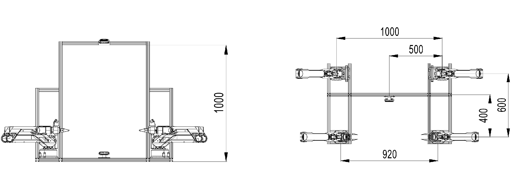
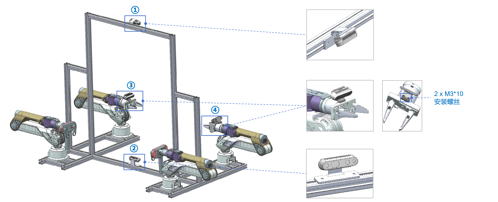

# 桌面遥操作

## **技术规格**

<table style="border-collapse: collapse; width: 100%;">
    <thead>
        <tr style="background-color: black; color: white; text-align: left;">
            <th style="vertical-align: middle; padding: 8px; border: 1px solid #ddd; width: 250px;">项目</th>
            <th style="vertical-align: middle; padding: 8px; border: 1px solid #ddd;">数值</th>
        </tr>
    </thead>
    <tbody>
        <tr style="background-color: white; text-align: left;">
            <td style="vertical-align: middle; padding: 8px; border: 1px solid #ddd; width: 250px;">尺寸</td>
            <td style="vertical-align: middle; padding: 8px; border: 1px solid #ddd;">1770L * 761W * 1051H</td>
        </tr>
        <tr style="background-color: white; text-align: left;">
            <td style="vertical-align: middle; padding: 8px; border: 1px solid #ddd; width: 250px;">主臂</td>
            <td style="vertical-align: middle; padding: 8px; border: 1px solid #ddd;">2 * Galaxea A1 + 2 * Galaxea G1-T</td>
        </tr>
        <tr style="background-color: white; text-align: left;">
            <td style="vertical-align: middle; padding: 8px; border: 1px solid #ddd; width: 250px;">从臂</td>
            <td style="vertical-align: middle; padding: 8px; border: 1px solid #ddd;">2 * Galaxea A1 + 2 * Galaxea G1</td>
        </tr>
        <tr style="background-color: white; text-align: left;">
            <td style="vertical-align: middle; padding: 8px; border: 1px solid #ddd; width: 250px;">相机</td>
            <td style="vertical-align: middle; padding: 8px; border: 1px solid #ddd;">4 * Intel RealSense D435i</td>
        </tr>
        <tr style="background-color: white; text-align: left;">
            <td style="vertical-align: middle; padding: 8px; border: 1px solid #ddd; width: 250px;">基座</td>
            <td style="vertical-align: middle; padding: 8px; border: 1px solid #ddd;">100 mm x 100 mm</td>
        </tr>
        <tr style="background-color: white; text-align: left;">
            <td style="vertical-align: middle; padding: 8px; border: 1px solid #ddd; width: 250px;">充电端口</td>
            <td style="vertical-align: middle; padding: 8px; border: 1px solid #ddd;">额定电压：48V</td>
        </tr>
        <tr style="background-color: white; text-align: left;">
            <td style="vertical-align: middle; padding: 8px; border: 1px solid #ddd; width: 250px;">USB 端口</td>
            <td style="vertical-align: middle; padding: 8px; border: 1px solid #ddd;">USB 2.0</td>
        </tr>
    </tbody>
</table>

## **技术图纸**

### **相机设置**

<u>重要提示：请使用 M3*10 的安装螺丝来固定机械臂上的相机支架。</u>

如果您需要结构文件，请访问我们的 [Tabletop Teleoperation STP 仓库](https://github.com/userguide-galaxea/STP)以获取资源。