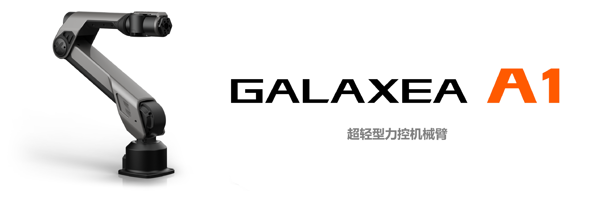
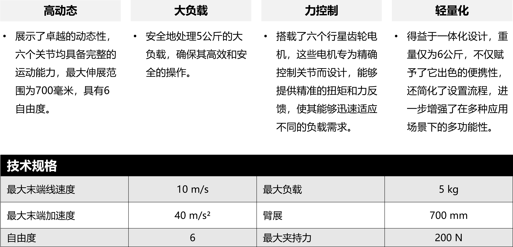

# Galaxea A1

## **高动态 & 大负载**

Galaxea A1 是一款轻型力控机械臂，拥有卓越的高动态和大负载能力。Galaxea A1 拥有出色的电气性能、强大的操控能力和多样化的关节结构，在要求精细操作的复杂应用中表现卓越。

Galaxea A1 以卓越的高速作业能力和精确的力控能力，在精细的装配操作和严格的研究实验中，都表现出无与伦比的性能。精巧的设计使其能够适应各种动作，成为精细自动化作业的理想选择。

## **关键硬件特性**

## **高级配件**

探索我们专为提升 Galaxea A1 性能而设计的配件，体验其卓越性能和创新特点。

  

      
     
    <a href="../../product_info/A1_accessory_G1" style="display: inline-block; width: 250px;">Galaxea G1</a>
  

  

      
     
    <a href="../../product_info/Dexterous_Hands" style="display: inline-block; width: 250px;">Inspire-Robots RH56 Series &nbsp&nbsp;灵巧手</a>
  

## **为AI开发量身定制**

- 模仿学习-桌面遥操作

## **探索更多**

如果您想了解更多关于Galaxea A1的硬件和软件细节，请参考Galaxea A1用户手册中的详细信息。

该手册将为您提供详尽的技术参数、操作指南和系统配置要求，帮助您充分理解和发挥Galaxea A1的无限潜力。