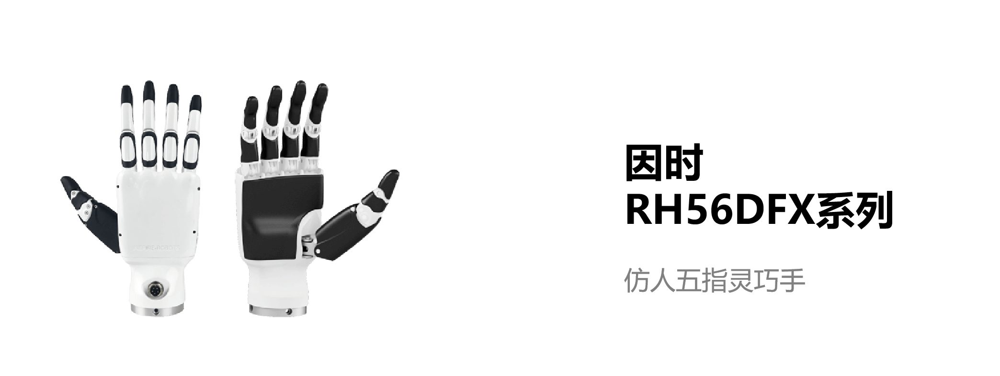

# 灵巧手

## 更强大
灵巧手列拥有6个自由度（DOF）和12个运动关节，结合力位混合控制算法，实现了亚毫米级的重复定位精度，并能够处理数公斤的负载。这些手部能够精确模拟人手的抓握动作。该系列支持 ROS 系统，并提供相应的 ROS 插件，便于集成和使用。

- 大握力
- 适中速度
- 集成力传感器

 

## 技术规格
<table style="width: 100%; border-collapse: collapse;">
    <thead>
        <tr style="background-color: black; color: white;text-align:left">
            <th style="width: 300px;">指标</th>
            <th style="width: 400px;">数值</th>
        </tr>
    </thead>
    <tbody>
        <tr style="background-color: white;">
        </tr>
        <tr style="background-color: white;">
            <td>自由度</td>
            <td>6</td>
            <tr style="background-color: #f2f2f2;">
            <td>关节</td>
            <td>12</td>
        <tr style="background-color: white;">
            <td>重量</td>
            <td>540 g</td>
        </tr>
        <tr style="background-color: #f2f2f2;">
            <td>工作电压</td>
            <td>DC24V ± 10%</td>
        </tr>
        <tr style="background-color: white;">
            <td>工作电流</td>
            <td>0.2A</td>
        </tr>
        <tr style="background-color: #f2f2f2;">
            <td>重复定位精度</td>
            <td>±0.2 mm</td>
        </tr>
        <tr style="background-color: white;">
            <td>拇指最大抓握力</td>
            <td>15 N</td>
        </tr>
        <tr style="background-color: #f2f2f2;">
            <td>四指最大抓握力</td>
            <td>10 N</td>
        </tr>
        <tr style="background-color: white;">
            <td>抓握力分辨率</td>
            <td>0.5 N</td>
        </tr>
        <tr style="background-color: #f2f2f2;">
            <td>拇指横向旋转范围</td>
            <td>＞ 65°</td>
        </tr>
        <tr style="background-color: white;">
            <td>拇指侧摆速度</td>
            <td>107 °/s</td>
                    </tr>
        <tr style="background-color: #f2f2f2;">
            <td>拇指弯曲速度</td>
            <td>70 °/s</td>
                    </tr>
        <tr style="background-color: white;">
            <td>四指弯曲速度</td>
            <td>260 °/s</td>
        </tr>
    </tbody>
</table>