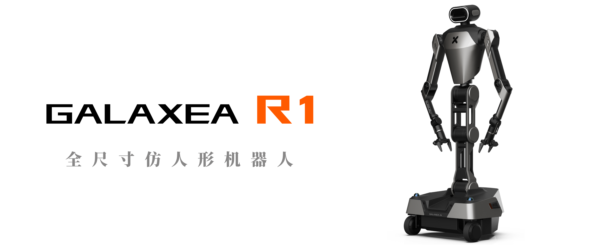
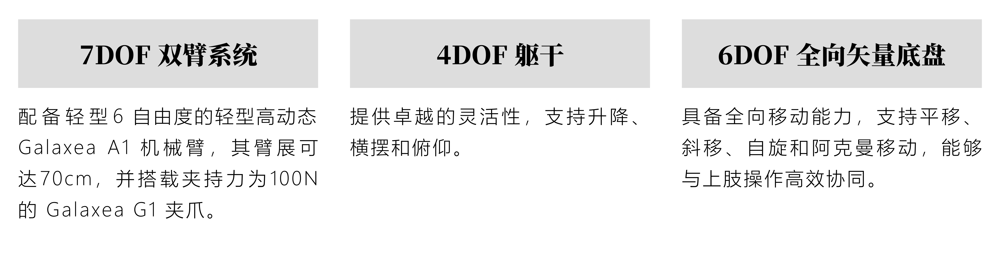

# Galaxea Robot

# Wide Operating Range & High Flexibility

Galaxea R1 is a full-size Dual-Arm Humanoid Robot humanoid robot with a wide vertical operating range of up to 2 m and a horizontal operating radius of 700 mm. It is fitted with two 6-DoF lightweight and highly dynamic  [Galaxea A1](docs/Introducing_Galaxea_Robot/product_info/A1.md) robot arms and two [Galaxea G1](docs/Introducing_Galaxea_Robot/product_info/A1_accessory_G1.md) grippers, a 4-DoF torso and a three-wheel steering vector chassis, ensuring exceptional maneuverability and adaptability across diverse operational environments.

## Key Hardware Features

## Key Specifications

Ideal for advanced applications needing higher environmental awareness and visual processing, enhancing the robot’s perception and navigation capabilities.

<table style="width: 100%; border-collapse: collapse;">
    <thead>
        <tr style="background-color: black; color: white; ">
            <th style="width: 250px;line-height: 1.2;">Feature/Specification</th>
            <th style="width: 400px;line-height: 1.2; ">Values</th>
        </tr>
    </thead>
    <tbody>
        <tr style="background-color: white;">
            <td style="font-weight: bold;">Operating Range (Height)</td>
            <td>0 ~ 200 cm</td>
        </tr>
        <tr style="background-color: #f2f2f2;">
            <td style="font-weight: bold;">Operating Radius</td>
            <td>70 cm per arm   86 cm per arm with gripper</td>
        </tr>
        <tr style="background-color: white;">
            <td style="font-weight: bold;">Max. Payload</td>
            <td>5 kg@0.5 m</td>
        </tr>
        <tr style="background-color: #f2f2f2;">
            <td style="font-weight: bold;">Degree of Freedom</td>
            <td>24 DOF in total: · 6 DOF for chassis · 4 DOF for torso · 14 DOF for dual arms with grippers</td>
        </tr>
        <tr style="background-color: white;">
            <td style="font-weight: bold;">Max. Deep Learning Computing Capability</td>
            <td>550 Tops</td>
        </tr>        
        <tr style="background-color: white;">
            <td style="font-weight: bold;">Camera</td>
            <td>✅ Head: 1 ✅ Wrist: 2 ✅ Chassis: 5</td>
        </tr>
        <tr style="background-color: #f2f2f2;">
            <td style="font-weight: bold;">LiDAR</td>
            <td>✅1 * 360°   (2 for Optional)</td>
        </tr>
    </tbody>
</table>

## Ready for AI Development

Use Case

## Discover More

If you wish to learn more about the hardware and software specifics of Galaxea R1, please refer to the [Galaxea  R1 User Guide](https://h0n15kpzc1.feishu.cn/wiki/DnWAw6npVidnAOkq8MZczyZHn8f) for detailed information.

The manual will provide you with comprehensive insights into the technical specifications, operational guidelines, and system requirements that will help you understand and utilize Galaxea R1 to its fullest potential.