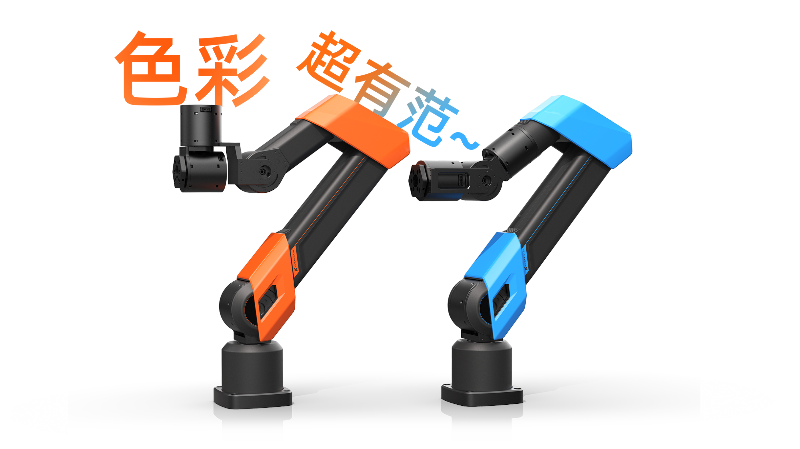
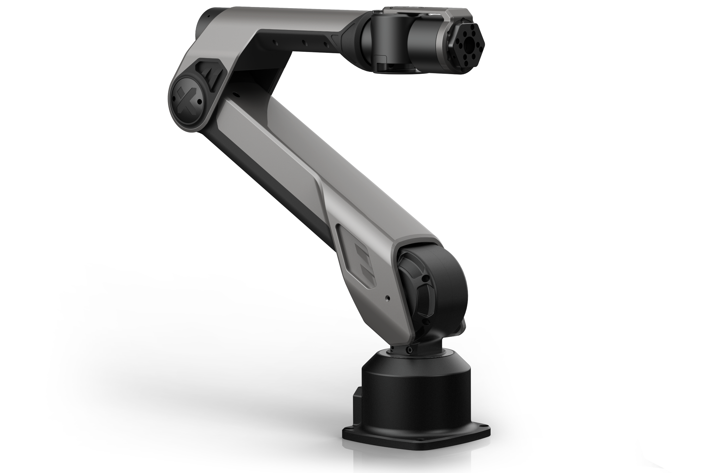

---
hide:
  - navigation
  - toc
---

#    

<!DOCTYPE html>
<html lang="en">
<head>
    <meta charset="UTF-8">
    <meta name="viewport" content="width=device-width, initial-scale=1.0">
    <title>Swiper Example</title>
    <!-- Link Swiper's CSS -->
    <link rel="stylesheet" href="https://unpkg.com/swiper/swiper-bundle.min.css">
    <!-- Link to custom CSS file -->
    <link rel="stylesheet" href="styles.css">
</head>
<body>
    

        

            

                

                    

                        
                        <a href="Guide/A1XY/A1XY_Getting_Started" class="btn btn-primary">了解更多</a>
                    

                    

                        
                    

                

            

            

                

                    

                        
                        <a href="Introducing_Galaxea_Robot/product_info/R1" class="btn btn-primary">了解更多</a>
                    

                    

                        
                    

                

            

            

                

                    

                        
                        <a href="Introducing_Galaxea_Robot/product_info/A1" class="btn btn-primary">了解更多</a>
                    

                    

                        
                    

                

            

        

        

        

        

    

    
    
</body>
    <main id = unique-page>
        

            <section class="products-section">
                <h2></h2>
                

                        <a href="Guide/R1Pro/R1Pro_Unbox_Startup_Guide">开箱启动</a>  
                        <a href="Guide/R1Pro/R1Pro_Hardware_Introduction">硬件介绍</a>  
                        <a href="Guide/R1Pro/R1Pro_Software_Introduction">软件介绍</a>  
                

            </section>
            <section class="products-section">
                <h2></h2>
                

                        <a href="Guide/R1Lite/R1Lite_Unbox_Startup_Guide">开箱启动</a>  
                        <a href="Guide/R1Lite/R1Lite_Hardware_Introduction">硬件介绍</a>  
                        <a href="Guide/R1Lite/R1Lite_Software_Introduction">软件介绍</a>  
                

            </section>
            <section class="products-section">
                <h2></h2>
                

                        <a href="Guide/R1/R1_Step_by_Step_Guide">开箱启动</a>  
                        <a href="Guide/R1/R1_Hardware_Guide">硬件介绍</a>  
                        <a href="Guide/R1/R1_Software_Guide">软件介绍</a>  
                

            </section>
            <section class="products-section">
                <h2></h2>
                

                        <a href="Guide/A1XY/A1XY_Unbox_Guide">开箱启动</a>  
                        <a href="Guide/A1XY/A1XY_Hardware_Introduction">硬件介绍</a>  
                        <a href="Guide/A1XY/A1XY_Software_Introduction">软件介绍</a>  
                

            </section>
            <section class="products-section">
                <h2></h2>
                

                        <a href="Guide/A1/A1_Getting_Started">开箱启动</a>  
                        <a href="Guide/A1/A1_Hardware_Guide">硬件介绍</a>  
                        <a href="Guide/A1/A1_Software_Guide">软件介绍</a>  
                

            </section>
        

    </main>
    <section class="contact-section">
        <h2>联系我们</h2>
        
联系电话：4008 780 980  邮箱（产品/商务）: <a href="mailto:product@galaxea.ai">product@galaxea.ai</a> 邮箱（技术支持）: <a href="mailto:support@galaxea.ai">support@galaxea.ai</a>

    </section>
</html>

